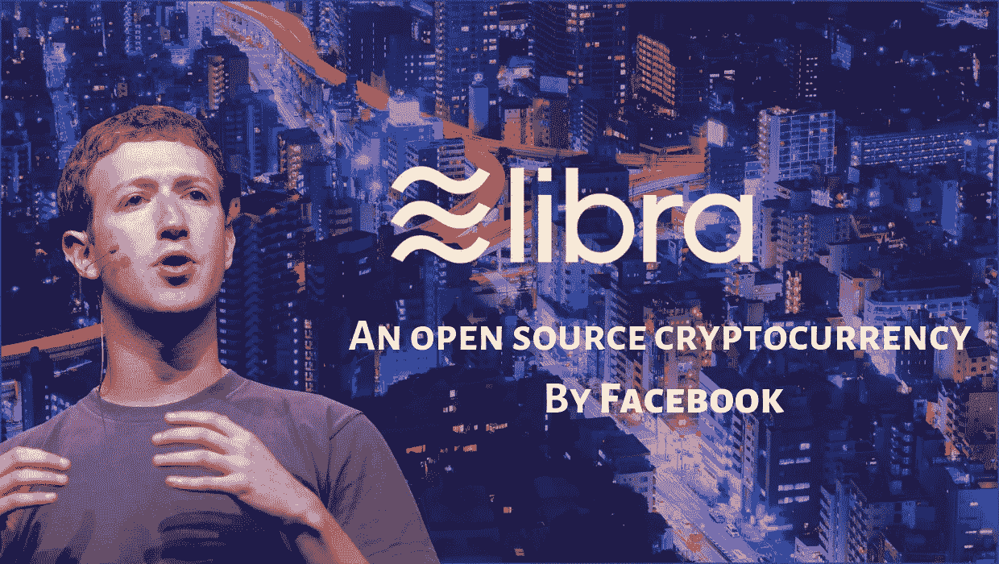
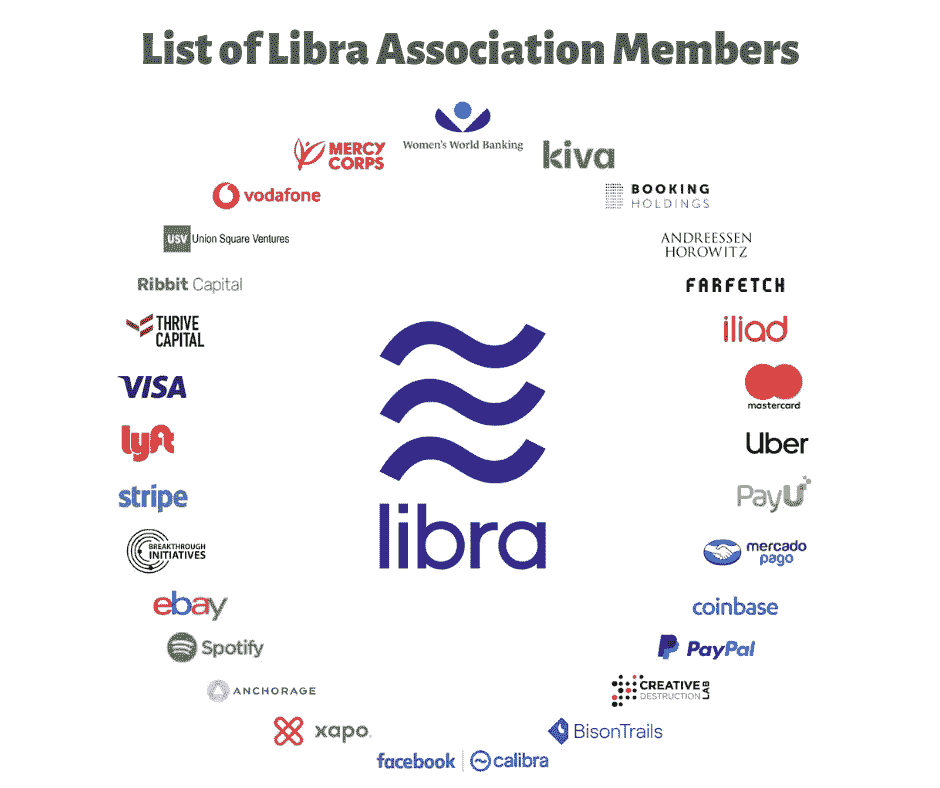

# 脸书的天秤座加密货币:你需要知道的一切

> 原文：<https://medium.com/quick-code/facebooks-libra-cryptocurrency-everything-you-need-to-know-4e278cedf9b?source=collection_archive---------0----------------------->



Facebook’s Libra cryptocurrency

脸书最近宣布了他的加密货币 Libra 加密货币，该货币已经开源，将于 2020 年上半年推出。Libra 加密货币基于区块链技术，是去中心化的(通过网络分布)。脸书说它是一种全球货币，可以被全世界的人使用。所以，不管你离开哪里，你都可以在任何地方利用天秤座，除非你的国家政府禁止使用它。

Libra 和比特币的主要区别在于 Libra 是一种联邦加密货币，而比特币是一种公共加密货币。公共加密货币仅仅意味着它不受特定实体的控制，而在联合加密货币中，它是由一些公司集团控制的，在这种情况下，Libra 协会由脸书、Spotify、PayPal、万事达卡、Visa 等公司组成。

Libra 区块链白皮书:[https://developers . Libra . org/docs/the-Libra-区块链-paper](https://developers.libra.org/docs/the-libra-blockchain-paper)

# 加密货币和区块链有什么区别？

在我们继续之前，让我们先了解加密货币和区块链到底意味着什么。

加密货币和区块链是两回事。人们通常会混淆它们。加密货币是一种虚拟货币，可以以数字格式在互联网上转移。加密货币基于区块链技术。区块链是一种加密系统，使用哈希技术(主要是 SHA- 256)来确保交易安全。在区块链中，有“n”个区块，每个区块都有自己的哈希密钥。并且每个块包含其前一个块的 SHA 密钥。每当我们在一个块中进行哪怕是很小的改变时，它的 SHA 键也会改变，其余块的键也会改变。每个区块与另一个区块链接，形成区块链，称为区块链。

区块链系统中的每个数据块都有三样东西:前一个数据块的散列关键字和它自己的散列关键字。账本是记录每一笔交易的数据库，由区块链中的每个区块(节点)维护。并且有一个工作证明(POW ),它维护着区块链中的块的列表。因此，当有人试图入侵区块链系统或试图在其中进行任何更改时，该特定块的哈希键会发生变化。

**学习资源:**

1.  [区块链革命](https://amzn.to/2IN19J5)
2.  [比特币和加密货币技术——全面介绍](https://amzn.to/2NeHO7Q)

# 天秤座协会是什么？

天秤座由天秤座协会管理，其成员包括各种业务，如贝宝，万事达卡，脸书，Spotify 等。天秤座创始成员的完整名单可以在[这里](https://libra.org/en-US/association/)找到。这是一个独立的非营利会员制组织，总部设在瑞士日内瓦。Libra 协会的目标是促进开源，管理 Libra 货币的增长和稳定。



Current members of the Libra Association

目前，Libra 协会有 28 名成员，但他们的计划是在 2020 年 Libra 加密货币推出前增加 100 名成员。

# 移动编程语言

**Move** 是脸书专门为 Libra 区块链开发的新创建的编程语言。它将用于创建自定义交易和智能合同。这种语言的开发考虑到了系统的安全性。

要详细了解 move 编程语言及其工作原理，您可以阅读官方白皮书“ [Move:一种具有可编程资源的语言](https://developers.libra.org/docs/move-paper)”。

# 对于开发人员

因为 Libra 加密货币是开源的，这最终会给开发者一个优势，让他们可以查看 Libra 的源代码，并了解它是如何构建的。开发人员可以轻松地修改代码并对其进行一些更改，还可以详细了解这项技术。

更多关于获取 Libra 源代码的信息，你可以查看 Libra 开发者官方页面:[https://developers.libra.org/](https://developers.libra.org/)

在你下载 Libra 源代码之前，你必须先下载下面的包，否则你会得到一个错误。

1.  *卷曲:*
2.  *货物:* `sudo apt-get install cargo`
3.  *zlib:*

# 创建 Libra 区块链的第一笔交易

假设我们想把天秤座的硬币从一个账户转移到另一个账户。首先，我们需要一个 libra 区块链账户，其中必须有一些 libra 币，然后只有我们可以将 Libra 币转移到另一个账户。这和 PayPal 是一样的，在我们进行交易之前，我们先从我们的银行账户向我们的 PayPal 账户添加资金。

下载源代码后，您可以通过运行以下命令来运行测试网络。

```
./scripts/cli/start_cli_testnet.sh
```

您的提示现在将变为`%libra`，表示您正在运行测试网络。在这里，您可以创建和执行您的事务。

# 执行交易的命令:

1.  ***创建账户:*** 创建账户。在这里，您不必指定任何名称。运行此命令后，您将获得您创建的每个帐户的索引号。
2.  ***账户列表:*** 获取可用账户列表。
3.  ***账号 mint 0 10:*** 给你的账号添加天秤座币。这里“0”是你想添加天秤座的账户的索引号，“10”是你想添加的天秤座硬币的数量。
4.  ***转账 0 1 10:*** 将天秤从账户“0”转入账户“1”，转入金额为“10”。

关于 libra 交易的详细例子和学习更多这样的命令，你可以去[https://developers.libra.org/docs/my-first-transaction](https://developers.libra.org/docs/my-first-transaction)

感谢您的阅读，如果您喜欢其中的内容，请在[版块](https://www.patreon.com/liongueststudios)上支持我们。你的支持一定会帮助我们写出更多这样的内容。

更多这样的技术博客文章，你可以访问我的网站:[https://liongueststudios.com/blogs/](https://liongueststudios.com/blogs/)

*原载于 2019 年 6 月 26 日*[*https://liongueststudios.com*](https://liongueststudios.com/facebooks-libra-cryptocurrency-everything-you-need-to-know/)*。*