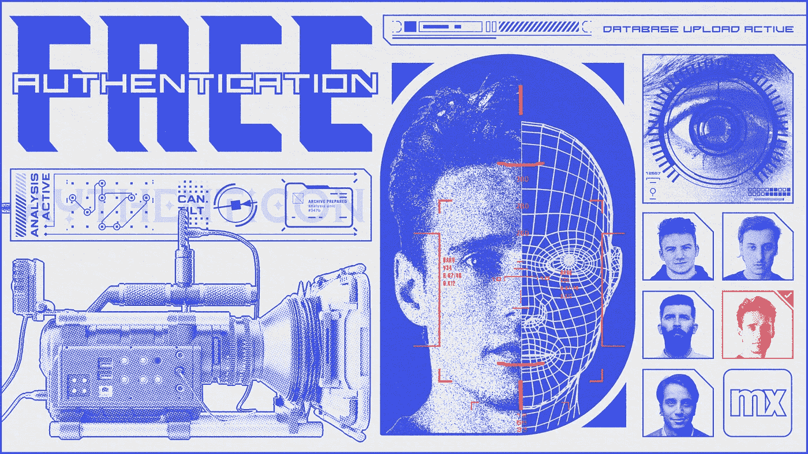
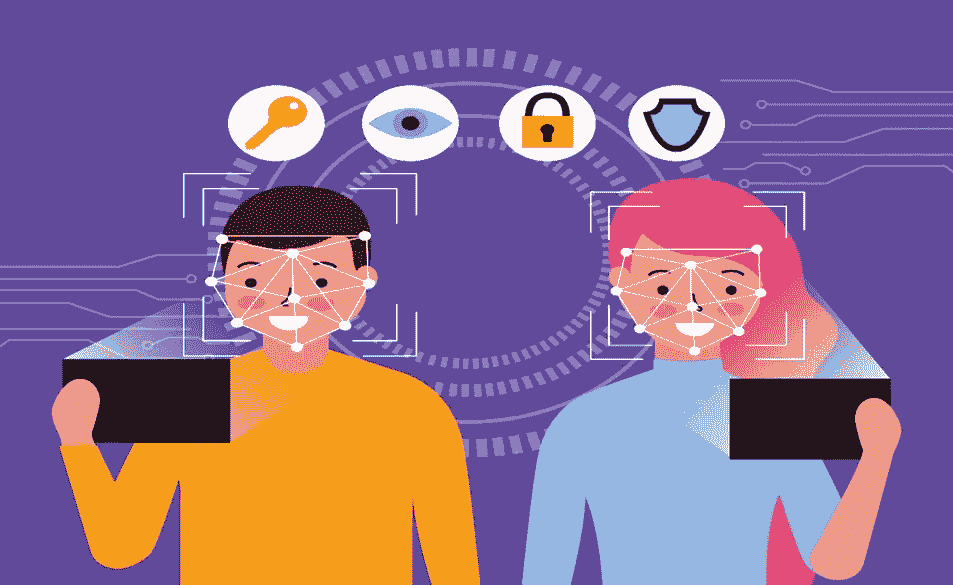
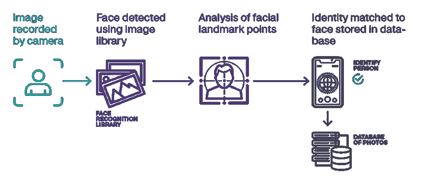
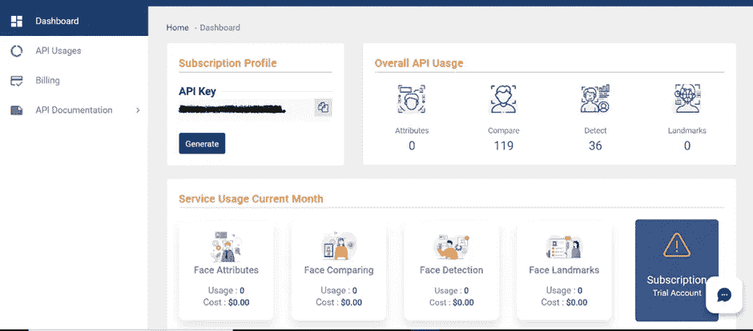
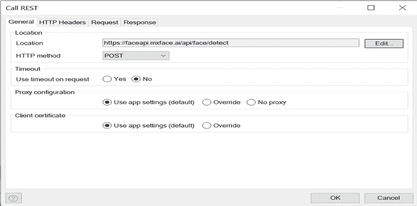
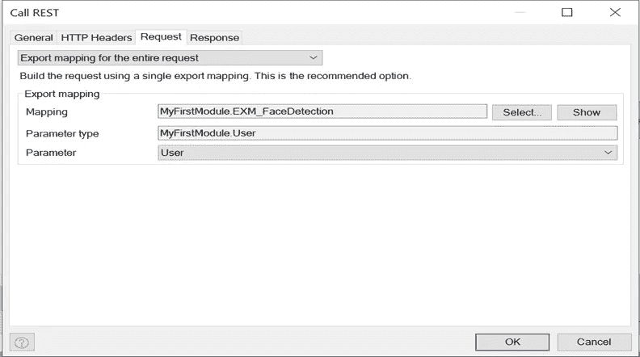

# 使用 MxFace.ai 在 Mendix 中进行面部认证

> 原文：<https://medium.com/mendix/facial-authentication-in-mendix-using-mxface-ai-12194df2edea?source=collection_archive---------4----------------------->

## 它的工作原理以及如何在你的 Mendix 应用中进行设置。



Facial Authentication In Mendix Using MxFace.ai

十年前，我们用密码来保护我们的账户。如今，技术不断发展，安全机制也不断完善。以至于最近，生物识别已经成为本地和 web 应用的焦点。



在这篇博客中，我将向您展示如何借助名为 [MxFace.ai](https://mxface.ai/about-us) 的第三方 API 在 Mendix 中实现面部认证。

## 它是如何工作的

*在此之前，我将分享一个图表，对面部验证如何工作进行高级解释。*



**人脸比较 API 比较两张人脸**并确定它们是否属于同一个人。当图像被发送到面部比较 API 时，两个面部都被**转换为面部向量模板**，并且**欧几里德距离被计算**。然后使用函数将欧几里德距离结果转换成置信度值，面部比较 API 在其回复中反映该置信度值。

# **按照以下步骤在你的应用中实现面部认证**

## 注册您的帐户

去 MxFace。AI 并注册一个**免费试用**来获得你的 API 密匙(**在你的试用结束后有一个免费等级**每天对 API 调用 **100 次**

[](https://mxface.ai/) [## 主页| mxface

### 我们的网站需要一些 cookies 才能正常运行(必需)。此外，其他 cookies 可能会与您的…

mxface.ai](https://mxface.ai/) 

这是一个非常简单的集成，一旦我们有了 API 密钥，我们就可以继续将其集成到您的 Mendix 应用程序中。



创建 API 键后，我们可以跳转到 Mendix Studio Pro 并调用这个 REST 服务。

## 在你的应用中拍照

为了获得用户的图像，你可以使用[网络动作模块](https://docs.mendix.com/appstore/modules/web-actions/)中的**Javascript 动作**或者使用市场上的[相机小工具](https://marketplace.mendix.com/link/component/107943)。

然后我将此与 **base64 encode 结合到** **文件** Java action(来自 [Community Commons](https://marketplace.mendix.com/link/component/170) 模块)中，该动作用于获取 Base64Image(作为字符串),然后该图像可用作人脸检测 API 的输入。

## 调用 API

现在，我们可以在微流中调用 API，并设置位置和相应的字段，以从 API 获得响应。

```
**Location** - https://faceapi.mxface.ai/api/face/detect

**Method Type** - POST 
```



添加各自的自定义标题。

```
**Subscription-Key** : {your API key}**Content-Type:** 'application/json'
```

之后，将 Base64Image 字符串作为请求体的输入进行传递。这里我为请求使用了导出映射。



**样品申请主体**

```
{"encoded_image":"#base64 encoded string of image#"}
```

使用导入映射存储响应。

**样本响应体:**

```
[
   {
      "quality":0.595912,
      "faceRectangle":{
         "x":"41,XXX",
         "y":34,
         "height":44,
         "width":34
      }
   }
]
```

从响应中，我们可以看到面部的属性，如形状、图像质量以及 x 轴和 y 轴。

接下来，我们需要集成面部对比 API。

## 面部对比 API

```
**Location** - [https://faceapi.mxface.ai/api/face/verify](https://faceapi.mxface.ai/api/face/verify)
**Method** - POST
```

添加各自的自定义标题。

```
**Subscription-Key** : {your API key}**Content-Type:** 'application/json'
```

**样品请求正文**

```
{
 "encoded_image1":"#Base64EncodedImage#",
 "encoded_image2":"#Base64EncodedImage#"
}
```

**样本响应体**

```
{
"confidence":0.999999,
 "image1_face":{ 
 "faceRectangle":{
  "x":41,
  "y":34,
  "height":44,
  "width":34
},
"quality":0.595912
},
"image2_face":{
"faceRectangle":{
  "x":41,
  "y":34,
  "height":44,
  "width":34
},
"quality":0.595912
}
}
```

# 全部完成！

根据可信度范围，我们可以通过电子邮件使用 OTP 对用户进行身份验证，并允许他们登录。下面是我如何在自己的 Mendix 应用程序中实现这一点的例子。


希望这篇文章能帮助你在 Mendix 中实现面部认证。

> 如果您有任何疑问，请联系我们😊，下一篇文章再见。
> 
> 乐于用低代码编码！

## 阅读更多

[](https://mxface.ai/face-comparing) [## 面部对比

mxface.ai](https://mxface.ai/face-comparing)  [## 呼叫休息服务

### 此活动只能在微流中使用。1 简介呼叫休息服务活动可用于呼叫休息…

docs.mendix.com](https://docs.mendix.com/refguide/call-rest-action/) 

*来自发布者-*

*如果你喜欢这篇文章，你可以在我们的* [*中页*](https://medium.com/mendix) *找到更多喜欢的。对于精彩的视频和直播会话，您可以前往*[*MxLive*](https://www.mendix.com/live/)*或我们的社区*[*Youtube PAG*](https://www.youtube.com/c/MendixCommunity/community)*e .*

*希望入门的创客，可以注册一个* [*免费账号*](https://signup.mendix.com/link/signup/?source=direct) *，通过我们的* [*学苑*](https://academy.mendix.com/link/home) *获得即时学习。*

有兴趣更多地参与我们的社区吗？加入我们的 [*Slack 社区频道*](https://join.slack.com/t/mendixcommunity/shared_invite/zt-hwhwkcxu-~59ywyjqHlUHXmrw5heqpQ) *。*