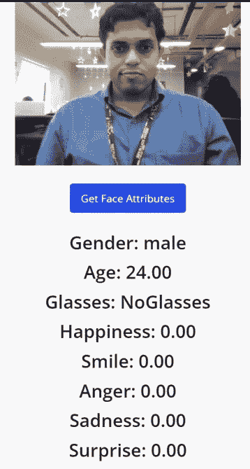

# 使用 Microsoft Azure 在 Mendix 中进行面部识别

> 原文：<https://medium.com/mendix/facial-recognition-in-mendix-using-microsoft-azure-738a134038b8?source=collection_archive---------4----------------------->


Facial Recognition in Mendix using Microsoft Azure

面部识别曾经是科幻小说中的事情，现在我们用它来解锁手机，而没有停下来想想它有多神奇。面部识别系统使用生物识别技术来绘制照片和视频中的面部特征。然后，它将这些信息与已知人脸数据库进行比较，以找到匹配，从而帮助验证一个人的身份。机器学习需要数十亿个数据点来处理并给出准确的结果。因此，它无限期地保存我们的面部信息，这可能会引起隐私问题，因此在使用它时保护用户的数据是极其重要的。


# **如何在 Mendix 应用程序中使用它。**

要在 Mendix 中获得面部识别，一个简单的解决方案是使用第三方提供商。经过一些研究，我决定使用微软 Azure 的 Face APIT4，并从 Mendix 应用程序中传递我们的照片。

## 实用解决方案

**第一步**

在微软 [Azure](https://azure.microsoft.com/) 中创建一个开发者账户。


**第二步**

前往[portal.azure.com/home](https://portal.azure.com/home)并选择**认知服务。**然后在认知服务中，选择 **Face API。**


点击资源管理下的**创建**，然后点击**快速启动**。

现在，它将向您显示一些键和端点。


> 记下键和端点。以后会用到。

**第三步**

要从用户处获取图像，使用**相机小部件**并将图像提交到从**系统中概括的实体中。图片**

**第四步**

现在，在 Mendix 中—调用微流中的 Rest 服务活动，并将位置字段设置为

```
[https://{yourendpoint}/face/v1.0/detect?detectionModel=detection_01&returnFaceId=true&returnFaceLandmarks=false&returnFaceAttributes=age,gender,headPose,smile,facialHair,glasses,emotion](https://{yourendpoint}/face/v1.0/detect?detectionModel=detection_01&returnFaceId=true&returnFaceLandmarks=false&returnFaceAttributes=age,gender,headPose,smile,facialHair,glasses,emotion)
```


**添加以下自定义 HTTP 头:**

```
**Ocp-Apim-Subscription-Key** : {key you noted down before}**Content-Type:** ‘application/octet-stream’**detectionModel:** ‘detection_01’**returnFaceId:** ‘true’**returnFaceLandmarks:** ‘false’**returnFaceAttributes:** ‘age,gender,headPose, smile, facialHair, glasses, emotion’
```


并在请求体中传递图像属性。


使用导入映射保存响应。保存面部属性后，您现在可以显示值和图像。



## 最后的想法

希望这篇关于如何使用 Azure Active Directory 和 Mendix 实现面部识别的教程有所帮助。

如果您有任何问题，请在本博客上发表您的评论:)

下一篇文章再见，拜拜！！！

## 阅读更多

[](https://docs.mendix.com/howto/integration/consume-a-rest-service) [## 使用 REST 服务- Studio Pro 9 操作指南| Mendix 文档

### 在您的 Mendix 应用程序中，您可以使用来自 REST 服务的信息。本指南通过一个示例向您展示了如何做到这一点…

docs.mendix.com](https://docs.mendix.com/howto/integration/consume-a-rest-service) [](https://docs.mendix.com/refguide/json-structures) [## JSON 结构- Studio Pro 9 指南| Mendix 文档

### JSON 结构文档存储了一个 JSON 片段，并将其转换成一个可以在 Import…

docs.mendix.com](https://docs.mendix.com/refguide/json-structures) [](https://docs.mendix.com/refguide/import-mappings) [## 导入映射- Studio Pro 9 指南| Mendix 文档

### 有关介绍，请参考映射文档。图 1 描述了一个导入映射文档的例子…

docs.mendix.com](https://docs.mendix.com/refguide/import-mappings) [](https://docs.microsoft.com/en-gb/azure/cognitive-services/face/) [## Face 文档-快速入门、教程、API 参考- Azure 认知服务

### Azure Face 服务提供人工智能算法，可以检测、识别和分析图像中的人脸。面部…

docs.microsoft.com](https://docs.microsoft.com/en-gb/azure/cognitive-services/face/) 

*来自发布者-*

*如果你喜欢这篇文章，你可以在我们的* [*中页*](https://medium.com/mendix) *找到更多喜欢的。对于精彩的视频和直播会话，您可以前往*[*MxLive*](https://www.mendix.com/live/)*或我们的社区*[*Youtube PAG*](https://www.youtube.com/c/MendixCommunity/community)*e .*

*希望入门的创客，可以注册一个* [*免费账号*](https://signup.mendix.com/link/signup/?source=direct) *，通过我们的* [*学苑*](https://academy.mendix.com/link/home) *获得即时学习。*

有兴趣加入我们的社区吗？你可以加入我们的 [*Slack 社区频道*](https://join.slack.com/t/mendixcommunity/shared_invite/zt-hwhwkcxu-~59ywyjqHlUHXmrw5heqpQ) *或者那些想要更多参与的人，看看加入我们的*[*Meetups*](https://developers.mendix.com/meetups/#meetupsNearYou)*。*