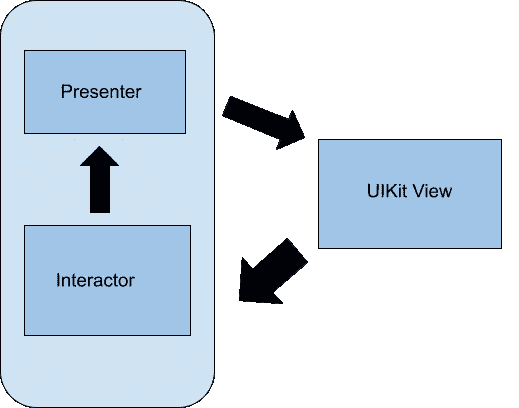
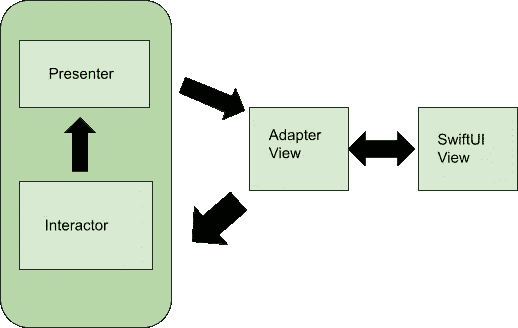

# 关于 SwiftUI 和 Jetpack Compose 比较的事实检查和常见误解

> 原文：<https://medium.com/quick-code/fact-check-and-common-misconceptions-around-comparing-swiftui-jetpack-compose-9fa37a77130?source=collection_archive---------0----------------------->


使用移动应用程序的开发人员有多个 UI 选项可供选择。使用声明式 UI 比命令式 UI 有明显的优势。

> 近年来，声明式 UI 越来越受欢迎，因为它们使开发人员能够用更少的代码更快地创建移动应用程序，在声明式 UI 中，您可以描述 UI 在给定状态下的外观，并且框架会根据需要对更改做出响应。

这种 UI 框架的两个例子是 **SwiftUI** 和 **Jetpack Compose** 。

[SwiftUI](https://developer.apple.com/xcode/swiftui/) 包括多个 API 和其他组件，用于跨 iOS、macOS、tvOS 和 watchOS 的可定制应用设计。这意味着，您现在只需学习一种语言和一个布局框架，就可以在任何地方部署您的代码。Jetpack Compose 旨在简化 Android 上的开发，随着应用程序状态的变化自动更新，并访问 Android APIs。

这两个框架既有相似之处，也有不同之处。本文将对这两者进行比较，以便您可以确定哪一个更适合您的项目。

SwiftUI 和 Jetpack Compose 之间的比较将集中在几个重要因素上，例如它们提供的平台支持、每个平台所需的学习曲线以及它们提供的功能。

## **Jetpack 可组合功能**

可组合函数用于以编程方式定义应用程序的 UI。这意味着应用程序的布局不需要使用 XML 文件。要创建一个可组合的函数，您只需要对函数名使用 **@Composable** 注释。

下面是一个可组合函数的基本语法的例子。

```
@Composable
fun HelloWorld() {
   Text("Hello, World!")
}
```

为了使用这个可组合的函数，我们在这个方法中调用它，如下所示:

```
setContent {
  HelloWorld()
}
```

以前，它会显示在 XML 布局文件(main_layout.xml)中，如下所示:

```
<LinearLayout 
android:layout_width="match_parent"
android:layout_height="match_parent"
android:orientation="vertical" >
    <TextView android:id="@+id/text"
    android:layout_width="wrap_content"
    android:layout_height="wrap_content"
    android:text="Hello, World" />
</LinearLayout>
```

并且布局资源文件将以这种方式加载:

```
fun onCreate(savedInstanceState: Bundle) {
  super.onCreate(savedInstanceState)
  setContentView(R.layout.main_layout)
}
```

## SwiftUI 功能

在 Swift UI 中，Xcode 生成的代码示例如下所示:

```
struct ContentView : View {
  var body : some View {
    Text("Hello, world!")
  }
}
```

然而，以前使用 UIKit 时，在 ViewController 中会编写相同的语法，如下所示:

```
class ViewController: UIViewController {
   @IBOutlet weak var myLabel: UILabel!
   override func viewDidLoad() {
     super.viewDidLoad()
     myLabel.text = "Hello, World!"
   }
}
```

## 类似

除了它们的基本功能，SwiftUI 和 Jetpack Compose 还提供了其他相似之处。

*   它们都是**命令式/声明式的—** 然后您可以响应用户事件并手动更新数据。随着状态的变化，您决定 UI 应该如何变化。在 iOS 中，这意味着你不必像在 UIKit、StoryBoard 或 Interface Builder 中那样“连接事物”，而在 Android 中，你不需要从 XML 布局文件中加载内容。总的来说，您编写的代码要少得多。
*   这两个框架还在源代码中提供了更好的可读性 Jetpack Compose 的内置组件(如文本和按钮)也是由可组合函数构建的，因此您可以更容易地检查源代码，以查看每个参数是如何列出的以及它们是如何工作的。SwiftUI 中的内置视图以类似的方式呈现在原始视图中，尽管这种情况下的源代码可读性较差。

## 差异

SwiftUI 和 Jetpack Compose 确实有显著的不同。

*   例如，SwiftUI 是与 OS 一起打包的**，而 Jetpack Compose 是**一个库—**swift ui 的运行性能更好，因为它是在系统中预编译的，但如果你需要向框架中添加新功能，你需要等待你的项目配置适当的最低版本。在 Android 中，如果你想给 Jetpack Compose 增加一个功能，只需要升级你的库版本。**
*   SwiftUI 使用**协议实现**，而 Compose 使用**编译器插件和组合——**组合是一种将责任委托给另一个类的优雅方式，但对于 SwiftUI 方法来说不是必需的，在 swift ui 方法中，您添加一个等同于组件的“修饰符”。
*   由于 SwiftUI 与系统的强耦合性，很难写出一个不尊重 iOS 设计的应用。使用 Jetpack Compose，您可以轻松地创建符合材料规范的组件，但是您需要更多的代码来构建具有漂亮 UI 的应用程序。
*   SwiftUI **不是开源的**，文档随着时间的推移在慢慢增长。Jetpack Compose **是开源的**,公众很容易获得。你可以检查图书馆里建了什么来做同样的或相似的事情，或者寻找灵感。
*   尽管预览功能对两个框架都可用，SwiftUI 在预览画布上即时显示您的更改，无需刷新。另一方面，Jetpack Compose 要求您在做出更改后单击刷新按钮，以便您可以看到新更改的预览。

## SwiftUI 所需的学习曲线

虽然您可能马上就开始使用 SwiftUI，但为了避免有限的支持、有限的接受度和有限的 API 覆盖范围，您需要记住 UIKit。

例如，SwiftUI 仅在 iOS 13 及更高版本的设备上可用，仅在 [WWDC 2019](https://developer.apple.com/videos/wwdc2019/) 上展示。这表明 SwiftUI 将无法支持要求兼容 iOS 12 或更早版本的应用。由于 UIKit 已经存在了十多年，您应该能够找到您可能遇到的几乎每个问题的答案，以及提供扩展和定制的多个库。

不过，如果你目前使用 UIKit，你可以为当前项目切换到 SwiftUI。UIKit 流程如下所示:



这里有一个使用相同流程的可点击按钮的示例代码。

```
class ViewController: UIViewController { override func viewDidLoad() {class ViewController: UIViewController {
  override func viewDidLoad() {
   super.viewDidLoad()
   let button = UIButton(type: UIButton.ButtonType.system) as
 UIButton
    button.setTitle("Show data", for: UIControl.State.normal)
    button.addTarget(self, action: #selector(self.buttonAction), for: .touchUpInside)
    self.view.addSubview(button)
   }
   @objc func buttonAction(_ sender:UIButton!) {
    print("Button pressed")
   }
   override func didReceiveMemoryWarning() {
     super.didReceiveMemoryWarning()
   }
}
```

如果您将其转换为 SwiftUI，流程将变为如下所示:



将自定义按钮的代码更改为如下所示:

```
struct ContentView: View {
  var body: some View {
   VStack(alignment: .leading) {
    Button {
     print("Button pressed")
    } label: { Text("Show data") }
   }
  }
}
```

## 编写 Jetpack 所需的学习曲线

至于 Jetpack Compose，为现有项目重写整个 UI 是深入尝试的一种方式。当当前可用的可组合函数不完全支持您的一些遗留代码时，这可能会令人沮丧，但是对于初始设置，迁移整个屏幕以进行组合是一项任务。

```
@Composable
fun HelloWorld() {
   Text("Hello, World!")
}
```

Compose 还支持向现有的视图层次结构中添加可组合的组件。为此，只需向 XML 文件添加一个 ComposeView，如下例所示:

```
<LinearLayout
android:layout_width="match_parent"
android:layout_height="match_parent"
android:orientation="vertical" >
    <TextView android:id="@+id/text"
      android:layout_width="wrap_content"
      android:layout_height="wrap_content"
      android:text="Hello, World" />
   <androidx.compose.ui.platform.ComposeView
     android:id="@+id/compose"
     android:layout_width="match_parent"
     android:layout_height="match_parent" />
</LinearLayout>
```

在活动中，调用此视图上的 setContent 方法，将您的可组合应用到 UI 的这一部分。

```
findViewById<ComposeView>(R.id.compose).setContent {
  MaterialTheme {
    Text("Hello, World!")
  }
}
```

在可组合层次结构中使用视图是您可能需要考虑的另一件事。当您必须使用没有类似可组合视图的视图时，比如地图视图，这会很有帮助。当在可组合 UI 中提供这些遗留视图时，可以使用 AndroidView 可组合。

Android XML 设置很可能永远不会完全消失，就像 SwiftUI 和 UIKit 一样。从旧标准到新标准的转换需要几年时间，类似于 Java 到 Kotlin 的转换，您可能仍然会偶尔与旧代码进行交互。

## 包装它

有人可能会说，在 Android 和 iOS 上同时使用 Compose 是个好主意，其他人会倾向于说尊重平台的 UI/UX 准则很重要，Compose 不能像 SwiftUI 那样构建应用程序。在这种情况下，*没有一个控制另一个*。

声明式用户界面承诺为移动开发者提供一个直观、低代码的应用解决方案。SwiftUI 和 Jetpack Compose 都提供了很多功能。如果您正在使用 iOS，并且需要系统中的即时功能，SwiftUI 可能是正确的选择。如果你正在使用 iOS 或 Android，并且你更喜欢具有更多可定制性的开源工具，那么你应该考虑 Jetpack Compose。