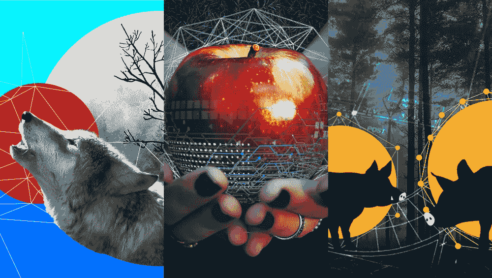
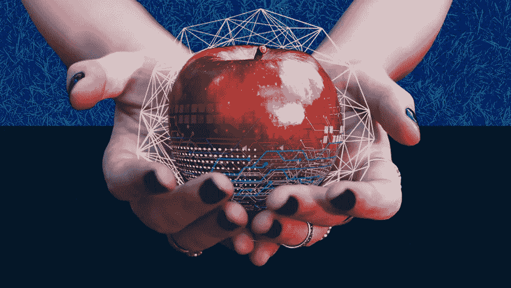
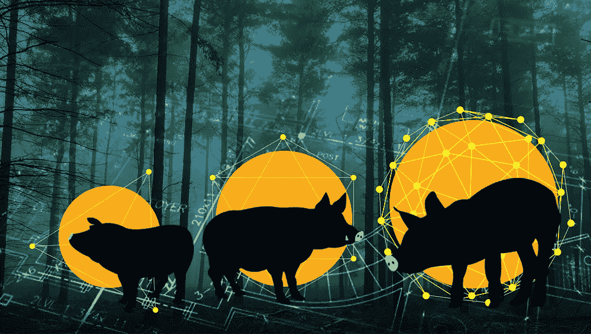

# 在区块链世界中重新想象的童话

> 原文：<https://medium.com/capital-one-tech/fairy-tales-re-imagined-in-a-blockchain-world-8dc919cfdbf3?source=collection_archive---------7----------------------->

每次我参加关于区块链的会议，我都发现人们试图解释区块链是如何运作的。他们从谈论密码术、块、散列、链、分布式分类帐、工作证明等开始。有些人“明白”，而大多数人不明白。他们只是想知道这对他们意味着什么，以及它会如何改变我们每天使用的系统。当演讲者讲到区块链的应用程序时，大多数听众已经为理解它的工作原理而筋疲力尽了。

所以，这里有一篇关于区块链的文章，它完全跳过了区块链是如何工作的，而进入了区块链如何有潜力改变科技世界的部分。而且，为了好玩，让我们在我们都知道和喜爱的童年童话的背景下谈论这种潜力。

# 白雪公主

王后问她的镜子，“墙上的魔镜，谁是世界上最美丽的人？”得知是白雪公主，她开始着手摆脱她的对手。她把自己伪装成一个老巫婆，给了白雪公主一个有毒的苹果，使她进入了死一般的睡眠，许多页后，在王子的帮助下才得以解决。

在我们童话般的区块链世界中，白雪公主接受了苹果，并检查了与苹果相关的区块链记录。日记条目——在苹果的整个生命周期中不可改变并不断积累——显示它来自一个著名的果园，三天前由第四夜班工人采摘，由农民马克运送到有机苹果商店，在那里从城堡厨房卖给第六女仆，并在前一天晚上用水果托盘送到女王的房间。

> *在这个仙境中，以人为中心的区块链记录受到保护，隐私访问受限；但是食品安全记录被认为是对社会的一种公共产品，并且容易获取。就像我们在自己的现实中挣扎着剥开的古雅的小个体水果贴！*

等等…女王的房间…那是邪恶的女王！这个老巫婆是怎么从邪恶的皇后那里拿到苹果的？白雪公主非常怀疑，感谢老妇人的苹果，但小心翼翼地用戴着手套的手把它扔进了灌木丛。她从不陷入死一般的沉睡，也不需要王子的干预来唤醒她。

***结束……***

区块链有可能彻底改变我们所有的供应链。从机器零件到食品安全，我们很快就能查找一件商品的出处和历史，确保它是真品，并沿着供应链追踪它的旅程。安全条目—在对象的整个生命周期内不可变并创建—允许安全的来源，减少欺诈和伪造的情况，并提高安全性。

考虑到食品安全，沃尔玛已经开始尝试区块链。所以现实离我们虚构的故事并不太远！

# 三只小猪

**三只小猪各造了三间小屋——一间稻草屋，一间木头屋，一间砖屋。一只狼经过并威胁道，*“我要吹气，我要吹气，我要把你的房子吹倒。”*每只小猪依次从稻草堆跑到树林里，最终跑到砖房逃脱。狼摧毁了更脆弱的房子，但最终被砖房挫败。**

在我们童话般的区块链世界里，狼找到猪是轻而易举的事情，因为所有的财产转让、产权记录、许可证和政府记录都存储在政府资助的公共区块链中。这些记录是透明的，对所有人都可用，并且是不可变的。没有人可以欺诈性地偷你的房子或汽车，产权保险是不必要的。房产转让在一个安全的分布式系统中完成，无需等待数小时来获得许可或去政府办公室登记交易。狼很容易就找到了区块链的公共财产，并找到了猪的地址。他还能够从许可记录中推断出他们三所房子中的两所容易受到他的攻击。一顿美味小吃的好机会！

> *今天，我们的许多州都有公开可用的记录，包括财产* [*所有权和历史*](https://icare.fairfaxcounty.gov/ffxcare/search/commonsearch.aspx?mode=address) *。区块链可以让我们对自己的数据有更多的控制权，并让它为我们工作，而不是停留在模糊的筒仓中。*

等等…童话不是都有大团圆结局吗？在这种情况下，区块链的自动化合同允许小猪在狼把它们气走后，立即领取他们的房屋保险金，并重建他们的房子。这次有额外的加固来抵御风的破坏。我们希望他们也更加小心，不要让饥饿的掠食者接触到他们的区块链记录！

***结束。***

潜在的可能性是，区块链的智能合同可以允许合同规则直接写入区块链本身。*“一旦有可靠消息来源证实房屋结构完全被毁，保险公司同意赔偿小猪 100 美元。”*房屋被毁的消息一被当地报纸刊登出来，就被写进标题记录等。，100 美元将被转移到小猪猪。没有表格要填，没有额外的谈话，没有延迟。

虽然这些合同必须仔细地以数字形式书写，但一旦完成，合同条款可以自动执行、自动实施且不可逆转，交易成本非常低。

瑞典目前正在试验将土地注册放在区块链上。我们故事中的另一个虚构，越来越接近现实。

# 红色小小红帽

**大灰狼扮成小红小红帽敲奶奶的门，奶奶让他进来，不料却被一口吞下！当小红小红帽到达奶奶家时，她看到奶奶全身裹在被单里。通过一系列精心制作的语句(*“哦奶奶，你的手好大啊！你的牙好大啊！”*)她发现大灰狼在冒充奶奶！但在她被吞下之前。谢天谢地，窗边一个碰巧及时的猎人打败了大灰狼，奶奶和小红小红帽从他的肚子里跳了出来，虽然受到了惊吓，但没有受伤。**

在我们的童话世界里，当大灰狼扮成小红小红帽敲奶奶的门时，她不开门！这扇门是一扇智能门，当它检测到小红小红帽的智能手表时会自动打开。小红的智能手表没有在门附近发布任何区块链位置交易！当大灰狼敲门，智能门宣布一个身份不明和未经授权的访客试图进入时，奶奶非常怀疑！门用可疑事件更新共享的区块链，社区中的所有其他智能门被警告，并且大坏狼被阻止。

如果大灰狼真的钻进去，一口吞下奶奶，小红小红帽还有可能免遭同样的命运。在她到家之前，她会收到通知，奶奶的生命警报挂件在过去的十分钟内没有向区块链写入任何健康统计数据！这与祖母的健身跟踪器记录相关，记录显示她没有迈出一步，她的心率创下新低。它还与来自她的茶壶的数据相关联，该数据报告它没有为她泡下午 3 点的茶，并且她的储藏室门报告她没有打开它来拿她的茶饼干。

> 不仅人们可以与区块链互动，他们的家居用品也可以。支持分布式物联网(IoT)的设备和分布式账本(区块链)可以协同工作来跟踪交互。物联网对象通过互联和共享的区块链向我们发送信息，相互交谈，让日常生活变得更加轻松。冰箱重新订购牛奶，我们一离开办公室，炉子就开始做晚饭，在线零售商甚至在我们订购生日礼物之前就已经发货了。所有交互、协调和触发都通过共享的分布式区块链基础设施进行

奶奶的私人医生和 911 应答者监测区块链条目中的模式也同样感到震惊。小红小红帽带着两个护理人员来到门口，准备好应对狼的袭击！

那天晚上，在当地电视台，你可以听到小红说，“我的奶奶可能是一个喜欢住在树林里的隐私狂人，”她说，“但即使是她也知道小心翼翼地与其他系统共享她的数据是非常明智的！"

***终点。***

许多国家，如新加坡，已经为他们的公民推出了数字身份，为他们在区块链中的应用奠定了基础。电子公司 LG 已经在一个门上安装了运行完整版 Windows 10 的冰箱。亚马逊已经推出了基于云的智能按钮，以帮助重新订购常见的家居用品。他们联合起来保护我们不受我们自己的大坏狼的伤害只是时间问题！

# 从童话世界到现实世界

这些为区块链世界重新讲述的童话故事让我们更好地感受到区块链如何适用于我们的生活，而不仅仅是区块链如何运作。

在我们的童话世界里，区块链是一个共享的坚不可摧的日记，我们所有的角色都可以使用。日记中的每一页都以牢不可破的方式牢固地附在它前面的所有页上。一旦写好了，没人能修改它。人物可以写他们达成的交易，他们创造或消费的东西，或者他们下的赌注。通常，故事变得更简单，更清晰，更公平，更少创伤！

有一天我们会给我们的孙辈讲什么故事？他们会以*“很久很久以前，在区块链发明之前……”开始吗*

这些是作者的观点。除非本帖中另有说明，否则 Capital One 不隶属于所提及的任何公司，也不被其认可。使用或展示的所有商标和其他知识产权都是其各自所有者的所有权。本文为 2019 首都一。