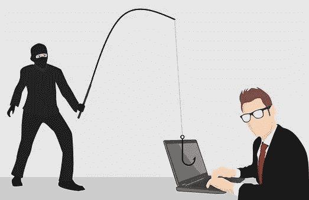
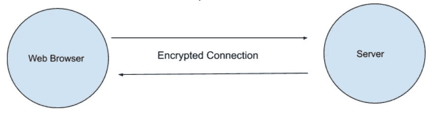
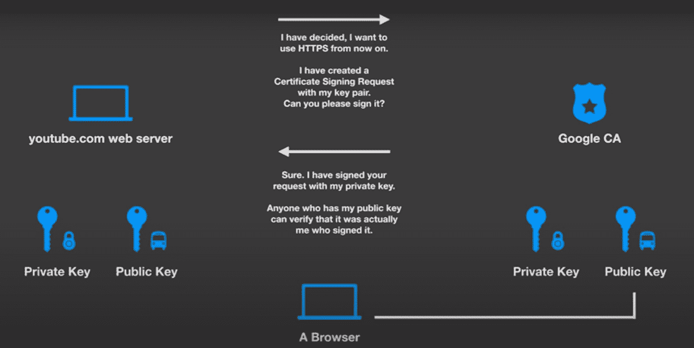
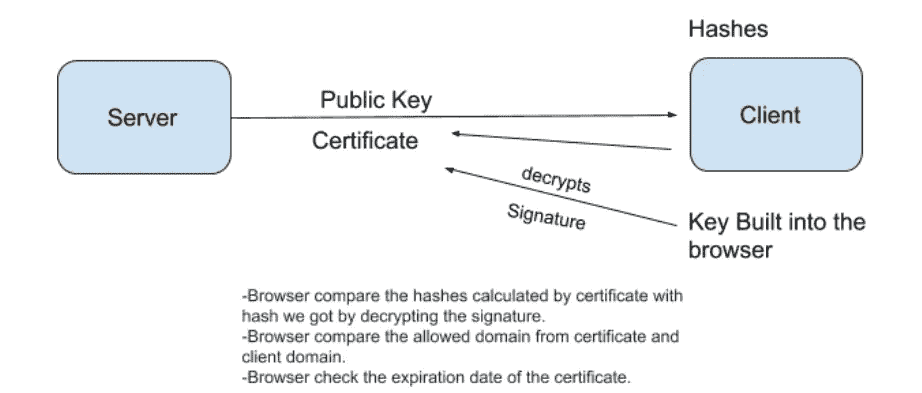
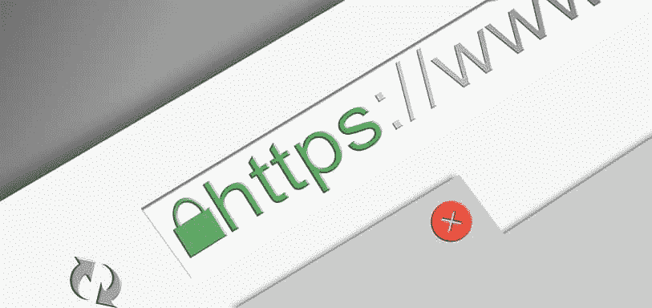
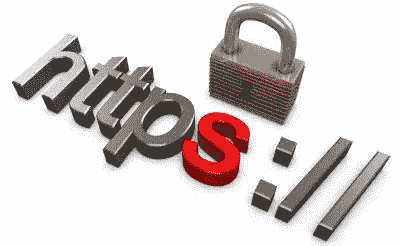

# 假 SSL 证书:它们怎么会成为问题？

> 原文：<https://medium.com/globant/fake-ssl-certificates-how-can-they-be-a-problem-901cfe0b34f7?source=collection_archive---------0----------------------->

Source: [https://pixabay.com/illustrations/search/security/](https://pixabay.com/illustrations/search/security/)

当我在一个网站上进行银行交易时，我注意到 URL 包含 HTTPS，旁边显示一个锁图标。我在谷歌上搜索了更多的网址，发现一些网站没有锁图标或 HTTPS。我发现这样的网站很有可能是由黑客创建来窃取有价值的信息的。

想知道在交易过程中，网址中带有 HTTPS 的网站如何保护您的信用卡信息免受攻击吗？

Source : [https://pixabay.com/illustrations/thinking-question-think-man-mark-4695538/](https://pixabay.com/illustrations/thinking-question-think-man-mark-4695538/)

基于一些搜索，我发现安全是由 SSL 证书处理的。我将根据我的研究尝试回答围绕它的一些问题。

什么是 SSL 证书？

SSL 代表安全套接字层证书。它提供了服务器和客户端之间的安全连接。安全连接是通过加密它们之间传输的数据来提供的。锁告诉用户你访问的服务器是安全的。

一个组织需要在其 web 服务器上安装 SSL 证书，以创建与浏览器的安全会话。

**谁提供这个 SSL 证书？**

SSL 证书由受信任的证书颁发机构提供。当某人为其业务申请 SSL 证书时，CA 会验证所提供的信息。一旦通过验证，CA 提供带有签名的 SSL 证书。

Source : [https://www.youtube.com/watch?v=T4Df5_cojAs&t=271s](https://www.youtube.com/watch?v=T4Df5_cojAs&t=271s)

**SSL 证书是如何工作的？**

当您的浏览器向服务器请求网站时，服务器会发送一个公钥和一个数字签名证书。
浏览器使用所有标准浏览器中预装的 CA 密钥解密数字签名。一旦解密，它找到一个散列。

浏览器现在使用证书计算散列值。如果两个哈希匹配，这意味着证书是有效的。
证书通过验证后，浏览器会创建一个对称密钥(这是一个可用于加密和解密数据的单个密钥)。
该密钥使用服务器的公钥加密并发送给服务器。

由于对称密钥是使用服务器的公钥加密的，因此只有该服务器可以使用其私钥解密它。现在浏览器和服务器都有了相同的对称密钥。他们可以通过使用对称密钥对数据进行加密和解密来轻松传递数据，从而创建一个安全通道。

**用户如何确定网站是否有假的 SSL 证书？**

当 SSL 证书有效时，浏览器会在地址栏中显示 HTTPS。它还显示挂锁图标。如果证书是假的，浏览器会显示为“不安全”。在这种情况下，不会出现挂锁图标或 HTTPS。

Source : [https://topofthelist.net/is-your-website-secure/](https://topofthelist.net/is-your-website-secure/)

自签名证书；虽然它不是伪造的，但我们必须将它包含在浏览器中，这样浏览器就不会将其识别为伪造的证书。这种类型的应用程序用户数量很少，并且主要出现在受控环境中。对于有数百万用户使用的公共网站，证书应该由 CA 颁发。

**假证如何成为问题？**

黑客可以通过获取 CA 的用户名和密码，然后接受证书签名请求来发布假证书。
黑客还可以创建自己的自签名证书，并在用户的机器上安装根证书，这样当用户访问假冒网站时，浏览器会显示一个带有 HTTPS 的挂锁图标。

有一个案例研究，2011 年，一名黑客使用 SSL 证书发行商 Comodo 的可信合作伙伴的受损系统发行了九个伪造的 SSL 证书。

这 9 个证书都在攻击后几小时内被吊销了。

 [## 黑客伪造网络服务的 SSL 证书

### 黑客入侵了欧洲一家网络认证公司的系统，发布虚假证书，迫使…

www.itnews.com.au](https://www.itnews.com.au/news/hackers-fake-ssl-certificates-for-web-services-252211) 

**我怎样才能免受中间人攻击？**

您正在访问的网站应该显示一个锁图标，并且 URL 应该显示 HTTPS 连接而不是 HTTP。

Source : [https://wpformation.com/wordpress-http-https/](https://wpformation.com/wordpress-http-https/)

始终更新浏览器，以便可以安装最新的根证书。

使用标准浏览器，因为它们带有最新的可信 CA 证书。

避免使用未知的机器输入银行凭证。

避免免费公共 Wifi 承载任何交易。

**结论:使用来自 CA 的有效 SSL 证书有很多好处**

有效 SSL 证书的好处如下:

*   它通过使用 HTTPS 协议来保护连接。
*   它通过加密数据来防止黑客读取您传输的信息。
*   它增加了搜索引擎优化在谷歌搜索中的排名。
*   它增加了客户的信任和信心。