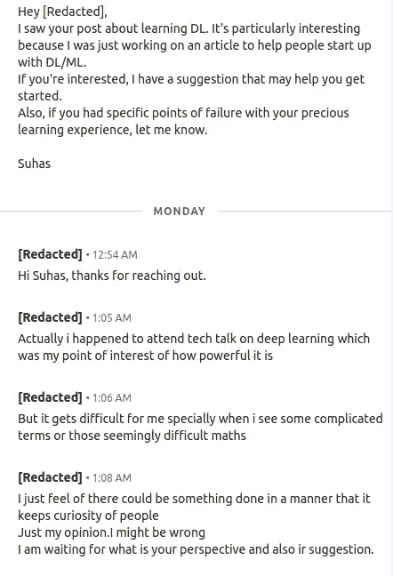
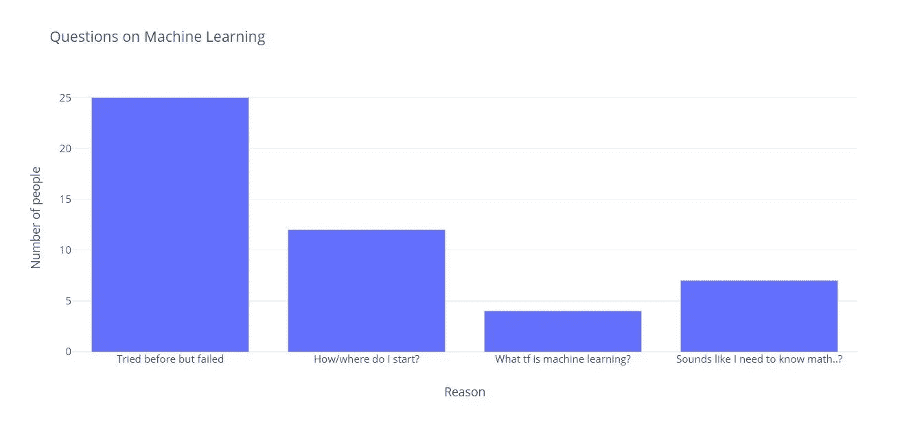
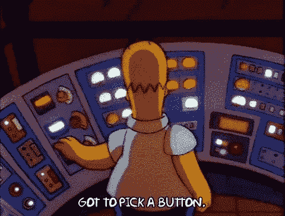
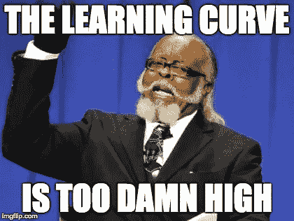
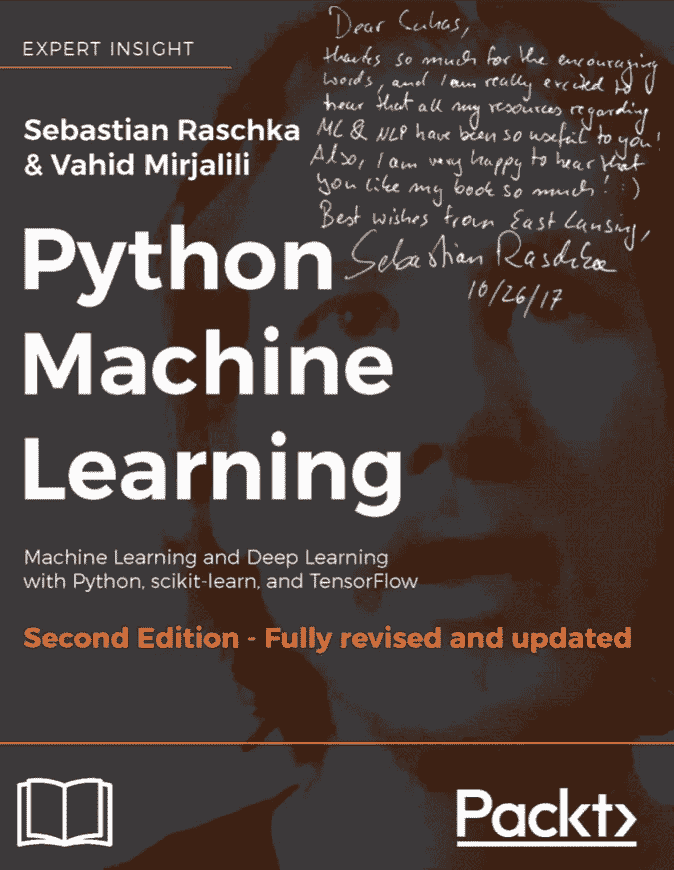

# 快速跟踪 Fast.ai

> 原文：<https://medium.com/quick-code/fast-tracking-fast-ai-90de49eb3244?source=collection_archive---------5----------------------->

> 关于如何在学习机器学习中不失败的固执己见的指南

我几乎每天都遇到许多想要学习机器学习的开发人员和企业家。

Conversation on LinkedIn while this article rested in my drafts

这些是被问到的一些问题

> “我如何开始学习 AI？
> 什么是神经网络？
> AI，ML，DL 有什么区别？
> 我试着学数字语言，但是数学太疯狂了——我不懂

下面是问题的样子(收集的实际数据)

所以，让我们假设手头有一个任务。为了完成这项任务，你必须扭转局面。所有旋钮都需要设置到一个精确的位置，这样才能获得想要的结果。

现在，当我们看 Coursera 的课程(吴恩达的课程)——你学到了很多东西，为什么是旋钮？你应该转多少？为什么要转？转太多会怎么样？

虽然知道所有这些信息很好，但这并没有回答我们如何解决现实世界的问题。经常有人问我“为什么要学机器学习？”这些答案帮助我将想要学习机器学习的人大致分为两类。

1.  **那些想先花时间了解旋钮如何工作，但不一定想去转动它们的人** —这类人通常不打算写代码，或者即使他们想写，也总是次要的。他们非常了解参数(记住，这里是旋钮)是如何工作的，参数是用来做什么的，如果它们(参数)改变了，结果会怎么样。老实说，这个班很少。
2.  **先转动旋钮，然后了解旋钮如何工作的人-** 现在，你很有可能属于这里。你已经涉猎了 python，甚至可能是 numpy 和 pandas 库。你可能不好意思地看了看 kaggle 竞赛和许多深度学习课程，它们似乎在内容上相互超越，你已经得出了一个结论。

> 神圣的嘘！#，在这个领域有很多东西需要了解。

你不需要一个原始的想法来开始。我希望有人在我学习机器学习的时候告诉我。每次我学习如何建立一个分类器，我总是试图找出一个好的问题，我可以用我的新发现的知识来解决，忽略 Kaggle 竞争。但是，稍后会详细介绍。我保证。

2016 年，我强烈建议初学者使用 TensorFlow，并从吴恩达的课程中获取内容。当时，吴恩达正在开发 DeepLearning.ai，似乎他的内容领先于其他所有人。后来，我注意到很多人对学习 ML 有心理障碍——仅仅是因为在这些平台上，你被教导要转动所有的旋钮。这和我第一次没有学习 ML 的原因是一样的。我花了一段时间才明白，看讲座和看论文并不等同于做机器学习。原因很简单——

你还记得当你第一次学习循环和 if 条件时，你可能很难想象这些东西是如何工作的吗？然后，在 2013 年，麻省理工学院为孩子们提供了一种有趣的学习编程的方式，这种方式看起来更容易，也更有吸引力？Scratch 上的孩子能比我们更快地理解编程概念？

Remeber Scratch?

> 在很多方面，Scratch 之于传统编程，Fast.ai 之于机器学习。

更少的旋钮可以转动。抽象印心时不需要知道的东西。非常注重结果。Fast.ai 教授了一种叫做“自上而下”的方法。这实质上意味着——大局优先。更少的旋钮可以转动。把你学到的东西付诸实施——即使这意味着你不明白这些旋钮是干什么的。

第一课包括加载数据集、训练 resnet34 或 resent50 以及查看我们的输出。这鼓励学习者提出更实际的问题，如“我如何加载我的数据集？我怎样才能让用户上传一张图片并链接到分类器？

另一方面，Tensorflow 让初学者担心激活功能、辍学或更多。在很多方面，我认为我们都希望以最少的工作量获得最大的成就(至少在第一天)，而有了 fast.ai，坚持上几节课的人会有更大的成就感。

因此，总而言之-
Fast.ai 采取了一种方法，它像教小孩子运动一样，教你一个前沿研究+从业者领导的领域。不要花太多时间阅读关于你的运动，只是出去玩。
最重要的是，如果你错过了，不要忘记再次挥杆。

1.  代码>消费——现在就开始编码，不要只是看视频和看书。自我评估，然后消费更多的内容。
2.  概念>细节——先了解你的概念，你会逐渐挖掘所有的细节。
3.  垂直学习>水平学习——坚持一个框架，掌握概念，然后拓宽视野，学习更多的框架和库。
4.  合作>竞争——说真的，在论坛上问问吧。不要被吓倒，他们不是充满了退伍军人。总有初学者，会给那些提出要求的人提供帮助。

如果你从构建猫和狗的分类器开始，在尝试你的分类器想法之前，尽可能多的理解分类器，为你认为简单的想法重写代码是可以的。

不要害怕阅读你正在使用的库的开源代码。

另外，让我告诉你——这确实是一个压倒性的领域。成为一个伟大的实践者是很难的，它需要大量的耐心和练习。

最后，不要害怕接触专家。当我学习机器学习失败时(这是 pre fast.ai)塞巴斯蒂安·拉斯卡(Sebastian Raska)关于 Python 中的机器学习的书可能是我最喜欢的书之一，我经常使用。

我鼓起勇气和 Sebastian 谈论他的工作和这本书，他甚至给我发了一本他的书的电子签名版！

You can buy his book [here](https://www.amazon.in/Python-Machine-Learning-Sebastian-Raschka-ebook/dp/B00YSILNL0), but I urge you to do your research since a lot has changed since 2017 :)

哦，是的，Kaggle 竞赛——可能感觉现在每个人都在谈论它们，你也可能感觉每个人的代码都比你的好，但是花些时间，去入门部分([如果你找不到它](https://www.kaggle.com/competitions?sortBy=grouped&group=general&page=1&pageSize=20&category=gettingStarted))，即使问题听起来重复和古怪，也要试一试。

我希望这对你有用！别忘了编码，编码，编码。
我祝你的探索顺利。

