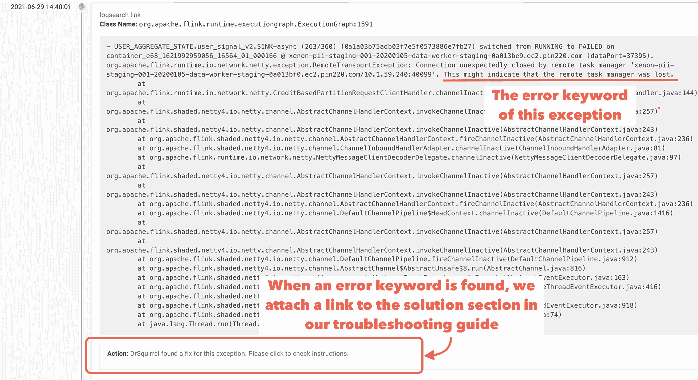
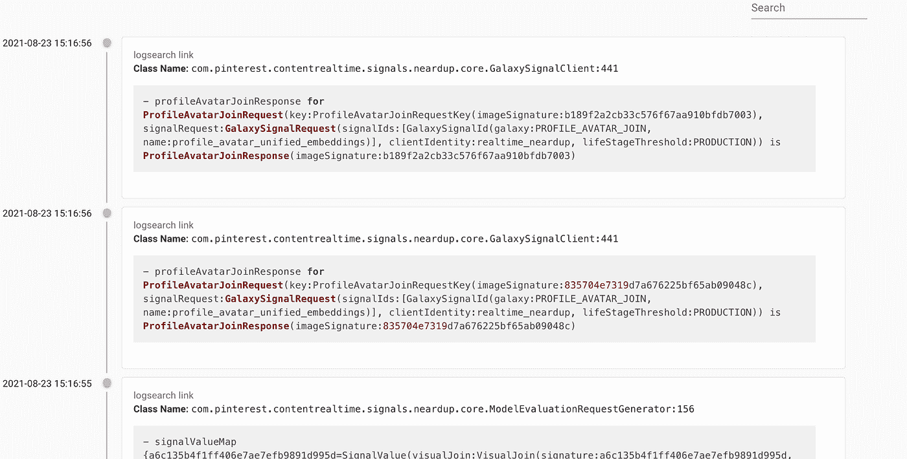
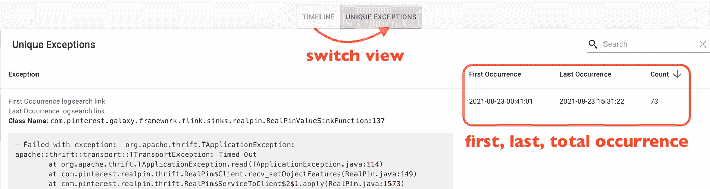
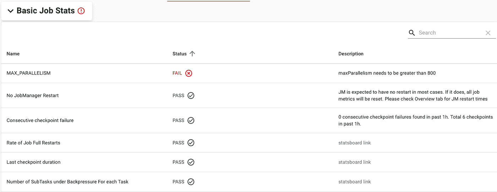
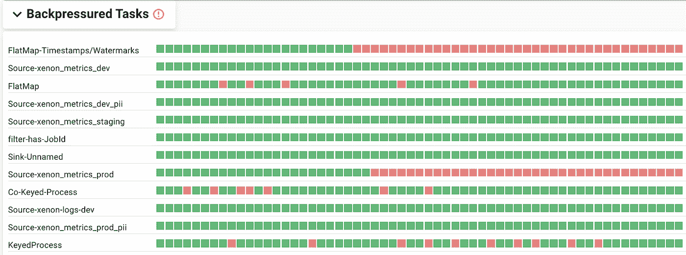
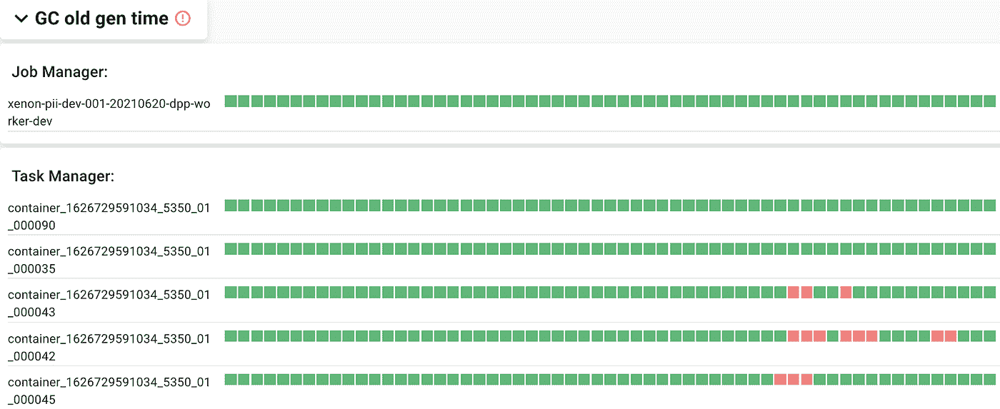
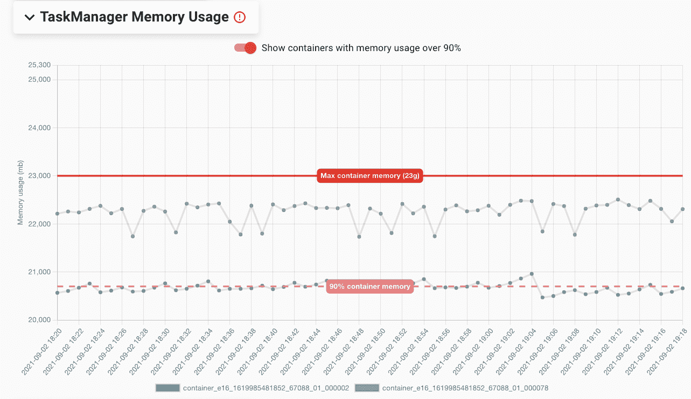
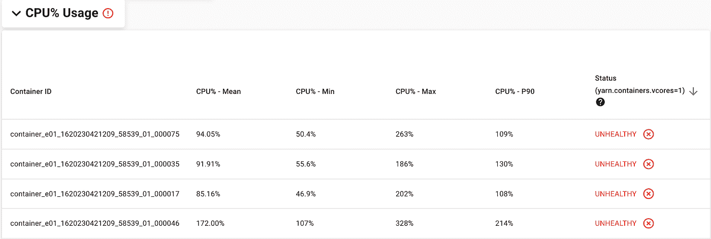
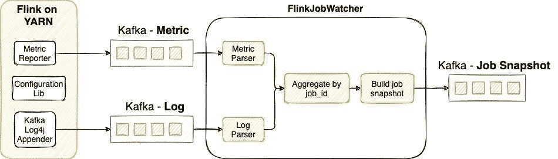
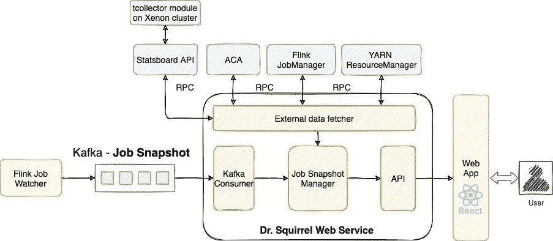

# 通过 Pinterest 上的自助诊断工具更快地采用 Flink

> 原文：<https://medium.com/pinterest-engineering/faster-flink-adoption-with-self-service-diagnosis-tool-at-pinterest-50a07143f444?source=collection_archive---------2----------------------->

江和软件工程师，流处理平台团队

在 Pinterest，流数据处理支持广泛的实时[用例](/pinterest-engineering/unified-flink-source-at-pinterest-streaming-data-processing-c9d4e89f2ed6)。近年来，由 Flink 支持的平台通过提供近乎实时的内容激活和指标报告，被证明对业务具有巨大的价值，并有可能在未来释放更多的用例。然而，为了利用这种潜力，我们需要解决开发速度的问题。

从编写第一行代码到生产中稳定的数据流可能需要数周时间。由于要调查的日志和指标的数量以及可用于优化的配置的多样性，故障排除和优化 Flink 作业可能特别耗时。有时候，需要对 Flink 内部有深入的了解，才能在开发过程中找到问题的根本原因。这不仅会影响开发人员的速度，并产生不理想的入门体验，还需要大量的平台支持，从而限制了流用例的可伸缩性。

为了使调查更容易、更快速，我们开发了一个 Flink 诊断工具 **DrSquirrel** ，以显示和汇总工作症状，提供对根本原因的洞察，并提出具有可操作步骤的解决方案。自发布以来，该工具已经为开发人员和平台团队带来了显著的生产力提升。

# Flink 工作故障排除的挑战是什么？

## 大量分散的日志和指标，其中只有少数是重要的

对于故障排除，工程师通常:

*   从 YARN UI 滚动浏览 JM/TM 日志墙
*   检查几十个作业/服务器指标仪表板
*   搜索并验证作业配置
*   单击 Flink Web UI 作业 DAG 以查找检查点对齐、数据偏差和背压等详细信息

然而，我们花费时间的 90%的统计数据要么是良性的，要么与根本原因无关。拥有一个只收集有用信息、只显示对故障排除重要的信息的一站式商店，可以节省大量时间。

## 这是不好的指标，现在怎么办？

一旦涉众确定了不好的度量，这是一个经常被问到的问题，因为需要更多的推理来找到根本原因。例如，检查点超时可能意味着不正确的超时配置，但也可能是背压、s3 上传缓慢、垃圾收集或数据不对称的结果；丢失 TaskManager 日志可能意味着坏节点，但通常是堆或 [RocksDB statebackend OOM](https://issues.apache.org/jira/browse/FLINK-18712) 的结果。理解所有的推理并彻底验证每个可能的原因需要时间。然而，80%的问题修复遵循一种模式。这让我们想知道——作为一个平台团队，我们是否应该有计划地分析统计数据，并告诉利益相关者调整什么，而不让他们进行推理？

## 故障排除文档远远不够

我们向客户提供故障排除文档。然而，随着故障排除使用案例数量的增加，文档变得太长，无法快速找到某个问题的相关诊断和说明。工程师还必须手动应用 if-else 诊断逻辑来确定根本原因。这给自助诊断增加了很多麻烦，并且仍然依赖平台团队进行故障排除。此外，每当平台推出新的工作健康要求时，doc 并不擅长号召行动。我们认识到，需要一种更好的工具来高效地共享故障排除要点，并强制实施集群作业健康要求。

# 松鼠博士，用于故障排除的自助诊断工具

鉴于上述挑战，我们开发了 DrSquirrel，这是一款用于快速问题检测和故障排除指导的诊断工具，旨在:

*   将故障排除时间从几小时缩短到几分钟
*   将开发人员调查所需的工具从许多减少到一个；和
*   将故障排除所需的 Flink 内部知识从中级降低到低级

简而言之，我们将有用的信息集中在一个地方，执行作业健康检查，明确标记不健康的作业，并提供根本原因分析和可操作的步骤来帮助解决问题。让我们来看看一些功能亮点。

## 查看日志的更有效方式

对于每次作业运行，Squirrel 博士都会突出显示直接触发重启的异常(例如 TaskManager 丢失，OOM ),以帮助从大量日志中快速找到需要关注的相关异常。它还在单独的部分收集所有包含堆栈跟踪的警告、错误和信息日志。对于每个日志，Squirrel 博士都会检查内容，看是否能找到错误关键字，然后在故障排除指南中提供一个链接，指向我们的逐步解决方案。

Dr.Squirrel suggestion

使用搜索栏可以搜索所有日志。最重要的是，Dr. Squirrel 提供了两种更有效地查看日志的方法——时间线视图和独特的异常视图。如下所示，时间线视图允许您按时间顺序查看日志，如果需要更多详细信息，可以使用类名和预填充的 ElasticSearch 链接。

*Timeline view of logs*

只需点击一下，我们就可以切换到独特的异常视图，在该视图中，相同的异常与元数据(如第一个、最后一个和总出现次数)一起分组在一行中。这简化了识别最常见异常的过程。

Unique exception view

## 工作健康一目了然

松鼠博士提供了一个健康检查页面，使工程师，无论是初学者还是专家，都能自信地判断这份工作是否健康。Squirrel 博士没有显示普通的指标仪表板，而是监视每个指标 1 小时，并明确标记它是否符合我们的平台稳定性要求。对于平台团队来说，这是一种高效且可扩展的方式来交流和实施被认为是稳定的东西。

健康检查页面由多个部分组成，每个部分关注职务健康的不同方面。快速浏览这些部分可以很好地了解整体工作健康状况:

*   **基本作业统计信息**部分监控基本统计信息，如吞吐量、完全重启率、检查点大小/持续时间、连续检查点故障、过去 1 小时的最大并行度。当指标未通过运行状况检查时，它们会被标记为失败并排在最前面。

Basic Job stats section

*   **背压任务**细粒度跟踪每个操作者的背压情况。一分钟内无背压显示为绿色方块，否则显示为红色方块。每个操作者 60 个方块，代表过去 1 小时的背压情况。这使得识别背压发生的频率和哪个操作者最早开始变得容易。

*Backpressured Task section*

*   **GC Old Gen Time** 部分具有与背压相同的可视化效果，可以提供 GC 是否发生得太频繁以及是否可能影响吞吐量或检查点的概述。通过同样的可视化，GC 和背压是否同时发生以及 GC 是否可能导致背压变得显而易见。

*GC old gen section*

*   **JobManager/TaskManager 内存使用情况**跟踪 YARN 容器内存使用情况，这是我们通过运行在 worker 节点上的守护程序收集的 Flink Java 进程的常驻集大小(RSS)内存。RSS 内存更准确，因为它包括了 Flink 内存模型中的所有部分以及 Flink 不跟踪的内存，如 JVM 进程堆栈、线程元数据或通过 JNI 从用户代码分配的内存。我们在图中标记了配置的最大 JM/TM 内存，以及 90%的使用阈值，以帮助用户快速发现哪些容器接近 OOM。

*JM/TM memory graph*

*   **CPU%使用情况**部分显示使用的 CPU 容量比分配给它们的 vcores 多的容器。这有助于监控和避免多租户 Hadoop 集群中的“噪音邻居”问题。非常高的 CPU 使用率可能会导致一个用户的工作负载影响另一个用户工作负载的性能和稳定性。

CPU% usage section

## 有效配置

Flink 作业可以在不同级别进行配置，例如执行级别的代码内配置、作业属性文件、客户端级别的命令行参数和系统级别的 flink-conf.yaml。工程师在不同级别配置相同的参数进行测试或热修复并不罕见。对于覆盖层次结构，什么值最终生效并不明显。为了解决这个问题，我们构建了一个配置库，它可以计算出作业运行的有效配置值，并将这些配置呈现给 Squirrel 博士。

## 可查询的集群作业运行状况

提供了丰富的作业统计数据，Squirrel 博士成为了一个资源中心，可以了解集群作业的健康状况，并深入了解平台的改进。例如，10 大重启根本原因是什么，或者有多少百分比的作业遇到内存问题或背压。

# 体系结构

正如在上面的特性中所看到的，指标和日志都集中在一个地方。为了以可伸缩的方式收集它们，我们在我们的 Flink 定制构建中添加了 MetricReporter 和 kafkaLog4jAppender，以持续向 Kafka 主题发送度量和日志。KafkaLog4jAppender 还可以过滤出对我们很重要的日志——警告、错误和堆栈跟踪附带的信息日志。接下来是 Flink job watcher——这是一个 Flink 作业，它在一系列解析和转换之后将来自同一作业的指标和日志连接起来。然后，FlinkJobWatcher 每隔 5 分钟创建一个作业健康快照，并将其发送到 JobSnapshot Kafka 主题。

越来越多的 Flink 用例引入了大量的日志和指标。FlinkJobWatcher 作为一个 Flink 作业，可以完美地处理不断增长的数据规模，并通过简单的并行调整保持与用例数量相当的吞吐量。

Our Flink custom build

一旦 JobSnapshot 可用，就需要获取更多数据并将其合并到 JobSnapshot 中。为此，我们使用 [dropwizard](http://www.dropwizard.io/) 构建了一个 RESTful 服务，该服务保持从 JobSnapshot 主题读取数据，并通过 RPC 提取外部数据。外部数据源包括 YARN ResourceManager(用于获取静态数据，如用户名和启动时间)、Flink REST API(用于获取配置)、一个名为 Automated Canary Analysis(ACA)的内部工具(用于将时间序列指标与具有细粒度标准的阈值进行比较),以及一些其他内部工具(允许我们显示自定义指标，如 RSS 内存和 CPU%使用率),这些指标是从运行在 worker 节点上的守护进程收集的。React 还构建了一个很好的 UI，使工作健康状况易于探索。

*Dr. Squirrel web service*

# 未来的工作

我们将继续改进 Squirrel 博士，使其具备更好的工作诊断能力，帮助我们向完全自助式入职迈进一步:

*   **容量规划:**监控和评估吞吐量、内存和 vcores 的使用情况，以找到最有效的资源设置。
*   **与 CICD 的集成:**我们正在运行一个 CICD 管道来自动验证和推送从开发到生产的变更。随着 CICD 推出新的变革，松鼠博士将与 CICD 整合，为就业健康状况提供更多信心。
*   **警报&通知:**用健康报告摘要通知作业所有者或平台团队。
*   **每项工作的成本估算**:根据预算计划和认知的资源使用情况，显示每项工作的成本估算。

# 承认

“大声喊出来”感谢 Hannah Chen，Nishant More 和孙波对这个项目的贡献。非常感谢平-林敏设置初始 UI 工作和 Teja Thotapalli 在 SRE 方面的基础设施设置。我们还要感谢张昂、王春燕、戴夫·伯吉斯的支持，感谢我们所有的客户团队提供了宝贵的反馈和故障排除方案，帮助我们使工具更加强大。

# 在 Pinterest 阅读更多关于流处理的信息

*   [Pinterest 上的统一 Flink 源:流数据处理](/pinterest-engineering/unified-flink-source-at-pinterest-streaming-data-processing-c9d4e89f2ed6)
*   [使用 Apache Flink(近)实时检测图像相似性](/pinterest-engineering/detecting-image-similarity-in-near-real-time-using-apache-flink-723ce072b7d2)
*   [Pinterest 视觉信号基础设施:从 Lambda 到 Kappa 架构的演变](/pinterest-engineering/pinterest-visual-signals-infrastructure-evolution-from-lambda-to-kappa-architecture-f8f58b127d98)
*   [使用 Apache Flink 在 Pinterest 进行实时实验分析](/pinterest-engineering/real-time-experiment-analytics-at-pinterest-using-apache-flink-841c8df98dc2)

*要在 Pinterest 了解更多关于工程的知识，请查看我们的* [*工程博客*](https://medium.com/pinterest-engineering) *，并访问我们的*[*Pinterest Labs*](https://www.pinterestlabs.com/?utm_source=medium&utm_medium=blog-article-link&utm_campaign=jiang-niu-september-17-2021)*网站。要查看和申请空缺职位，请访问我们的* [*职业*](https://www.pinterestcareers.com/?utm_source=medium&utm_medium=blog-article-link&utm_campaign=jiang-niu-september-17-2021) *页面。*