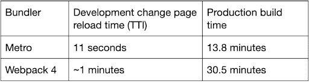
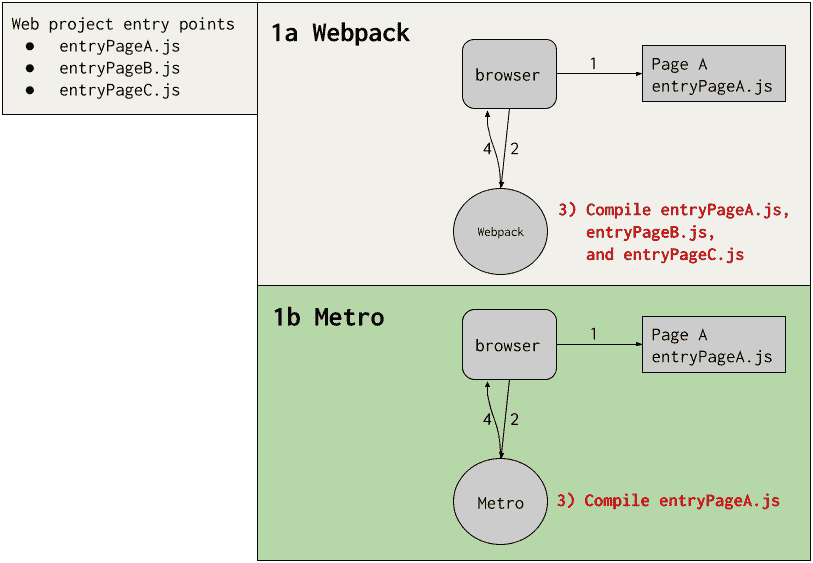
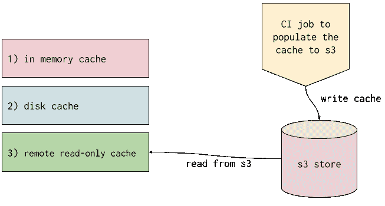
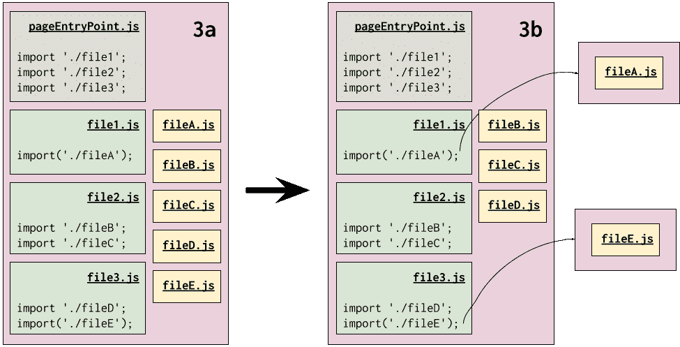
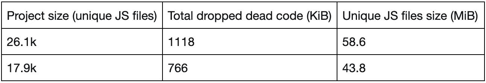

# 使用 Metro 构建更快的 JavaScript

> 原文：<https://medium.com/airbnb-engineering/faster-javascript-builds-with-metro-cfc46d617a1f?source=collection_archive---------1----------------------->

*Airbnb 如何从 Webpack 迁移到 Metro，并使开发反馈循环近乎即时，最大的生产构建速度提高了 50%,最终用户运行时间略有改善。*

**By:** [Rae 刘](https://www.linkedin.com/in/raejin/)

# 介绍

2018 年，前端 Airbnb 基础设施依赖 Webpack 进行 JavaScript 捆绑，在此之前一直为我们提供良好的服务；然而，随着我们的代码库在去年几乎翻了两番，前端团队注意到了对开发体验的重大影响。不仅构建性能慢，而且一行代码的平均页面刷新时间在 30 秒到 2 分钟之间，这取决于项目的大小。为了减轻这种情况，团队决定迁移到[地铁](https://facebook.github.io/metro/)。

由于切换到 Metro，我们提高了构建性能。在开发中，反映和加载一个简单的 UI 更改所需的时间([时间到交互 TTI 指标](https://developer.mozilla.org/en-US/docs/Glossary/Time_to_interactive))比**快 80%**。编译大约 49k 模块(JavaScript 文件)的最慢的生产构建比**快 55%**(从 30.5 分钟降到 13.8 分钟)。作为一个额外的奖励，我们观察到使用 Metro 构建的页面在 [Airbnb 页面性能得分](/airbnb-engineering/creating-airbnbs-page-performance-score-5f664be0936)上提高了~ **1%** 。

JavaScript bundlers 的扩展问题当然不是 Airbnb 独有的问题。在这篇博文中，我们想要强调 Webpack 和 Metro 之间的关键架构差异，以及我们在开发和生产构建中面临的一些迁移挑战。如果你预计你自己的一个项目在未来会有很大的扩展，我们希望这篇文章能提供解决这个问题的有用见解。

# 什么是地铁？

[Metro](https://facebook.github.io/metro/) 是 React Native 的开源 JavaScript 捆绑器。虽然 Airbnb 不再使用 React Native ，但我们相信它的基础设施也可以用于网络。在与 Meta 的 Metro 人员进行了多次磋商以及我们自己的一些修改后，我们设法建立了一种 Metro 风格，现在可以为所有 Airbnb 网站提供开发和生产捆绑服务。

从概念上讲，Metro 将捆绑分解为三个步骤，顺序如下:[解析](https://facebook.github.io/metro/docs/concepts#resolution)、[转换](https://facebook.github.io/metro/docs/concepts#transformation)和[序列化](http://serialization)。

*   解析处理如何解析 import/require 语句。
*   Transformation 负责编译代码(源代码到源代码的编译器，它将现代的 TypeScript/JavaScript 源代码转换成功能相当的 JavaScript 代码，这些代码经过了更好的优化并向后兼容旧的浏览器)，一个示例工具是 [babel](https://babeljs.io/) 。
*   序列化将转换后的文件组合成 JavaScript 包。

这三个概念是理解 Metro 如何工作的基础。在接下来的章节中，我们将重点介绍 Metro 和 Webpack 之间的关键架构差异，以便更深入地了解 Metro 的优势。

# Metro 和 Webpack 之间的主要架构差异

# 在开发中按需处理 JS 包

当我们谈论包时，JavaScript 包在技术上只是一个序列化的依赖图，其中入口点是图的根。在 Airbnb，一个网页映射到一个入口点。在开发中，Webpack(甚至是最新的 v5 版本)需要知道所有页面的入口点[才能开始捆绑。另一方面，Metro 开发服务器动态处理请求的 JavaScript 包。](https://webpack.js.org/concepts/entry-points/)

更具体地说，在 Airbnb，每个前端项目都有一个节点服务器，它匹配到特定入口点的路径。当请求一个 web 页面时，DOM 包含带有开发 JavaScript URLs 的脚本标记。浏览器加载页面，并向 Metro 开发服务器请求 JavaScript 包。在图 1 中，我们展示了 Metro 和 Webpack 开发设置之间的差异:

图 Metro 和 Webpack 的 JS 包开发设置之间的差异

在这个示例中，有一个 web 项目，它有三个入口点:entryPageA.js、entryPageB.js 和 entryPageC.js。如图 1 所示，在这两个场景中，浏览器加载页面 A (1)，然后向捆绑器请求 entryPageA.js 文件(2)，最后捆绑器用适当的捆绑包响应浏览器(4)。使用 Webpack bundler (1a)，即使浏览器只请求 entryPageA.js，Webpack 也会在启动时编译所有入口点，然后才能响应来自浏览器的 entryPageA.js 请求。另一方面，在 Metro bundler (1b)中，我们看到开发服务器没有花费任何时间编译 entryPageB.js 或 entryPageC.js，而是在响应浏览器请求之前只编译 entryPageA.js。

Airbnb 最大的前端项目之一有大约 2.6 万个独立模块，每页模块数量的中位数是大约 7.2 万个模块。因为我们也做服务器端渲染，我们最终需要处理的模块数量翻倍，大约为 48k。使用 Metro 的开发模型，我们通过按需编译 JavaScript 节省了大约 70%的工作。

这一关键的架构差异改善了开发人员的体验，因为 Metro 只编译需要的内容(请求页面上的 JavaScript 包)，而 Webpack 在启动时预编译整个项目。

# 多层高速缓存

我们利用的另一个强大的 Metro 特性是它的[多层缓存](https://facebook.github.io/metro/docs/caching)特性，这使得设置持久和非持久缓存变得简单明了。虽然 Webpack 5 也配有[磁盘永久缓存](https://webpack.js.org/guides/build-performance/#persistent-cache)，但它没有 Metro 的多层缓存灵活。Webpack 提供了两种[截然不同的缓存类型](https://webpack.js.org/configuration/cache/#cachetype):“文件系统”或“内存”，仅限于内存或磁盘缓存，没有远程缓存功能。相比之下，Metro 提供了更多的灵活性，允许我们定义缓存实现，包括混合不同类型的缓存层。如果一个层有缓存未命中，Metro 会尝试从下一层检索缓存，依此类推。

图 Airbnb 如何使用 Metro 配置多缓存层

高速缓存的排序决定了高速缓存的优先级。检索缓存时，将使用第一个有结果的缓存层。在图 2 所示的设置中，速度最快的内存缓存层的优先级最高，其次是文件/磁盘缓存，最后是远程只读缓存。与没有缓存的默认 Metro 实现相比，在编译 22k 文件的项目中，使用远程只读缓存可以使服务器构建速度提高 56%。

Metro 性能的一个贡献因素是其内置的工人支持，这放大了多层缓存的效果。虽然 Webpack 需要仔细配置才能通过第三方插件利用 worker，但 Metro 默认情况下会加速 worker 以卸载昂贵的转换，从而无需配置即可提高并行性。

但是为什么要使用远程只读缓存而不是常规的远程缓存(读和写)？我们发现，对于具有 22k 文件的同一个项目，不写入远程缓存可以额外节省 17% 的构建时间。向远程缓存写入数据会导致网络调用，这可能会造成很高的开销，尤其是在速度较慢的网络上。为了填充缓存，我们引入了一个在默认分支提交时定期运行的 CI 作业，而不是远程缓存写入。

# 序列化

在 bundler 上下文中，序列化意味着将转换后的源文件组合成一个或多个包。在 Webpack 中，序列化的概念封装在[编译挂钩](https://webpack.js.org/api/compilation-hooks/#root) (Webpack 的公共 API)中。在 Metro 中，序列化函数负责将源文件组合成包。

关于序列化重要性的一个例子，让我们看看国际化支持。我们目前支持大约 70 个地区的 Airbnb 网站，2020 年，我们的[国际化平台](/airbnb-engineering/building-airbnbs-internationalization-platform-45cf0104b63c)提供了超过 100 万条内容。为了支持 JS 包的国际化，我们需要在序列化步骤中实现特定的逻辑。尽管我们在序列化 Metro 和 Webpack 的捆绑包时必须实现类似的国际化逻辑，但是 Webpack 需要大量的源代码阅读来找到合适的编译挂钩，以便我们实现这种支持。除此之外，还需要理解复杂的概念，比如什么是依赖模板以及如何编写我们自己的模板。相比之下，与 Metro 实现相同的国际化支持则是一股新鲜空气。我们只需关注如何将 JS 包与翻译内容序列化，所有任务都在单个序列化器函数中完成。Metro 捆绑概念的简单性使得任何定制功能的实现都非常简单。

# Airbnb 采用 Metro 的挑战

尽管 Metro 具有上述的架构优势，但它也带来了需要克服的挑战，以便在 web 上充分利用它。因为 Metro 是为在 React 本地环境中使用而设计的，所以我们需要编写更多的代码来实现与 Webpack 同等的功能，所以决定改用 Metro 的代价是重新发明一些轮子，并学习通常与我们无关的 JavaScript bundler 的内部工作方式。

在开发中，我们必须创建一个带有自定义端点的 Metro 服务器来处理构建依赖图、翻译、捆绑 JS & CSS 文件以及构建源地图。对于产品构建，我们将 Metro 作为一个节点 API 来处理解析、转换和序列化。

完全迁移的表面积很大，所以我们将其分为两个阶段。因为我们的 Webpack 设置的缓慢迭代速度导致了开发人员生产力方面的巨大成本，所以我们将使用 Metro development server 解决缓慢的 Webpack 开发体验作为我们的首要任务。在第二阶段，我们让 Metro 具有与 Webpack 对等的特性，并在生产中运行 Metro 和 Webpack 之间的 A/B 测试。我们在这一过程中面临的两个最大挑战概述如下。

# 束分裂

用于开发的开箱即用 Metro 设置在每个入口点产生了大约 5MiB 的巨大包，因为单个包是 React Native 的预期用例。对于 Web 来说，这个包的大小对浏览器资源和网络延迟造成了很大的负担。每次代码更改都会导致 5mb 的包被处理和下载，效率很低，并且无法进行 HTTP 缓存。即使更改后的代码立即重新编译，我们仍然需要减小代码的大小并提高浏览器的可缓存性。

为了提高 Metro 在 Web 环境中的性能，我们通过[动态导入](https://developer.mozilla.org/en-US/docs/Web/JavaScript/Reference/Statements/import#dynamic_import)边界来分割包，这种技术也被称为[代码分割](https://developer.mozilla.org/en-US/docs/Glossary/Code_splitting)。代码分割边界使我们能够有效地利用 HTTP 缓存。

在图 3 中，导入('。/file’)表示动态导入边界。左手侧的束(3a)被分解成右边的三个更小的束(3b)。当导入(')时，需要额外的包。/file’)语句。

在图 3a 中，假设 fileA.js 已更改，则需要重新下载整个包，以便浏览器获取 fileA.js 中的更改。对于图 3b 所示的通过动态导入拆分的包，fileA.js 中的更改只会导致重新下载 fileA.js 包。其余的包可以重用浏览器缓存。

图 3:通过动态导入边界分割包。束由带有粉色背景的矩形框表示。

当我们开始考虑生产捆绑包时，我们希望优化与开发中有所不同。运行束分裂算法需要时间，我们不想在开发中浪费时间优化束大小。相反，我们优先考虑页面加载性能，而不是最小化包的大小。

在生产中，我们希望向最终用户交付更少更小的 JavaScript 包，以便页面加载更快，用户体验更好。生产中没有 Metro 开发服务器，所以所有的包都是预构建的。这使得束分裂成为使我们的 Metro 构建产品就绪所需的最大的阻塞特性。受 Webpack 的束分裂算法的启发，我们实现了一个类似的机制来分裂 Metro 依赖图。与通过动态导入边界进行的开发分割相比，在 airbnb.com 上产生的包大小减少了约 20%(1549 KB –> 1226 KB)。

在比较 Metro 和 Webpack 实现之间的捆绑包分割结果时，我们意识到两者都提供了大小相当的捆绑包，其中一些页面使用 Metro 提供了数量略高的 Javascript 捆绑包。尽管页面权重稍重，Metro 和 Webpack 的 [TTFCP](https://developer.mozilla.org/en-US/docs/Glossary/First_contentful_paint) 、[最大内容油漆](https://developer.mozilla.org/en-US/docs/Web/API/Largest_Contentful_Paint_API)和[总阻塞时间](https://web.dev/lighthouse-total-blocking-time/)指标不相上下。

# 摇树

单独的束分裂显著地减少了束的大小，但是我们能够通过删除死代码使束更小。然而，在一个项目中识别什么被认为是死代码并不总是显而易见的，因为一个项目中的一些“死代码”可能是其他项目中的“用过的代码”。这就是摇树运动发挥作用的地方。它依赖于代码库中 [ECMAScript 模块](https://tc39.es/ecma262/#sec-modules)(ESM)[import](https://developer.mozilla.org/en-US/docs/Web/JavaScript/Reference/Statements/import)/[export](https://developer.mozilla.org/en-US/docs/Web/JavaScript/Reference/Statements/export)语句的一致用法。基于项目中的导入/导出使用，我们分析了哪些特定的导出语句没有被项目中的任何文件导入。最后，bundler 删除未使用的导出语句，使整个包变得更小。

我们在为 Metro 产品构建实现树摇动算法时面临的一个挑战是错误地删除运行时执行的代码的风险。例如，我们遇到了与[重导出语句](https://developer.mozilla.org/en-US/docs/web/javascript/reference/statements/export#re-exporting_aggregating)相关的多个 bug。由于 Webpack 以不同的方式处理 ESM 导入/导出语句，因此没有可比较的现有技术可供参考。在多次迭代树抖动算法实现之后，下表显示了在给定项目规模的情况下，我们最终能够丢弃多少死代码。

# 结论

地铁迁移带来了一些非常重要的改进。Airbnb 最大的前端项目编译了大约 48k 模块(包括服务器和浏览器编译)，平均构建时间从 30.5 分钟下降到 13.8 分钟，下降了大约 55%。此外，我们看到 [Airbnb 页面性能分数](/airbnb-engineering/creating-airbnbs-page-performance-score-5f664be0936)有所提高，由 Metro 创建的页面性能分数提高了约 1%。最终用户性能的提高是一个惊喜，因为我们最初的目标是获得中性的实验结果。

Metro 架构的简单性在许多方面让我们受益匪浅。来自其他团队的工程师迅速加入到 Airbnb 的 Metro 实施中，这意味着为捆绑系统做出贡献的门槛更低。[多层缓存系统](https://facebook.github.io/metro/docs/caching)操作简单，使得缓存实验成为可能。定制捆绑器功能集成变得显而易见且更易于实施。

我们承认，自从我们在 2018 年评估[地块](https://parceljs.org/)、[网络包 4](https://webpack.js.org/) 和[地铁](https://facebook.github.io/metro/)以来，情况已经发生了变化。还有其他一些工具，比如 [rollup.js](https://rollupjs.org/guide/en/) 和 [esbuild](https://esbuild.github.io/) ，我们还没有探索太多，我们知道与 Webpack 相比，Metro 不是一个通用的 JavaScript bundler。然而，在 Metro 特性奇偶校验上工作了几年之后，我们看到的结果向我们证明了追求 Metro 是一个好的决定。Metro **通过缩短开发和生产构建时间，解决了**我们最绝望的扩展问题。借助即时开发反馈循环和更快的生产构建，我们比以往任何时候都更加高效。如果你想帮助我们继续改进我们的 JavaScript 工具和构建优化，或者解决其他网络基础设施的挑战，请查看 Airbnb 的这些开放角色:

[高级前端基础设施工程师，网络平台](https://careers.airbnb.com/positions/3903900/?gh_src=61d6ab411us)

[基础设施工程经理](https://careers.airbnb.com/positions/3903900/?gh_src=61d6ab411us)

[云基础设施高级软件工程师](https://careers.airbnb.com/positions/2623004/)

[高级/职员软件工程师，可观察性](https://careers.airbnb.com/positions/4168852/)

# 感谢

感谢所有为这个多年项目做出贡献的人。没有你们任何一个人，我们不可能做到！特别感谢我可爱的团队[迈克尔·詹姆斯](mailto:michael.james@airbnb.com)和[诺亚·舒格曼](mailto:noah.sugarman@airbnb.com)将地铁生产迁移到终点线。感谢[布里·邦吉](mailto:breanna.bunge@airbnb.com)、[丹·比姆](mailto:dan.beam@airbnb.com)、[伊恩·迈尔斯](mailto:ian.myers@airbnb.com)、[伊恩·雷梅尔](mailto:ian.remmel@airbnb.com)、[乔·伦乔尼](mailto:joe.lencioni@airbnb.com)、[麦迪森·卡普斯](mailto:madison.capps@airbnb.com)、[迈克尔·詹姆斯](mailto:michael.james@airbnb.com)、[诺亚·舒格曼](mailto:noah.sugarman@airbnb.com)对这篇博文的评论和巨大反馈。

*所有产品名称、标识和品牌都是其各自所有者的财产。本网站中使用的所有公司、产品和服务名称仅用于识别目的。使用这些名称、标志和品牌并不意味着认可。*