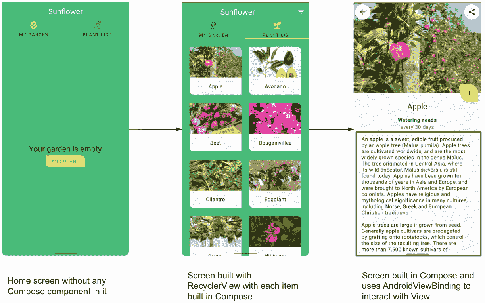
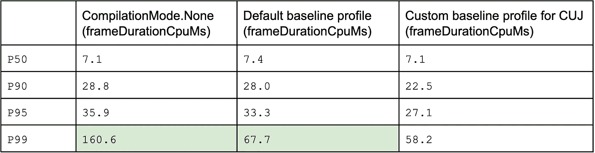
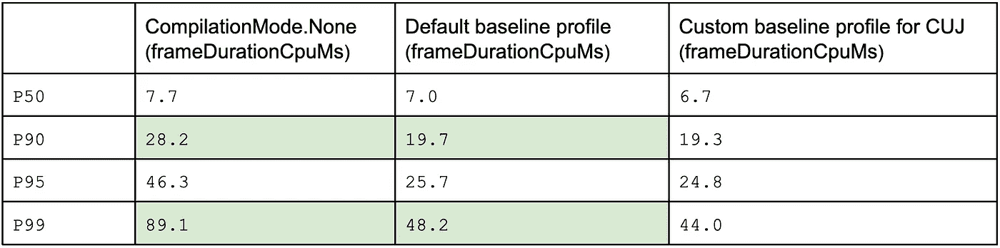
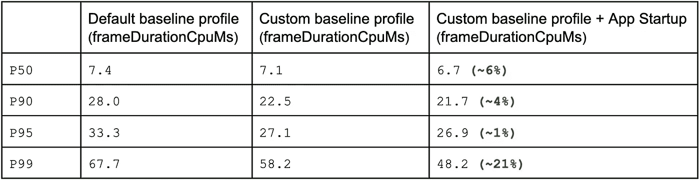
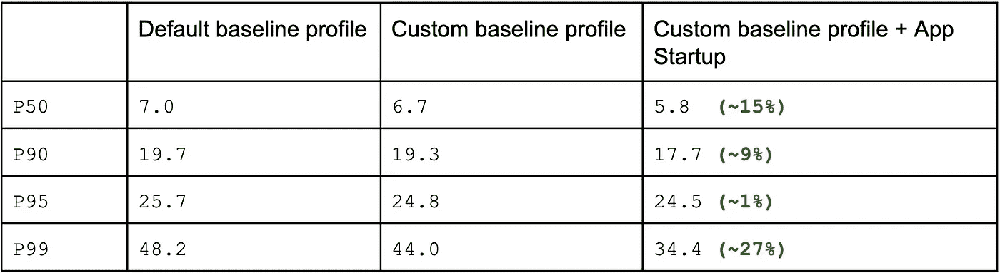

# 更快的 Jetpack 撰写视图与应用程序启动和基线配置文件的互操作

> 原文：<https://medium.com/androiddevelopers/faster-jetpack-compose-view-interop-with-app-startup-and-baseline-profile-8a615e061d14?source=collection_archive---------3----------------------->

Jetpack Compose 旨在与现有的基于视图的应用程序互操作。这使你能够采取一种[渐进的方法来迁移](https://developer.android.com/jetpack/compose/interop/migration-strategy)你现有的应用程序的用户界面进行合成。

当你的应用在迁移过程中，而**还没有在主屏幕或登陆屏幕上安装**组件时，用户可能会在导航到由 Compose 构建的屏幕时注意到 jank。这是因为**Compose 库只有在第一次使用的时候才会被加载**。有一种变通方法，就是在主页/登录屏幕上添加一个可组合的像素。这种解决方法可以确保合成组件在使用前预热。我们不建议采用这种方法，因为在你的应用程序中实施这种方法会产生对你的功能实现没有帮助的代码，并可能导致不可预见的错误。相反，我们建议结合使用[应用启动库](https://developer.android.com/topic/libraries/app-startup)和定制基线配置文件来解决 jank 问题。我们将对这种组合如何帮助提高应用程序的性能进行基准测试和可视化。

# 使用基线配置文件

[基准配置文件](https://developer.android.com/studio/profile/baselineprofiles)有助于改善 Android 应用的应用启动和运行时性能。基线配置文件是 APK 中包含的类和方法的列表。Android Runtime (ART)在应用程序安装期间使用它们将关键路径预编译为机器代码。这是一种 profile-guided optimization (PGO)形式，通过减少必须实时(JIT)编译的代码量，让应用程序优化启动、减少 jank 并提高最终用户的性能。

Jetpack Compose 作为一个库分发。这使得频繁的更新组合和向后兼容旧的 Android 版本。但是作为一个非捆绑的库分发是有成本的；程序库需要在应用启动时加载，并在需要功能时及时解释(要了解更多细节，请查看[为什么你总是要在发布时测试编写性能？](/androiddevelopers/why-should-you-always-test-compose-performance-in-release-4168dd0f2c71))。每当应用首次使用库功能时，这可能会导致更长的应用启动时间或 jank。为了解决这个问题，Compose 提供了一个基线配置文件，以便在安装应用程序时提前编译 Compose。在大多数情况下，Compose 提供的默认基线配置文件足以提供出色的性能。但是，基于应用程序的常见用户交互来定制个人资料通常会产生更好的结果。

# 技术性能分析

为了分析这种性能提升，我们编写了一些[宏基准](https://developer.android.com/topic/performance/benchmarking/macrobenchmark-overview)测试，并在[向日葵](https://github.com/android/sunflower)示例应用上测量了性能。该应用程序部分迁移到 Compose，在登录/主屏幕上没有任何可组合的内容。

在本次性能分析中，我们将与应用中的三个屏幕进行互动:

*   使用基于视图的设计构建的**主页**屏幕，其中没有任何组件。
*   **工厂列表**屏幕由 RecyclerView 构建，视图内的每个项目由 Compose 构建。它使用 [ComposeView](https://developer.android.com/reference/kotlin/androidx/compose/ui/platform/ComposeView) 视图来托管撰写内容。
*   用 Compose 构建的 **Plant details** 屏幕使用 [AndroidViewBinding](https://developer.android.com/reference/kotlin/androidx/compose/ui/viewinterop/package-summary#AndroidViewBinding(kotlin.Function3,%20androidx.compose.ui.Modifier,%20kotlin.Function1)) 创建 Android 布局资源并与之交互。

Sunflower 应用程序代码有一个 [BaselineProfileGenerator](https://github.com/android/sunflower/blob/23872b15c7cfd07c3a24701264057c8fce38c30b/macrobenchmark/src/main/java/com/google/samples/apps/sunflower/macrobenchmark/BaselineProfileGenerator.kt) 类，用于创建基线概要文件。我们执行了测试，并针对这些关键用户旅程(CUJs)创建了一个定制的基线配置文件。这个概要文件可以在**主**源集下的[**baseline-prof . txt**](https://github.com/android/sunflower/blob/main/app/src/main/baseline-prof.txt)文件中找到。与 Compose 提供的默认基线配置文件相比，自定义基线配置文件确实显示了性能改进。让我们来看看几个场景的测试结果:

*   **【场景 1】**从主屏幕，用户导航至部分内置在 Compose 中的工厂列表屏幕。基准测试在 [PlantListBenchmarks](https://github.com/android/sunflower/blob/4144f97f4fd687af5f1693d1955f01a05e83a005/macrobenchmark/src/main/java/com/google/samples/apps/sunflower/macrobenchmark/PlantListBenchmarks.kt) 类中可用。

Macrobenchmark 多次运行您的测试，并以统计分布的形式输出结果。分布以百分位数 **P50** — **P99** 表示。以下是我们运行基准测试时的结果:

> 对于上表所示的数据， **P50** 为编译模式。无表示 50%的帧渲染速度超过 7.1 毫秒。

*   **【场景 2】**用户导航到完全由 Compose 构建的屏幕，并使用 AndroidViewBinding 与 TextView 交互。基准测试在 PlantDetailBenchmarks 类中可用。以下是我们运行基准测试时的结果:

***注:*** *基准测试是在三星 Galaxy Fold 上执行的，您的基准测试结果可能会显示不同的数字，但总体性能影响应该是相似的。*

当你仔细观察 P99 的数字时，你会注意到显著的改进。这些异常值通常是导致 jank 的原因。

为了进一步提高应用程序性能，我们可以使用应用程序启动库在实际使用之前预热组合组件。让我们试一试，看看我们会有什么发现。

# 使用应用程序启动库预热合成库

[应用启动库](https://developer.android.com/topic/libraries/app-startup)提供了一种在应用启动时初始化组件的结构化方法。使用应用程序启动库，您可以在应用程序启动期间预热编写库。

按照以下步骤使用应用程序启动库添加合成初始值设定项:

*   要在应用中使用 Jetpack 启动，请在应用的 **build.gradle** 文件中添加对 startup-runtime 的依赖。

为了预热 Compose 组件，创建一个新的`ComposeInitializer`类，如下面的代码片段所示。

​​ProcessLifecycleInitializer *ensures that the Compose library is warmed up only when at least one activity is going to be visible.*

> 以这种方式初始化 ComposeView 不会将内容添加到视图层次结构中，但是它仍然有助于初始化撰写组件。

*   要使 ComposeInitializer 可被应用程序启动发现，请导航到项目中的 **AndroidManifest.xml** 文件。在`InitializationProvider`清单条目下添加一个`<meta-data>`条目，如下面的代码所示:

`InitializationProvider`是一个特殊的内容提供者，帮助发现和调用您刚刚定义的组件初始化器。

*   重新生成并更新基线配置文件，以考虑启动时的更改。基线配置文件生成器是 macrobenchmark 模块的一部分。你只需要从`BaselineProfileGenerator`类执行`startPlantListPlantDetail`测试。
*   从`PlantListBenchmarks`和`PlantDetailBenchmarks`类重新运行宏基准测试。

以下是我们对之前每个场景的发现:

*   **【场景 1】**从主屏幕，用户导航至工厂列表屏幕。

仔细一看，对于部分用 Compose 构建的屏幕，离群值似乎有了 **~21%** 的提升。通常是异常帧导致了 jank。

*   **【场景 2】**用户导航至工厂详情屏幕。

异常值有 **~27%** 的百分比改善。

在这两种情况下，添加应用程序启动初始化器提高了性能，特别是对于 P99 中的异常值。

[这里的](https://github.com/android/sunflower)是访问 GitHub 上代码的链接。

现在的问题是，你应该总是为这样的场景添加应用启动库吗？它适用于你所有的项目吗？在您做出这样的决定之前，我们强烈建议您:

1.  编写基准测试并衡量应用程序的性能。
2.  实施变革
3.  重新运行您的测试来验证性能是否真的提高了。

从长远来看，这种实现方法将帮助您评估这些建议是否真的适用于您的应用程序。让统计数据驱动您的实施选择，以提高性能。

# 结论

*   无论是否需要应用启动库，都要添加基线配置文件。
*   当您的应用在主页/登录屏幕上没有任何组件，并且用户导航到部分或全部由 Compose 构建的屏幕时，自定义基线配置文件和应用启动库的组合会带来更好的性能结果。
*   你可以使用应用程序启动库来预热 Compose 组件，而不是为了性能(而不是因为设计选择)而在 home/landing 屏幕上添加 Compose。
*   仅仅因为有人建议并不意味着你必须遵循那个建议。编写宏基准测试来检查应用启动库是否真的提高了应用的性能。让统计数据驱动您的实施选择，以确保它们能够带来性能改进。

感谢本·特伦格罗夫、弗洛里纳·芒特内斯库、本·韦斯、瑞安·门特利和拉胡尔·拉维库马尔对评论的帮助。

# 参考资料:

*   [App 启动](https://developer.android.com/topic/libraries/app-startup)
*   [用 Macrobenchmark 检查 app 性能](https://developer.android.com/codelabs/android-macrobenchmark-inspect#0)
*   [通过基准配置文件提高应用性能](https://developer.android.com/codelabs/android-baseline-profiles-improve#0)
*   [应用性能指南](https://developer.android.com/topic/performance)