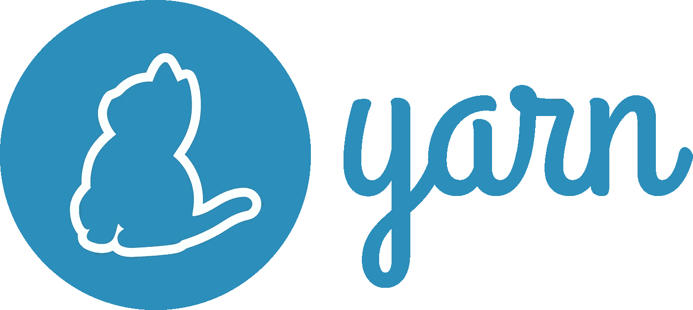
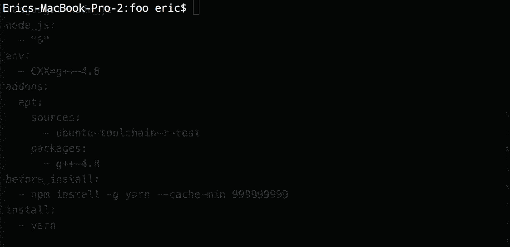

# 使用纱线构建更快、更可靠的 CI

> 原文：<https://medium.com/javascript-scene/faster-more-reliable-ci-builds-with-yarn-7dbc0ef31580?source=collection_archive---------5----------------------->


McKay Savage (CC BY 2.0)

你可能听说过纱线。它旨在作为 npm 客户端的更快、更可靠的替代方案。让包在本地更快地安装固然很好，但是要真正从 Yarn 中获得最大收益，您还应该将它与您的持续集成服务器一起使用。

当与持续集成服务器配对时，Yarn 可以减少由于不同安装的包解析不同而导致的随机 CI 故障的数量。

因为缓慢的安装和随机的 CI 故障会降低您整个团队的速度，它们会对您团队的生产力产生倍增的拖累效应。随机故障甚至比缓慢的安装更令人沮丧，因为当某个东西失败时，您必须确定它是否是一个间歇性的错误，或者是转移软件包的结果。说起来容易做起来难。

纱来救援了！



# 纱线不是

*   国家预防机制登记册的替代品

Yarn 不是 npm 包注册表的替代品。它不是一个竞争包库生态系统。这不是鲍尔惨败的重演。

它是一个使用 npm 软件包注册表的客户端。

# 纱线是

*   更快的安装。
*   确定性依赖——使用`yarn.lock`,您每次都将获得安装在相同目录结构中的相同包的相同版本。

# 转向纱线

当 Yarn 发布的时候，我立刻意识到它可能是有价值的，但是我等了几天才从其他人那里听到它是否符合承诺。

当有消息称它对人们很有效时，我决定开始在一个应用程序项目中使用它。

## 安装纱线

Yarn 团队建议像安装本地应用程序一样安装 Yarn。**我建议你忽略他们的安装文档**。

没有原生的 Mac 安装程序，所以在 Mac 上，他们推荐自制。除非你用了自制软件安装 Node(这我不推荐——用 [nvm 代替](https://github.com/creationix/nvm)，省去了很多头疼的事，方便在节点版本之间切换)，否则**就不要用自制软件安装 Yarn** 。

Homebrew 还会安装 Node，它会将`node`和`npm`全局命令重新链接到 Homebrew 路径，打破你之前的 Node 设置。

除了家酿路线的依赖性管理问题，如果你将 macOS 升级到最新版本，它将通过扰乱`usr/local`的所有权来破坏家酿，所以你也将有那个混乱需要整理。

**谢天谢地，还有一个更好的选择:**

```
npm install -g yarn
```

额外收获:当你设置你的 CI 服务器时，你也应该有`npm`可用，这样你就可以**使用同一个安装程序在你需要的任何地方安装**`**yarn**`**。**

**具有讽刺意味的是，是的:我建议您安装一个 JavaScript 包管理器来安装您的新 JavaScript 包管理器。我确信这是 Yarn 团队推荐 Mac 安装自制软件的真正原因。主要是为了避免这种有点尴尬的讽刺。但是相信我。**

> **`npm`是有经验的 JavaScript 开发者安装 Yarn 的最简单也是最好的方法。**

**Yarn 团队会告诉你 OS 原生包依赖管理器是最好的方法，因为它可以跟踪你所有的包依赖。我明白这种逻辑，但实际上，*它只在 Linux 上成立*。 **Homebrew 不是 macOS 的原生包依赖管理器。它不会也不应该管理你在 Mac 上的所有应用依赖。****

**Yarn 的主要依赖是 Node，**自制并不是安装 Node** 的最佳方式。那么为什么要用自制软件来管理纱线依赖性呢？**

**Windows 有自己的故事，我不太熟悉，所以我不会评论他们的安装说明对 Windows 用户有多好。**

**你知道什么可以在 Mac、Windows 和 Linux 上运行，只需要一套指令，没有平台特有的麻烦吗？**国家预防机制。****

# **使用纱线**

**简而言之，这些是您需要记住的命令:**

****添加一个依赖:****

**`yarn add <packagename>`**

****添加开发依赖:****

**`yarn add --dev <packagename>`**

****删除依赖关系:****

**`yarn remove <packagename>`**

****安装:****

**`yarn` *(安装是默认行为)***

****

**大多数时候这就是你需要的。**

# **锁定文件**

**Yarn 使用`yarn.lock`文件完成了确定性依赖魔法。这应该是一种更加可靠的`npm shrinkwrap`形式。关键区别在于 npm 的安装程序算法不是确定性的，甚至是收缩的。Yarn 的安装程序算法是确定性的。这意味着在一台机器上安装的、使用相同锁文件的内容，将与在另一台机器上安装的内容完全相同。**

> **不要。它的存在是为了确保确定性依赖解析，以避免“在我的机器上工作”的错误。**

**为了让锁文件为您工作，**您必须将它签入 git。****

# **设置持续集成**

**正如我在安装步骤中提到的，您可以用`npm install -g yarn`安装 yarn，这将在大多数 CI 服务器上工作。下面是 Travis-CI 用户的示例`.travis.yml`:**

# **纱线在现实中是如何工作的？**

**如果你对安装速度有多快感到好奇，以下是我从测试应用程序中提取的从头开始安装的数据:**

****使用国家预防机制:****

```
$ time npm install
0m30.193s
```

****使用纱线:****

```
$ time yarn
0m44.835s
```

*****哎呀！*****

**Yarn 的主要卖点是它应该比 npm 更快，但在我对真实项目的测试中，它在从头安装所有依赖项时实际上要慢一些。**

**添加新的依赖怎么办？**

****使用国家预防机制:****

```
$ time npm install lodash
0m6.204s
```

****使用纱线:****

```
$ time yarn add lodash
0m2.948s
```

**好吧，这才像话。我仍然担心从头开始安装的时间，但是现在，用 yarn 添加包的速度大约是 npm 的两倍。**

**显然，从头安装还有改进的空间(这决定了 CI 安装的速度)，但我现在很满意。**

**对此要有所保留，因为这些东西可以从一个操作系统改变到另一个操作系统，从一个版本补丁改变到下一个版本:**

> **Yarn 添加新包装的速度大约是 npm 的两倍。
> 从头安装时，Yarn 比 npm 慢。**

# **结论**

**到目前为止，我对纱线的体验基本上是好的。**

**我刚刚开始在生产中测试它，所以我还不能自信地谈论它的可靠性，但我很乐观。**

**如果真的如预期的那样，Yarn 可以为你的团队节省很多时间。到目前为止，我的结果喜忧参半。**

## **你应该使用纱线吗？**

**现在说绝对同意还为时过早，但我会乐观地点头表示同意。我支持 Yarn 团队解决这些问题，并随着时间的推移不断改进。**

# **[跟随埃里克·埃利奥特学习 JavaScript】](https://ericelliottjs.com/product/lifetime-access-pass/)**

*****埃里克·艾略特*** *著有* [*【编程 JavaScript 应用】*](http://pjabook.com) *(奥赖利)，以及* [*【跟埃里克·艾略特学 JavaScript】*](http://ericelliottjs.com/product/lifetime-access-pass/)*。他为 Adobe Systems******尊巴健身*******华尔街日报*******【ESPN*******BBC****等顶级录音师贡献了软件经验********

****他大部分时间都在旧金山湾区和世界上最美丽的女人在一起。****