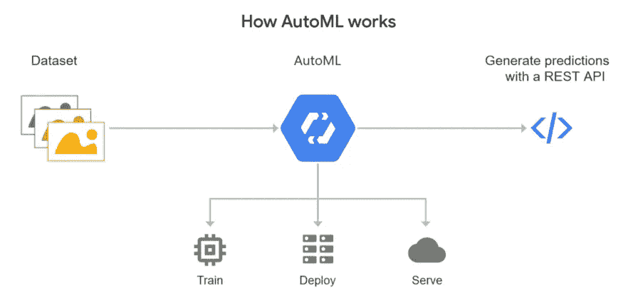

# MLOps 假人的特征商店

> 原文：<https://medium.com/globant/feature-stores-for-mlops-dummies-f098d7269024?source=collection_archive---------0----------------------->

从数据工程师的角度开始使用要素存储

Photo by [Venti Views](https://unsplash.com/@ventiviews?utm_source=medium&utm_medium=referral) on [Unsplash](https://unsplash.com?utm_source=medium&utm_medium=referral)

拥有大量数据并不一定意味着机器学习(ML)模型可以在其上进行训练。根据 [Forbes](https://www.forbes.com/) 的[调查](https://www.forbes.com/sites/gilpress/2016/03/23/data-preparation-most-time-consuming-least-enjoyable-data-science-task-survey-says/?sh=24e183616f63)，数据科学家花费 **80%** 的时间在**数据准备上，**包括转换或缩放输入列(又名 [**特性**](https://en.wikipedia.org/wiki/Feature_(machine_learning)) **)** 以使数据可用于机器学习。这种将原始数据丰富为可以馈入 ML 模型的特征的过程称为 [**特征工程**](https://en.wikipedia.org/wiki/Feature_engineering) **。**

**特征库**是存储和组织这些特征的地方，其明确目的是用于训练模型(由数据科学家使用)或进行预测(由具有已训练模型的应用程序使用)

在本文中，我们将看到:

*   什么是功能商店？
*   ML 平台有哪几代，需要什么特性库？
*   部署特性存储的最佳框架有哪些？

## 什么是功能商店？

做一个基本的了解，可以说特性商店就像数据科学的[数据仓库](https://en.wikipedia.org/wiki/Data_warehouse)*。他们的主要目标是让数据科学家能够缩短从数据摄取到 ML 模型训练的时间。下图描述了一个特征库的布局。*

A Feature Store

> 功能存储是一个中央保险库，用于存储文档化、管理和访问控制的功能，这些功能可在整个组织的不同 ML 模型中使用。

要素库是一个数据管理系统，用于管理和服务 ML 模型的要素，并充当 ML 要素的数据管理层。它从各种来源获取数据，并执行定义的转换、聚合、验证和其他操作来创建要素。特征存储注册可用的特征，并使它们准备好被 ML 训练管道发现和使用。

功能存储与传统的数据仓库有何不同？

在下表中，我们看到了功能存储和数据仓库之间的主要区别的概述。

Key differences between a Datawarehouse and Feature Store

数据仓库可以用来存储预先计算的特征，但是除了 ML 管道之外，它们没有提供更多的功能。当数据科学家需要使用 Python 创建训练/测试数据时，或者当需要低延迟的在线要素(用于向在线模型提供要素)时，我们需要要素存储。一些现有的解决方案可用于以低延迟处理数据，如 Amazon Redshift、Hbase、Redshift、Cosmos DB 等。

## **ML 平台有哪几代，以及对特性商店的需求？**

如果我们试图从头开始解决一个 ML 问题，我们基本上需要以下四个关键部分:

Four key pieces of ML

由此产生的输出是预测，这必然是企业感兴趣的。我们可以根据上面列出的四个要素中的哪一个来对不同代的 ML 平台进行分类:

**第 1 代是** **基于代码和环境的**:重点是编写代码，协作，并使代码易于执行。笔记本曾经是，并将继续是数据科学家日常使用的主要工具之一。爱他们或恨他们，他们以一种其他编辑技术没有的方式在 ML 领域站稳了脚跟。尽管 Gen 1 ML 平台在开发周期中有其用途，但时间已经证明它们是不适合生产工作的系统。

**第二代是基于模型的**:重点是快速创建和跟踪实验，以及部署、监控和理解模型。从表面上看，基于模型的解决方案看起来很棒，然而，拼凑点解决方案有其缺陷，如难以集成工具、难以排除故障、需要一个专家团队等。

[*Generation 2: Model-based AI approach*](https://continual.ai/post/is-data-first-ai-the-next-big-thing)

**第三代是基于数据的**:重点是构建特征和标签——大多数用例真正独特的方面——以及 ML 工作流程其余部分的自动化。这个想法是，人工智能已经足够先进，我们应该能够简单地向我们的平台提供一组训练数据，以及少量的元数据或配置，平台将能够在几个小时内创建我们的用例并将其部署到生产中，这将减少对编码、流水线和管理 [DevOps](https://en.wikipedia.org/wiki/DevOps) 工具的需求。

[Generation 3: Data First AI approach](https://continual.ai/post/is-data-first-ai-the-next-big-thing)

注册特征和关系。自动化特征工程。与同行协作，这样我们就不必在每次需要转换数据时重新创建轮子。让特征存储弄清楚如何为训练和推断提供数据。

> *“矛盾的是，数据是人工智能最不被重视和淡化的方面”*

谷歌也加强了**数据优先人工智能**的紧迫性和机遇，谷歌在最近的一篇论文中得出结论，[数据是人工智能最被低估和淡化的方面。](https://storage.googleapis.com/pub-tools-public-publication-data/pdf/0d556e45afc54afeb2eb6b51a9bc1827b9961ff4.pdf)

## **部署功能商店的最佳框架有哪些？**

有许多框架将帮助我们自动化整个特征工程过程，并在短时间内为分类和回归任务产生大量特征。MLOps 社区对不同的可用功能存储进行了很好的比较。我们可以在这里找到它[。市场的领导者有](https://mlops.community/learn/feature-store/)[盛宴](https://feast.dev/)、 [Hopsworks](https://www.hopsworks.ai/) 、 [AWS SageMaker 特色店](https://aws.amazon.com/ru/sagemaker/feature-store/)、 [Google AutoML](https://cloud.google.com/automl\) 。

**米开朗基罗**

优步是第一批发布特色商店概念的大公司之一。这是一组服务，帮助用户 1)创建和管理共享功能，2)允许统一引用功能的在线和离线版本，以帮助消除在离线培训和在线服务之间复制代码的需要。

Uber’s feature store — *Data preparation pipelines push data into the Feature Store tables and training data repositories.* (source: [https://eng.uber.com/michelangelo/](https://eng.uber.com/michelangelo/))

**盛宴**

[盛宴](https://feast.dev/)是由 Gojek 和 Google Cloud 联合开发的开源特色商店。这里有一个[链接](https://github.com/Azure/feast-azure/tree/main/provider/tutorial)来开始这场盛宴。

How Feast works | Image by [Feast](https://feast.dev/)

Hopsworks

逻辑时钟 在他们的 Hopsworks 框架中增加了一个特性库。它主要关注离线培训部分，但可能具有最清晰/简单的架构。

Source: [https://www.logicalclocks.com/feature-store/](https://www.logicalclocks.com/feature-store/)

**数据砖块**

Databricks 在 2021 年 6 月发布了 Azure 平台支持的特性商店实现的[公开预览版](https://docs.microsoft.com/en-us/azure/databricks/applications/machine-learning/feature-store)

**谷歌云汽车**

[Cloud AutoML](https://cloud.google.com/automl) 是一套 ML 产品，使 ML 专业知识有限的开发人员能够针对他们的业务需求训练高质量的模型。它依赖于谷歌最先进的转移学习和神经架构搜索技术。Cloud AutoML 利用谷歌 10 多年的专有研究技术，帮助 ML 模型实现更快的性能和更准确的预测。

Dataset → AutoML (automatically search through Google’s whole model zoo) → Generate Predictions with a REST API call. Image Source, [Cloud AutoML](https://cloud.google.com/automl/)

Google AutoML 的主要产品有:

*   [Vertex AI](https://cloud.google.com/vertex-ai) —统一平台，帮助您构建、部署和扩展更多 AI 模型。
*   [AutoML Tabula](https://cloud.google.com/vertex-ai/docs/start/automl-model-types#tabular) r —在结构化数据上自动构建和部署最先进的 ML 模型。
*   [AutoML Image](https://cloud.google.com/vertex-ai/docs/start/automl-model-types#image) —从云中或边缘的对象检测和图像分类中获得洞察力。
*   [AutoML Video](https://cloud.google.com/vertex-ai/docs/start/automl-model-types#video) —实现强大的内容发现和引人入胜的视频体验。
*   [AutoML Text](https://cloud.google.com/vertex-ai/docs/start/automl-model-types#text) —通过机器学习揭示文本的结构和意义。
*   [自动翻译](https://cloud.google.com/translate/automl/docs) —动态检测语言并进行翻译。

**特征工具**

[Featuretools](https://www.featuretools.com/) 是一个执行自动化特征工程的框架。它擅长将时态和关系数据集转换为机器学习的特征矩阵。Featuretools 集成了我们已经拥有的 ML 管道构建工具。

Source: [https://www.featuretools.com/](https://www.featuretools.com/)

其他一些有趣的特征工程解决方案包括 [**【自动调整】**](https://github.com/cod3licious/autofeat/blob/master/autofeat_examples.ipynb) 、 [**ExploreKit**](https://people.eecs.berkeley.edu/~dawnsong/papers/icdm-2016.pdf) 、 [**OneBM**](https://arxiv.org/pdf/1706.00327.pdf) 和 [**TsFresh**](https://tsfresh.readthedocs.io/en/latest/) **。**

查看这篇令人惊叹的[文章](https://towardsdatascience.com/is-there-a-feature-store-over-the-rainbow-291cab94e8a5)，了解哪个特性商店最适合你的用例。

# 结论

在这篇博客中，我们已经了解了特性库的重要性，它们随着时间的推移而演变，以及为什么我们需要特性库来支持下一代 ML 平台。我们还研究了同类最佳的框架，这些框架利用特征库来简化 ML 流程，并通过加速 ML 实验来缩短上市时间。

# 参考

了解更多关于功能商店的信息:

*   特征存储是机器学习领域的下一件大事吗？
*   [功能存储与数据仓库](http://Feature Store vs Data Warehouse)
*   [特征存储 101](/data-for-ai/feature-store-101-b964373891c4)
*   [最佳功能工程工具](https://neptune.ai/blog/feature-engineering-tools)

MLOps 的最新进展:

*   [Databricks 宣布推出首个与数据和 MLOps 平台合作设计的功能商店](https://databricks.com/blog/2021/05/27/databricks-announces-the-first-feature-store-integrated-with-delta-lake-and-mlflow.html)
*   [Alteryx 发布新的 AutoML 产品和智能套件](https://www.zdnet.com/article/alteryx-announces-new-automl-product-and-intelligence-suite/)
*   [Splice Machine 推出 Splice Machine 特征库，以简化特征工程并使机器学习民主化](https://www.prnewswire.com/news-releases/splice-machine-launches-the-splice-machine-feature-store-platform-to-simplify-feature-engineering-and-democratize-machine-learning-301209712.html)
*   [Molecula 为其人工智能特色商店技术筹集了 1760 万美元](https://venturebeat.com/2021/01/13/molecula-raises-17-6-million-for-its-ai-feature-store-technology/)