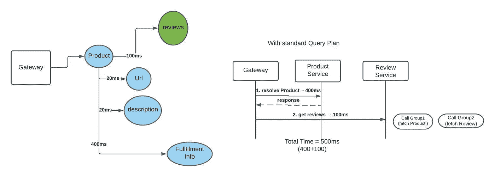
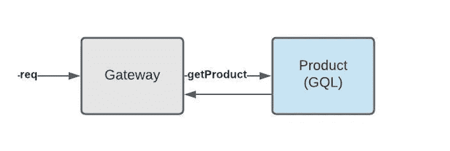
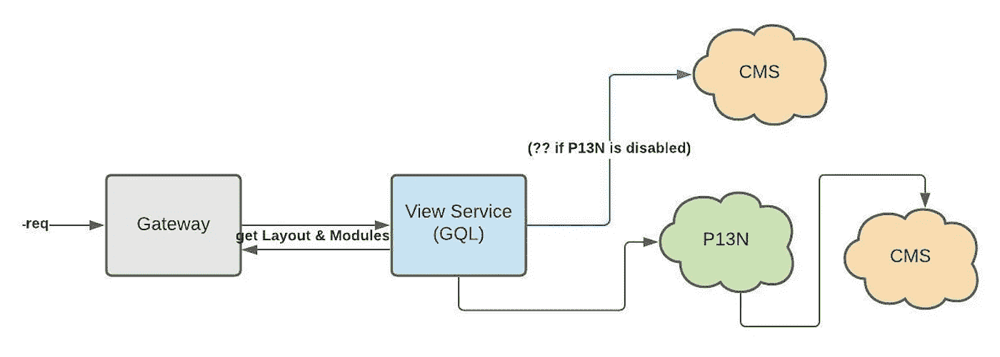
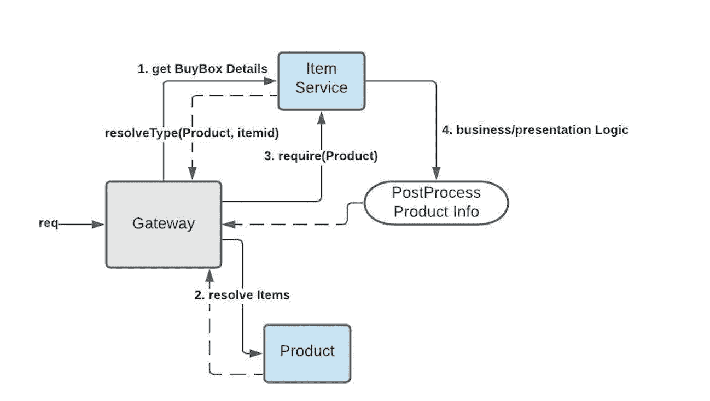
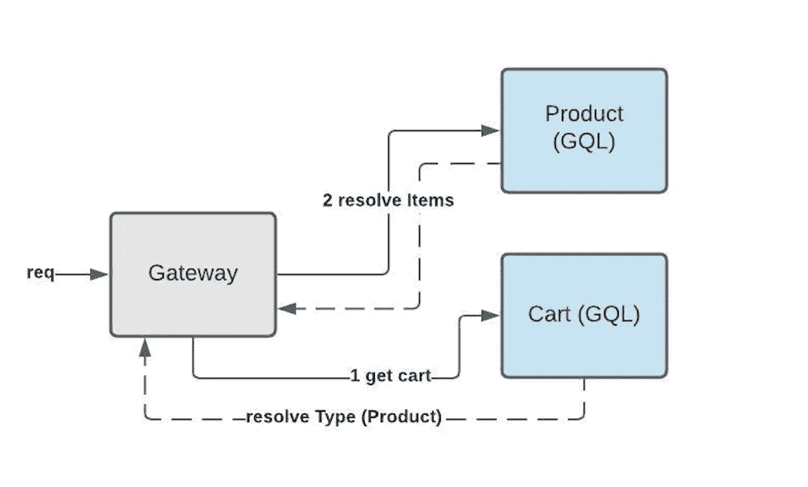

# 联合图表 QL @ Walmart

> 原文：<https://medium.com/walmartglobaltech/federated-graphql-walmart-bfc85c2553de?source=collection_archive---------0----------------------->


Trail in Bangalore — from my iPhone

这篇文章讨论了我们采用联合 GraphQL 的动机(沃尔玛客户体验)以及我们在将基于 REST 的编排器迁移到联合 GraphQL 时看到的一些用例&模式。这里假设您熟悉 GraphQL 语义，但可能对联邦规范不熟悉。

# 介绍

联合 GraphQL 是一种便于分布式 GraphQL 服务解析单个图的图节点的机制。它有一个中央网关节点，分析 GQL 查询并确定哪些 GQL 服务满足查询。客户端将查询发送到网关，网关遵循分散收集模式来编排向其注册的服务提供者。在沃尔玛，我们使用 [Apollo 框架](https://www.apollographql.com/docs/federation/)提供联合 GraphQL 网关&联合 GraphQL 服务。服务是使用`apollo-server` `apollo-gateway`和`fastify`构建的

# 动机

## 领域模型一致性

我们的客户之旅包括由 BFF(后端对前端)编排器驱动的页面。旅程分为多个页面，每个页面都有自己的编排器来满足客户的需求。这些是用 Java 或 NodeJS 编写的基于 REST 的编排器。大多数 Orchestrator 引擎要么是由组织结构决定的，要么是由需要定制视图模型的客户团队决定的。例如，POV 传送带上的产品信息将由与产品服务对话的个性化服务提供。搜索页面上的搜索结果由另一个 orchestrator 提供支持，该 orchestrator 也与产品服务进行对话。没有实施通用的共享数据模型，导致在每个页面上为一个产品块定制实现。在客户端上。

## 开发人员工效学

我们希望开发人员有一个一致的模型来工作，它总是最新的并且容易获得。在 GraphQL 中，带有文档化字段和类型的模式是事实上的 API 契约。此外，GraphQL Playground 允许开发人员在集成之前尝试各种查询。开发横向关注点，比如今天的`adding item to wishlist`，意味着接触与产品服务相协调的各种服务，将喜欢的项目添加到它们的模型中。有了 Federated GraphQL，List 团队可以扩展产品模式并将`isFavourite`功能添加到`product schema`中，从而减少团队之间所需的协调。

## 表演

对于前端应用和驱动前端的协调器来说，性能是头等大事。在联合模型中，网关与服务位于同一个 WAN 中，因此网关产生服务调用的网络开销在 20-40 毫秒之间。它不执行任何计算量大的任务，主要是 I/O。此外，网关通过最小化对服务 p 的调用次数来进行自己的网络路径优化。因此，如果假设产品服务满足图中的 N 个字段，则只有一个对产品服务的调用。这在大多数情况下都能很好地工作，除了本文后面提到的一个特殊用例。

## 根据目标衡量成功

鉴于我们正在转向一个全新的平台，确保我们做出的决策可以用数据来衡量，并且我们可以在未来改进它，这一点非常重要。我们采用的一些成功衡量标准如下

*   客户端有效负载大小减少—我们发现，对于相同的功能，有效负载大小提高了大约**60%**
*   对同一个域服务的重叠呼叫数量— **100%** 改进，因为所有呼叫都通过单一服务或网关
*   FE & BE 的领域实体的可重用性— **100%** 模式被扩展用于附加功能。此外，GQL 确保只有一个解析器 a 类型。

# 使用联合图表学习

虽然 GraphQL 解决了我们现有的许多棘手问题，但联邦 GQL 并不是解决分布式图形共享的灵丹妙药。有些用例不太适合 GraphQL 模式，仍然需要额外的后端编排模式。我们首先关注边缘的 GQL，向下移动到域服务，如果有意义的话，引入联邦。这里有一些不太符合要求的用例。

## 共享实体

共享实体是跨多个领域的模型。这方面的一个例子是在主页、搜索页面、项目页面等之间共享的视图模块。模块是视图的构建块，语义上等同于`div`或`ViewModel`。视图是从我们的内容管理系统中配置的模块构建的。布局驱动哪些模块进入视口的哪些部分。在 case Layouts &模块中，我们有许多域驱动的后端系统，它们想要驱动客户端页面上的最终布局&模块。例如，搜索页面上的模块是由 ML 模型&查询上下文驱动的。主页视图由个性化后端驱动，个性化后端根据客户环境决定哪些模块是相关的。这两个后端都希望最终决定应该将什么样的布局&模块发送给请求客户端。主页&搜索页面的客户端请求如下所示

```
//Types in ViewModule Service
interface ModuleConfigs {
  configs: JSON
}
type ViewModule {
  name: String!
  type: String!
  version: Int!
  configs: ModuleConfigs!}type P13NModuleConfig implements ModuleConfigs {
 recommendations: [ProductInfo]
 metaData:MetaData
}
type BannerModuleConfig implements ModuleConfig {
  bannerImgUrl:String
  bannerText:String
}
type ContentLayout {
 layout: JSON
 modules: [ViewModule]
}
extend type query {
 contentLayout:ContentLayout
}//Queryquery HomeLayout {
contentLayout {
   layoutJSON,
   modules {
     moduleName
     ...on BannerModuleConfig {
       bannerImageUrl
     }
     ...on P13NModuleConfig {
        product {
          productId
          description
          url
        }
     }
   }
}//Search ViewModel Types

type GuidedNavConfig implements ModuleConfig {
  config: JSON
  guidedNavigation: [NavigationItems] //comes from Search Response 
}//SearchView Query
searchView {
   layoutJSON,
   modules {
     moduleName
     ...on GuidedNavConfig  {
       guidedNavigation {
          navigationItems {
              itemName
              link
          }
       }
     }
   }
}
```

一个简单的 GQL 模式将首先获取模块，然后从联邦服务中丰富模块。然而，这种方法在搜索的情况下不起作用，因为模块和搜索结果紧密地联系在一起，并且对搜索结果的查询是编排的长杆，我们不希望在第一次获取模块和随后用搜索结果丰富时增加任何延迟。

我们最初的联邦版本，导致了基于域的分离。因此，搜索视图模型是由搜索服务驱动的(其主要职责是提供给定查询的搜索结果)。在搜索中，客户端既需要页面上的模块，也需要搜索查询的结果。搜索页面上有许多依赖于搜索结果的模块(如方面、过滤器或导航)。我们需要能够为 CMS 中的搜索视图和搜索结果并行编排，然后从结果中缝合视图。这一要求产生了以下问题

*   使用模式拼接技术(如`delegateToSchema`)的 ViewModel 服务的后端入口
*   客户对搜索视图与任何其他视图的不同查询有助于请求进行搜索

为了克服这些问题并使代码更易于维护，我们将 ViewModel 服务作为一个迷你的协调器，与个性化服务、内容管理系统和搜索后端进行对话。下一节将讨论为什么这种模式(不同的域控制聚合结果)很难在 GQL 中建模。

# `@extends` & `@requires`联邦指令

## @扩展

在我们深入研究之前，我们将触及这个指令的作用。`@extends`是在类型级别指定的 GraphQL 指令，指示该实体是当前服务中引用的远程实体。如果我们用等价的 Rest 术语来说，远程实体是一个可以从服务中获取的实体。因此，在这种意义上，实体还需要指定如何获取它的契约。这是我们在远程实体上指定`key fields`的地方，它规定了与远程服务的契约，以获取该实体。因此，从 ViewModule 服务扩展的模块实体可以是这样的。要获取模块，需要提供由`@external`标记的`moduleId`

```
extend type ViewModule @key(fields:"moduleId") {
  moduleId: String! @external }
```

指定对该模块的依赖有两个原因

1.  当您需要修饰模块以向其添加功能时
2.  当您使用中的远程实体作为类型中的组合字段时

***装饰扩展实体***

```
extend type Product [@key](http://twitter.com/key)(fields: "productId") {
  productId: String @external //populated by the Product Service
  canAddToCart: boolean // decorated by CartService on Product entity
}
```

***扩展实体作为另一个字段的输入***

```
extend type Product [@key](http://twitter.com/key)(fields: "productId") {
  productId:String  [@external](http://twitter.com/external) //indicates that the service extending this entity, will provide the productId to resolve a Product using __resolveType function
}
type Cart {
  items:[Product]
}
```

## @需要

`@requires`用于指定业务逻辑内部需要的字段。客户端可能不会查询必填字段，但当前服务需要该字段来解析定义它的字段。例如，如果我们需要将特定类型的模块标记为顶级模块，那么`topModules`是一个字段，您可以将它添加到视图模型中来实现这一功能，您可以使用`@require`指令在过滤之前获取所有模块。客户只会要求`topModules`，而不会要求`modules`。另外`modules`不会是远程实体的键的一部分，但是它在它的字段中。

```
extend type View [@key](http://twitter.com/key)(fields: "pageId") {
 pageId : String [@external](http://twitter.com/external)
 modules: [Module] //needed for field below
 topModules: [Module] [@requires](http://twitter.com/requires) (fields:"modules { moduleId description config { configJSON }") 
}
```

如果 Module 是由其他类型组成的复杂字段，那么`requires` 指令将需要对复杂对象进行解结构，以指定所需的确切字段。随着需要进行的锅炉板延伸量的增加，这可能会很快失控。

## 联合和接口

不能从远程服务扩展联合。然而，它们可以被打包并在需要相同签名的不同服务之间共享。

## 查询计划执行

网关分析查询，然后准备编排路径。为此，它分析由`@extends`和`@requires`指定的服务之间的依赖关系。然后，在调用服务之前，所有对依赖项的获取调用都被“提升”。虽然这是最明显的&确保依赖于图中其他部分的服务在调用服务之前**得到解决的最佳方法，但当出于性能原因(比如服务 SLA 很高)您希望在需要依赖之前开始调用服务解决方案，以便它们并行执行时，这可能会变得棘手。**

举例来说，一个`Product`有一个`fulfilment`属性，它来自履行服务，需要 400 毫秒才能得到响应。我们有一个`reviews`属性，它扩展了产品模式，并由评论服务填充。为此，它需要来自产品服务的 productId。因为父解析器和履行解析器都在**产品服务**中，并且查询计划在服务**跃点上优化，所以在这种情况下，网关将在调用 Reviews 服务之前等待来自产品服务的所有属性。因此，虽然`reviews`不需要履行信息，但它必须等待产品解决方案的长尾效应，然后才能进行点评。**

```
//Review Service
extend type Reviews [@key](http://twitter.com/key)(fields: "productId") {
 productId: String [@external](http://twitter.com/external)
 reviews: [Review] 
}//Product Service
type Product [@key](http://twitter.com/key)(fields: "productId")  {
    productId:String
 productId: String 
 url: String
 fulfilmentInfo:FulfilmentInfo
}
```



> 上面的内容表明，一个模式有太多的依赖关系会增加在联合服务中必须编写的模板，并且依赖关系会影响查询执行计划——因此，为搜索视图建模性能优化的视图模型是一个难题

## 服务集成模式

为了能够快速识别各种服务所使用的 GQL 模式，我们发现将一个名称与我们在此列出的各种模式相关联是非常有用的。

***原子实体***

最简单的集成，其中服务与图中的其他部分没有任何依赖关系。



Atomic Entity Representation

***迷你管弦乐***

这里，GQL 服务直接与其他服务协调，因为它有一个复杂的上游依赖关系来解析它的模式。



Mini orchestrator Entity Representation

***聚合实体***

聚合实体引用远程实体并聚合它们的类型，它们需要这样做，因为它们需要在解析到远程实体之前进行预处理。



Aggregated Entity Representation

***扩展实体***

扩展实体通过向远程类型添加字段来修饰远程类型。



Extended Entity Representation

# 结论

联邦 GraphQL 对于关注点的分离和团队的自治非常有效。然而，必须对一些用例进行建模，牢记上述考虑因素，例如共享实体、图中节点之间的依赖关系，从性能角度和模式维护角度来看，这些都会导致效率低下。

*感谢* [*纳加·马莱帕蒂*](https://medium.com/u/60157e388cc0?source=post_page-----bfc85c2553de--------------------------------) *对本文的贡献和评论。*