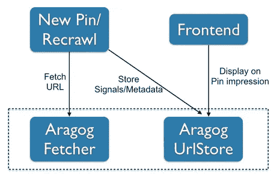
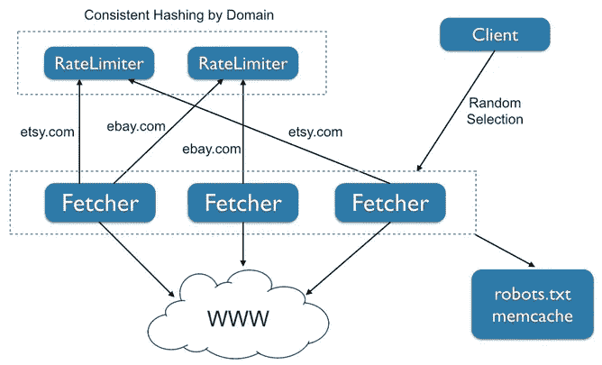
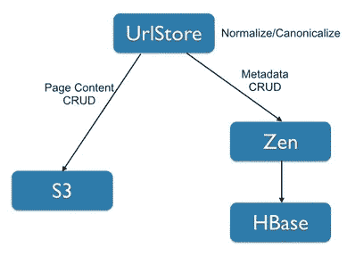
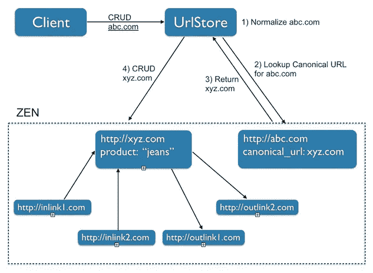

# 通过阿拉戈克获取和提供数十亿个网址

> 原文：<https://medium.com/pinterest-engineering/fetching-and-serving-billions-of-urls-with-aragog-890a872585b5?source=collection_archive---------2----------------------->

Varun Sharma | Pinterest 基础设施工程师

每周，我们都会处理数十亿个 URL，为 Pinners 创造丰富、相关且安全的体验。通过大头针链接的网页包含丰富的信号，使我们能够在大头针上显示有用的信息(如食谱成分、产品价格和位置数据)，推断出更好的建议并打击垃圾邮件。为了充分利用这些信号，我们不仅需要获取、存储和处理页面内容，还需要以低延迟提供处理后的内容。

我们需要的答案是构建阿拉戈克，这是一套从我们不断增长的 URL 库中获取、存储、处理和提供内容的系统，对 Pinners 的延迟很低。

## 阿拉戈克建筑

在构建处理数十亿个 URL 的基础设施时，有几个重要的考虑事项必须要意识到:

1.  规范化/标准化:同一个 URL 可以用许多不同的形式表示，几个 URL 最终可能会重定向到同一个 URL。URL 规范化(不同 URL 表示的重复数据删除)和规范化(指向同一页面的 URL 的重复数据删除)在减少服务所需的数据存储量方面起着重要作用。
2.  爬行礼貌:在这种规模下，对每个特定域的流量进行速率限制和平滑是非常重要的。此外，robots.txt 规则需要得到适当的尊重。
3.  建模 URL 数据:人们可能希望存储与 URL 相关联的提取的元数据片段，或者存储和更新与 URL 相关联的内链接和外链接。

阿拉戈克由两个服务组成:阿拉戈克获取器，它获取网页，遵守适当的速率限制并适当地规范化 URL；阿拉戈克 UrlStore，它存储并提供所有已处理的元数据和有关 URL 的信号。下图描述了我们的爬行管道/前端和阿拉戈克之间的一些交互。

## 阿拉戈克·费彻

阿拉戈克提取器是一种节俭的服务，负责礼貌地提取 URL。阿拉戈克·费彻发出 HTTP 请求，跟随重定向并检索页面内容和 HTTP 头。获取器返回一个 Thrift 结构，其中包含页面内容、HTTP 头、获取延迟、重定向链和其他数据。

实现爬行礼貌需要两件事:

1.  尊重 robots.txt 中的规则
2.  对特定域的流量进行平滑和速率限制

阿拉戈克提取器检索特定域上的 robots.txt 文件，将其内容缓存七天。当请求获取 URL 时，它会应用 robots.txt 中的获取/不获取规则。如果 robots.txt 允许获取，它会使用 URL 的域调用速率限制器。

速率限制器可以立即允许请求，坚持让提取器将请求延迟几毫秒以平滑 URL 提取，或者因为已经超过了速率而迫使其失败。为了确保阿拉戈克 Fetcher 不会因为太多的请求而使一个域负担过重，速率限制器允许一个域最多有 10 个 QPS。必要时，我们会为一些流行或更频繁爬行的域覆盖此限制。使用我们的[配置管理系统](https://engineering.pinterest.com/blog/serving-configuration-data-scale-high-availability)将覆盖作为配置文件传播到限速器池。

速率限制器由一个机器池提供服务，该机器池使用 URL 域的一致散列法进行分片。因此，单个机器负责在单个域上做出速率限制决策。当添加或停用速率限制器进程/机器时，它还最小化速率限制状态的数量。每个速率限制器机器存储从域到上次调度获取时的时间戳的映射。速率限制器检索这个时间戳(让我们称之为 *lastScheduledFetchTimeMs* )并相应地调度下一次获取。例如，如果允许的 QPS 是 10，速率限制器将在*lastScheduledFetchTimeMs+100*为这个 URL 安排一个获取(因为我们希望在 100ms 间隔请求)。速率限制器使用 CAS 更新来乐观地更新 URL 的最后预定获取时间，并且在 CAS 操作失败时重试。它通过从 *lastScheduledFetchTimeMs* 中减去当前时间来计算延迟。当有大量突发请求时，延迟会很大(超过一秒)。当这种情况发生时，速率限制器会向提取器抛出一个异常。存储一个 8 字节的时间戳使得每个域的开销非常小。

每当 URL 受到速率限制时，客户端只需将获取重新安排到稍后的时间，这是我们的异步任务执行系统 [PinLater](https://engineering.pinterest.com/blog/pinlater-asynchronous-job-execution-system) 本质上支持的一个特性。

## 阿拉戈克网址商店

每次你看到一个 [Rich Pin](https://business.pinterest.com/en/rich-pins) ，你都在看阿拉戈克 UrlStore 提供的数据。UrlStore 是一个存储和服务系统，它保存从获取的页面中提取的元数据。它保存页面内容本身、从页面提取的半结构化数据和 web 图形元数据，如内链接和外链接。我们创建了这个共享系统，以便产品团队可以快速构建使用这些元数据的功能，而无需构建自己的可伸缩服务基础设施。

在设计系统时，我们考虑了几个关键的设计因素。首先，我们希望为整个组织的所有 URL 元数据提供一站式服务。其次，我们希望以可接受的低延迟从我们的 API 层提供 Pinterest 的全部在线读取流量，以及从我们的离线处理系统(结合了批处理和实时处理)提供读写流量。

为了实现这一点，我们构建了一个联合存储系统，它提供了一个全面的数据模型，同时在具有适当大小、延迟、持久性和一致性的系统中高效地存储元数据。

这里有几个例子说明我们如何在延迟、持久性和一致性之间进行权衡。

**页面内容**

我们存储获取的网页的全部内容。这些是不经常检索的大数据块，仅用于脱机管道处理。我们选择将这些数据存储在 S3，因为负担得起的大存储容量比低延迟更重要。

每个网页都存储为一个单独的 S3 文件。我们使用 URL 的散列(标准化的和规范的)作为关键字，但是我们发现 S3 容易受到关键字热点的影响。当您创建许多具有长的公共前缀的键时，您可能会使 S3 集群中的单个服务器过载，从而降低您的 bucket 中的一些键的性能(使用 URL 作为键将会创建这些热点)。我们最初试图使用反向域名的 URL(想象一下，在一个 S3 桶中有一百万个关键字都以“com.etsy/…”开头)，但最终收到了亚马逊的热门投诉。

**引脚元数据**

当最初锁定对象时，检索、处理和存储显示在 Rich Pins 上的动态数据，并且只要 Pins 和底层页面存在，就定期刷新这些数据。当 Pin 出现在电路板上或搜索结果中时，该数据被检索并显示给 Pinner。

生成的数据列表总是在不断发展，因此我们在阿拉戈克 UrlStore 中为 URL 元数据提供了一个灵活的数据模型，包括域名和值的映射。例如，产品 Pin 可能有一个“产品名称”字段和一个“价格”字段。应用程序团队负责字段名和值的二进制格式。在大多数情况下，单个 URL 的元数据是由我们的离线处理系统增量更新的(一次更新几个字段)，元数据的子集在不同的情况下提供给用户。

鉴于访问 URL 元数据的低延迟要求，以及带有内链接/外链接的 URL 可以方便地建模为图形的事实，我们使用 [Zen](http://www.youtube.com/watch?v=yI0vHfgK6oI) (由 HBase 支持)作为底层存储系统。Zen 是 Pinterest 的图形存储服务，它允许定义节点并通过边链接这些节点。Zen 属性可用于存储与节点相关联的元数据，Zen 边可用于对内链接/外链接进行建模。Zen 提供了快速、高效的 CRUD 操作以及节点和边的索引。

UrlStore 负责在对 Zen 的元数据或对页面内容的 S3 执行 CRUD 操作之前执行 URL 规范化/标准化(如下所示)。规范的 URL 信息存储在名为“canonical_url”的 Zen 节点属性中(也由爬行管道更新)。URL 规范化和标准化是一个复杂的主题，对于这篇文章来说太详细了。

在下图中，客户端发出在 abc.com 上执行 CRUD 操作的请求。我们规范化 URL，查找 Zen 节点并确定规范的 URL。一旦确定了规范 URL，我们就对规范 URL(即 xyz.com)发出相应的 CRUD 操作。这些可以包括添加/移除 zen 边(内链接/外链接)或添加/移除 Zen 节点属性(元数据)。

自阿拉戈克推出以来，各种管道已经使用它在在线/离线场景中获取、处理和提供 URL 内容。我们每天通过阿拉戈克获取数百万个网址，处理数十亿个在线网址请求。

*鸣谢:本作品由 Jonathan Hess、贾成洪和 Varun Sharma 共同完成。*