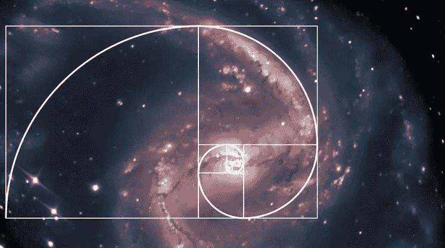
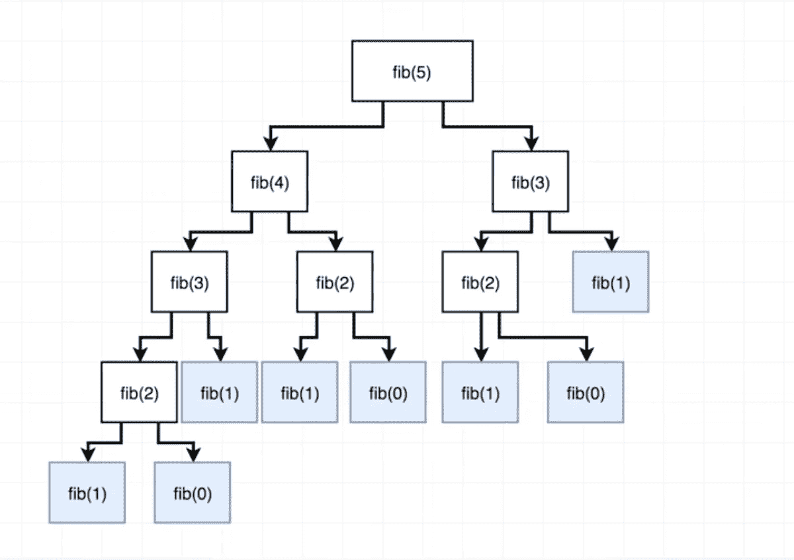
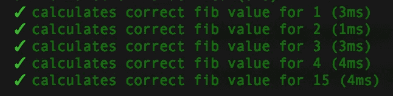
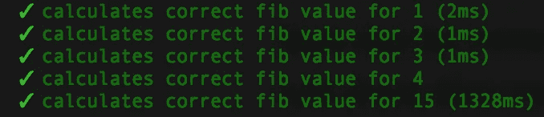

# 斐波那契数列 JavaScript 面试问题。迭代和递归解决方案。

> 原文：<https://medium.com/quick-code/fibonacci-sequence-javascript-interview-question-iterative-and-recursive-solutions-6a0346d24053?source=collection_archive---------0----------------------->



**“写一个函数返回斐波那契数列中的一个 n 元素”**是你在编码挑战面试部分最常听到的问题之一。在这篇博文中，我将介绍这个问题的两个最典型的解决方案，还将涉及一个可怕的(对于大多数新手开发者来说)时间复杂性的话题。

那么什么是斐波那契数列呢？据[百科](https://en.wikipedia.org/wiki/Fibonacci_number)T4:

> 在数学中，**斐波纳契数列**是以下整数序列中的数字，称为**斐波纳契数列**，其特征是前两个数字之后的每个数字都是前两个数字之和

根据所选的序列起点(0 或 1)，序列如下所示:

1, 1, 2, 3, 5, 8, 13, 21, 34, 55, 89, 144, …

或者这个:

0, 1, 1, 2, 3, 5, 8, 13, 21, 34, 55, 89, 144, …

**趣闻:**斐波那契数列，又称黄金分割比，在自然界中出现很多。贝壳的螺旋形、波浪的曲线、种子的头部、松果和树枝等图案都可以用这个数学序列来描述。大到星系螺旋，小到 DNA 分子都遵循黄金比例法则，这一事实表明斐波那契数列是宇宙最基本的特征之一。


好了，现在回到地球和我们的斐波纳契数列编码挑战。让我们快速描述一下我们的 **fib()** 函数的测试用例。如果我们取一个短的 Fibonacci 序列:[0，1，1，2，3，5，8，13，21]和 fib(4)，结果将等于 3，所以基本上我们需要从我们的 Fibonacci 序列数组中返回一个索引为 4 的元素。

这里想到的一个可能也是最容易的解决方案是迭代。让我们看看它会是什么样子:

```
function **fib(n)**{
  let arr = [0, 1];
  **for** (let i = 2; i < n + 1; i++){
    arr.push(arr[i - 2] + arr[i -1])
  }
 return arr[n]
}
```

所以请注意，for 循环实际上无法有效地生成两个第一个数字，因为我们的循环将涉及两个数字相加，所以我们没有创建空数组，而是将变量 **arr** 赋给[0，1],因为我们知道它将始终存在。之后，我们创建一个循环，从 **i = 2** 开始迭代，并将数字添加到数组中，直到数组的长度等于 **n + 1** 。最后，我们返回编号为 **n** 的数组的索引。

```
fib(4)
=> 3
```

太好了，看起来这行得通。现在，如果你的面试官认为这还不够，并要求你实现一个递归的解决方案呢？

尽管递归解决方案看起来很简单，但如果你以前从未遇到过，那么要实现它是相当棘手的:

```
function **fib(n)** {
  if (n < 2){
    return n
  }
  return **fib(n - 1) + fib (n - 2)**
}
```

因此，我们这里的基本情况是，如果它的值小于 2，则返回 **n** 。让我们看一下图表，它将帮助您理解我们代码的其余部分发生了什么。函数 **fib** 被参数 **5** 调用:



(Diagram from Stephen Grider’s “The Coding Interview Bootcamp“ course on Udemy.com)

基本上，我们的 fib 函数将继续递归调用自己，创建树的越来越多的分支，直到它遇到基本情况，从基本情况开始，它将自下而上地对每个分支的返回值求和，直到它最终将它们求和并返回一个等于 5 的整数。这可能需要一点时间来理解，所以花点时间看看这棵树，你就会明白那里发生了什么。

对于斐波那契数列，强烈推荐[学习 JavaScript](https://blog.coursesity.com/popular-javascript-frameworks/) 。既然我们已经讨论了这个问题的两种常见解决方案，那么让我们来讨论一下时间复杂性。

一些测试环境，比如 Jest，会以毫秒为单位显示你的函数运行需要多长时间。假设我们已经为这个挑战预先写好了一些测试，结果会是这样的:

**迭代求解:**



(from Stephen Grider’s “The Coding Interview Bootcamp“ course on Udemy.com)

**递归求解:**



(from Stephen Grider’s “The Coding Interview Bootcamp“ course on Udemy.com)

现在看看我们用 **n=15 调用 **fib()** 的情况。**迭代解 4ms，递归解 1328ms 才能完成同样的动作。这是为什么呢？

我们迭代求解中的一个算法需要 [**线性时间**](https://en.wikipedia.org/wiki/Time_complexity#Linear_time) 来完成任务。基本上我们迭代循环 **n-2** 次，所以在这种情况下，大 O(用来描述我们最坏情况的符号)将简单地等于 **n** 。

在递归的情况下，解需要 [**的指数时间**](https://en.wikipedia.org/wiki/Time_complexity#Exponential_time) **，**，这可以通过当 n 增加时树的大小指数增长的事实来解释。因此，斐波纳契数列中每增加一个元素，函数调用就会增加。大 o 在这种情况下等于 **2^n** 。

希望现在你已经征服了斐波纳契数列编码挑战，你已经增加了成功通过面试的机会。在下一篇博文中，我将介绍使用记忆化实现递归解决方案的可能改进。敬请期待！