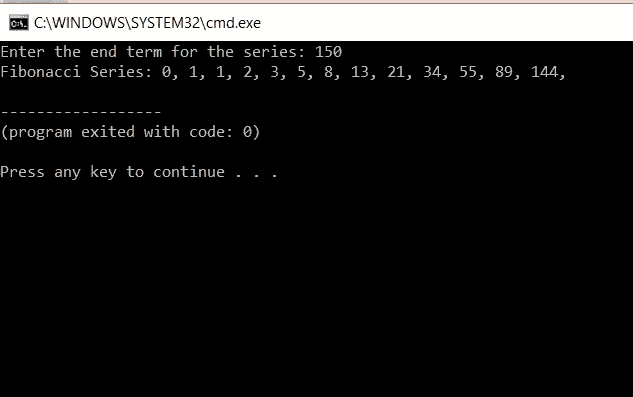

# C 程序设计中的斐波那契数列

> 原文：<https://medium.com/edureka/fibonacci-series-in-c-3207f0f57eb6?source=collection_archive---------2----------------------->


Fibonacci Series in C — Edureka

如果你作为一个程序员参加过面试，你会知道有很多 C 编程面试可能会问一个为斐波那契数列创建程序的问题。这个看似简单的棘手问题困扰着许多人。在本文中，我们将讨论如何在 c 中实现斐波那契数列。

*   斐波纳契级数
*   斐波那契数列，直到用户输入数字
*   使用递归的斐波那契数列

那么让我们开始吧，

# C 语言中的斐波那契数列

斐波那契数列是数列中前面两个数相加形成的数列。前两项分别为 0 和 1。这之后的项是通过简单地将前两项相加而生成的。

有两种方法可以编写斐波那契数列程序:

*   无递归的斐波那契数列
*   使用递归的斐波那契数列

# 斐波那契怎么算？

斐波纳契数列是一系列数字:0，1，1，2，3，5，8，13，21，34，…

下一个数字是通过将它前面的两个数字相加得到的:

*   2 的计算方法是将它前面的两个数相加(1+1)，
*   3 是通过将它前面的两个数相加(1+2)来计算的，
*   5 是(2+3)，以此类推...

这是一个斐波那契数列的例子:0，1，1，2，3，5，8，13 等等。

在上面的例子中，0 和 1 是数列的前两项。这两个术语是直接打印的。第三项是由前两项相加而成的。在这种情况下是 0 和 1。所以，我们得到 0+1=1。因此，1 被打印为第三项。通过使用第二和第三项而不使用第一项来生成下一项。这样做，直到你想要的或用户要求的条款的数量。在上面的例子中，我们使用了八个术语。

这里有一个 c 程序:

```
#include<stdio.h>
int main()
{
int first=0, second=1, i, n, sum=0;
printf("Enter the number of terms: ");
scanf("%d",&n); //accepting the terms
printf("Fibonacci Series:");
for(i=0 ; i<n ; i++)
{
if(i <= 1)
{ sum=i;
} //to print 0 and 1
else
{
sum=first + second;
first=second;
second=sum;
//to calculate the remaining terms.
//value of first and second changes as new term is printed.
}
printf(" %d",sum)
}
return 0;
}
```

**输出:**


在上面的程序中，我们首先声明所有的变量。首先，我们设置第一个和第二个变量的值，这些变量将用于生成更多的项。接下来，我们声明 n 项，它将保存项数。我们有一个术语来表示两位数的和，叫做 sum。最后一项是 I，用于 a 循环中的迭代。

我们接受来自用户的术语数，并将其存储在 n 中。然后我们有一个 for 循环，从 0 一直运行到用户请求的术语数，即 n。

在 for 循环中，我们首先有一个 if 语句，条件是检查 I 的值是否小于 1。如果是零，则打印一个，这取决于术语的数量。当有两个以上的术语时，它用于打印首字母 0 和 1。

如果项数大于 1，则执行循环的 else 部分。在这部分中，变量 first 和 second 的相加被赋给变量 sum。下一项是和变量。例如，将值为 0 和 1 的第一个和第二个相加，得到的和值为 1。

在下一部分中，我们将第二项的值赋给第一项，然后将和的值赋给第二项。这样做是因为对于下一个术语，随着新值的打印，前面的两个值被改变。这是总值。如果我们考虑将 0 和 1 分配给第一个和第二个，在这个步骤之后，第一个的值将是 1，第二个的值也将是 1，因为 sum 的值是 1。

退出 else 部分后，我们打印 sum 值。这一直执行到 I 的值等于 n，循环中断，我们退出程序。

让我们继续阅读 C #文章中的斐波那契数列，看看还能做些什么，

# 斐波那契数列，直到用户输入数字

**代码:**

```
#include <stdio.h>
int main()
{
int first = 0, second = 1, sum = 0, n;
printf("Enter the end term for the series: ");
scanf("%d", &n);
printf("Fibonacci Series: %d, %d, ", first, second);
sum = first + second;
while(sum <= n)
{
printf("%d, ",sum); 
irst = second;
second = sum;
sum = first + second;
}
return 0;
}
```

**输出:**



在这个程序中，我们从用户那里得到最终术语。我们必须显示一个斐波纳契数列直到这个数字。这是通过使用 while 循环来完成的。我们接受用户的输入，这是最后一项。然后打印第一项和第二项。在此之后，将第一个和第二个相加，存储在 sum 中。然后，有一个 while 循环。它一直运行到总和的值小于用户输入的数字的值。在 while 循环中，首先打印出总和。

在下一部分中，我们将第二项的值赋给第一项，然后将 sum 的值赋给第二项。我们再次执行加法，将第一项和第二项相加，并将其赋值为总和。循环运行，直到总和值大于用户输入的数字。

# 10 的斐波那契数列是多少？

斐波纳契数列是通过将前两个数字相加得到下一个数字来实现的，从 0 和 1 开始:

```
#include <iostream>
using namespace std;
int main ()
{
int a = 0, b = 1;
cout << a << ", " << b;
for (int i = 0; i < 8; i++)
{
cout << ", " << a + b;
b = a + b; // b is the sum of the 2 numbers
a= b - a; // a is the old y
}
}
```

# 0 是斐波那契数吗？

没错，斐波那契数列就是数列:
0，1，1，2，3，5，8，13，21，34，…

让我们继续讨论 C 语言文章中斐波纳契数列的最后一点。

# **斐波那契数列使用递归**

另一种编程斐波那契数列生成的方法是使用递归。递归是以自相似的方式重复项目的过程。在编程语言中，如果一个程序允许你在同一个函数中调用一个函数，那么它就被称为该函数的递归调用。

**代码:**

```
#include<stdio.h>
int f(int);
int main()
{
int n, m= 0, i;
printf("Enter Total terms:n");
scanf("%d", &n);
printf("Fibonacci series terms are:n");
for(i = 1; i <= n; i++)
{
printf("%dn", fibonacci(m));
m++;
}
return 0;
}
int fibonacci(int n)
{
if(n == 0 || n == 1)
return n;
else
return(fibonacci(n-1) + fibonacci(n-2));
}
```

**输出:**


在这个程序中，我们使用递归来生成斐波那契数列。函数 Fibonacci 被递归调用，直到我们得到输出。在函数中，我们首先检查数字 n 是零还是一。如果是，我们返回 n 的值。如果不是，我们用值 n-1 和 n-2 递归调用 Fibonacci。

如果你想查看更多关于人工智能、DevOps、道德黑客等市场最热门技术的文章，那么你可以参考 [Edureka 的官方网站。](https://www.edureka.co/blog/?utm_source=medium&utm_medium=content-link&utm_campaign=fibonacci-series-in-c)

> 1.[C 程序的基本结构](/edureka/basic-structure-of-c-program-ed3bf9c72632)
> 
> 2. [C 程序求一个二次方程的根](/edureka/c-program-quadratic-equation-1483f6a182af)
> 
> 3.[如何在命令提示符下编译 C 程序](/edureka/compile-c-program-in-command-prompt-e6cd3ce11d8e)
> 
> 4. [C 编程教程](/edureka/c-programming-tutorial-36bc0380175f)

*原载于 2019 年 7 月 15 日*[*https://www.edureka.co*](https://www.edureka.co/blog/fibonacci-series-in-c/)*。*