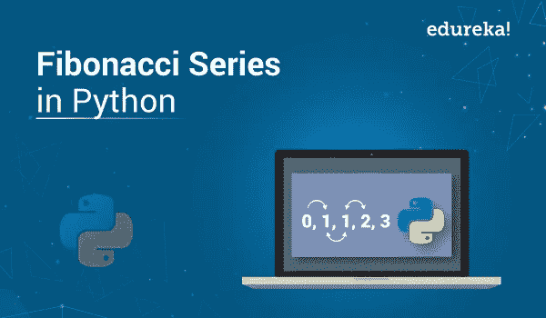

# Python 中的斐波那契数列

> 原文：<https://medium.com/edureka/fibonacci-series-in-python-8a5b74a9cc3c?source=collection_archive---------3----------------------->



斐波那契数列是以意大利数学家命名的一系列数字，被称为**斐波那契**。它只是一系列数字，从 0 和 1 开始，然后通过前面两个数字的相加继续。在本文中，您将学习如何使用多种方法编写 Python 程序来实现斐波那契数列。下面将讨论指针:

*   什么是斐波那契数列？
*   Python 程序写斐波那契数列
*   使用循环
*   使用递归

我们开始吧。

# 什么是斐波那契数列？

斐波那契数列是数列中前面两个数相加形成的数列。

**斐波那契数列的例子:** 0，1，1，2，3，5

在上面的例子中，0 和 1 是数列的前两项。这两个术语是直接打印的。第三项的计算方法是将前两项相加。在这种情况下是 0 和 1。所以，我们得到 0+1=1。因此，1 被打印为第三项。通过使用第二和第三项而不使用第一项来生成下一项。这样做，直到你想要的或用户要求的条款的数量。在上面的例子中，我们使用了五个术语。

接下来，让我们写一个 Python 程序来实现它。

# Python 程序实现斐波那契数列

用 Python 编程语言实现斐波那契数列是最简单的！现在有多种方法来实现它，即:

让我们一个一个地看这两个代码。

## 使用循环的斐波那契数列

**Python 中的循环**允许我们多次执行一组语句。让我们写一个 python 程序，用循环实现斐波那契数列。

```
# Enter number of terms needed                   #0,1,1,2,3,5....
a**=**int(input("Enter the terms"))
f**=**0                                         #first element of series
s**=**1                                         #second element of series
**if** a<**=**0:
print("The requested series **is**",f)
**else**:
print(f,s,end**=**" ")
**for** x **in** range(2,a):
next**=**f**+**s
print(next,end**=**" ")
f**=**s
s**=**next
```

**输出:**输入术语 5 0 1 1 2 3

另一种编程斐波那契数列生成的方法是使用递归。让我们深入探讨一下。

## 使用递归编写斐波那契数列的 Python 程序

递归是基本的 Python 编程技术，其中函数直接或间接调用自身。相应的函数称为**递归函数**。使用递归算法，某些问题可以很容易地解决。让我们看看如何在 Python 中使用递归打印 Fibonacci 数列的前 n 个数字。

**Python 代码:**

```
**def** FibRecursion(n):
**if** n <**=** 1:
**return** n
**else**:
**return**(FibRecursion(n**-**1) **+** FibRecursion(n**-**2))
nterms **=** int(input("Enter the terms? "))  # take input from the user
**if** nterms <**=** 0:  # check if the number is valid
print("Please enter a positive integer")
**else**:
print("Fibonacci sequence:")
**for** i **in** range(nterms):
print(FibRecursion(i))
```

**输出:**多少项:5
0 1 1 2 3

**说明:**在上面的 Python 程序中，我们使用递归来生成斐波那契数列。函数 FibRecursion 被递归调用，直到我们得到输出。在函数中，我们首先检查数字 n 是零还是一。如果是，我们返回 n 的值。如果不是，我们用值 n-1 和 n-2 递归调用 Fibonacci。

这就把我们带到了“Python 中的斐波那契数列”这篇文章的结尾。我们已经学习了如何使用循环语句或递归以编程方式打印第 n 个斐波那契数。

如果你想查看更多关于人工智能、DevOps、道德黑客等市场最热门技术的文章，你可以参考 Edureka 的官方网站。

请留意本系列中的其他文章，它们将解释 Python 和数据科学的各个方面。

> *1。*[*Python 中的机器学习分类器*](/edureka/machine-learning-classifier-c02fbd8400c9)
> 
> *2。*[*Python Scikit-Learn Cheat Sheet*](/edureka/python-scikit-learn-cheat-sheet-9786382be9f5)
> 
> *3。* [*机器学习工具*](/edureka/python-libraries-for-data-science-and-machine-learning-1c502744f277)
> 
> *4。* [*用于数据科学和机器学习的 Python 库*](/edureka/python-libraries-for-data-science-and-machine-learning-1c502744f277)
> 
> *5。*[*Python 中的聊天机器人*](/edureka/how-to-make-a-chatbot-in-python-b68fd390b219)
> 
> *6。* [*Python 集合*](/edureka/collections-in-python-d0bc0ed8d938)
> 
> *7。* [*Python 模块*](/edureka/python-modules-abb0145a5963)
> 
> *8。* [*Python 开发者技能*](/edureka/python-developer-skills-371583a69be1)
> 
> *9。* [*哎呀面试问答*](/edureka/oops-interview-questions-621fc922cdf4)
> 
> *10。*[*Python 开发者简历*](/edureka/python-developer-resume-ded7799b4389)
> 
> *11。*[*Python 中的探索性数据分析*](/edureka/exploratory-data-analysis-in-python-3ee69362a46e)
> 
> *12。* [*蛇与蟒蛇的游戏*](/edureka/python-turtle-module-361816449390)
> 
> *13。* [*Python 开发者工资*](/edureka/python-developer-salary-ba2eff6a502e)
> 
> *14。* [*主成分分析*](/edureka/principal-component-analysis-69d7a4babc96)
> 
> *15。*[*Python vs c++*](/edureka/python-vs-cpp-c3ffbea01eec)
> 
> 16。 [*刺儿头教程*](/edureka/scrapy-tutorial-5584517658fb)
> 
> 17。[*Python SciPy*](/edureka/scipy-tutorial-38723361ba4b)
> 
> 18。 [*最小二乘回归法*](/edureka/least-square-regression-40b59cca8ea7)
> 
> *19。* [*Jupyter 笔记本小抄*](/edureka/jupyter-notebook-cheat-sheet-88f60d1aca7)
> 
> 20。 [*Python 基础知识*](/edureka/python-basics-f371d7fc0054)
> 
> *21。* [*Python 模式程序*](/edureka/python-pattern-programs-75e1e764a42f)
> 
> *二十二。* [*用 Python 进行网页抓取*](/edureka/web-scraping-with-python-d9e6506007bf)
> 
> *23。* [*Python 装饰器*](/edureka/python-decorator-tutorial-bf7b21278564)
> 
> *24。*[*Python Spyder IDE*](/edureka/spyder-ide-2a91caac4e46)
> 
> *25。*[*Python 中使用 Kivy 的移动应用*](/edureka/kivy-tutorial-9a0f02fe53f5)
> 
> *26。* [*十大最佳学习书籍&练习 Python*](/edureka/best-books-for-python-11137561beb7)
> 
> *27。* [*机器人框架与 Python*](/edureka/robot-framework-tutorial-f8a75ab23cfd)
> 
> *28。*[*Python 中的贪吃蛇游戏*](/edureka/snake-game-with-pygame-497f1683eeaa)
> 
> *29。* [*Django 面试问答*](/edureka/django-interview-questions-a4df7bfeb7e8)
> 
> 三十。 [*十大 Python 应用*](/edureka/python-applications-18b780d64f3b)
> 
> *31。*[*Python 中的哈希表和哈希表*](/edureka/hash-tables-and-hashmaps-in-python-3bd7fc1b00b4)
> 
> *32。*[*Python 3.8*](/edureka/whats-new-python-3-8-7d52cda747b)
> 
> *33。* [*支持向量机*](/edureka/support-vector-machine-in-python-539dca55c26a)
> 
> *34。* [*Python 教程*](/edureka/python-tutorial-be1b3d015745)

*原载于 2019 年 9 月 23 日*[*【https://www.edureka.co】*](https://www.edureka.co/blog/python-fibonacci-series/)*。*