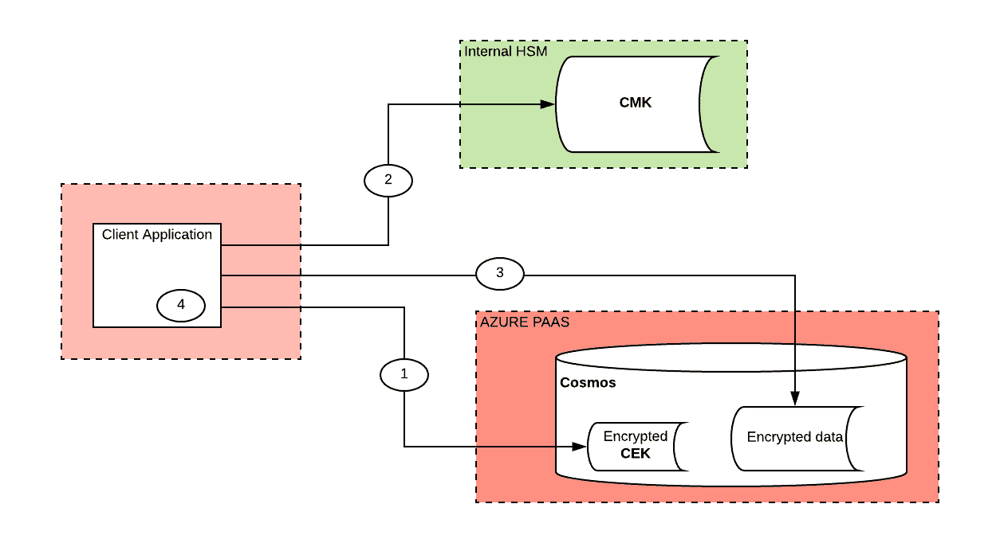

# Azure CosmosDb 文档中的字段级加密

> 原文：<https://medium.com/walmartglobaltech/field-level-encryption-in-azure-cosmosdb-documents-c701f605754e?source=collection_archive---------4----------------------->

在当今世界，客户的数据安全和隐私至关重要。当您开始采用云时，这变得尤为重要。

通常，您还必须遵守特定产品领域的法规遵从性。例如，如果你进入**电子商务**的领域并处理用户的信用卡信息，你必须符合 **PCI DSS** 。如果你进入了**医疗保健**领域，你可能必须遵守 **HIPAA** 标准，这取决于你处理的医疗保健数据的种类

通过防火墙设置限制您的云 PaaS(平台即服务)组件，可能是可以应用的最基本的安全措施。但是，这并不能完全保护您的数据免受其他内部团队的攻击，例如云管理员、数据库管理员等。

**加密助您一臂之力** —有了加密，数据的完全控制权现在归特定的企业所有者和技术团队所有，而不会将解密的数据泄露给未经授权和授权的各方。

# **用例**

作为云迁移的一部分，我们需要在 Cosmos 中存储 JSON 文档，文档中的一些字段非常敏感。

我们桌子上的加密选项如下。

1.  **将整个文档存储为加密的 blob**

*   优点:这更容易实现
*   *缺点*:对字段没有可搜索性(将数据库简化为键值存储)，加密和解密的成本更高，基本可调试性丧失，即现在即使是对文档的基本检查也需要解密

2.**仅加密高度敏感的字段**

*   *优点*:允许在索引字段上搜索，更低的加密和解密成本，支持基本的可调试性。
*   *缺点*:实现起来相对复杂，仍然需要解决对加密字段的搜索。

由于上述“选项 2”的优势，我们选择继续进行。此外，加密有两种标准形式

*   ***随机化*** :使用随机 CEK(内容加密密钥)，所以同样的文本会有不同的加密输出。这被认为是更安全的，但是您失去了在字段上搜索的能力
*   ***确定性*** —使用标准 CEK，这样相同的文本将有相同的加密输出。

如上所述，我们对这些字段中的一些有搜索需求，所以我们不得不用确定性加密来解决。

# 挑战

由于 CosmosDb 不提供任何可以加密特定字段的现成功能，所以我们必须想出自己的解决方案。

我们还必须以无缝的方式解决这个问题，以便所有加密和解密的复杂性都被查询/DAO 层吸收，并且客户端不需要特别地参与相同的细节，例如，加密文本并传递到 Cosmos 查询

根据我们的信息安全要求，如果使用确定性模式，我们还必须经常轮换加密密钥。

# 加密基础

在我们深入研究如何解决它的细节之前，下面是加密方法的一些基础知识。

*   加密由一个名为 *CEK(内容加密密钥)*的标准密钥完成
*   在系统的生命周期中, *CEK* 不会改变，因为如果我们需要改变 *CEK* 的话，重新加密所有历史数据会有很大的开销。
*   为了确保您的 *CEK* 的健全性/安全性，它以加密的方式存储在您的配置系统中，通过另一个名为 *CMK(内容主密钥)*的密钥进行加密。
*   *CMK* 可以旋转，在任何时间点都应该有至少两个版本的加密 *CEKs* (一个用旧的 CMK 加密，另一个用新的 CMK 加密)，您的应用程序(在这种情况下是 DAO 层)可以理解，以支持 CMK 的无缝旋转。
*   CMK 主要由 HSM 支持/提供。

***总结流程:***

> 应用程序发出参数化查询。库(Cosmos 客户端库)拥有加密列的元数据。
> 
> **1。**库从列元数据中获取加密算法，此后加密 CEK 和 CMK 的位置
> 
> **2。然后，库联系密钥库并检索 CMK 来解密 CEK。缓存解密的 CEK 以减少往返次数(如果允许)**
> 
> **3。然后，库使用解密的 CEK 加密查询中的参数，并将查询发送到服务器。**
> 
> **4。**如果读取查询，结果中返回的加密列由库使用相同的 CEK 解密。

# 解决办法

通常 Spring 数据仓库在抽象 Crud 方法方面做得非常好，我们使用 spring-data-cosmosdb 进行我们的 cosmosdb 交互。其中一种方法是在 spring 数据层之上添加加密功能作为包装。

1.  ***定义加密元数据***

我们提出了一种可以在包含加密元数据的实体对象的字段上定义的注释。

*   *encryption type*&*encryption algorithm*—不言自明，它们表示加密的类型和用于加密的算法。
*   *ceKid* —这是配置系统中 *CEK* 的密钥标识符，即表示存储加密 CEK 的密钥。由于不同的字段可能具有不同的 CEK，元数据指示用于该字段的特定密钥标识符。
*   可缓存—这是一个字段，指示您是否可以缓存未加密的密钥或在每次需要使用它时解密它(这是一个您需要采取的安全措施，因为内存转储可能会暴露您的 CEK)

2. ***储酒桶***

我们选择使用单独的 Cosmos 集合来存储加密的 CEKs。然而，cek 还需要存储主密钥的元数据。所以我们为 CEK 和 CMK 设计了以下 POJO 对象。

*   *关键路径值*—HSM 层中的 CMK 密钥标识符。
*   *providerName*—providerName 是 HSM 访问层的一个实现。因为它在不同的团队/组织之间会有所不同，所以我们选择保持它的抽象，实现下面的接口。

KeyStoreProvider 的特定于客户端的实现可以在应用程序启动时向 KeyStoreManager 注册，以便它们可供 crypto 实用工具类使用。

3. ***扩展 DocumentDbPersistentProperty 存储 CryptoMetadata***

spring-data-cosmosdb 中的 DocumentDbPersistentProperty 类存储字段元数据，例如，它是 id 还是 partitionKey 字段。我们对其进行了扩展，以存储来自步骤 1 中定义的注释的加密元数据。

***4。扩展 MappingDocumentDbConverter***

MappingDocumentDbConverter 是 EntityConverter 类，它负责将 POJO 转换为 Cosmos 文档对象，反之亦然。因此，加密(写)和解密(读)字段的功能是通过扩展转换器来实现的。

# **结论**

加密带来了一些我们都应该意识到的缺点。

1.  *将所有查询转换为绑定查询* —之前我们曾提供预构建的字符串作为查询，因为所有的 Cosmos 查询都被转换为 POST 请求，与 JDBC 的查询缓存不同，绑定参数并没有给我们带来多少优势。这种方法没有帮助我们识别字段元数据，即，如果它是一个加密的字段，数据应该加密并在查询参数中传递给服务器。
2.  *加密列中不支持基于范围的查询* —显然，加密列破坏了文本/数字的顺序/排序语义。因此这些列不支持基于范围的查询。

字段级加密确保了在保护云上的客户数据和简化基本调试之间的良好平衡。

# 承认

合著者[拉凯什·潘迪特](https://medium.com/u/bb9e68824db8?source=post_page-----c701f605754e--------------------------------)

来自 [Srinivas Devarakonda](https://medium.com/u/206b04e5090e?source=post_page-----c701f605754e--------------------------------) 和 [Krishna Kanth Annamraju](https://medium.com/u/2cf58d95bc2e?source=post_page-----c701f605754e--------------------------------) 的重要意见