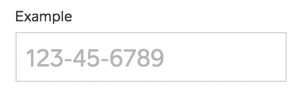
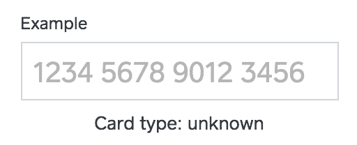

# FieldKit:用于复杂输入格式的简单库

> 原文：<https://medium.com/square-corner-blog/fieldkit-a-simple-library-for-complex-input-formatting-ae9ad5f67169?source=collection_archive---------0----------------------->

## 用户键入时实时输入文本字段格式。

*由* [*乔泰勒*](https://medium.com/u/6b48b491242a?source=post_page-----ae9ad5f67169--------------------------------) *和* [*布莱恩多诺万*](https://medium.com/u/c9cfa64b9d05?source=post_page-----ae9ad5f67169--------------------------------) *。*

> 注意，我们已经行动了！如果您想继续了解 Square 的最新技术内容，请访问我们的新家[https://developer.squareup.com/blog](https://developer.squareup.com/blog)

为了创造最佳的用户体验，我们努力为我们的产品构建一个漂亮而简单的界面。因此，当我们着手为我们的网上商店[建立一个结账流程的时候，我们希望顾客在输入信用卡和联系信息的时候，能有和在本地应用程序上一样好的体验。这需要做大量的工作，但是我们知道我们需要消除网站上常见的](http://squareup.com/shop)[“没有破折号或空格”](http://www.unixwiz.net/ndos-shame.html)的信息。我们用现场工具包做到了这一点。

FieldKit 在用户键入时提供实时的文本字段格式。它简化了输入格式，为用户创造了更好的体验，同时输出标准化的数据。幸运的是，这对于任何人来说都很容易实现，因为我们已经开源了 FieldKit。

# 控制您的文本字段

您可以[下载最新版本的](https://github.com/square/field-kit/releases)field kit，包括。js 文件。您还可以使用 [npm](https://www.npmjs.com/) 来安装 FieldKit，以便在您项目的基于 npm 的构建系统中使用。

$ npm 安装字段-套件-保存

默认情况下，FieldKit 提供 FieldKit。TextField 作为一个简单的基类，它包装一个文本字段而不改变其行为。

```
<input type="text" id="text-field-example" /><script>
  var field = new FieldKit.TextField(document.getElementById('text-field-example'));
</script>
```

FieldKit 还使您能够在输入的生命周期内监听一些基本事件。在输入的整个生命周期中，可能会对其执行一些操作，如 textFieldDidBeginEditing 或 textDidChange。发生这种情况时，FieldKit 会通知您。

```
<input type="text" id="text-field-example" maxlength=”20” /><script>
  var field = new FieldKit.TextField(document.getElementById('text-field-example'));
  field.setDelegate({
    textFieldDidBeginEditing: function(field) {
      console.log(field.value());
    },
    textFieldDidEndEditing: function(field) {
      console.log(field.value());
    },
    textDidChange: function(field) {
      console.log(field.value());
    }
  });
</script>
```

FieldKit 在与格式化程序一起使用时最有用。我们有针对信用卡号、有效期、电话号码、当地货币和社会保险号的格式化程序。FieldKit 还提供了创建自定义格式化程序的构造块。

```
<input type="text" id="social-security-number" />
<input type="text" id="text-field-example-2" /><script>
  var ssnField = new FieldKit.TextField(
    document.getElementById('social-security-number'),
    new FieldKit.SocialSecurityNumberFormatter()
  );
</script>
```



使用格式化程序，您可以:
*控制允许输入的数据；
*在输入中插入额外的字符(不是用户键入的)以标准化格式；
*并且，使用根据情况变化的定制格式逻辑。

除了格式化程序，我们还有一些不同的字段类型，为特定的用例添加了额外的功能。例如，我们有一个 CardTextField。该字段自动使用 AdaptiveCardFormatter，公开一个 [Luhn Check](https://en.wikipedia.org/wiki/Luhn_algorithm) 方法，并将完整的卡号模糊化，只显示最后 4 位数字。

```
<input type="text" id="card-number" placeholder="1234 5678 9012 3456">
<div id="card-type">Card type: <span id="card-type-span">unknown</span></div> <script>
  var field = new FieldKit.CardTextField(document.getElementById('card-number'));
  field.setCardMaskStrategy(FieldKit.CardTextField.CardMaskStrategy.DoneEditing);
  field.setDelegate({
    textDidChange: function() {
      document.getElementById('card-type-span').innerHTML = (field.cardType() || 'unknown');
    }
  });
</script>
```



我们包括的另一个字段是到期日期字段。要了解这些领域的更多信息，请前往[源代码和 wiki](https://github.com/square/field-kit/wiki) 。

# TL；博士；医生

FieldKit 是一个可用于为您的应用程序创建自定义输入体验的工具。能够定制数据输入，包括如何格式化和解析，将允许更安全和更一致的用户体验。

FieldKit 已经在 Square 的几乎每个 web 项目中使用了多年。现在，我们很期待你能把它带到哪里。请帮助我们改进 [FieldKit](https://github.com/square/field-kit) ，让网络输入变得更好。

[](/@jmt3) [## 乔·泰勒

### 热爱生活::做你喜欢的事情::热爱你所做的事情:

medium.com](/@jmt3) [](/@eventualbuddha) [## 布莱恩·多诺万-简介

### 我为@Square 制作数字产品，主要是网站。

medium.com](/@eventualbuddha)