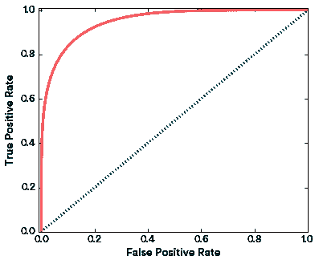

# 通过有针对性的摩擦打击金融欺诈

> 原文：<https://medium.com/airbnb-engineering/fighting-financial-fraud-with-targeted-friction-82d950d8900e?source=collection_archive---------0----------------------->

## Trust 团队的 David 向我们介绍了 Airbnb 如何应对退款，同时最大限度地减少对好客人的影响。

The piano in our “Vienna” meeting room in San Francisco has an easter egg. Move the right book, and it will play for you!

在任何一个晚上，全球 191 个国家都有近 200 万人入住 Airbnb 房源。我们全球社区的快速增长基于一件事:信任。

我们采取[全面的方法](/reinvent/perfect-strangers-how-airbnb-is-building-trust-between-hosts-guests-f9132c3e6b92)来获得信任，包括强大的主动措施和被动支持，但今天我想重点谈谈我们提前做的一些工作——通常是在后台——以防止欺诈者在我们的网站上使用被盗信用卡。

在这篇文章中，我将介绍我们如何利用机器学习、实验和分析来识别和阻止欺诈者，同时最大限度地减少对绝大多数好用户的影响。首先，我将介绍我们使用机器学习(ML)模型来触发旨在阻止欺诈者的摩擦。然后，我将概述我们如何通过最小化损失函数来选择模型的阈值，并深入研究损失函数中的每一项:假阳性、假阴性和真阳性的成本。最后，我将通过一个数值例子来比较阻塞事务的优化和应用摩擦。

## 我们要对抗的是:退款

像所有在线业务一样，Airbnb 面临着试图使用偷来的信用卡的欺诈者。当真正的持卡人意识到他们的卡被盗，并注意到他们的账单上有未经授权的费用时，信用卡公司会发出所谓的“[退款](https://en.wikipedia.org/wiki/Chargeback)”，商家(在我们的例子中是 Airbnb)会退还这笔钱。

与我们的一些竞争对手不同，我们吸收了这些退款的成本，不会将任何财务责任转嫁给我们的主机。为了更好地保护我们的社区，并减少我们自己面临的退款成本，我们积极努力从一开始就阻止被盗信用卡的使用。

我们通过多种方式检测金融欺诈，但我们的主要方法是使用机器学习(ML)模型，这些模型是根据过去确认的商品和确认的欺诈行为的例子进行训练的。因为没有一个模型是完美的，我们总会有误报:模型或规则归类为“坏”(高于阈值)的“好”事件。在某些情况下，我们直接阻止动作，但是在大多数情况下，我们允许用户有机会满足一个叫做**摩擦**的额外验证。摩擦在理想情况下是阻止欺诈者的东西，但对于好用户来说很容易满足。

为了阻止被盗信用卡的使用，我们的退款模型触发了许多摩擦，以确保客人实际上被授权使用该卡，包括微授权(在信用卡上放置两个小授权，持卡人必须通过登录其在线银行对账单来识别)和账单验证(要求持卡人上传与该卡相关的账单副本)。

## 优化模型阈值

我们根据过去预订中的正面(欺诈)和负面(非欺诈)示例来训练计费模型，目标是预测预订欺诈的概率。因为欺诈极其罕见，这是一个正面标签稀缺的不平衡分类问题。我们根据真阳性率和假阳性率来描述我们的模型在不同阈值下识别欺诈性预订和良好预订的性能，然后使用取决于这些比率的损失函数来评估与每个阈值相关的总成本。

具体来说，我们的目标是最小化总损失函数 *L* ，我们可以写为:

在这个等式中， *FP* 是误报的数量， *G* 是好用户在受到摩擦时的退出率， *V* 是好用户终身价值， *FN* 是误报的数量， *C* 是欺诈事件的成本， *TP* 是真报的数量， *F* 是摩擦对欺诈者的功效。(“真负值”的成本(即模型正确地将好预订识别为好预订)为零，因此不会出现在损失函数中。)在接下来的几节中，我们将检查我们是如何估计每一项的。

## 误报的代价

如果我们错误地将摩擦应用于一个好的预订(误报)，我们会产生成本，因为好用户有可能不会完成摩擦，然后不会使用 Airbnb。好用户退出的概率由 *G* 给出。

对于每一个无法完成摩擦并从漏斗中掉落的好客人，我们近似地认为该客人一生都在搅动——也就是说，我们失去了他们整个[一生的价值](/airbnb-engineering/using-machine-learning-to-predict-value-of-homes-on-airbnb-9272d3d4739d) *V* 。在这篇文章中，我们不会深入讨论如何计算终身价值的细节，但这是许多企业共有的概念。

好用户退出的损失通过将假阳性的数量乘以每个假阳性的预期损失来给出: *FP * G * V* 。

为了测量每个摩擦对好用户的影响，我们使用我们的 T2 实验报告框架运行了一个 A/B 测试。我们将模型分数低的用户(不太可能是欺诈者)分配到漏斗中相同阶段的实验中，在该阶段我们将对欺诈者应用摩擦。

在这些优秀的用户流失实验中，我们衡量的是什么？为了简单起见，我们倾向于选择一个单一的漏斗末端指标。对于反退款摩擦，我们衡量成功完成预订的客人数量。我们希望找到好用户摩擦掉线率 *G* ，我们将其定义为:1 —(摩擦组的*成功率)/(对照组*的*成功率)。*

良好的用户流失实验运行成本很高。我们需要让足够多的好用户退出，这样我们就能以合理的置信度来衡量退出的程度——这意味着一些好客人最终不会预订！为了最小化暴露于摩擦的良好用户的总数，同时仍然在给定的置信区间内测量 G，我们使用高度不平衡的分配，例如 95%控制(无摩擦)/ 5%处理(摩擦)。要了解原因，请考虑我们可以使用 Delta 方法来计算比率指标的方差，如下所示:

是这个方程𝜇 *_c* 和𝜇 *_t* 分别是对照和处理统计的均值，𝜎_ *c* 和𝜎_ *t* 是各自的方差，*g*= 1-𝜇_*t*/𝜇_*c*。由于𝜎_ *t* 是由昂贵的处理(摩擦)组大小设定的，我们希望𝜎_ *c* 尽可能小——这可以通过用不平衡实验增加对照组大小来实现。在许多情况下，如果 *G≪* 1，那么为了在 *G* 上达到相同的置信区间，与 50/50 实验相比，不平衡实验允许我们将大约一半的用户暴露于摩擦。

运行不平衡实验的缺点是，与 50/50 实验相比，统计数据需要更长时间才能收敛(即，需要更大的总样本量)。确切的治疗比例需要根据每天符合实验条件的用户数量、 *G* 的预期大小以及我们愿意进行实验的时间量来定制。

## 假阴性的代价

接下来，我们需要知道假阴性的成本，也就是得分低于模型阈值的欺诈事件的成本。假阴性造成的总损失简单地由假阴性的数量乘以每个欺诈事件的成本得出: *FN * C.*

Airbnb 吸收所有与退款相关的成本，我们从不将这些成本转嫁给我们的主人。因此，总成本是欺诈者支付的全部金额，加上与处理器费用和增加的卡拒绝率相关的开销因素。

## 真阳性的成本

真正的肯定是当模型正确地识别出分数高于阈值的欺诈者时。在这里，我们应用摩擦来实现我们的最终目标:阻止这个欺诈者使用 Airbnb。如果摩擦成功阻挡了诈骗者，我们就达到了这个目的，没有任何损失。

然而，没有摩擦是完美的，如果欺诈者设法通过摩擦，那么我们就会遭受损失。由*TP**(1-*F*)**C*给出的来自真阳性的总损失，其中 *F* 是欺诈者在受到摩擦挑战时的退出率。

我们使用另一个 A/B 测试来测量 *F* ，其中我们指定得分*高于*模型阈值的高风险用户。这一次，不平衡发生了逆转，因为*而不是*对欺诈者施加摩擦是非常昂贵的。我们将所有因实验而跳过摩擦的高风险事件进行人工审查，以防止对我们社区的伤害，并将损失降至最低。我们跟踪衡量欺诈事件的指标，并比较摩擦组中成功欺诈事件的数量(希望很少！)与对照组中人工审查发现的欺诈事件数进行比较，得到欺诈者退出率 *F* 。F=1 的值表示摩擦在阻止欺诈者方面 100%有效，因此我们希望 *F* 尽可能接近 1。

一些评论:

*   一个可能的摩擦是彻底否认或阻止一项交易或事件，就像许多金融公司所做的那样。这可以被认为是在 *F* =1 和 *G* =1 的情况下的摩擦。
*   一个理想的摩擦力应该是 F = 1，G = 0。如果我们有这样的摩擦，我们会把它应用到所有的事件中，因为把它应用到好用户身上是没有成本的。不幸的是，像这样的摩擦很难发生！

**Figure 1**: Schematic diagram of Good user dropout and Fraudster dropout experiments.

## 示例:阻止事务与应用摩擦的比较

让我们看一个虚构的例子。首先，让我们想象一下，我们根据过去的欺诈案例训练了一个机器学习模型——在这个例子中，我们将使用一个虚拟的 ROC 曲线，由*TPR =⁵√*【1-(1-*FPR*)⁵】定义

Figure 2: Example ROC curve of a ML model predicting P(fraud)

假设有 1%的事件是由欺诈者尝试的。每个欺诈实例的固定成本为 C=10，每个好用户的价值为 V=1。如果我们使用我们的模型直接阻塞事务(图 3(a))，通过阻塞大约 1%的事务，损失函数最小化到大约 6。如果我们改为使用该模型来触发一个摩擦，该摩擦对欺诈者的有效性为 *F* =95%，良好用户的辍学率为 *G* =10%，那么通过将摩擦应用于 11%的交易，总损失将最小化至约 3。我们可以通过使用摩擦而不是硬阻止交易来减少将近一半的总损失！

**Figure 3(a):** Blocking events, a friction with *F*=1 and *G*=1\. **Figure 3(b):** Applying a friction with *F*=0.95 and *G*=0.1

请注意，我们可以更进一步，对风险最高的事件进行硬阻塞，并对中等风险的事件应用摩擦力。这种方法映射到上述相同损失函数的二维优化。

## 最后的想法

打击欺诈本质上是一项对抗性的工作。我们施加摩擦的力度越大，欺诈者再次尝试攻击的可能性就越小，而上述框架并没有明确说明这种反馈循环。出于这个原因，我们倾向于比损失函数曲线上的最佳点更积极地行动。当我们看到欺诈率下降时，我们也避免太快更新我们的经营点，尽管如果欺诈率上升，我们会迅速采取行动和更新。

事实是，欺诈者永远不会停止寻找绕过我们防御的新方法。机器学习和有针对性的摩擦只是我们努力保持社区安全的许多方式之一，我们的团队正在不断努力改进我们的系统，以便[赢得您的信任](http://www.airbnb.com/trust)，并领先于那些可能想利用我们社区的人。

*想和我们一起打击诈骗犯吗？我们一直在寻找* [*优秀人才加入我们的数据科学和分析团队*](https://www.airbnb.com/careers/departments/data-science-analytics) *！*

*特别感谢 Trust &数据科学团队成员审阅本文:Kapil Gupta、Sara Kwasnick、Jason Sobel、安格利·贾恩、、Vicki Ballagh、Nick Shapiro 和 Milan Shen。*