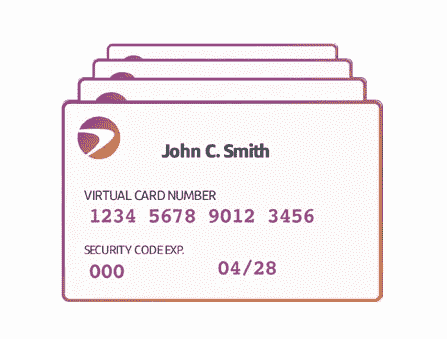
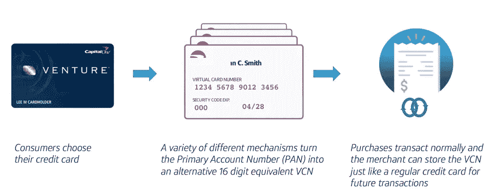
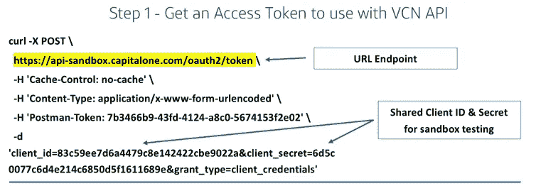
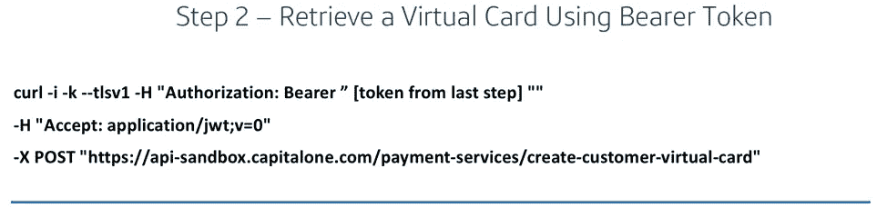
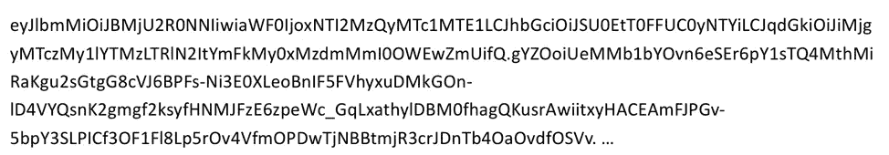
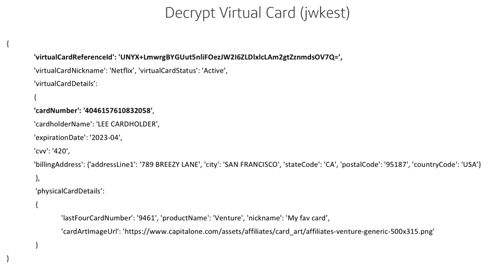

# 使用虚拟卡号实验 API 对抗支付中断和在线欺诈

> 原文：<https://medium.com/capital-one-tech/fighting-payment-disruptions-and-online-fraud-with-the-virtual-card-numbers-experimental-api-38fb901c7e5?source=collection_archive---------2----------------------->

当你把一家科技公司和一家银行结合起来会发生什么？您可以获得创新的解决方案来消除网上购物体验中的摩擦。通过我们新的[虚拟卡号 API](https://developer.capitalone.com/api-products/virtual-card-numbers/) ，Capital One 正在建立一项模拟创建在线购物虚拟卡号的实验性服务。我们希望[你对它的反馈](https://gitter.im/CapitalOne-DevExchange/virtual-card-numbers)，同时我们对设计进行迭代，朝着最终产品努力。

# 什么是虚拟卡号

随着在线和移动商务的发展，普通消费者现在已经将他们的卡存储在几十个经常性的开账单者和在线商家的文件中。这增加了客户信用卡信息的暴露，如果客户的卡被重新发行或更换，可能会导致支付过程中断。

虚拟卡号不同于信用卡号并且对每个商家是唯一的，因为商家不需要处理信用卡号，所以虚拟卡号可以限制敏感卡信息的暴露。虚拟卡号还可以通过防止支付过程中断来帮助增加销售额；当客户的卡被重新发行时，存储在文件中的虚拟卡号仍然有效，并且现在与新的(真实的)卡号相关联。

虚拟卡号使用支付令牌化来提供一种消费者和商家都能从中受益的解决方案:

虚拟卡号使用与物理卡相同的支付轨道——每个虚拟卡号都有一个唯一的 16 位卡号(每个商家一个)、安全码和有效期。

# 虚拟卡号实验 API

[Capital One DevExchange](https://developer.capitalone.com/)于 2016 年推出，其使命是开放我们的 API，让开发者共同创造使用我们产品的体验。为了更好地为商家、消费者和支付处理者服务，我们最近发布了[虚拟卡号](https://developer.capitalone.com/api-products/virtual-card-numbers/)——这是一个实验性的 API，允许开发人员模拟为拥有 Capital One 信用卡的客户创建虚拟信用卡号。这个[实验性 API](/capital-one-developers/experimental-api-strategy-from-capital-one-be72db15362) 旨在利用令牌化和虚拟卡号技术的力量来改善电子商务体验。

目前，我们设想了两种主要的支付令牌化和虚拟卡 API 用例:新客户和现有客户注册。

## **新客户注册**

第一个用例是关于我们如何为更无缝的在线交易发行虚拟卡。在这个用例中，一旦 Capital One 持卡人准备好从网上商店结账，他们就可以登录自己的帐户，使用虚拟卡号 API 轻松创建一个唯一的虚拟卡号供该商户使用。

## **现有客户登记**

另一个用例是更新现有的卡信息。如果客户在商家网站上存储了物理卡号，在客户允许的情况下，可以用虚拟卡替换它，以增强控制和安全性。在这里，商家可以主动要求将物理卡号替换为允许不间断消费的虚拟卡。

> **想对虚拟卡号 API 的用例提供反馈吗？**查看产品页面，点击 [**反馈**](https://gitter.im/CapitalOne-DevExchange/virtual-card-numbers) 标签，让我们知道您的想法。

# 虚拟卡号技术深度探讨

Capital One 有一套丰富的[沙箱](https://api-sandbox.capitalone.com/)供你与我们的生产和实验 API 进行交互。作为一个实验性的 API，虚拟卡号目前是一个模拟服务，只能用于在这种环境下提供令牌。正如您将在 [API 文档](https://capitalone-devexchange.github.io/api-products/virtual-card-numbers/documentation/)中看到的，有一组您可以用于此步骤的公共凭证。

一旦你做到了这一点，你将得到一个标准令牌，然后可以与虚拟卡号 API 一起使用。

这里我们有另一个端点。在支付服务的下面是所有不同的 API 端点:添加一张卡，更新和与商家交换一张卡，禁用和停用一张卡。

完成后，您将得到一个加密的响应，其中包含客户使用该卡所需的所有机密信息。

最后一步是解密卡。我们使用来自 [OpenSSL](https://www.openssl.org/) 的加密来加密和解密。一旦你解密并打开它，你就可以访问卡的其他信息——昵称、卡号、有效期和地址等。—客户在传统支付平台上使用信用卡所需的所有信息。

还有一些简单的东西可以让你在支付流程或其他工作流程中体验。比如:

*   卡片艺术。
*   卡的最后 4 位数字，以减轻顾客的困惑，并可能有助于店内退货。
*   产品系列(*即*、Quicksilver、Venture 等。)以便客户可以访问与该卡类型相关联的卡奖励和保护。

还有其他端点用于更新虚拟卡和报告商家活动，如更新和停用的虚拟卡。

> **想对虚拟卡号 API 背后的技术提供反馈吗？**查看产品页面，点击 [**反馈**](https://gitter.im/CapitalOne-DevExchange/virtual-card-numbers) 标签，让我们知道您的想法。

# 结论

我们正在寻求社区对虚拟卡号 API 的反馈，因此我们可以将它整合到最终产品中。我们的 API 目标是以最直观和用户友好的方式利用支付令牌化技术，以便:

## **消费者**

*   降低在线使用信用卡和在商家网站上存储信息的风险。
*   可以以新的方式使用他们的信用卡，而不必使用实际的卡号[【MC2】](#_msocom_2)。
*   对他们的储蓄卡和消费有更多的控制权。

## **商户**

*   通过避免废弃的购物车和由于无效的支付细节导致支付过程中断而导致的购买损失，增加收入。
*   由于每个虚拟号码都是唯一的，因此减少了因数据泄露而导致的卡补发。

在我们将这个 API 投入生产之前，我们正在寻找反馈和额外的用例，我们希望收到您的反馈。[请查看我们的产品页面](https://developer.capitalone.com/api-products/virtual-card-numbers/)了解更多关于我们虚拟卡号 API 当前版本的信息。

*披露声明:这些观点仅代表作者个人观点。除非本帖中另有说明，否则 Capital One 不属于所提及的任何公司，也不被其认可。使用或展示的所有商标和其他知识产权都是其各自所有者的所有权。本文为 2018 首都一。*