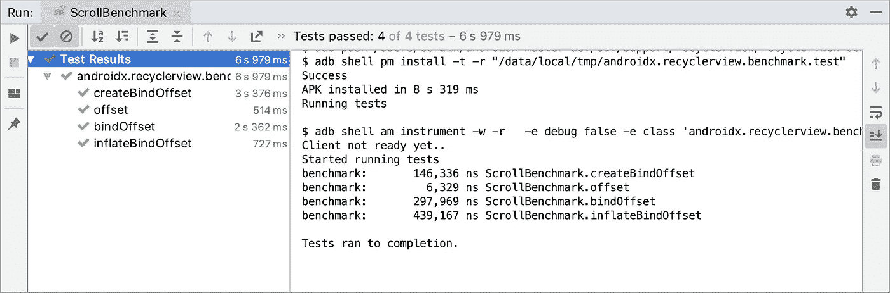
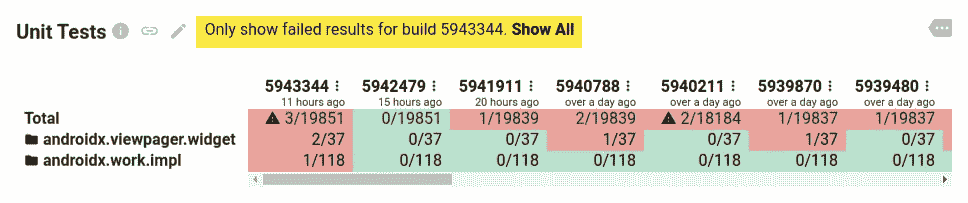
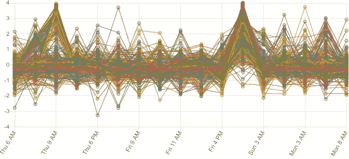
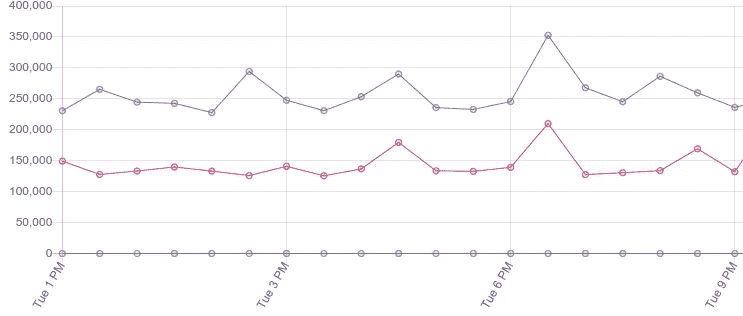
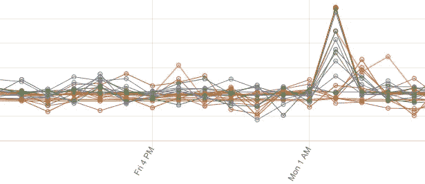
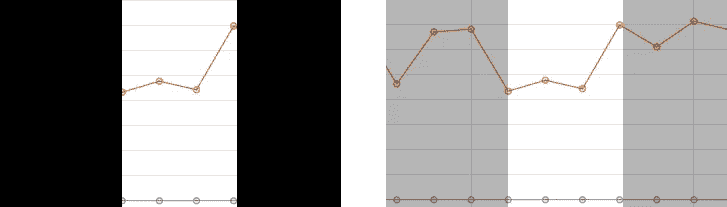
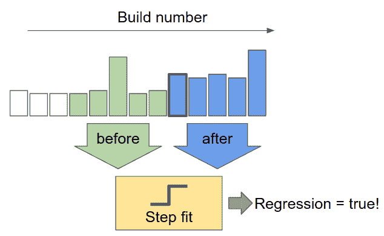
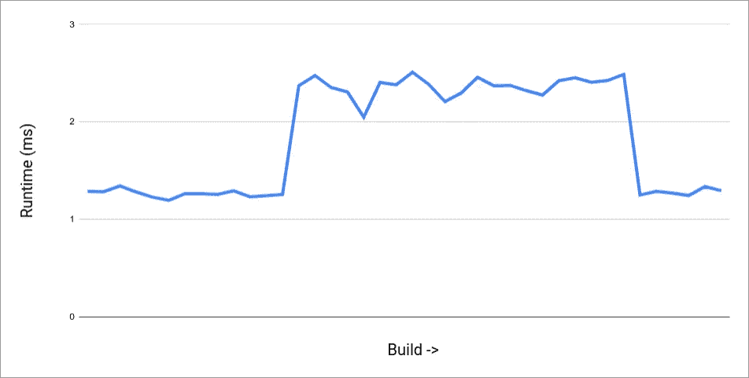
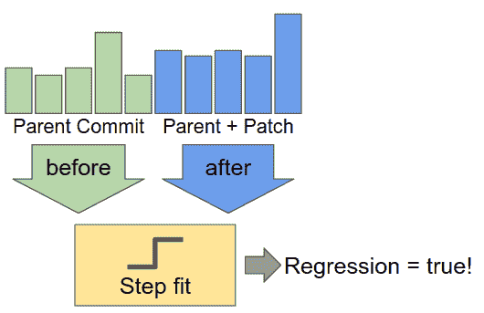

# 用 CI 中的基准来对抗衰退

> 原文：<https://medium.com/androiddevelopers/fighting-regressions-with-benchmarks-in-ci-6ea9a14b5c71?source=collection_archive---------2----------------------->

我们在 [I/O 2019](https://www.youtube.com/watch?v=ZffMCJdA5Qc) 发布了第一个基准库 alpha，并一直在改进它，以帮助您在优化 Android 代码的同时准确测量性能。Jetpack 基准测试是在 Android 设备上运行的标准 JUnit 工具测试，使用库提供的规则来执行测量和报告:

Sample project on Github at [android/performance-samples](https://github.com/googlesamples/android-performance/tree/master/BenchmarkSample).

Sample Android Studio output, running multiple benchmarks.

该库通过其 [JUnit 规则 API](https://developer.android.com/reference/kotlin/androidx/benchmark/junit4/BenchmarkRule.html) 处理预热、检测配置问题，并测量代码的性能。

这对于在您的办公桌上进行基准测试来说非常好，但是基准测试的大部分价值来自于检测持续集成中的回归。你如何处理 CI 中的基准数据？

# 基准测试与正确性测试

即使您有成千上万个正确性测试，也很容易通过折叠信息将其放在仪表板上。下面是我们用于喷气背包的。

没什么特别的，但是它用了两个常用的技巧来减少视觉负荷。首先，它按包和类折叠成千上万个测试的列表。然后，默认情况下，它隐藏其中没有失败的包。几十个库的测试结果，总共将近 2 万个测试，很容易在几行文本中显示出来。正确性测试仪表板的伸缩性非常好！

但是基准呢？基准测试不会输出简单的通过/失败，它是每个测试的标量值。这意味着我们不能简单地折叠 pass 结果。让我们看看数据的图表，也许我们可以直观地辨别模式。毕竟，你可能拥有的**比正确性测试少得多**

这是大量的视觉噪音。即使只有数百个而不是数千个结果，这也不是查看数据的有用方式。没有改变的基准测试占用了和真实回归一样多的可见空间，所以我们真的需要过滤掉它。

# 回归检测的简单方法

我们可以从简单的事情开始，试着回到正确性测试的通过/失败的世界。我们可以将失败定义为在两次运行之间下降了某个百分比阈值的任何基准。然而，由于差异，这在实践中会失败。

Benchmarks with View inflation are prone to higher variance, but still provide useful data.

尽管我们试图在基准测试中产生稳定、一致的数字，但差异仍然可能很大，这取决于工作负载和您运行的设备。例如，我们发现膨胀视图的测试远不如其他 CPU 工作负载基准测试稳定。一个百分比阈值并不适用于每个测试，但是我们不希望将分配阈值(或基线)的负担放在基准作者身上，因为随着时间的推移维护起来很麻烦，并且不能随着基准数量的增加而很好地扩展。

差异也可能以不频繁的套件范围峰值的形式出现，在这种情况下，正在测试的设备的某些条件在连续几个基准测试中产生异常缓慢的结果。虽然我们可以解决其中的一些问题(例如，当内核由于低电量而被禁用时，防止运行)，但很难完全防止这些问题。

recyclerview, ads-identifier, and room benchmarks, all spiking during one run — we DO NOT want to report this as a regression

## 要点是，我们不能只看 Build N 与 N-1 的结果来寻找回归——我们需要更多的上下文来做决定。

# 逐步拟合，可扩展的解决方案

我们在 Jetpack CI 中使用的方法是分步拟合，由 [Skia Perf 应用](https://skia.org/dev/testing/skiaperf)提供。

这个想法是我们在基准数据中寻找阶跃函数。如果我们检查每个基准测试的结果序列，我们可以寻找向上或向下的“台阶”，作为特定构建改变基准测试性能的信号。我们想看看几个数据点，以确保我们看到的是多个结果的一致模式，而不是侥幸:

Context reveals a large regression to actually be an unstable benchmark

我们如何检查这样一个步骤？我们查看了变更前后的多项结果:

然后，我们使用以下代码片段计算回归的显著性:

其工作原理是检测变更前后的误差，并基于该误差衡量平均值的差异。基准的方差越小，我们在检测小的回归时就越有信心。这让我们可以在同一个系统中运行纳秒级精度的微基准测试，同时运行大型(移动)数据库基准测试，具有更高的**方差。**

你也可以自己试试！点击 run 按钮，根据在我们的 CI 中运行的 WorkManager 基准测试的数据来尝试该算法。它将输出到一个带有[回归](https://ci.android.com/builds/branches/aosp-androidx-master-dev/grid?head=5783944&tail=5783944)的构建的链接，以及到它的[后续修复](https://ci.android.com/builds/branches/aosp-androidx-master-dev/grid?head=5787972&tail=5787972)的链接(点击‘View Changes’查看里面的提交)。当数据被绘制成图表时，这些数据与人们看到的倒退和进步相匹配:

基于我们的算法配置，图中所有的小噪声都被忽略。您可以使用上面的两个参数来控制它的触发时间:

1.  `WIDTH` —提交前后要考虑多少结果
2.  `THRESHOLD` —回归必须有多严重才会出现在你的仪表盘上。

较高的宽度增加了对不一致性的抵抗力，但是会使在频繁变化的结果中找到回归变得更加困难——我们目前使用的宽度是 5。阈值是一个通用的灵敏度控制，我们目前使用 25。降低它以找到更多的回归，但您也可能会看到更多的假阳性。

要在 CI 中为自己设置此功能:

1.  [写一些基准！](http://d.android.com/benchmark)
2.  在真实设备上运行 CI，最好有[持续性能](https://developer.android.com/studio/profile/benchmark#sustained-perf)支持
3.  [从 JSON 收集输出指标](https://developer.android.com/studio/profile/run-benchmarks-in-ci)
4.  每次一个结果准备好，看最后的`2 * WIDTH`结果

如果有倒退或改进，发出警报(电子邮件、问题或任何对你有用的东西)来调查以前构建的`WIDTH`的性能。

# 预提交

那么 presubmit 呢？如果你不让回归进入构建，那么捕捉回归就容易多了！

在 presubmit 中运行基准测试是完全防止回归的一个很好的方法，但是首先要记住:基准测试就像 flakey 测试，它需要像上面的算法这样的基础设施来解决不稳定性。

对于 presubmit 测试，它会中断提交补丁的工作流程，您需要对您使用的回归检测有特别高的信心。

上面的分步拟合算法是需要的，因为单次运行基准测试本身并不能给我们足够的信心。不过，我们可以捕获更多的数据来获得这种信心——只需在有和没有更改的情况下运行多次，以检查补丁是否引入了回归。

只要您对每次测试更改都要运行几次基准测试以增加信心所增加的资源成本感到满意，那么 presubmit 就能很好地工作！

完全公开—我们目前在 Jetpack 的 presubmit 中没有使用基准测试，但是如果你想的话，下面是我的建议:

*   运行基准测试 5 次以上，无论有没有补丁(后者通常可以被缓存，或者从 postsubmit 结果中获取)
*   考虑跳过特别慢的基准测试
*   不要基于结果阻止提交补丁——只要在代码审查期间考虑结果。回归有时是改进代码库的一部分！
*   考虑到之前的结果可能不存在。在 presubmit 中无法检查正在添加的基准！

# 结论

Jetpack Benchmark 提供了一种简单的方法来获得 Android 设备的准确性能指标。结合上面的 step fit 算法，您可以在不稳定性影响用户之前检测到性能退化——就像我们在 CI 的 Jetpack 中所做的那样。

关于从哪里开始的注意事项:

*   在基准测试中捕捉你的关键滚动界面
*   添加关键库交互的性能测试，以及昂贵的 CPU 工作
*   像对待退步一样对待进步——它们值得研究！

# 附加阅读

如果你想了解更多，我在 2019 年 Android 开发者峰会上与[@ itdustinlam](http://twitter.com/itsdustinlam)一起做了一个关于 CI 中基准的[演讲。](https://www.youtube.com/watch?v=ynBPcFs6OOk)

要了解更多关于 Jetpack Benchmark 的工作原理，请查看我们的 [Google I/O talk](https://www.youtube.com/watch?v=ZffMCJdA5Qc) 。来自 Jetpack 库的基准测试结果在[androidx-perf.skia.org](http://androidx-perf.skia.org/)发布。

我们使用 [Skia Perf 应用程序](https://skia.org/dev/testing/skiaperf)来跟踪我们的 AndroidX 库的性能。您可以看到[这里描述的步长适配算法的实际源代码](https://github.com/google/skia-buildbot/blob/master/perf/go/stepfit/stepfit.go)，因为它在我们的 CI 中运行。如果你有兴趣了解更多，Joe Gregorio 已经写了另一篇关于他们更高级的 K-means 聚类检测算法的博文[解释了 Skia 项目开发的具体问题和解决方案，专门设计用于扩展许多配置(操作系统和操作系统版本、CPU/GPU 芯片/驱动程序变体、编译器等)。).](https://bitworking.org/news/2014/11/detecting-benchmark-regressions)