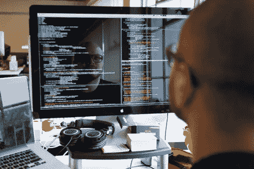
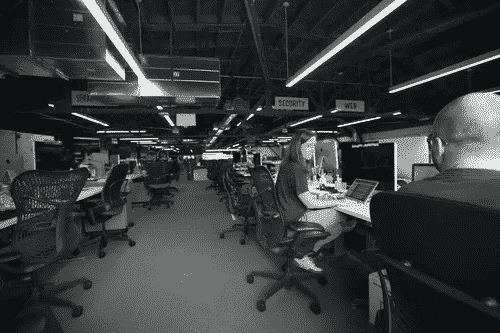

# 在 Pinterest 对抗垃圾邮件

> 原文：<https://medium.com/pinterest-engineering/fighting-spam-at-pinterest-78f4e7dc4727?source=collection_archive---------3----------------------->

Marty Weiner | Pinterest 工程经理，BlackOps

垃圾邮件发送者过去喜欢我们，但现在不喜欢了。

Pinterest 是一个很好的垃圾邮件平台，因为我们有大量的流量流向其他网站。垃圾邮件发送者希望将流量转移到他们的网站，这样 Pinners 就会上当受骗。为了做到这一点，他们会将别针伪装成有前途的减肥产品、在家工作的机会、廉价的名牌手袋等等。这就是 Pinterest BlackOps 团队的用武之地。我们的任务不是打击垃圾邮件，而是让我们不需要这样做。

要想成功，垃圾邮件发送者必须制造大量的垃圾邮件，让大量的人看到并点击，并且一直不让我们知道。典型的垃圾邮件发送者会通过从遍布世界各地的计算机上创建真实的帐户或劫持帐户来试图看起来像一个好用户。总是有一些微妙的缺陷使这些垃圾邮件发送者脱颖而出，一旦我们找到一个，我们就能够关闭它们。然后他们进化他们的策略，比赛再次开始。我们的工作是始终领先他们一步，让滥发 Pinterest 无利可图。

## 我们如何抵御坏人

那么，如果一个敌人试图看起来像一个好用户，并迅速改变它的样子和攻击方式，你该如何应对呢？结合经济模型的军事战争。

为了成功地执行这种策略，我们需要系统能够让我们快速有效地观察和响应攻击，同时又不伤害好用户。

去年，我们开始构建一个名为 Stingray 的新系统，我们的垃圾邮件分析师可以使用它来快速观察攻击，编写规则来响应攻击，停止攻击，清理和发展，所有这些都在几分钟内完成。Stingray 是一个分布式流处理器和规则引擎，使我们能够在几毫秒内对已知的恶意行为做出反应。如果攻击与数百个不同维度的签名相匹配，我们甚至可以先发制人，在攻击开始前阻止它。因为我们用某些基本的分布式系统保证来构建 Stingray，所以我们很快就能够编写一个规则，并在过去轻松地应用它，完全消灭攻击和它留下的混乱。

在过去的六个月里，我们增加了强大的集成测试环境和全面的监控，以帮助我们快速开发和轻松检测问题。我们比以往任何时候都更快地在运营战略上取得了重大进展，仅在几个月内:

*   Pinterest 上报告的垃圾邮件数量急剧下降，已经不是一个有用的指标了
*   我们的系统现在对内部垃圾邮件请求的响应速度提高了一倍
*   点击垃圾邮件的 Pinners 数量已经下降了一半(从很少到更少)
*   我们的系统成功应对不良行为的能力从 95%提高到 99.99%

我们可以在几毫秒内摧毁整个攻击，而在 12 个月前，我们一天要花 4 个小时

我们打击垃圾邮件，这样 Pinners 可以享受他们的经验，但垃圾邮件发送者将继续努力改善，只要我们是一个伟大的平台，让他们展示他们的内容。当你读到这封信的时候，他们正在发动一场新的改良攻击！

如果你想了解更多关于我们如何日常对抗垃圾邮件的信息，我制作了一个简短的纪录片。更多关于在 Pinterest 上保持安全的信息，请查看我们的[帮助中心](https://help.pinterest.com/en)。

如果你想和我们开战，我们总是需要对构建和设计大型复杂分布式系统充满热情的多面手。[加入我们的黑色行动团队！](https://about.pinterest.com/en/careers/engineering-product)

马蒂·韦纳是黑色行动小组的经理

*获取 Pinterest 工程新闻和更新，关注我们的工程*[*Pinterest*](https://www.pinterest.com/malorie/pinterest-engineering-news/)*，* [*脸书*](https://www.facebook.com/pinterestengineering) *和* [*推特*](https://twitter.com/PinterestEng) *。有兴趣加入团队吗？查看我们的* [*招聘网站*](https://about.pinterest.com/en/careers/engineering-product) *。*