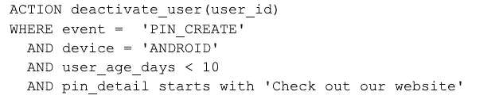
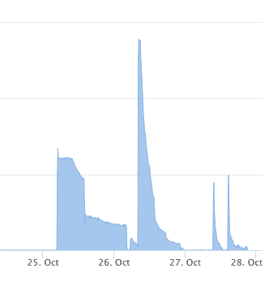
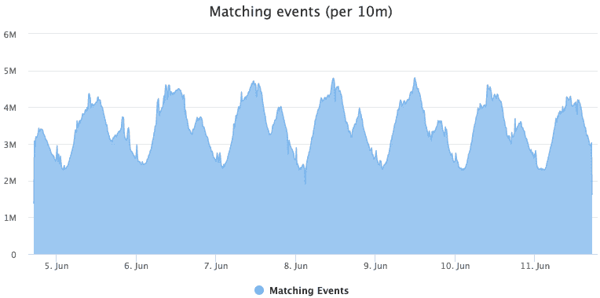
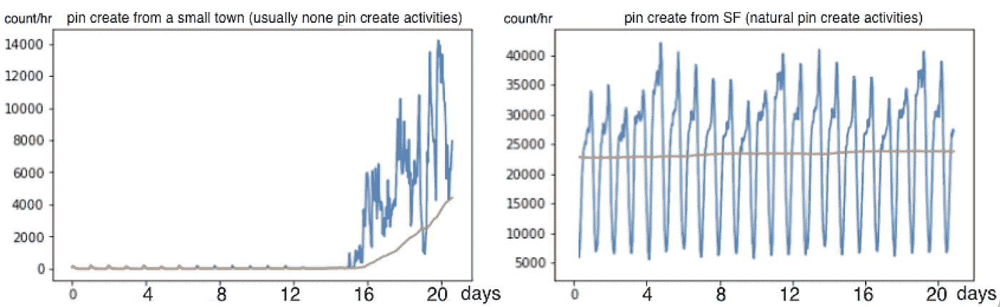
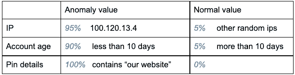
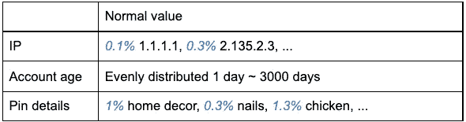
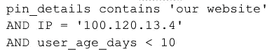
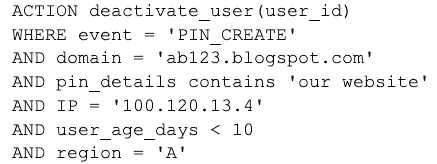
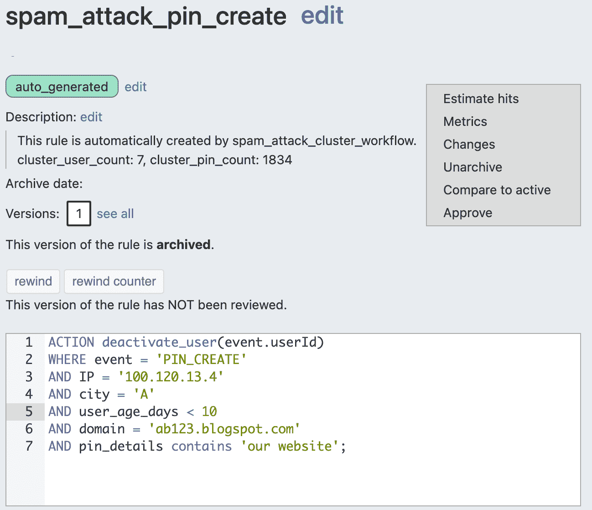
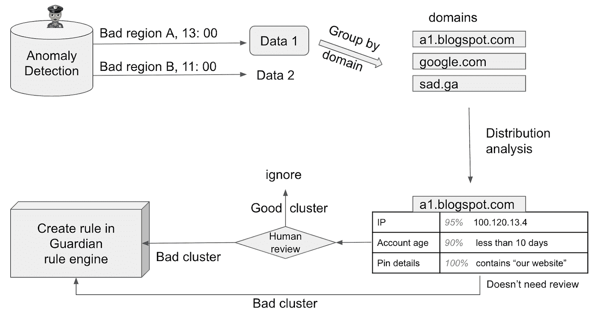

# 使用聚类和自动规则创建来对抗垃圾邮件

> 原文：<https://medium.com/pinterest-engineering/fighting-spam-using-clustering-and-automated-rule-creation-1c01d8c11a05?source=collection_archive---------3----------------------->

Cathy Yang |软件工程师，信任与安全

我们在 Pinterest 最优先考虑的事情之一是保证 Pinners 的安全，这包括保护他们免受垃圾邮件的侵害。信任与安全小组的目标不仅仅是捕捉垃圾邮件，而是尽可能快地将其删除，以最小化 Pinner 的影响。

垃圾邮件发送者的目标是赚钱，而实现这一目标的最佳方式是大规模发送垃圾邮件。这是一个数字游戏:一百万封垃圾邮件比一封垃圾邮件有效得多。为了快速删除垃圾邮件，我们查看垃圾邮件攻击的常见趋势，以识别可疑行为。

为了达到有效的规模，垃圾邮件发送者必须自动化他们的行动，并且这些“攻击”中的每一个都可以被认为是一个集群。攻击群集中的每个事件可能具有一些共同特征，但是不同的群将具有不同的共同特征集。

例如，在创建大量 pin 的攻击中，垃圾邮件发送者可能会将所有 pin 指向同一个域。虽然攻击之间的域可能会发生变化，但垃圾邮件制造者仍然试图将流量定向到同一个垃圾邮件站点。

我们的垃圾邮件缓解策略之一是我们的规则引擎 [Guardian](/pinterest-engineering/fighting-spam-with-guardian-a-real-time-analytics-and-rules-engine-938e7e61fa27) ，它有助于识别垃圾邮件攻击中的常见特征。

# 动机

以前，当垃圾邮件攻击发生时:

*   我们的系统统计板上会发出警报，随叫随到的分析师会进行调查
*   分析师将确定该攻击的共同趋势
*   分析师将创建一个“补丁规则”(一个特定的临时规则来处理攻击)，然后追溯应用它来捕捉旧的和未来的垃圾邮件发送者

这个过程存在很多问题，原因有很多:对于分析师来说，这是一个非常手动的过程，在垃圾邮件攻击和我们的响应之间存在延迟，这对 Pinners 来说是一个潜在的负面影响。

但是，如果我们可以自动检测垃圾邮件发送者的批量操作，找到每个集群中的共享共同特征，创建这些修补程序规则，并捕获这些类型的垃圾邮件攻击，会怎么样呢？

# 补丁规则

修补程序规则旨在是短期的，并且高度针对攻击。以下是旨在停用垃圾邮件用户的修补程序规则示例:

1.  是新帐户
2.  正在用 Android 设备创建 pin
3.  以文本“查看我们的网站”开始 Pin 描述

该规则在捕捉垃圾邮件攻击方面非常有效，并且不太可能影响任何好用户。在 SQL 的定制变体 GSQL 中，规则如下:

Guardian 使得创建类似 SQL 的规则变得非常容易。仅仅通过使用 *where* 子句，我们就可以在这些条件下停用用户。为了自动创建这样的规则，我们只需要关注用户停用的 *where* 子句或条件。

如上所述，大多数简单攻击都有一些共同的特征，即使它们使用不同的帐户。因此，我们的目标是从一组用户中提取共同的特征。

# 异常检测和聚类

检测垃圾邮件攻击中突发活动的策略之一是时序异常检测。异常检测有利于检测尖峰活动(如图 1 所示)，这些活动极有可能是垃圾邮件活动。

Figure 1: Spiky activities

在 Pinterest，我们有一个内部实时异常检测系统。我们将为模型提供一个时间序列的事件，模型可以从中学习。如果模型的期望值与实际值相差某个阈值，就有异常。

然而，如果我们对具有所有特征的所有事件的时间序列进行异常检测，正常的用户活动将会有太多的噪声，并且突发可能被异常检测算法忽略。

Figure 2: A lot of noise on all user activities

相反，我们对具有特定特征的特定事件类型发出警报。例如，为了对 Pin 创建事件发出警报，我们可能会对 IP 地址、Pin 详细信息、地理位置或其他一些特征进行异常检测。这里的目标是缩小我们想要聚集的事件的范围，而不会从正常的用户活动中引入太多的干扰。

以按城市划分的 Pin 创建时间序列为例:

Figure 3: Abnomal Pin creation events from a small town that usually doesn’t have any Pin creation activities vs. normal Pin creation events from San Francisco

黄线:每小时的模型预期计数

蓝线:每小时实际 Pin 创建事件数

左侧的图表显示，在突然达到峰值之前，Pin 创建事件的数量在相当长的时间内几乎为 0。由于与移动平均值相比，计数激增如此之多，我们的异常检测算法告诉我们，该镇在此期间的 Pin 创建事件非常可疑。这就把我们的关注点缩小到了那段时间的事件上。然后，我们收集了相关数据，并将其存储在 S3，以进行进一步的聚类。

## 使聚集

分析我们存储在 S3 的数据的目标是找到共享某个模式的用户，因为他们很可能来自一个垃圾邮件活动。这个想法是:

*   按一个感兴趣的特性分组:如果按域分组，我们会有 group*google.com*，group*instagram.com*，group *something.gr* 等。
*   对于每个组，我们查看所有其他兴趣特征的值分布
*   如果存在具有主导值的特征(例如组中 95%的 IP 是 1.1.1.1)，我们知道存在集群

我们看到许多垃圾邮件发送者试图通过创建多个链接到他们自己的域的 pin 来将 Pinners 引导到他们的网站。在以下示例中，让我们考虑将 Pin 的域作为我们感兴趣的特征:

1.  异常检测告诉我们，从今天 13:00 开始，A 城出现了异常
2.  我们查询得到那个时间段的所有数据，然后按域分组(ab 123 . blogspot . com；bc456.blogspot.com；something.grgoogle.com；Instagram.com；其他域)
3.  对于每个域，我们计算其他几个特征的数据分布，如 IP、帐龄和 Pin 细节。然后我们将知道每个值在该特性下出现的频率。

对于域名*ab123.blogspot.com*:

将上面的结果与已知的可信域进行比较，比如 Google.com 的*:*

**

*4.【Google.com】是一个值得信赖的域名；所有感兴趣的特征都具有良好的随机分布。然而，域名*ab123.blogspot.com*有三个主要特征:*

**

*5.现在，我们可以使用我们的查询语言 GSQL 创建一个包含所有条件的规则，在 Guardian 中编写规则:*

**

*6.一些其他标准也可能有助于减少误报，例如仅当超过 10 个用户满足标准时才创建规则，或者仅当他们创建了超过 100 个 pin 时才创建规则。我们也可以使 group by 条件成为一个正则表达式模式，如*'^[a-za-z]+[0–9]+[.]blogspot[。]com$'* ，而不是一个确切的域。*

# *评估结果*

## *代理审查*

*对于普通用户来说，在一定的时间跨度内很少出现类似的模式，但是如果集群规模不是很大，用户仍然有可能是好的。为了减少任何误报的影响，我们将我们聚集的*抽样用户*发送到我们的内部内容审查工具 [PinQueue](/pinterest-engineering/introducing-pinqueue3-0-pinterests-next-gen-content-moderation-platform-fcfa972bf39c) ，以便代理可以在我们打开规则之前评估规则的准确性，并允许它自动对用户采取行动。*

## ***在 Guardian 中创建规则***

**

*Figure 4: Auto-created rule*

*一旦我们确信规则的准确性符合我们的标准，我们就将它添加到 Guardian 中。*

## ***一定时间后存档***

*由于这些规则旨在临时缓解特定的垃圾邮件攻击，所以我们在一定时间后存档补丁规则，通常是在我们看到攻击已经平息之后。这不仅是一个很好的内务管理问题，而且还限制了任何假阳性的暴露。将来，可能会有一个符合所有这些条件的好用户，如果我们不存档，他会被补丁规则意外停用。*

## *垃圾邮件制造者会变异，但我们可以自动创建新的补丁规则！*

*当垃圾邮件发送者发现使用这个 IP 不再有效时，他们肯定会通过购买其他 IP 或其他域来再次尝试。但是只要有一些模式，我们就可以自动创建新的补丁规则。*

# *摘要*

*通过异常检测、聚类和自动规则创建，我们现在可以快速做出反应，检测大多数简单的垃圾邮件攻击，然后对它们采取措施。下面，图 4 显示了该过程的概况:*

**

*Figure 5: Automated rule creation with anomaly detection diagram*

# *承认*

*这篇博文是在哈里·沙曼斯基和凯特·弗莱明的大力帮助下完成的。感谢谷开发了异常检测系统。此外，还要感谢 Preston Guillory、、、刘、Alok Singhal、Dennis Horte、Carmen Dekmezian、Weiqi An、以及我们的 Trust & Safety 团队的其他成员提供的帮助和建议！*

**要在 Pinterest 了解更多工程知识，请查看我们的* [*工程博客*](https://medium.com/pinterest-engineering) *，并访问我们的*[*Pinterest Labs*](https://labs.pinterest.com/?utm_source=medium&utm_medium=blog-article&utm_campaign=yang-august-3-2021)*网站。要查看和申请空缺职位，请访问我们的* [*职业*](https://www.pinterestcareers.com/?utm_source=medium&utm_medium=blog-article&utm_campaign=yang-august-3-2021) *页面。**