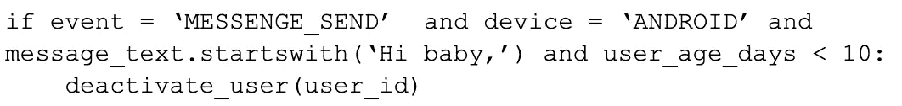
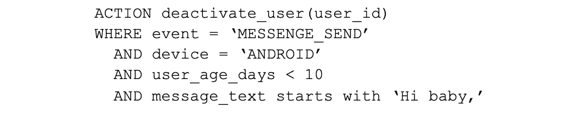
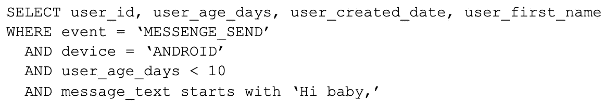
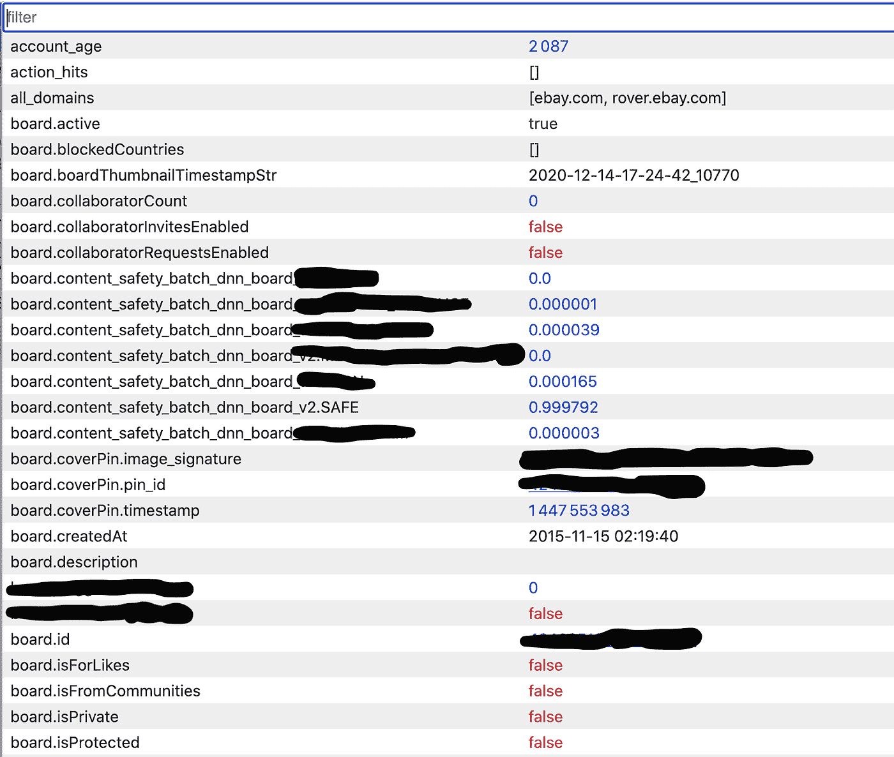
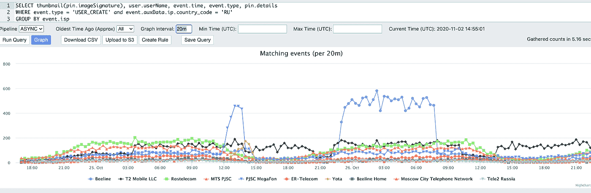
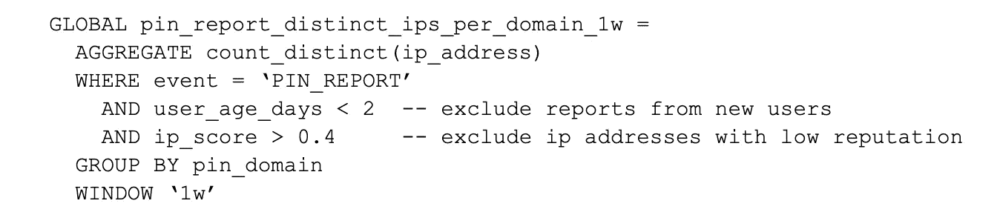

# 利用实时分析和规则引擎 Guardian 对抗垃圾邮件

> 原文：<https://medium.com/pinterest-engineering/fighting-spam-with-guardian-a-real-time-analytics-and-rules-engine-938e7e61fa27?source=collection_archive---------1----------------------->

潘宏凯|软件工程师，信任与安全

作为信任与安全团队，我们的主要职责之一是保护 Pinners 免受垃圾邮件的侵害。如果没有保护，垃圾邮件可能会遍布 Pinterest，因为垃圾邮件发送者可以以比实际用户高得多的速度编写脚本和生成活动。

我们在 Pinterest 打击垃圾邮件的最有价值的工具之一是我们使用的规则引擎。规则引擎允许我们查看事件流，并在满足规则中的标准时采取措施(如阻止邮件、停用发件人或标记用户进行人工审查)。

在这里，我们将分享我们的反垃圾邮件规则和查询的演变，以及我们在整个过程中学到了什么。

## 历史:从 Python 开始

我们的规则引擎始于 Python，在这里我们可以运行规则来对特定场景采取行动。阻止垃圾邮件攻击的简单规则可能如下所示:

这一规定将使那些在 Android 设备上使用不到 10 天的账号发送以“嗨，宝贝”开头的信息的新用户失效。它非常具体，但通常是有效的，因为敌对的行动者会创建数千个帐户，所有的活动都遵循相同的模式。我们的实际规则要比这复杂得多。有些侧重于补救(如上图)，使用特定属性来识别积极攻击 Pinterest 的用户帐户。其他规则侧重于主动检测，使用基于机器学习的方法来检测敌对行为者。

这个基于 Python 的系统，内部称为 Stingray，为我们服务到 2018 年。我们有一个用户界面，允许人们轻松地创建规则，点击“启用”，瞧，一段类似上面的代码将在所有连接到我们的规则引擎的事件上运行。可以在不到 10 分钟的时间内创建一个规则并投入生产。而且谁不喜欢 Python——过程简单，对吧？(在我们 2015 年的[博客文章](/pinterest-engineering/fighting-spam-at-pinterest-78f4e7dc4727)中有更多关于垃圾邮件规则引擎的愿景。)

然而，在实践中，规则创建不仅仅是简单地编写 Python 并在生产中使用规则。我们发现完整的周期看起来更像:

1.  等待在配置单元中记录和填充数据
2.  编写 Presto/Hive 查询，直到找到垃圾邮件模式并评估误报。为了获得想要的属性，您可能需要查询许多不同的表
3.  将 Presto/Hive 查询结果转换为 Python 以创建规则。
4.  在“模拟运行”模式下启用规则(这种模式只记录操作，但不执行操作)。这是必要的，因为你不想冒错误的风险，这些错误可能会使好用户在转换到 Python 时失去活力
5.  验证规则是否捕获了预期的用户/pin/IP。

*   如果一切正常，启用！
*   如果有一个 bug，回到第 3 步

最终，只有一小部分工作流发现垃圾邮件模式。这也需要几天时间，涉及大量的上下文切换，而且很单调，容易出错。

# Guardian 和改进的规则创建工作流

2017 年末，我们意识到基于 Python 的方法不可扩展，并着手通过 Elixir 中的新系统来简化规则创建工作流。我们从头开始构建 Guardian 作为一个实时查询引擎，在查询引擎之上有一个规则引擎。数据集由一个非规范化的表组成，该表有 10 多行和 10 多列，以定制的列格式存储在计算机集群的磁盘上。

Guardian 将我们对抗垃圾邮件所需的所有数据整合到一个地方。每一行都代表一项行动，并充满了我们抵制垃圾邮件的信号。所有信息都在一个地方，而不是跨多个表执行复杂的连接，这使得查询(和反垃圾邮件)更简单、更快。此外，我们不再使用 Python，所有规则都是 SQL-query 格式，进一步简化了规则创建和回溯测试流程。

为了更具体地说明，上面的例子在 Guardian 中看起来像下面这样:

为了进行回溯测试，可以复制并粘贴规则，然后将其转换成如下查询:

然后，规则创建者可以很容易地看到关于所有用户的信息，如果规则处于活动状态，这些用户将被该规则停用。反之亦然，规则是查询也意味着一旦规则创建者在 Guardian 中完成了他们的分析，他们就可以将他们的最终查询复制并粘贴到新规则中。不需要额外的时间来将结果翻译成相应的规则引擎语法。当查询时，您得到的正是如果在生产中变成一个规则会发生的事情。

# 开发新的查询引擎

注意，查询语法并不完全是 SQL。因为我们创建了自己的查询引擎，所以我们也开发了这种语言。它基于 SQL，但我们也移植了 Presto 和 Hive 中使用的流行函数，如 count_distinct(使用 HyperLogLog)、regex_extract 和 url_extract_path，并创建了许多分析师和工程师要求的自定义函数，如计算数字列表的标准偏差或字符串的 Shannon 熵。有了内置的自动补全器，这些功能在很大程度上是可以自我发现的(尽管我们也有文档概述每个功能)。

简单规则创建的整个周期现在不到一个小时(而不是几天)，大部分时间都花在分析上。我们完全去掉了规则翻译步骤，这使得 Guardian 在分析师和工程师中很受欢迎，为更多的改进打开了空间。

除了主要的规则引擎和查询引擎，我们还添加了其他功能来帮助分析和规则创建过程，包括以下内容。

## 特征发现

单击一行将弹出一个 UI，允许进行列搜索并查看该行的所有功能。由于有成千上万的列，我们不可能在一个查询中显示所有的列，所以这个功能对于查看给定事件的可用列是必不可少的。

## 图形可视化

垃圾邮件经常以峰值的形式出现，因此我们内置了可视化功能，使得峰值很容易被实时识别。

*The above query segments by ISPs. Guardian will graph the most popular ISPs matching the conditions. We can easily see that there’s abnormal spikes in user creation traffic from the ‘Beeline’ ISP, allowing us to further narrow down the attack pattern.*

## 回填规则

我们的查询引擎存储三周的数据。因为规则只是查询，所以回填简单而快速。我们通过查询引擎运行编译后的规则查询，并向下游发送结果动作。

## 即时查询结果

与 Hive 或 Presto 不同，我们不会等待收集所有结果。我们一得到结果就显示出来，然后不断追加和更新结果。通过这种方式，用户在点击“运行查询”的瞬间就可以获得关于他们的查询的反馈

*The above query finds the image signature that’s been saved by the most number of distinct IP addresses (note we have custom functions to display an image if given the imageSignature). The query is only 4% done, but you can already get a sense of the most saved Pins, and the UI is updated every two seconds with the latest results.*

## Presto 连接器

尽管 Guardian 中的数据集已经包含了大量与垃圾邮件相关的数据，但我们偶尔会希望将它加入到其他表上。由于表的巨大尺寸，将数据转储到 Hive 或任何其他数据库格式是不可行的。相反，我们构建了一个 Presto 连接器，这使得 Guardian 数据集只是 Presto 中的另一个表。使用该表的查询将导致 Presto 对 Guardian 进行 RPC 以提取所选数据。

## 监控和警报

除了像“deactivate_user”、“hide_pin”、“force_password_change”这样的操作之外，用户还可以指定一个名为“monitor”的操作，只要条件匹配，该操作就会增加指标。该指标将连接到我们的内部监控和警报工具，然后可以创建仪表板和警报。

## 计数器/聚合

我们发现我们经常想要在我们的事件流中创建聚合——例如，为每个用户创建的 pin 数的计数器。用例包括创建一个新的速率限制，让计数器成为模型的一个特性，或者让一个 strike 系统用于策略目的。计算这些计数器是我们众多规则的先决条件。在很长一段时间里，这些计数器在代码中或通过配置文件递增。但是维护起来很复杂，尤其是在计数器递增的条件很复杂的情况下。

然后，我们意识到，在 Guardian 中，计数器的创建过程可以变得更加流畅，其中增加的条件只是查询。

举例来说，Guardian 中的这条语句将填充一个计数器，计算将某个域标记为垃圾邮件的 IP 的不同数量:

*pin _ report _ distinct _ IPS _ per _ domain _ 1w*将成为另一个在 Guardian 中可见并在规则中可用的列。一个计数器可以依赖另一个计数器。规则引擎自动计算依赖关系图，并确定规则运行的顺序。

请注意，除了计数器之外， *count_distinct* 函数还可以被我们的许多其他聚合函数替换，例如 *sum* 、 *array_agg* 和 *simpsons_index* 。同样，因为它是我们的定制语言，我们只是将分析师或工程师要求的任何聚合添加到我们的语言中。这使我们能够快速试验和部署简单的模型。

# 基础设施成本效率

这个新的规则引擎比我们旧的 Python 规则引擎便宜得多。以前，我们必须在每个事件上运行 Python。使用 Guardian，我们可以首先将大量事件转换成一个表，然后针对每个规则，在表上运行一个查询。每个额外的规则在计算上都是非常便宜的，因为运行一个查询是很便宜的。

例如，开头给出的 Python 规则将被预编译成以下查询:

# 基础设施设计

## 特征丰富

我们为用户活动事件点击 Kafka。我们还公开了一个 thrift API，它允许 Pinterest 服务器直接调用 Guardian，以获得是否应该阻止事件的响应(规则可以指定“阻止”操作)。我们的特征丰富集群将仅利用几个属性来接收这些事件，然后利用来自多个不同来源的信息来丰富它们，这些来源包括我们的地理位置库、用户数据库、Pin 数据库、基于图像/用户 id /域的 ML 模型分数、网站爬行数据等等。最终结果是一个巨大的事件，它将发送到规则引擎。规则/查询引擎是无模式的，因此用户可以在功能丰富层中自由添加/删除功能。

## 规则引擎

在特性丰富之后，我们使用一个称为微批处理的过程，它允许我们将不同的 API 请求批处理在一起，并创建一个包含数百个可以查询的事件的表。如前所述，规则可以作为对这个新表的查询来运行。产生的动作被发送给卡夫卡。下游服务监听 Kafka 主题并采取 Guardian 指定的操作。

一些规则涉及计数器/聚合的获取和存储。这些规则使用 Memcached 存储、更新和提取聚合，并能够向表中添加新列。随后在依赖循环中运行的规则可以使用新创建的列中的数据。

规则存储在 MySQL 数据库中。我们在规则引擎中有一个独立的进程，负责监听变化和编译规则。每当在 UI 中激活或停用一个规则时，该过程将重新获取所有规则，将它们编译成查询，计算规则之间的依赖关系，然后将编译后的规则列表存储到本地缓存中。

规则全部运行完毕后，所有事件(现在包括来自计数器/聚合的数据)都将被传递给查询引擎。

## 实时查询引擎

查询引擎监听由规则引擎产生的新事件。每个节点将事件分组为包含 16k 个事件的段，然后将该段存储在磁盘上。事件发生到可供查询之间的延迟大约是一两秒。

在每个段中，事件以列格式存储，这意味着我们不是逐行存储，而是逐列存储。查询将总是只使用一小部分可用列。通过以列格式存储，您可以从磁盘中只读取查询所需的列。在每一列中，我们存储“类型”(boolean、string、float 等。)通过倒排索引(我们将“类型”映射存储到 16k 位图)。这允许我们将相同“类型”的条目存储在同一列中，从而大大提高了性能。这也允许 Guardian 是无模式的——Guardian 自动计算和存储类型，而不是依赖用户指定每一列的类型。为了更大的性能提升，许多存储和查询操作都用“C”进行了重写和优化，因为我们需要对如何访问和存储内存进行细粒度控制。

对于并行化，每个查询会打开数百个映射器进程和少量 reducer 进程。然后，这些片段被均匀地分配给映射器进行处理。如果需要聚合(例如，如果有 group by 子句)，每个映射器将按键散列分组，然后将其结果发送到正确的缩减器(这样，所有具有相同 GROUP BY 键的条目都将被发送到相同的缩减器)。UI 将每两秒钟轮询一次结果。

这些优化使我们在运行查询时比 Hive 和 Presto 快得多，并允许以更紧凑的方式存储数据。

# 摘要

建立一个执行规则的系统是对抗垃圾邮件的基础。但是，构建一个能够简化整个垃圾邮件发现和规则创建过程的系统更有价值。Guardian 的核心设计决策，如统一查询和规则的语言，拥有一个单一的非规范化表，允许语言高度可定制，以及确保查询在几秒钟内运行，使我们的工作效率显著提高，并使 Guardian 成为我们打击垃圾邮件工具包中不可或缺的一部分。

我们希望这篇博客对开发规则引擎的挑战有所启发。

# 承认

非常感谢哈里·沙曼斯基、蔡美诗·萨缪尔森和凯特·弗莱明对这篇博文的帮助！感谢 Preston Guillory、Cathy Yang、Sharon Xie、Alok Singhal、Farran Wang 以及 Trust & Safety Signals 团队的其他成员帮助设计和建造了 Guardian，这是 Pinterest 的一个信任和安全纪念项目！

*要在 Pinterest 了解更多关于工程的信息，请查看我们的* [*工程博客*](https://medium.com/pinterest-engineering) *，并访问我们的*[*Pinterest Labs*](https://labs.pinterest.com/)*网站。要查看和申请空缺职位，请访问我们的* [*职业*](https://www.pinterestcareers.com/homepage) *页面。*