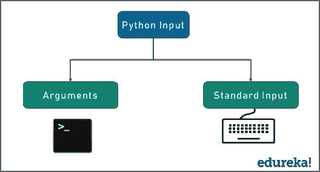

# Python 中的文件处理——Python 中的读写打开关闭文件

> 原文：<https://medium.com/edureka/file-handling-in-python-e0a6ff96ede9?source=collection_archive---------0----------------------->


File Handling in Python

Python 编程语言是由 Guido Van Rossum 于 1989 年创建的一种高级解释型编程语言。如今，它已被广泛应用于几乎所有领域，而且没有放缓的迹象。这是因为 Python 提供给开发者的所有特性。而且，文件处理是 Python 的顶级特性之一。

根据该网站的调查，Python 的受欢迎程度在 2018 年超过了 c#—就像它在 2017 年超过了 PHP 一样。在 GitHub 平台上，Python 超过 Java 成为使用第二多的编程语言，2017 年打开的 pull 请求比 2016 年多 40%。

在这篇关于“Python 中的文件处理”的文章中，我包含了以下主题:

*   为什么你需要文件处理？
*   Python 支持的文件类型
*   使用 Python 的文件操作
*   使用 Python 创建文本文件
*   使用 Python 读取文本文件
*   在 Python 中循环遍历文件对象
*   Python 中的文件写入方法
*   在 Python 中关闭文件
*   在文本文件中拆分行

让我们从为什么我们需要文件处理开始这篇“Python 中的文件处理”的博客吧！

# 为什么需要文件处理？

文件处理对于大部分开发社区来说一直是至关重要的。但是，为什么呢？

花一分钟时间考虑一下这种情况—您有一台正在运行的服务器，您需要访问该服务器上的文件。您可以远程完成这项工作，或者您需要通过向服务器上的 python 程序提供一些输入来本地处理文件。

如果我必须亲自回答这个问题——我在我的深度学习模型中大量使用文件来将我的数据集导入到程序中，所以当我说文件的使用在 Python 中极其重要时，我想我同意社区中很大一部分人的观点。

所以回到基础——我们如何向 Python 输入一些东西？

*   **标准输入** —通常的键盘输入
*   **命令行参数**——在执行时向代码中输入一些参数



但是，也考虑一下这种情况——如果你不得不阅读大量的数据，而每次都输入这些数据是不切实际的，那该怎么办？或者即使这样，一直打出来也没什么意义。

那么，在这里把你想要的任何输入存储在一个地方并且只要你的需求被满足就一直使用它的最简单的方法是什么呢？答案是？文件！

这个概念非常简单，我相信每个阅读这篇文章的人在文章结束时都会有所体会。

处理文件基本上打开了成千上万扇门中的另一扇门。Python 的每一扇门都再次开启了“n”个机会。

接下来，让我们看看 Python 支持的不同类型的文件。

# Python 支持的文件类型

您能很快想到您知道的所有文件类型吗？图像、音频、视频、文本、脚本等等。

在考虑支持的文件类型时，对本机操作系统的依赖性是要记住的最重要的事情。

Windows 支持第一行中提到的所有文件类型。但是它支持所有类型的文件吗？绝对不行！这里也有一定的限制。

现在来看 Python——主要有两种类型的文件:

*   **二进制**
*   **正文**


在 Python 中，二进制文件也被归类为一般的 0 和 1。

一个**二进制**文件是任何类型的非文本文件。由于其性质，二进制文件只能由知道或理解文件结构的应用程序处理。换句话说，它们必须是可以读取和解释二进制的应用程序。

文本文件由一系列的行组成，每一行包含一系列的字符。这就是你所知道的代码或语法。每一行都以一个特殊字符结束，称为 EOL 或行尾字符。

接下来，在这篇“Python 中的文件处理”博客中，让我们看看 Python 支持的不同文件操作。

# 使用 Python 的文件操作—Python 中的 CRUD 操作:

您通常可以执行哪些不同的文件操作？

我们称之为 **CRUD** 。 **CRUD** 代表:

*   创造
*   ead
*   更新日期
*   删除


但是，请注意，还可以对这些文件执行许多其他操作。例如，复制文件或更改文件和过滤器的属性。

所有这些操作对于操作文件都很重要。这种操作确保文件操作可以按照处理文件的用户的确切要求来执行。


查看上面的流程图，快速了解需要做什么。首先，我们创建一个文件，然后打开该文件。我们处理那个文件——不管是读还是写，或者任何与此相关的事情。最后，当我们使用它时，我们关闭文件。

现在来看 Python——可以手动或通过 Python 创建文件。现在，让我们考虑一下，我们将通过转到该位置并创建一个类似于文本文件的文件来手动完成它。

在本文的后面，我将向您展示让 Python 为我们创建文件是多么容易，敬请关注。

## Python 中的 open()函数:

现在我们来看看如何用 Python 打开一个文件。这非常简单——我们有一个名为 open 函数的内置函数，正是用于这个目的。open 函数有两个参数——一个是文件名，另一个是模式。

这是 open 函数的语法。

```
***file_object  = open(“filename”, “mode”)*** where ***file_object*** is the variable to add the file object
```

那么这两个参数是什么意思呢？一个是你要打开的文件名。在这个时间点上，它可以是任何东西以及文件类型的扩展名。这很重要，所以一定要记住这一点。

第二，我们有模式。我们知道这意味着要打开文件，对吧？看看这个。

## 打开模式:

这些是可用于打开文件的各种模式。我们可以在读模式、写模式、附加模式和创建模式下打开。非常简单。但是请注意，默认模式是读取模式。

包含模式参数是可选的，因为如果省略它，将采用默认值“r”。“r”值代表读取模式，这只是许多模式中的一种。

这些模式是:

**r**’—读取模式，仅当文件被读取时使用
’**w**’—写入模式，用于编辑新信息并将其写入文件(当该模式被激活时，任何同名的现有文件将被擦除)
’**a**’—追加模式，用于将新数据添加到文件的末尾；也就是说，新信息被自动修改为结束
' **r+** ' —特殊的读写模式，用于在处理文件时处理这两个动作

请注意，只有当文件也存在时，您才能在“阅读更多”中打开它。如果你试图去读一些不存在的东西，Python 会给你一个漂亮的错误信息。

此外，您还可以指定文件应该以二进制模式还是文本模式以及模式来处理。您可以将模式设置为 WT，这意味着文件将以写模式打开，Python 打开的文件是一个文本文件。

**示例**

```
f = open(“workfile”,”w”)  
print f
```

该代码片段以写入模式打开名为“workfile”的文件，以便我们可以对其进行更改。存储在文件中的当前信息也会显示或打印出来，供我们查看。

一旦完成了这些，您就可以继续调用对象函数了。两个最常见的功能是读和写。

接下来，让我们看看如何使用 Python 创建文本文件。

# 使用 Python 创建文本文件

为了更熟悉 Python 中的文本文件，最好从创建我们自己的文本文件开始。我们也将检查一些例子！

使用您选择的任何简单的文本编辑器，让我们首先创建一个文件。在这一点上，你可以给它起任何你喜欢的名字，最好用你能认同的名字。这通常是为了增加可读性。可读性有助于更好地理解代码，调试和记录它！

然而，出于本教程的目的，我们将把它称为“demofile.txt”。只需创建文件并将其留空。

看看下面的代码，你可以复制同样的东西，然后把它放到你的编辑器里！

```
file = open(“demo.txt”,”w”) 
file.write(“Hello World”) 
file.write(“This is our new text file”) 
file.write(“and this is another line.”) 
file.write(“Why? Because we can do it this easily.”) 
file.close()
```

**输出**

```
***$ cat demo.txt*** 
***Hello World*** 
***This is our new text file*** 
***and this is another line.*** 
***Why? Because we can do it this easily.***
```

接下来，让我们看看如何使用 Python 读取文本文件。

# 用 Python 读取文本文件

在 Python 中有很多方法可以读取文本文件。但是，让我们从简单的东西开始，从那里着手。

如果需要提取包含文件中所有字符的字符串，可以使用以下方法:

```
file.read()
```

使用此方法的完整代码如下所示:

```
file = open(“demo.txt”, “r”)  
print file.read()
```

该命令的输出将显示文件中的所有文本，与我们之前告诉解释器添加的文本相同。没必要全部再写一遍，但是如果你一定要知道的话，除了“$ cat demo.txt”这一行，其他的都会显示出来。

另一种读取文件的方法是调用一定数量的字符。

例如，使用以下代码，解释器将读取存储数据的前五个字符，并将其作为字符串返回:

```
file = open(“demo.txt”, “r”)   
print file.read(5)
```

注意我们是如何使用相同的 *file.read()* 方法的，只是这次我们指定了要处理的字符数。

其输出将类似于:

```
***Hello***
```

如果你想逐行读取一个文件——而不是一次读取整个文件的内容——使用 *readline()* 函数。

你为什么要用这样的东西？

假设您只想查看文件的第一行——或者第三行。您将尽可能多地执行 *readline()* 函数来获取您正在寻找的数据。

每次运行该方法时，它都会返回一个字符串，其中包含文件中的单行信息。

```
file = open(“demo.txt”, “r”)  
print file.readline():
```

这将返回文件的第一行，如下所示:

```
***Hello World***
```

如果我们只想返回文件中的第三行，我们可以使用:

```
file = open(“testfile.txt”, “r”)  
print file.readline(3):
```

但是，如果我们想返回文件中的每一行，适当分开呢？您将使用相同的函数，只是形式不同。这被称为 *file.readlines()* 函数。

```
file = open(“testfile.txt”, “r”)  
print file.readlines()
```

您将得到的输出是:

```
***[‘Hello World’, ‘This is our new text file’, ‘and this is another line.’, ‘Why? Because we can.’]***
```

注意每一行是如何相应地分开的？请注意，这不是向用户显示文件内容的理想方式。但是，当您希望在开发或召回过程中快速收集个人使用的信息时，它非常有用。

接下来，让我们看看如何使用 Python 来遍历文件对象。

# 在 Python 中循环遍历文件对象

当您想要以一种更高效、更快速的方式读取(或返回)文件中的所有行时，可以使用 loop over 方法。使用这种方法的优点是相关代码既简单又易读。

```
file = open(“demo.txt”, “r”)  
for line in file:  
print line
```

这将返回:

```
***Hello World*** 
***This is our new text file*** 
***and this is another line.*** 
***Why? Because we can.***
```

看到这比以前的方法简单多了吗？

接下来，让我们看看如何使用 Python 编写文本文件。

# Python 中的文件写入方法

关于 file write 方法，您会注意到一点，它只需要一个参数，即您想要写入的字符串。

此方法用于向现有文件添加信息或内容。要在将数据写入文件后开始新的一行，可以添加一个 EOL 字符。

```
file = open(“demo.txt”, “w”)

file.write(“This is a test”) 
file.write(“To add more lines.”)

file.close()
```

显然，这将修改我们当前的文件，以包括这两行新的文本。不需要显示输出。

接下来，在这篇“Python 中的文件处理”博客中，让我们看看如何使用 Python 关闭文本文件。

# 在 Python 中关闭文件

当你完成工作后，你可以使用 ***fh.close()*** 命令来结束事情。这样做的目的是完全关闭文件，终止正在使用的资源，从而释放这些资源供系统部署到其他地方。

重要的是要明白，当你使用 ***fh.close()*** 方法时，任何使用 file 对象的进一步尝试都将失败。

注意我们在几个例子中是如何使用它来结束与文件的交互的？这是一个很好的做法。

接下来，让我们看看如何使用 Python 来拆分文本文件中的行。

# 在文本文件中拆分行

作为最后一个例子，让我们探索一个独特的函数，它允许您拆分从文本文件中提取的行。这样做的目的是，每当解释器遇到一个空格字符时，就分割变量数据中包含的字符串。

但是仅仅因为我们要用它来在一个空格字符后分行，并不意味着这是唯一的方法。实际上，你可以使用任何你想要的字符来拆分你的文本，比如冒号。

实现这一点的代码(也使用 with 语句)是

```
with open(“hello.text”, “r”) as f:
data = f.readlines()

for line in data:
words = line.split()
print words
```

如果您想使用冒号而不是空格来拆分文本，只需将 line.split()改为 line.split(":")。

其输出将是:

```
***[“hello”, “world”, “how”, “are”, “you”, “today?”]***
***[“today”, “is”, “Saturday”]***
```

以这种方式显示单词的原因是它们是作为数组存储和返回的。使用拆分功能时，请务必记住这一点。

本教程中讨论的概念应该有助于您创建自己的文件，并为其添加功能和可操作性。

当您试图通过简化过程来创建一个应用程序并使其适合您的个人需求时，这将非常方便。现在，在 Python 的帮助下，您也应该能够使用这些文件操作来轻松开发应用程序。

如果你想查看更多关于人工智能、DevOps、道德黑客等市场最热门技术的文章，那么你可以参考 [Edureka 的官方网站。](https://www.edureka.co/blog/?utm_source=medium&utm_medium=content-link&utm_campaign=file-handling-in-python)

请留意本系列中的其他文章，它们将解释 Python 和数据科学的各个方面。

> 1. [Python 教程](/edureka/python-tutorial-be1b3d015745)
> 
> 2. [](/edureka/python-functions-f0cabca8c4a) [Python 编程语言](/edureka/python-programming-language-fc1015de7a6f)
> 
> 3. [Python 函数](/edureka/python-functions-f0cabca8c4a)
> 
> 4. [Python Numpy 教程](/edureka/python-numpy-tutorial-89fb8b642c7d)
> 
> 5. [Scikit 学习机](/edureka/scikit-learn-machine-learning-7a2d92e4dd07)
> 
> 6. [Python 熊猫教程](/edureka/python-pandas-tutorial-c5055c61d12e)
> 
> 7. [Matplotlib 教程](/edureka/python-matplotlib-tutorial-15d148a7bfee)
> 
> 8. [Tkinter 教程](/edureka/tkinter-tutorial-f655d3f4c818)
> 
> 9.[请求教程](/edureka/python-requests-tutorial-30edabfa6a1c)
> 
> 10. [PyGame 教程](/edureka/pygame-tutorial-9874f7e5c0b4)
> 
> 11. [OpenCV 教程](/edureka/python-opencv-tutorial-5549bd4940e3)
> 
> 12.[用 Python 进行网页抓取](/edureka/web-scraping-with-python-d9e6506007bf)
> 
> 13. [PyCharm 教程](/edureka/pycharm-tutorial-d0ec9ce6fb60)
> 
> 14.[机器学习教程](/edureka/machine-learning-tutorial-f2883412fba1)
> 
> 15.[Python 中从头开始的线性回归算法](/edureka/linear-regression-in-python-e66f869cb6ce)
> 
> 16.[用于数据科学的 Python](/edureka/learn-python-for-data-science-1f9f407943d3)
> 
> 17. [Python 正则表达式](/edureka/python-regex-regular-expression-tutorial-f2d17ffcf17e)
> 
> 18.[Python 中的循环](/edureka/loops-in-python-fc5b42e2f313)
> 
> 19. [Python 项目](/edureka/python-projects-1f401a555ca0)
> 
> 20.[机器学习项目](/edureka/machine-learning-projects-cb0130d0606f)
> 
> 21.[Python 中的数组](/edureka/arrays-in-python-14aecabec16e)
> 
> 22.[在 Python 中设置](/edureka/sets-in-python-a16b410becf4)
> 
> 23.[Python 中的多线程](/edureka/what-is-mutithreading-19b6349dde0f)
> 
> 24. [Python 面试问题](/edureka/python-interview-questions-a22257bc309f)
> 
> 25. [Java vs Python](/edureka/java-vs-python-31d7433ed9d)
> 
> 26.[如何成为一名 Python 开发者？](/edureka/how-to-become-a-python-developer-462a0093f246)
> 
> 27. [Python Lambda 函数](/edureka/python-lambda-b84d68d449a0)
> 
> 28.[网飞如何使用 Python？](/edureka/how-netflix-uses-python-1e4deb2f8ca5)
> 
> 29.[Python 中的套接字编程是什么](/edureka/socket-programming-python-bbac2d423bf9)
> 
> 30. [Python 数据库连接](/edureka/python-database-connection-b4f9b301947c)
> 
> 31. [Golang vs Python](/edureka/golang-vs-python-5ac32e1ef2)
> 
> 32. [Python Seaborn 教程](/edureka/python-seaborn-tutorial-646fdddff322)
> 
> 33. [Python 职业机会](/edureka/python-career-opportunities-a2500ce158de)

*原载于 2019 年 1 月 28 日*[*www.edureka.co*](https://www.edureka.co/blog/file-handling-in-python/)*。*