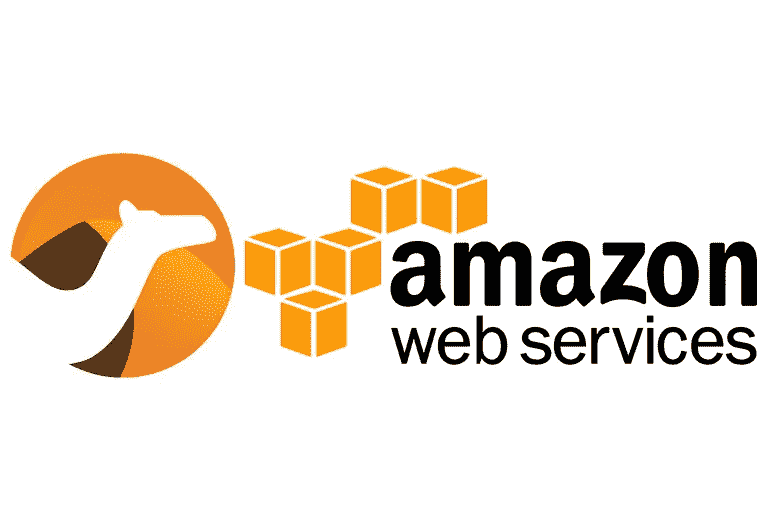
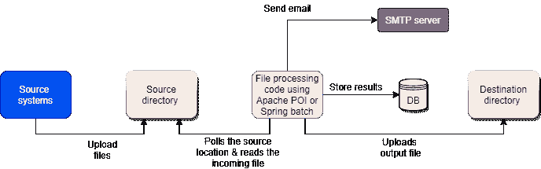
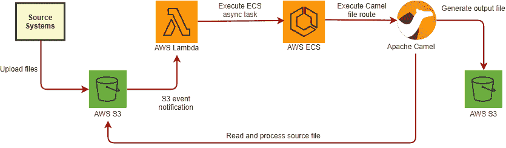

# 使用 Apache Camel & AWS 服务进行文件处理

> 原文：<https://medium.com/globant/file-processing-with-apache-camel-aws-services-6c18ee6c49f?source=collection_archive---------0----------------------->

这是我们的常规冲刺，直到我们得到一些文件处理即将到来的工作。我们认为这可能是我们过去工作的一些 csv 或 xl 文件处理工作，并开始检查初始 jiras。

所以我们有:-

1.  多个源系统每天生成一次不同的输入文件。
2.  每个文件具有不同的结构，包含固定宽度的字符数据，页眉，页脚和行数不超过 30k。
3.  要在某个位置上传的源文件和生成的输出文件。
4.  能够针对失败的记录向运营团队发送电子邮件和/或任何其他通知。

最初，我们认为解决方案应该如下所示，我们将代码捆绑成一个 jar，在服务器上运行，可能带有 cron 作业或独立的应用程序。也许我们可以添加一些消息队列。

但我们应该在现有的 AWS 客户端基础设施上构建云原生应用。这不是解决安全(目录许可、SMTP、数据库访问)成本和存储的完美解决方案，也没有使用任何现有的 AWS 服务。

此外，由于文件具有固定宽度的字符，没有任何分隔符，即使是 POI 或 Spring 批处理也无法适应。

那么这个怎么解决呢？在这里我们开始学习关于 [**阿帕奇骆驼**](https://camel.apache.org/) 和 [**AWS**](https://aws.amazon.com/) 服务的新概念。

首先，这是 EIP**和骆驼** ( [**企业整合模式**](https://www.enterpriseintegrationpatterns.com/patterns/messaging/) )的完美案例，为什么？

*   Camel 提供了精通的 API 来支持不同的源/目的地端点，因此您可以轻松地集成和更改。端点可以是任何 ftp 位置、jms 端点，甚至是 AWS S3 存储桶。
*   它有 [AWS S3 组件](https://camel.apache.org/components/latest/aws-s3-component.html)，该组件为从读取和写入 AWS S3 处理文件提供了出色的支持。
*   [Camel Bindy](https://camel.apache.org/components/latest/dataformats/bindy-dataformat.html) 支持不同的文件格式，包括固定宽度(这是我们的用例)，这有助于避免任何样板代码来解析分隔文件、页眉、页脚等。
*   使用 Camel，您可以轻松地编写 Junits 来测试文件处理代码。
*   我们还观察到 Camel 有很好的社区支持，我们的一个文件编码问题得到了及时的回应。[链接](http://camel.465427.n5.nabble.com/Character-encoding-lost-when-using-Camel-AWS2S3Endpoint-td5890047.html)

到目前为止还不错，但是接下来我们必须决定如何调用文件处理代码或者在 AWS 上部署。为了部署应用程序，我们有两个选择，使用 **AWS ECS(弹性容器服务)** : **EC2** (弹性计算云)或 **Fargate** 。

一般来说，ECS 是制作容器化应用程序并在 EC2 集群上运行它的好选择，你可以参考 AWS 文档[链接](https://aws.amazon.com/ecs/?whats-new-cards.sort-by=item.additionalFields.postDateTime&whats-new-cards.sort-order=desc&ecs-blogs.sort-by=item.additionalFields.createdDate&ecs-blogs.sort-order=desc)。ECS 在您自己的亚马逊 VPC 中启动您的容器，允许您使用您的 VPC 安全组和网络 ACL。没有与其他客户共享计算资源。您还可以使用 IAM 为每个容器分配粒度访问权限，以限制对每个服务的访问以及容器可以访问的资源。

Amazon EC2 提供了最广泛、最深入的计算平台，可选择处理器、存储、网络、操作系统和购买模式。

决定采用 EC2 方法，因为出于安全原因，客户团队更喜欢控制 EC2 的配置，并且 EC2 定价模式更具成本效益。这篇文章完美地描述了它们之间的区别[链接](https://containersonaws.com/introduction/ec2-or-aws-fargate/)。

但下一个问题是，我们如何运行这些 ECS 任务？接下来是 AWS Lambda 和 S3 通知事件。

[**AWS Lambda**](https://www.amazonaws.cn/en/lambda/) 是一个事件驱动的无服务器计算平台，由亚马逊提供，作为亚马逊网络服务的一部分。它是一种计算服务，运行代码以响应事件，并自动管理该代码所需的计算资源。Lambda 的最大执行时间跨度为 15 分钟，因为它是无服务器的，所以我们只为执行时间付费，并根据请求的数量，为 lambda 函数分配内存。

对于存储文件，显而易见的选择是亚马逊简单存储服务——S3。它是一种对象存储服务，可提供行业领先的可扩展性、数据可用性、安全性和性能。它还支持版本控制，并根据业务需求提供各种存储类别。查看详情[此处](https://aws.amazon.com/s3/)

亚马逊 S3 通知功能使您能够在您的存储桶中发生特定事件时接收通知。要启用通知，您必须首先添加通知配置，以确定您希望亚马逊 S3 发布的事件以及您希望亚马逊 S3 发送通知的目的地。

这正是我们所需要的，因此我们没有使用池化并等待文件到达，而是使用了“新对象创建的 S3 事件”,因此一旦文件到达 S3 存储桶，它就会触发 lambda 函数(我们使用 Java 代码，但它可以用 python 或 AWS 支持的其他语言编写),进而异步运行 ECS 任务。

希望下图能清楚地解释最终的端到端流程。

对于电子邮件通知，我们计划使用 AWS 简单电子邮件服务，这是一种经济高效、灵活且可扩展的电子邮件服务，使开发人员能够从任何应用程序中发送邮件。

**我们面临的挑战:-**

1.  如果你是第一次使用，Apache Camel 有一个学习曲线，并且有不同的方法来达到相同的结果(XML 与注释，不同的 bindy 格式，异常处理)，所以调试和提出一个运行模型有点乏味。
2.  在 AWS 开发环境中测试整个流程非常耗时，但幸运的是，我们使用了 [**Localstack**](https://github.com/localstack/localstack) 来模拟我们本地机器上的 AWS 设置，这大大加快了我们的测试速度。同样，如果你必须在 Windows 机器上运行 localstack 会有一些问题，但是我们可以用 docker 桌面来管理它。
3.  我们在保留文件中的重音字符时遇到了一个问题，Camel APIs 中的一个错误在 3.6.0 版本中得到修复，但在 AWS 上仍然不能正常运行。经过进一步的测试，我们可以通过将 AWS 平台的默认 lang 改为 LANG=en_US 来解决这个问题。UTF-8。
4.  之前，我们没有为 camel 代码设置任何超时，以便在文件处理完成后立即结束，这会导致多个 ECS 任务在后台运行。但是在我们指定 camel 配置的最大空闲时间后，我们可以解决这个问题。
5.  对于一些复杂的文件，我们最近观察到串行文件处理有点慢，所以现在我们增加了 Camel 提供的并行处理支持，在这里阅读更多关于线程模型。
6.  最近，我们必须读取并生成一个大文件(> 1.5 Gb)，为此我们必须使用 getByteRange/multipart upload S3 API。你可以在我的同事[写的这篇文章](/globant/large-file-processing-using-apache-camel-with-aws-s3-37c6633082cd)中读到更多的细节

这就是我们最终如何用 Camel 和 AWS 服务简化文件处理的，希望你喜欢这篇文章。

如果你有任何问题/意见，请给我留言！