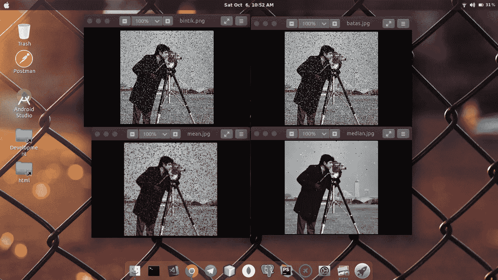

# Filter Gambar dengan Mean, Median dan Batas Menggunakan Java

> 原文：<https://medium.easyread.co/filter-gambar-dengan-mean-median-dan-batas-menggunakan-java-54d87835c6be?source=collection_archive---------7----------------------->


Photo by [Alexandre Perotto](https://unsplash.com/@perotto?utm_source=medium&utm_medium=referral) on [Unsplash](https://unsplash.com?utm_source=medium&utm_medium=referral)

Salah satu materi yang dibahas dalam matakuliah *computer vision* adalah operasi ketetanggaan dan *filtering* pada suatu citra atau gambar. Saya tertarik membuat tulisan ini karena salah satu tugas kuliah yang pernah saya kerjakan sebelumnya, sekaligus untuk referensi teman-teman yang mungkin sedang membutuhkan. Pengalaman saya saat mencari referensi (implementasi) untuk mengerjakan tugas ini lebih banyak tutorial menggunakan Matlab dibandingkan Java. Siapa tahu dengan tulisan ini dapat membantu menyelesaikan tugas teman-teman.

Oiya, beberapa bagian yang memuat tentang teori banyak saya kutip dari situs lain dan akan saya sertakan tautannya di bagian akhir tulisan ini. Sebelum lanjut lebih jauh, saya sarankan teman-teman tetap menggunakan referesi lain terkait teori, karena pada tulisan ini saya cenderung membahas secara implementasinya menggunakan Java. Sangat diperbolehkan bila teman-teman melihat ada bagian yang ingin dikoreksi atau ditambahkan.

# Ketetanggaan

Seperti yang diketahui bahwa suatu citra atau gambar tediri dari piksel-piksel yang terbentuk seperti matriks dengan ukuran tertentu. Jadi secara sederhana operasi ketetanggaan merupakan operasi pengolahan citra untuk mendapatkan nilai suatu piksel yang melibatkan nilai piksel-piksel tetangganya.


sumber: [http://www.charisfauzan.net/2016/02/operasi-ketetanggaan-piksel-pada-filter.html](http://www.charisfauzan.net/2016/02/operasi-ketetanggaan-piksel-pada-filter.html)

Dari ilustrasi gambar di atas terdapat dua macam, yaitu: empat ketetanggaan (kiri) dan delapan ketetangaan (kanan). Ketetangaan pada ilustrasi di atas maksudnya piksel lain yang berdekatan dengan piksel yang berada di tengah (P).

Hmm.. mungkin teman-teman berpikir bagaimana dengan piksel yang berada di pinggir yang tidak memiliki tetangga sebanyak piksel yang berada di tengah? Sewaktu dikelas saya dijelaskan bahwa ada beberapa cara untuk mengatasinya:

1.  Memberikan nilai dengan nilai piksel didekatnya, atau
2.  Memberikan nilai nol untuk nilai ketetangaan yang tidak ada.

Tentu saja pada program yang akan dibuat, saya menggunakan nilai nol dan empat ketetangaan karena alasan yang sederhana: lebih mudah. Hehe.

# Konsep Filter Mean, Median dan Batas

Mean, Median dan Batas adalah algoritma yang akan digunakan dalam pemfilteran. Saya coba bahas dengan singkat.

1.  Mean
    Menjumlahkan nilai piksel dengan ketetanggaannya lalu dibagi untuk mendapatkan nilai rata-ratanya.
2.  Median
    Mengurutkan nilai piksel dan ketetangaannya dari yang terkecil kemudian didaptkan nilai tengahnya.
3.  Batas
    Mendapatkan nilai piksel dan ketetanggannya kemudian menentukan nilai terendah sebagai batas bawah dan nilai tertinggi sebagai batas atas. Bila nilai piksel yang sedang dihitung (iterasi) lebih kecil dari batas bawah, maka diberi nilai sesuai dengan nilai batas bawah, begitu pula sebaliknya dengan batas atas.

# Implementasi Kode

Wah, panjang juga ya kodenya. Sebenarnya tidak juga kok, kode di atas terlihat panjang karena strukturnya saya pisah menjadi banyak *class.* Preferensi pribadi sebenarnya, saya lebih suka dipisah karena lebih mudah dibaca dan dipelajari.

Terus, bagaimana hasilnya bila program dijalankan?



Hasil dan perbandingan gambar original dan masing-masing filter

Saya menggunakan *inputan* gambar dengan *noise* yang sangat banyak yang kemudian berusaha difilter menggunakan algoritma di atas. Terlihat bahwa *filter median* menunjukkan hasil yang paling bagus.

# Bedah Kode

## FilterContract.java

Bagian ini sebenarnya opsional, saya hanya membuat *interface* sebagai kontrak *method* yang harus diimplementasikan pada setiap *class* .

## Neighbor.java

Bagian ini adalah letak dari semua proses yang akan dikerjakan, termasuk proses mendapatkan nilai ketetanggaan sekaligus perhitungan untuk filter yang dilakukan.

```
private int top, right, bottom, left;
private int current, mid;
private Color c;
```

Variabel `top` *,* `right` *,* `bottom` dan `left` saya gunakan untuk menyimpan nilai piksel dalam bentuk integer. `current` digunakan untuk menyimpan nilai piksel yang sedang diproses (iterasi) dan `mid` untuk menyimpan nilai tengah untuk *filter median* . Sedangkan variabel `*c*` dengan tipe data *library class* *Color (java.awt.Color* ) untuk mendapatkan nilai RGB.

Pada *class* ini terdapat tiga *method:* `redProcess(..)` *,* `greenProcess(..)` dan `blueProcess(..)` *.* Ketiga *method* ini memiliki fungsi yang sama, yaitu untuk mendapatkan masing nilai RGBnya. Di dalam setiap *method* tersebut terdapat kode:

```
// tetangga atas
if (row - 1 < 0) {
    top = 0;
} else {
    c = new Color(image.getRGB(row - 1, col));
    top = c.getRed();
}// tetangga kanan
if (col + 1 >= height) {
    right = 0;
} else {
    c = new Color(image.getRGB(row, col + 1));
    right = c.getRed();
}// tetangga bawah
if (row + 1 >= width) {
    bottom = 0;
} else {
    c = new Color(image.getRGB(row + 1, col));
    bottom = c.getRed();
}// tetangga kiri
if (col - 1 < 0) {
    left = 0;
} else {
    c = new Color(image.getRGB(row, col - 1));
    left = c.getRed();
}
```

Kode di atas digunakan untuk mendapatkan nilai setiap ketetanggaannya, dan memberi nilai nol bila tetangga pada bagian tertentu tidak ada.

```
int value = 0;
int[] values = {current, top, right, bottom, left};
```

Array `values` digunakan untuk menyimpan semua nilai dari *current* piksel sekaligus ketetanggaannya.

```
switch (context) {
    case "median":
        Arrays.sort(values);
        value = values[values.length / 2];
        break;
    case "mean":
        value = Arrays.stream(values).sum() / values.length;
        break;
    case "batas":
        Arrays.sort(values);
        if (current < values[0]) {
            current = values[0];
            break;
        } if (current > values[values.length-1]) {
            current = values[values.length-1];
            break;
        } value = current;
        break;
}return value;
```

Potongan kode di atas melakukan perhitungan sesuai dengan variabel `context` dengan algoritma yang telah dibahas poin sebelumnya (konsep mean, median dan batas) dan setelah proses selesai, *method* akan mengembalikan nilai `value` *.*

## Mean.java, Median.java dan Batas.java

Yap, ketiga *class* ini memiliki struktur dan kode yang sama. Hanya berbeda pada nilai variabel `context` dan file untuk *output* gambar setelah dilakukan pemfilteran. Jadi ketiga *class* ini saya gabung menjadi satu pembahasan. *Median.java* yang saya dijadikan perwakilan.

Berdasarkan kode pada poin implementasi, *class* median mewarisi *class* neighbor dan mengimplementasikan *method* dari *interface FilterContract* yang telah dibahas sebelumnya.

```
private String context = "median";
private BufferedImage image, newImage;
private int width, height;
```

Variabel `context` sebagai identitas untuk melakukan proses pemfilteran median. Kemudian `image` dan `newImage` berfungsi sebagai menyimpan citra yang sedang diolah. Perbedaan `image` dan `newImage` adalah `image` digunakan untuk mengambil nilai ketetangaan dari nilai piksel yang masih original, sedangkan `newImage` untuk menyimpan nilai baru setelah didapatkan dari proses filter. Sedangkan width dan height adalah ukuran piksel dari citra atau gambar tersebut.

Di dalam method `filter()` terdapat perulangan untuk mengolah setiap piksel dari awal hingga akhir. Dan setelah didapatkan nilainya, akan langsung diletakkan pada objek `newImage` untuk nilai yang baru. Begitu seterusnya sampai semua piksel selesai diproses.

Setelah semua selesai maka *method* `output()` dipanggil untuk mengeluarkan hasil filter menjadi file gambar baru.

## App.java

Terakhir pada *class App* hanya tinggal memanggil setiap *class filter* dan mengoper parameter file gambar yang akan diolah. Selesai.

Mudah-mudahan teman-teman belajar banyak dari tulisan ini. Sejujurnya saya sedikit kesulitan menyusun kalimat supaya terkesan ringan dan mudah dipahami pembaca. Mohon maaf bila ada kalimat yang strukturnya kurang bagus dan malah membuat bingung, karena sekali lagi saya sedikit kesulitan memilih kalimat yang pas untuk menjelaskan hehe. Semoga bermanfaat.

Github Repository:

[](https://github.com/biobii/computer-vision/tree/master/src/Filtering) [## biobii/computer-vision

### Source code for computer vision lecture. Contribute to biobii/computer-vision development by creating an account on…

github.com](https://github.com/biobii/computer-vision/tree/master/src/Filtering) 

Referensi:

[](http://www.charisfauzan.net/2016/02/operasi-ketetanggaan-piksel-pada-filter.html) [## Operasi Ketetanggaan Piksel pada Filter Batas, Filter Pemerataan dan Filter Median

### By Abd Fauzan Operasi ketetanggaan piksel adalah operasi pengolahan citra untuk mendapatkan nilai suatu piksel yang…

www.charisfauzan.net](http://www.charisfauzan.net/2016/02/operasi-ketetanggaan-piksel-pada-filter.html)