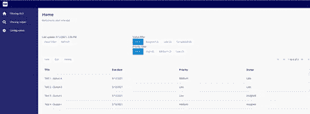

# 基于帮助者实体过滤列表

> 原文：<https://medium.com/mendix/filtering-lists-based-on-a-helper-entity-d96ccfd52c16?source=collection_archive---------2----------------------->

# Mendix 应用程序非常擅长以不同的形式显示数据列表，如数据网格、模板网格或列表视图。在这些标准解决方案上的过滤可能是有限的，并且当需要更多过滤功能时，需要额外的小部件。Mendix 9.0。带来了像 Datagrid 2.0 这样的改进，但是这个博客是为我们这些使用旧版本，并试图实现一个助手函数来进行高级过滤的人准备的。

**标准溶液**

在标准解决方案中(像在[工作流模块](https://marketplace.mendix.com/index3.html)中)，用户通过带有三个基于优先级的选项的选项卡容器获取信息，过滤是基于包含优先级的 xpath 选择完成的。该选择在每个选项卡中以不同的 xpath 选择重复出现。这很好，但是从维护的角度来看效率很低。数据网格可以使用不同的选择选项(简单、多重等)，但这些选项在列表视图或模板网格中不可用。

[https://bit.ly/MXW21](https://bit.ly/MXW21)

**用例**

服务中心有代理人处理不同客户通过电子邮件、电话等方式提出的请求。每个请求都记录在一个活动中，并分配给一个队列。将活动分配到队列是基于呼叫者选择的主题和/或呼叫者的位置。用户(也称为代理)被分配到不同的队列，并且可以处理他们被分配到的队列中的所有请求。

活动被分配到一个队列，并按优先级(高、中、低)排列，并得到一个截止日期/时间。在本博客中使用的领域模型下面:

Domain model assigning users to queues and activities to queues

我在用户和队列之间引入了一个额外的实体，以便能够添加关于关联的信息。

**基于助手实体实现助手功能**

在本文档中，将展示助手功能的实现，并扩展更多功能。

版本 1[***【1】***](#_ftn1)上带有帮助功能的目标屏幕

*最小可行产品*

该功能的基础是一个非持久实体(HelperAssignedActivities ),它有两个字段:FilterPriority 和 FilterStatus。

当页面启动时，检索微流(DS _ HelperAssignedActivities)返回 helperasignedactivities 的初始版本:

DS_HelperAssignedActivities microflow

这个微流只有一个活动来创建对象、设置初始值并返回创建的助手对象。

在页面中，一个网格被添加到助手对象的数据视图对象中。网格由“DS_GetActivities”微流返回的列表填充:

DS_GetActivities microflow

因为助手对象是非持久的，所以它不能在检索中使用，这就是为什么用优先级和状态过滤器字段的值创建两个变量。

检索是直接的，但是也应该注意在空的时候显示所有的值。

每个按钮都链接到一个微流，该微流更新助手对象(在客户机中刷新)并设置助手对象中的字段。

***版本 1:带计数器。***

这个 MVP 只是向您显示了过滤机制和结果，但是没有显示任何关于每个过滤选项的记录数量的信息。引入了一个新的子微流(SUB_HelperCalculateCounters)，它使用与网格中相同的微流，并确定每个选项[【2】](#_ftn2)(基于过滤和列表操作(计数))相关的记录的数量。然后，这些变量通过“在客户端刷新”存储在助手对象中。需要“在客户端刷新”来确保网格也用正确的过滤进行刷新。“在客户端刷新”在新子流程中完成，因此父流程中由按钮触发的“在客户端刷新”可以删除。

其中一个按钮的完整微流:

***版本 2:带队列过滤器。***

当列表变长时，根据特定队列进行过滤可能会很有用。这可以通过向助手实体添加关联来实现。可以在屏幕上添加一个参考选择器。为了强制刷新网格，从“更改时”事件(ACH _ HelperAssignedActivityQueue)启动一个新的微流。在这个微流程中，不需要更改助手对象，因为它是通过引用选择器直接完成的。

Reference selector with on change event

接下来，还需要通过从 helper 函数和 reset 函数中检索所选队列来调整网格使用的微流。

Changed retrieval microflow

***版本 3:保存选择以备将来使用。***

在上述场景中，用户每次都必须设置其过滤器。如果返回页面，过滤器还是一样的，那就太好了。这可以通过将助手实体链接到会话来实现，在检索微流中，首先通过当前会话检索助手实体，并在未找到时创建一个。因此，在同一个会话中，用户将保留其设置，尽管在屏幕上添加一个按钮来清除过滤器应该很方便。

另一种选择是将助手功能与用户实体相关联，并使其持久化。检索微流首先尝试通过当前用户获取助手对象，并在找不到时创建一个。

**结果**

版本 3 之后的结果(具有与用户相关联的助手):

Final result with helper function implemented

**总结**

在这篇博客中，提出了一个过滤的解决方案，可以用在很多情况下。它还可以扩展更多的过滤和排序，如日期选择等。更多的过滤选项将使查询更加复杂，这可能是一个风险[【3】](#_ftn3)。尽管数据网格(和数据网格 2)中有许多选项可用，但这些选项在列表视图或模板网格中不可用。记住使用过的过滤器的选项(参见版本 3)在常规数据网格中是不可能的。

[*【1】*](#_ftnref1)*过滤值对应的按钮以不同的动态类显示。该功能从 mendix 版本 8 开始提供。*

*Dynamic class of button*

[*【2】*](#_ftnref2)*计数器用于按钮的标题。*

[*【3】*](#_ftnref3)*另一种解决方案可能不会使您的查询过于复杂，但会在初始检索后删除对象。*

由经验丰富的自由职业 mendix 开发人员安德烈·(andre@mendixmagic.com 撰写的 ***。***

## 阅读更多

 [## Mendix World 2021 |召集您的应用开发团队 2021 年 9 月 7 日至 9 日

### 好像你需要说服…在一个全球制造商社区，他们想通过探索什么来相互学习…

bit.ly](https://bit.ly/MXW21)  [## 曲目|门迪克斯世界 2021

### 在今年 Mendix World 开幕之前，手工制作您的议程。浏览专为您量身定制的 8 个专题讲座中的 85 个以上专题讲座…

www.mendix.com](https://www.mendix.com/mendix-world/tracks/) 

*来自发布者-*

如果你喜欢这篇文章，你可以在我们的 [*媒体页面*](https://medium.com/mendix) *或我们自己的* [*社区博客网站*](https://developers.mendix.com/community-blog/) *找到更多类似的内容。*

*希望入门的创客可以注册一个* [*免费账号*](https://signup.mendix.com/link/signup/?source=direct) *，通过我们的* [*学院*](https://academy.mendix.com/link/home) *获得即时学习。*

有兴趣更多地参与我们的社区吗？你可以加入我们的 [*闲散社区频道*](https://join.slack.com/t/mendixcommunity/shared_invite/zt-hwhwkcxu-~59ywyjqHlUHXmrw5heqpQ) *或者想更多参与的人，看看加入我们的* [*遇见 ups*](https://developers.mendix.com/meetups/#meetupsNearYou) *。*