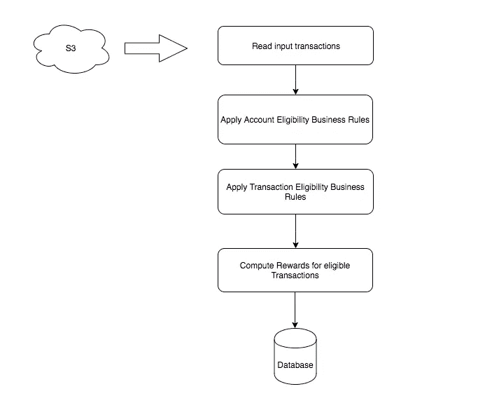
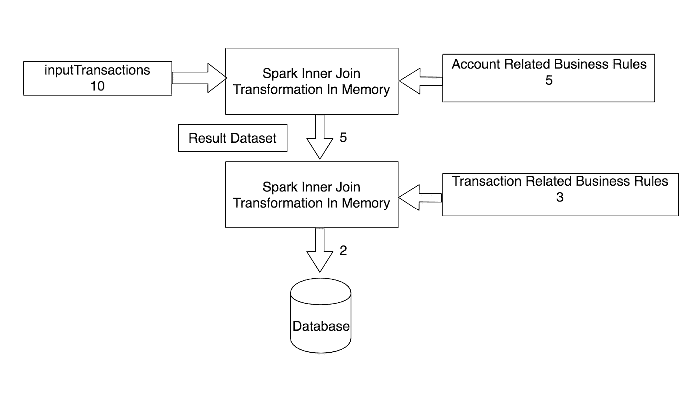
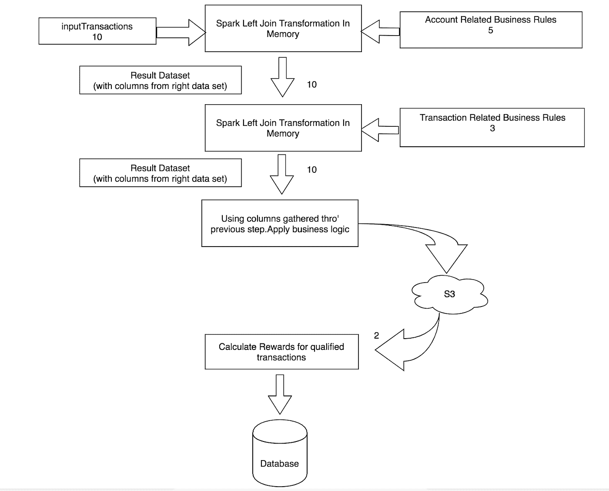

# Apache Spark 中过滤和丰富数据的比较

> 原文：<https://medium.com/capital-one-tech/filtering-vs-enriching-data-in-apache-spark-e44108c3a372?source=collection_archive---------1----------------------->

我知道这是一个模糊的标题…在更广泛的大数据处理方案中，对于如何处理数据，有各种选项/选择可用，有各种权衡。这篇博客的目的是通过比较我的团队尝试的两个选项来解决这种模糊性，以及为什么我们会选择一个而不是另一个。

数据存在于 Capital One 的 DNA 中。我们所有的决策都是由数据驱动的，作为一家有很多监管要求的金融公司，我们有义务提供更精细的处理数据，而不是高级细节。

但是在我们进入主题的更多细节之前，这里是 Apache Spark 对于初学者的快速要点 ***(如果您已经熟悉 Apache Spark，请跳到下一节。)***

# Apache Spark 快速介绍

[Apache Spark](https://spark.apache.org/) 是一个开源的大数据框架，用于使用计算集群分析大规模数据。Spark 的主要优势是内存计算，这提高了应用程序处理的速度。此外，Spark 支持各种工作负载，如批处理、机器学习、使用一次建立的相同基础设施的流。Spark 最初是加州大学伯克利分校的一个学术项目，后来于 2013 年 6 月 20 日捐赠给了 [Apache 基金会](https://www.apache.org/foundation/)。截至撰写本文时，Spark 的最新版本是 2.4

# 我们的应用用例#1:过滤器

Capital One 是 Apache Spark 批量和流式工作负载的大量用户。我开发的应用程序是核心信用卡交易处理引擎之一，用于为我们的信用卡客户计算奖励。我们的批处理管道有许多 Spark 作业，这篇博客的重点是名为 ***Filter 的作业的第一个版本。***

## **过滤器的功能**

Filter 将信用卡交易作为输入，应用一堆业务逻辑，过滤掉与赚取奖励无关的交易。

**High Level Workflow of Filter Job**

## **过滤器的问题**

我们在生产中使用了这个版本几个月，在调试数据时发现了一个问题。上面管道中提到的每个阶段都是两个数据集之间的一个 **spark 内部连接转换**。最终输出保存了合格的交易，并计算了奖励。然而，我们无法追溯到交易级别，为什么/哪种特定的业务逻辑使其没有资格获得奖励。这是因为所有中间连接结果集都是在内存中计算的**并在执行 spark 操作时传递到下一个阶段。**

很快，自然的问题出现了。我们能否在每个阶段结束时进行火花动作计数并缓存数据集？事实上，我们已经在这么做了。但问题是，它只能给我们多少交易被过滤作为阶段的业务逻辑的一部分，而不是每个交易的细节。

## **工作流程的样本数据表示(带计数)**

**Spark Data Representation of Filter Job**

假设十个事务作为输入被馈送。在应用业务逻辑(帐户资格)后，只有五个交易进入下一阶段，在下一阶段，同样的事情发生，它过滤掉另外三个交易，最后进行两个合格的交易，并计算奖励。

## **我们是如何克服这个问题的？**

如前所述，核心问题是使用 spark 内存内部连接的业务逻辑数据过滤。这使得很难进入每个事务的粒度细节，确定为什么/如何应用业务规则进行调试。经过多次讨论，该团队提出了一种不同的设计模式，即丰富数据，而不是在每个步骤中过滤数据。这就把我们带到了…

# 我们的应用用例#2:丰富

我们的新工作是 ***浓缩*** 。对于这项工作，我们分两步完成，而不是一步应用 spark 内部连接和业务逻辑过滤。

*   第一步——数据丰富，每个阶段使用 spark left outer join 从每个业务逻辑数据框架中丰富所需的数据。
*   第二步—使用前一步中收集的数据点进行业务逻辑过滤。

## **使用浓缩的工作流程样本数据表示(带计数)**

**Spark Data Representation of Enrichment Job**

和之前的例子一样。十个事务被作为输入。在使用业务逻辑(帐户资格)应用左外连接之后，它收集所需的列，以便在后面的阶段进行过滤。因此，不过滤事务，而是用每个阶段所需的数据列来丰富原始输入数据集。在最后一个阶段应用业务逻辑过滤后，我们仍然只看到两个合格的事务。然而，不同之处在于沿途获得了更丰富的数据。

## **浓缩优于过滤**

现在，在每个阶段，使用左外连接捕获所需的数据，并将其丰富到原始数据集中。它捕获状态信息，以便稍后进行更详细的分析/调试。相同的数据列/标志用于应用业务逻辑，并且在后面的阶段产生相同的结果，但是粒度更大。使用这种方法，我们能够找到每个事务的每个业务逻辑数据列/标志的状态。

# 做出改变

当我们将 Enrichment 部署到 Prod 时，我们希望确保输出是相同的。为了进行验证，我们对相同的输入数据集运行了两个作业，并部署了比较作业来比较过滤和丰富的结果。在此期间，我们的比较作业始终在过滤和浓缩作业上给出结果。这给了我们推进新浓缩模式的信心。在成功验证浓缩作业在生产中的性能后，我们更换了过滤器，并已在生产中成功运行浓缩一年。过滤器已从我们的整体处理流程中被淘汰。

# 丰富 vs 过滤？

我们选择 Apache Spark 进行平台现代化工作，在整体操作的性能和准确性方面肯定产生了良好的结果。我们的平台每天处理**数百万笔交易**，每天向客户奖励**数百万里程、现金、积分**。考虑到这些高数据——就我们对平台的处理和准确性的预期而言——我们倾向于丰富而不是过滤数据并不奇怪。

## **丰富数据模式的优点**

保持同一组数据，并按列增加数据集。这种精细的数据跟踪有助于更好地进行调试，并提高识别和报告的准确性

## **过滤数据模式的优点**

由于内存处理，计算速度更快，并提供高级指标

希望这个比较有助于您的用例决策权衡。

*披露声明:这些观点是作者的观点。除非本帖中另有说明，否则 Capital One 不属于所提及的任何公司，也不被其认可。使用或展示的所有商标和其他知识产权均为其各自所有者所有。本文为 2019 首都一。*