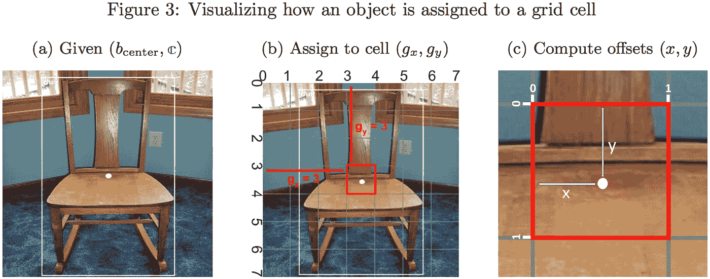

# Yolo 物体探测器:最终层和损失函数

> 原文：<https://medium.com/oracledevs/final-layers-and-loss-functions-of-single-stage-detectors-part-1-4abbfa9aa71c?source=collection_archive---------0----------------------->

# 1.1 动机

大多数深层物体探测器由一个特征提取 CNN(通常在 Imagenet 上预先训练，并针对探测进行微调)组成，该特征提取 CNN 连接到一个最终层，该层将特征整形为探测器特定的输出张量。切换 CNN 功能会导致速度和精度发生变化，如[1]、[2]、[3]所示。但是在许多情况下，从内存和计算能力的角度来看，从头开始训练一个 Imagenet CNN 是不切实际的。通常，我们使用开源的预建模型，调整最后的层和损失函数来完成我们的任务。一级对象检测器的损失函数(其中一个 CNN 产生边界框和类别预测)可能有些不寻常，因为预测张量用于构造真实张量。

作为 Oracle 机器学习团队的一员，我们一直在阅读关于这种对象检测器的文献，并以我们喜欢的数学语言进行解释，此外，我们还创建了图表、伪代码和数学公式来解释作者的意思，但忽略了这些内容。这是我们在 Oracle ML 阅读小组上发表的演讲的书面材料。我们最初是用 LaTex 写的，但是已经把我们的图形和方程转换成图像，在媒体上发布。

# 1.2 物体检测和 PascalVOC

给定一幅图像，对象检测器的任务是返回图像中我们关心的对象的边界框坐标和名称(类)。由于没有具体的输入很难谈论算法，我们以 PascalVOC 数据集[4]为例。

如图**图 1** 所示，对于每一幅图像，PascalVOC 都提供了一个注释文件，其中包含了 20 个类中的一个类的对象的边界框坐标。PascalVOC 通过左上角的 *(x_min，y_min)* 和右下角的 *(x_max，y_max)* 角坐标对边界框进行编码，但是一些对象检测算法使用具有宽度和高度的中心 xy 坐标对框进行编码。

为了将图像输入卷积神经网络，图像被调整大小为正方形。由于 PascalVOC 边界框坐标取决于图像宽度 ***W*** 和高度 ***H*** ，我们将框坐标归一化。由于 PascalVOC 提供的框编码不是编码边界框的唯一方式，角样式和中心样式编码的标准化如**等式 1** 所示。

优化需要数字，所以每个边界的类名变成了整数 **𝕔 ∈ [1，20]** ，因为在 PascalVOC 中有 **20** 个类。出于我们的目的，从一个类名称到 **𝕔** ，我们按照这个顺序在 PascalVOC 类列表中找到名称的索引:[飞机、自行车、鸟、船、瓶子、公共汽车、汽车、猫、椅子、奶牛、餐桌、狗、马、摩托车、人、盆栽、羊、沙发、火车、电视监视器]。

因此，对于每个图像，标签是由一些标准化的 **4** 维边界框 **b** 和整数类 id **𝕔** 表示的对象列表。

# 2.1 Yolo v1

Yolo 是首批深度单级探测器之一，自从第一篇论文在 2016 年 CVPR 发表以来，每年都会带来新的 Yolo 论文或技术报告。我们从 Yolo v1 [1]开始，但由于我们主要对分析损失函数感兴趣，我们真正需要了解的是 Yolo v1 CNN **(图 2a)** ，它获取一个 RGB 图像( **448×448×3** )并返回一个立方体( **7×7×30** )，在**(图 2b)** 中解释。

# 2.2 Yolo v1 包围盒编码

为了开始理解对 7×7×30 输出的解释，我们需要构造 Yolo 样式的标签。回想一下，一个图像的 PascalVOC 标签是一个对象列表，每个对象由一个边界框和一个分类来表示。现在的目标是将一幅图像的 PascalVOC 标签转换成与张量 Yolo 输出的 **7×7×30** 等价的形式。首先，我们需要从中心标准化的 PascalVOC 包围盒编码转换到 Yolo 包围盒编码。

Yolo 没有直接预测宽度和高度，而是预测平方根，以说明小数字的偏差比大数字的偏差更大。平方根映射用于扩展较小的数字，例如， **[0，0.25]** 中的任何数字都会映射到 **[0，0.5]** 。

Yolo 预测相对于 **7×7** 网格中的单元格的 xy 偏移，而不是预测由图像的宽度和高度标准化的边界框的中心。一旦图像被分成一个 **7×7** 网格，对于每个对象，我们定位包含对象中心的网格单元 **( *g* x，gy)** 。将预测对象的“职责”分配给网格单元后，我们将边界框的中心描述为从单元的偏移，如图**图 3** 所示，从而完成 Yolo 风格边界框的构建。

# 2.3 通过最大 IoU 将真实框分配给预测框

将对象分配到网格单元后，我们现在可以构造真值向量 **y_(gx，gy)*∈*【0，1】⁰**，这需要预测 ***ŷ* _(gx，gy)** 位于从 Yolo CNN 输出的 **7×7×30** 张量中的网格单元。如**图 2** 所示，每个网格单元预测两个边界框，它们具有各自的对象存在概率***【P(Object)】***和一个类别概率分布，因此每个单元仅预测一个对象，并且在预测时，我们选择具有最高值***【P(Object)***的边界框，这是该框包含对象的概率。

为了解释得更清楚，我们将 ***b*** 表示为真实物体包围盒，将***b̂₁****和 ***b̂₂*** 表示为预测包围盒，它们都是**等式 2** 中描述的 Yolo 编码样式。我们用对象类 **𝕔** 来构造真类概率向量***p******∈*****【0，1】*⁰****，其中除了在索引处 **𝕔** 外所有元素都为零，所以***p*****𝕔**= 1。我们定义 ***p̂*** 为预测类概率向量。**

****

**我们分别用 ***𝕔̂₁*** 和 ***𝕔̂₂*** 来表示盒子 1 和盒子 2 包含一个对象的“置信度”( ***P(Object)*** 表示各自的盒子)。我们将 ***b*** 分配给 box1 或 box2 中的一个，基于哪个预测的边界盒在并集上具有最高的交集，也称为 [Jaccard 索引](https://en.wikipedia.org/wiki/Jaccard_index)，其中 ***b*** 。作为参考，我们在**算法 1** 中定义了计算两个矩形的 IoU 的程序。我们将 c 设置为最大 IoU，有效地将 IoU 用作将对象分配给预测框的置信度的代理。这个过程产生真值向量 **y_(gx，gy)** ，图 4 中描述了一个例子。**

****

# **2.4 Yolo v1 损失函数**

**在使用编码为( **b** ， **𝕔** )的对象和来自网格单元 **(gx，gy)** 的预测来构造 **y_(gx，gy)** 之后，我们现在可以公式化负责预测对象的网格单元的损失 ***L* _(gx，gy)** 。尽管对于分类问题不是最佳的，Yolo v1 损失基本上是加权线性回归。**

**在[1]之后，我们将包围盒坐标***【b̂】***上的权重表示为 ***λ* _coord** ，其在[1]中被设置为 **5** ，当相应的盒子不包含对象时，****ĉ₂***上的权重表示为 ***λ* _noobj 为了使方程更简单，让***λ_ coord***为 ***4×4*** 矩阵，除了 ***λ* _coord** 在对角线上重复外，其余全为零。然后，我们可以为图 3** 中**的网格单元构建 Yolo v1 损失，将对象分配给图 4** 中**的框 1。*****

****

**当网格单元没有指定对象时，我们只有两个边界框没有对象丢失。**

****

**利用为所有情况的网格单元定义的 ***L* _(gx，gy)** ，为了得到整个图像的损失 ***L*** ，我们对所有网格单元的损失求和。**

****

**我们可以看到，这相当于[1]中给出的一幅图像的损耗公式，如图 1 所示。**

# **2.4 Yolo v2 最终层和损失函数**

**Yolo v2 [2]中最后一层和损失函数的主要变化是引入了“先验框”和每个网格单元的多对象预测。**

**Yolo v2 先验盒的灵感来自于更快的 RCNN [6](一种多级深度对象探测器)中使用的锚盒，但使用了不同的锚盒编码，这可能就是为什么[2]称它们为先验盒的原因。先验框是[2]通过对来自 PascalVOC(和 COCO)数据集的所有真值边界框运行 k-means 聚类而选择的宽度和高度。Yolo v2 不是直接预测边界框的宽度和高度，而是预测相对于前一个框的宽度和高度偏移。每个边界框预测的中心坐标保持与 Yolo v1 中的相同。Yolo v2 有 **5** 的先验，但这使得创建图表和符号很痛苦，所以我们在讨论中将其限制在 **2** ，出于同样的原因，我们还使用了 **7×7** 网格。**

****

**在 Yolo v1 中，最后一层中的每个网格单元只能预测一个对象，因为虽然每个网格单元让我们在两个边界框之间进行选择，但我们只有一个类概率向量。在 Yolo v2 中，每个网格单元预测一个边界框和每个先前框的类概率向量。假设我们有两个先验框，那么 ***ŷ* _(gx，gy)** 将是一个 **50** 维向量，因为对于每个先验，我们预测 **25** 个数字:框包含一个对象的概率，四个数字表示相对于前一个框的边界框坐标，以及 PascalVOC 的 **20** 维概率向量。**

**Yolo v2 损失函数在[2]中没有明确描述，但我们可以从 Yolo v1 损失函数中进行推断。虽然现在每个网格单元有多个对象预测，但 Yolo v2 仍然对预测的边界框执行真值的 max-IOU 匹配。预计包围盒坐标损失仍然是权重线性回归损失。然而，Yolo v3 技术报告提到使用二元交叉熵损失进行分类预测，Yolo v2 提到分类损失，我们推断这意味着不是回归损失，因此 Yolo v2 可能使用二元交叉熵。由于没有对象分配给网格单元时的损失与**等式 5** 中的损失相同，我们仅在**图 3** 中显示网格单元的 Yolo v2 损失，其中*与**等式 4** 中的损失相同，除了新的框编码。***

******

# ***Yolo v3 最终层***

***Yolo v3 技术报告的主要变化是最后一层，这是受特征金字塔网络(FPNs) [7]的启发。Yolo v3 [8]最终层由三个检测张量组成，每个检测张量都有自己的先验框，并且每个检测张量的分辨率都是前一个的两倍，例如，如果每个检测张量都有两个先验框，并且数据集是 PascalVOC，那么第一个可能的张量大小是 **7×7×50** ，这意味着第二个是 **14×14×50** ，第三个是**28×28×50**——这也是作者称之为“跨尺度预测”的部分原因。每个检测张量都像 Yolo v2 最终层一样组织，因此网格单元和对象分配的概念适用，虽然没有明确提到，但我们可以推断，像所有以前的 Yolo 化身一样，每个对象仍然只分配给一个检测张量中的一个网格单元。***

***虽然关于如何从特征提取器到三个检测张量的细节有点缺乏，但我们提出了我们对[8]第 2.3 节的解释的图表，通过这个图表，我们可以看到 Yolo 作者称之为“跨尺度预测”的另一个原因。Yolo v3 将特征提取器网络中的早期层与后期层(额外的 CNN 层)合并，这本质上就是 fpn 所做的。直观上，在高分辨率早期层中比在显著的二次采样的低分辨率后期层中更容易检测到小对象，但是 CNN 的早期层包含语义弱的特征，因此 fpn 不是直接使用它们，而是将它们与包含语义强的特征的上采样的后期层合并。***

******

***我们可以从图 6 中看到，Yolo v3 与 FPNs 不同，它使用级联而不是求和来合并层，虽然没有提到，但 Yolo v3 可能采用与 FPN 相同的方式进行上采样(使用最近邻)。此外，Yolo v3 的结构与[7]中的 FPN 不完全相同，因为 Yolo v3 不使用先前合并的结果来产生下一个检测张量。为了更清楚地说明差异，我们制作了一个图表，解释如果 Yolo v3 更接近 FPN 结构，它会是什么样子。***

******

***Yolo v3 的论文报告了对损失函数的实验，例如使用聚焦损失[9]，当与单次检测器[10](像 Yolo 这样的一级检测器)和 FPN 结合时，产生了称为 RetinaNet 的快速准确的检测器[9]。然而，这些实验都没有改善检测，因此损失基本上与 Yolo v2 相同。***

# ***参考***

1.  ***约瑟夫·雷德蒙、桑托什·库马尔·迪夫瓦拉、罗斯·b·格希克和阿里·法尔哈迪。你只看一次:统一的，实时的物体检测。更正，abs/1506.02640，2015 年。***
2.  ***约瑟夫·雷蒙德和阿里·法尔哈迪。YOLO9000:更好、更快、更强。更正，abs/1612.08242，2016。***
3.  ***Jonathan Huang、Vivek Rathod、、朱梦龙、Anoop Korattikara、Alireza Fathi、Ian Fis- cher、Zbigniew Wojna、、Sergio 和。现代卷积目标探测器的速度/精度权衡更正，abs/1611.10012，2016。***
4.  ***马克·埃弗林汉姆，吕克·范·古尔，C. K. I .威廉姆斯，j .温，安德鲁·齐泽曼。2010 年 pascal 视觉对象类(voc)挑战赛。***
5.  ***约瑟夫·雷德蒙。YOLO CVPR 2016 演讲和幻灯片。谷歌幻灯片:[https://docs.google.com/演示文稿/d/1 ka a7 no ambt 4 cal bu 9 ihgt 8 a 86 rrhz 9 yz 2 oh 4-gtdx 6m/edit # slide = id . p](https://docs.google.com/ presentation/d/1kAa7NOamBt4calBU9iHgT8a86RRHz9Yz2oh4-GTdX6M/edit#slide=id.p)，Youtube:[https://www.youtube.com/watch?v=NM6lrxy0bxs](https://www.youtube.com/watch?v=NM6lrxy0bxs)。访问时间:2018–10–12。***
6.  ***邵青·任、明凯·何、罗斯·吉斯克和孙健。更快的 R-CNN:用区域建议网络实现实时目标检测。在神经信息处理系统(NIPS)中，2015。***
7.  ***宗、彼得·多勒、罗斯·吉希克、明凯·何、巴拉思·哈里哈兰和塞尔日·贝隆吉。用于目标检测的特征金字塔网络。2017 年在 CVPR。***
8.  ***约瑟夫·雷蒙德和阿里·法尔哈迪。Yolov3:增量改进。CoRR，abs/1804.02767，2018。***
9.  ***宗-林逸、普里亚·戈亚尔、罗斯·格希克、明凯·何和彼得·多尔。密集物体探测的聚焦损失。《计算机视觉国际会议论文集》(ICCV)，2017 年***
10.  ***刘威、Dragomir Anguelov、Dumitru Erhan、Christian Szegedy、Scott E. Reed、傅成阳和 Alexander C. Berg。SSD:单次多盒探测器。更正，abs/1512.02325，2015 年。***