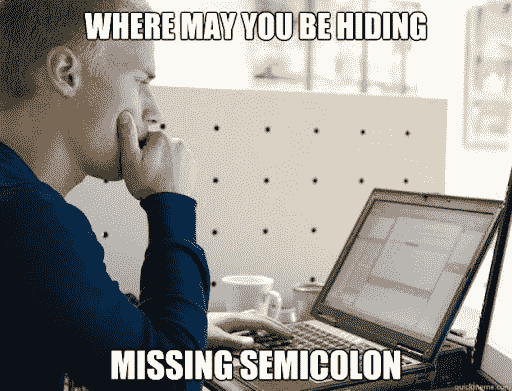

# Find errors, before they find you - Laravel Set-Up #1

> 原文：<https://medium.easyread.co/find-errors-before-they-find-you-laravel-set-up-1-f7e1e6ffd537?source=collection_archive---------3----------------------->

Assalamu’alaikum Warahmatullahi Wabarakatuh..



find error

Jadi, kali ini kita akan membuat suatu set-up atau boilerplate. Bahasa sederhananya adalah “rancangan jadi” untuk aplikasi laravel kita. Yang pertama, yang akan kita siapkan adalah menjadikan aplikasi laravel kita bisa mencari atau menunjukkan error (kesalahan) sebelum meluncurkan perubahan baru pada project kita.

Proses ini sangat berguna agar kita bisa melakukan *debugging* di fase paling awal bahkan sebelum menjalankan testing untuk aplikasi kita.

> Untuk melanjutkan membaca, perlu pengetahuan dasar tentang:
> - php
> - git — version control
> - laravel
> - composer — dependency manager

## create project

Untuk membuat project baru, kita bisa meng-install menggunakan composer secara langsung, atau bisa juga menggunakan laravel-installer. Kali ini saya contohkan menggunakan laravel-installer versi `4.2.7` .

```
laravel new setup-laravel
```


laravel-installer

kemudian kita bisa melakukan `initial commit` untuk meng-inisialisasi repo baru.


git init

## install `phpro/grumphp`

Kita akan meng-install library `[phpro/grumphp](https://github.com/phpro/grumphp)` , library/package ini berfungsi untuk melakukan `sniffing` (meng-endus) perubahan yang terjadi, setiap kali kita akan melakukan `commit` menggunakan git.

Untuk meng-install nya kita jalankan:

```
composer require phpro/grumphp --dev
```

*kita kembali menggunakan flag `--dev` karena kita hanya menginstallnya untuk proses development saja.


require phpro/grumphp

disini kita juga membuat sebuah file `grumphp.yml` untuk memilih task yang akan kita jalankan saat melakukan `commit` . Kita cukup menambahkan 2 task yaitu `phpcsfixer` dan `phpstan` .

Sekarang, kita memiliki sebuah file `grumphp.yml`


grumphp.yml

untuk bisa melakukan `sniffing` dengan dua package diatas, kita perlu meng-install keduanya terlebih dahulu.

## install phpcsfixer

Package ini berfungsi untuk melakuan pengecekan terhadap style code dari kode php kita. Ini menjadikannya seperti bahasa static typing.

Untuk meng-install nya kita bisa jalankan:

```
composer require friendsofphp/php-cs-fixer --dev
```


require phpcsfixer

untuk detail instalasi bisa menuju link berikut [ini](https://github.com/phpro/grumphp/blob/master/doc/tasks/phpcsfixer.md) .

kemudian, sekarang kita sudah bisa menggunakan package `phpcsfixer` ini di dalam file `grumphp.yml` yang sudah dibuat di awal tadi.

Ubah isi file `grumphp.yml` menjadi seperti ini:


grumphp-phpcsfixer

```
grumphp:
    tasks:
        phpcsfixer2:
            config: .php-cs-fixer.php
```

disitu tertulis bahwa konfigurasi dari `phpcsfixer2` adalah dari file `.php-cs-fixer.php` , lalu dimana file ini?? Tenang, kita akan membuatnya sekarang 😅

buatlah file dengan nama `.php-cs-fixer.php` yang berisi kode berikut:

sampai disini kita sudah selesai dalam meng konfigurasi `phpcsfixer` untuk bisa dijalankan menggunakan `grumphp.yml` .

Untuk mengecek apakah kita sudah bisa menjalankan `phpcsfixer` ini, kita bisa menjalankan perintah berikut:

```
vendor/bin/php-cs-fixer fix --dry-run --diff
```


phpcsfixer check

Dan ketika kita melakukan `commit` , pesan sukses dari `grumphp` sudah bisa kita lihat disini:


## install phpstan (with larastan)

Package phpstan, berfungsi untuk menemukan kesalahan dalam kode, tanpa harus benar-benar menjalankannya. Jadi ketika ada fungsional dari kode yang tidak sesuai, maka akan muncul peringatan saat kita melakukan `commit` .

Untuk menginstalnya, kita bisa menjalankan perintah:

```
composer require phpstan/phpstan --dev
```


require phpstan/phpstan

Kemudian, untuk menggunakan `phpstan` kita bisa menjalankan perintah:

```
vendor/bin/phpstan analyse app tests
```


Implementasi `phpstan` ke `grumphp` :

Ubah sintaks di dalam file `grumphp.yml` menjadi seperti ini:

```
grumphp:
    tasks:
        phpcsfixer:
            config: .php-cs-fixer.php
        phpstan:
            configuration: phpstan.neon
            use_grumphp_paths: false
```

Sekarang, jika kita lakukan `commit` maka akan muncul error bahwa file `phpstan.neon doesn't exist` atau tidak ada.


error phpstan.neon

Kita perlu membuat sebuah file dengan nama `phpstan.neon` yang berisi seperti dibawah ini:

```
includes:
    - ./vendor/**nunomaduro/larastan**/extension.neon

parameters:

    paths:
        - app

    # The level 8 is the highest level
    level: 5

    ignoreErrors: excludePaths:

    checkMissingIterableValueType: false
```

Kemudian kita juga perlu meng-install `nunomaduro/larastan` , untuk menyesuaikan rules dari phpstan agar sesuai dengan project laravel kita.

```
composer require nunomaduro/larastan --dev
```


require nunomaduro/larastan

Jika kita lakukan `commit` , maka akan tampil hasil dari pengecekan menggunakan dua package diatas.


commit with grumphp

Sampai disini, kita sudah selesai untuk set-up project kita menggunakan `grumphp` untuk menjalankan `phpcsfixer` dan `phpstan` .

Tips untuk menjalankan manual kedua library diatas, kita bisa menambahkan script di `composer.json` agar perintahnya lebih singkat.


add script

```
"scripts": { ...OTHER COMMAND...

       "cs-check": [
            "vendor/bin/php-cs-fixer fix --dry-run --diff"
        ],
        "cs-fix": [
            "vendor/bin/php-cs-fixer fix --diff"
        ],
        "analyze": [
            "vendor/bin/phpstan analyze"
        ],
}
```

Ini akan mempermudah menjalankan pengecekan satu-per-satu package diatas.


composer cs-check


composer cs-fix


composer analyze

Sekian. Semoga bermanfaat.

Reponya bisa dilihat di github:

[https://github.com/syofyanzuhad/laravel-setup](https://github.com/syofyanzuhad/laravel-setup)