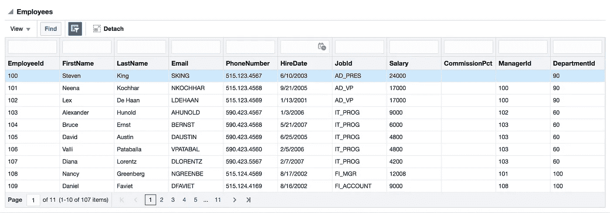
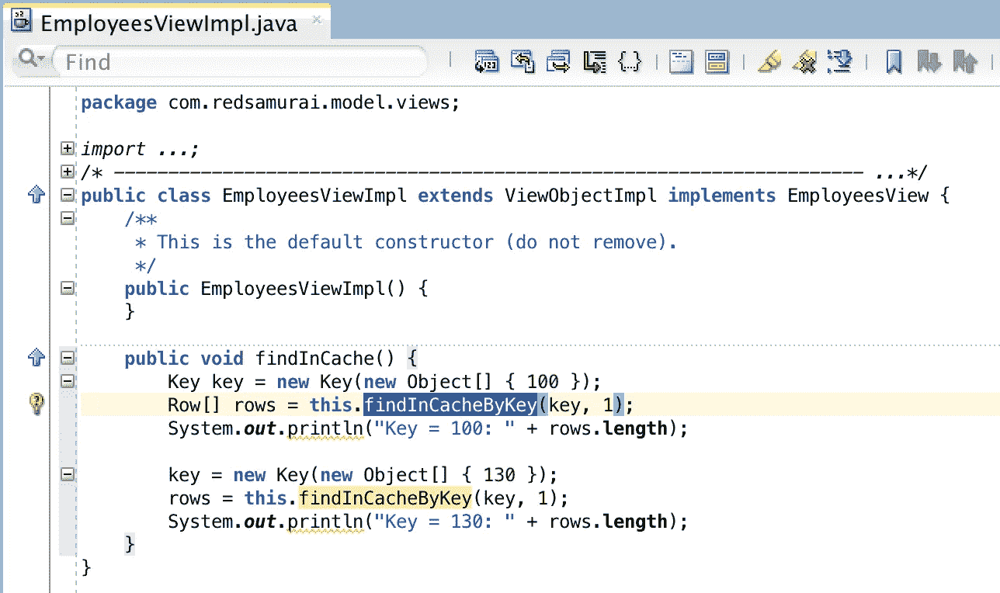

# 按关键字在缓存中查找 ADF BC API 方法用法

> 原文：<https://medium.com/oracledevs/find-in-cache-by-key-adf-bc-api-method-usage-5ff1cb17cbea?source=collection_archive---------0----------------------->

如果您需要验证具有给定键的行是否存在于提取的行集中，该怎么办？这在实现验证逻辑时可能很有用。ADF BC API 方法 findByKey 如果提取的行集中不存在具有给定关键字的行，将触发 SQL 调用并从数据库中提取行。幸运的是，有一个名为 *findInCacheByKey* 的 ADF BC API 方法，该方法只检查获取的行集中的行，而不去数据库——在某些情况下非常方便，如果没有获取记录，当您实际上不想从数据库中获取记录时。

想象一下带有分页功能的表格。前十行被提取并存在于缓存中:

现在，如果我们调用自定义方法，其中 *findInCacheByKey* 被调用两次，您将看到不同的结果。第一次调用使用提取的行集中的键—该调用将找到一行。第二次调用使用的键不属于提取的行集，行不在缓存中，调用将返回零行:

从我的 [GitHub](https://github.com/abaranovskis-redsamurai/findbykeyincacheapp) 库下载示例应用程序。

*原载于 2018 年 3 月 11 日*[*andrejusb.blogspot.com*](https://andrejusb.blogspot.lt/2018/03/find-in-cache-by-key-adf-bc-api-method.html)*。*