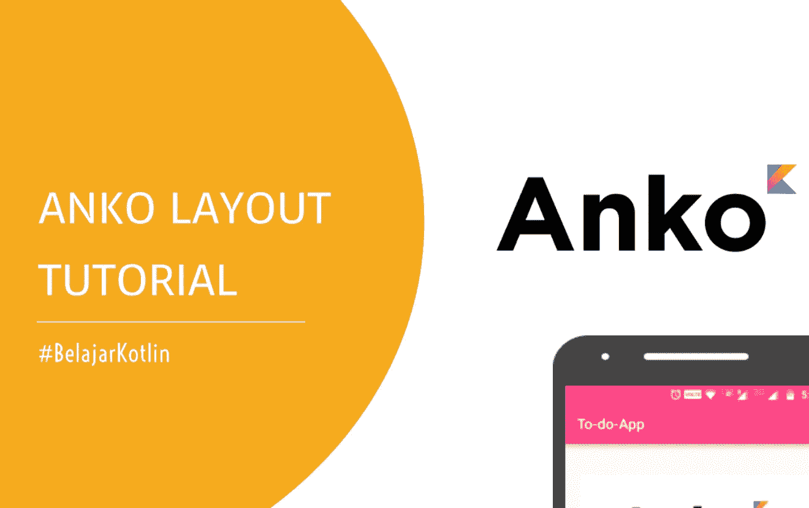
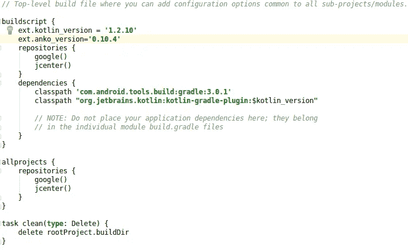
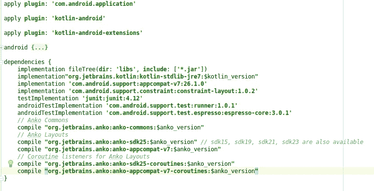

# Anko Layout — Sample Project Find My Age #BelajarKotlin

> 原文：<https://medium.easyread.co/find-my-age-sample-project-menggunakan-anko-layout-kotlin-921690cf90a9?source=collection_archive---------1----------------------->



Halo kawan-kawan, dalam kesempatan ini kita akan membuat *mini project* atau proyek sederhana untuk mengimplementasikan pembuatan layout dengan menggunakan Anko.

Kotlin sendiri terkenal dengan *less type* dan penulisannya yang *pragmatis,* karena itu saya jamin jika sebelumnya kalian terbiasa menyusun layout dengan menggunakan XML pasti kalian akan sangat mudah dan cepat beradaptasi dengan gaya penulisan ***DSL*** dari si Anko ini hehe 😄.
Oke langsung saja

# Pembuatan Project

Silahkan buat *project* android baru dengan nama *Find My Age* dan minimum SDK **API 15** . Pastikan mencentang *Include Kotlin Support* karena kita akan menggunakan Kotlin sebagai programming language nya.

# Install Anko Library

Untuk menginstall *library* Anko itu mudah banget loh, kalian bisa melihat langsung direpository resmi [Anko](https://github.com/Kotlin/anko) untuk lebih jelasnya.Untuk menginstall Anko kalian perlu mendefinisikan beberapa baris kode pada *depedencies gradle* (Module : App) kalian.

```
dependencies {
    compile "org.jetbrains.anko:anko:$anko_version"
}
```

Kemudian definisikan juga variable *$anko_version* pada gradle yang pertama (Project : FindMyAge)

```
dependencies {
    compile "org.jetbrains.anko:anko:$anko_version"
}
```

# Install Anko Layout & Event Listener

Untuk menginstall Anko Layout silahkan tambahkan *depedencies* berikut pada gradle module app kalian, sama seperti tahap sebelumnya :

```
dependencies {
    ...
    // Anko Layouts
    compile "org.jetbrains.anko:anko-sdk25:$anko_version" 
    compile "org.jetbrains.anko:anko-appcompat-v7:$anko_version"

    // Coroutine listeners for Anko Layouts
    compile "org.jetbrains.anko:anko-sdk25-coroutines:$anko_version"
    compile "org.jetbrains.anko:anko-appcompat-v7-coroutines:$anko_version"
    ...
}
```

Sehingga file gradle teman-teman akan terlihat seperti berikut ini :



**build.gradle** (Project : FindMyAge)



build.gradle (Project : Module app)

Seperti biasa setiap perubahan yang terjadi pada gradle kalian harus melakukan *Sync Now* untuk menyinkronisasi project

# Activity

Nah berikut adalah kode pada **MainActivity.kt**

```
**package** com.example.root.findmyage

**import** android.graphics.Typeface
**import** android.os.Build
**import** android.support.v7.app.AppCompatActivity
**import** android.os.Bundle
**import** android.support.annotation.RequiresApi
**import** android.view.Gravity
**import** android.view.View
**import** org.jetbrains.anko.*
**import** org.jetbrains.anko.sdk25.coroutines.onClick
**import** java.util.*

**class** MainActivity : AppCompatActivity() {

    @RequiresApi(Build.VERSION_CODES.*JELLY_BEAN_MR1*)
    **override fun** onCreate(savedInstanceState: Bundle?) {
        **super**.onCreate(savedInstanceState)

        *// View group
        verticalLayout* **{** *topPadding* = 20
            *gravity* = Gravity.*CENTER_HORIZONTAL
            // TextView untuk menampilkan hasil penghitungan Umur* **var** resultAge = *textView* **{** *text* = **"0"** *textSize* = 150F
                *typeface* = Typeface.*DEFAULT_BOLD
                textAlignment* = View.*TEXT_ALIGNMENT_CENTER* **}**.*lparams* **{
                width** = *matchParent* **}** *// EditText utuk Input tahun lahir* **val** birthYear = *editText* **{** *hint* = **"Enter year"
            }**.*lparams* **{
                width** = *matchParent* **height** = *wrapContent* **gravity** = Gravity.*CENTER* **leftMargin** = 10
                **rightMargin** = 10
            **}** *// Button untuk Triger penghitungan Umur* **val** btnFind = *button* **{** *text* = **"Find My Age !"** *// Memberi Event OnClick pada button
                onClick* **{** *// Dapatkan tahun yang di inputkan* **val** year = birthYear.*text*.toString().*toInt*()
                    *// Dapatkan tahun sekarang, kurangi dngan variable year* **val** age = Calendar.getInstance().get(Calendar.*YEAR*) - year;
                    *// Set hasil umur ke TextView* resultAge.*text* = age.toString()
                **}
            }**.*lparams* **{
                topMargin** = 10
                **width** = *wrapContent* **}
        }** }
}
```

Sekarang silahkan running project teman-teman ke device atau emulator.

# Penjelasan

***verticalLayout{}*** : Ini adalah ViewGroup paling luar atau biasa juga dikenal dengan istilah Root View.

***editText{}*** : Ini adalah widget pada Android sbagai tempat pengguna menginputkan nilai secara langsung. Dalam konsep Layout XML kita biasa menggunakannya dengan penulisan < EditText > < /EditText >

***button{}*** : Sama seperti editext button ini pun adalah sebuah Widget dalam Android. Dalam konsep layout XML kita biasa menggunakanya dengan penulisan < Button > < /Button >

**lparams{} :** Nah apasih *lparams* itu ? sederhananya lparams digunakan untuk mengatur semua yg berhubungan dengan layout / tata letak seperti lebar, tinggi, jarak padding, jarak margin, orientasi dll.

Jadi secara kesimpulan membangun Layout menggunakan Anko semudah ketika kita membuat dengan menggunaan layout XML. Malah kita lebih dimudahkan karena bisa memberikan Logic secara langsung pada Widget yang kita punya. Contoh ketika ingin memberikan Event Klik, kita tinggal definisikan saja ***onClick {}*** didalam kode widget yg kita buat.

Untuk penjelasan lebih lengkap tentang Anko Layout dapat teman-teman lihat disini [*https://github.com/Kotlin/anko/wiki/Anko-Layouts*](https://github.com/Kotlin/anko/wiki/Anko-Layouts)

Berikut project lengkap tutorial kali ini :
[*https://github.com/drawrs/find-my-age-anko-kotlin*](https://github.com/drawrs/find-my-age-anko-kotlin)

Semoga bermanfaat, Happy Coding !

*Artikel ini di tulis oleh* [*Rizal Hilman*](https://medium.com/u/1edd5468773b?source=post_page-----921690cf90a9--------------------------------) *, beliau sering menulis artikel mengenai Software Engineering dan Programming. Ikuti profilnya untuk mendapatkan update-an terbaru artikel-artikel beliau.*

*Jika anda merasa artikel ini menarik dan bermanfaat, bagikan ke lingkaran pertemanan anda, agar mereka dapat membaca artikel ini.*