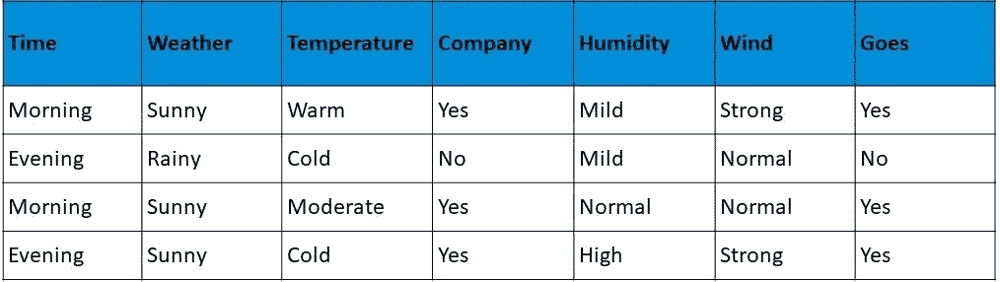

# 机器学习中 Find-S 算法如何实现？

> 原文：<https://medium.com/edureka/find-s-algorithm-in-machine-learning-bc6f42b6275d?source=collection_archive---------0----------------------->


在机器学习中，概念学习可以被定义为“*在预定义的潜在假设空间中搜索最适合训练样本的假设的问题”——Tom Mitchell。*在本文中，我们将介绍一种称为 Find-S 算法的概念学习算法。本文讨论了以下主题。

*   什么是机器学习中的 Find-S 算法？
*   它是如何工作的？
*   Find-S 算法的局限性
*   Find-S 算法的实现
*   用例

# 什么是机器学习中的 Find-S 算法？

为了理解 Find-S 算法，您还需要对以下概念有一个基本的了解:

1.  概念学习
2.  一般假设
3.  特定假设

## **1。概念学习**

我们试着用一个现实生活中的例子来理解概念学习。人类的大部分学习是基于过去的事例或经验。例如，我们能够识别任何类型的车辆——基于某一组特征，如品牌、型号等。，它们是在一大组特征上定义的。

这些特殊的特征将汽车、卡车等从更大的车辆组中区分出来。这些定义汽车、卡车等的特征被称为概念。

与此类似，机器也可以从概念中学习，以识别一个对象是否属于特定类别。任何支持概念学习的算法都需要以下条件:

*   培训用数据
*   目标概念
*   实际数据对象

## **2。一般假设**

假设，一般来说，是对某事的解释。一般假设基本上陈述了主要变量之间的一般关系。例如，点餐的一般假设是*我想要一个汉堡。*

G = { '？', '?', '?', …..'?'}

## **3。特定假设**

具体假设填写了一般假设中给出的变量的所有重要细节。上面给出的例子中更具体的细节是*我想要一个奶酪汉堡，里面有鸡肉意大利辣香肠，里面有很多生菜。*

s = { 'φ'，'φ'，……，'φ' }

现在，我们来谈谈机器学习中的 Find-S 算法。

Find-S 算法遵循以下步骤:

1.  将“h”初始化为最具体的假设。
2.  Find-S 算法只考虑正例，排除负例。对于每个正例，该算法检查该例中的每个属性。如果属性值与假设值相同，则算法继续运行，不做任何更改。但是如果属性值不同于假设值，算法会将其更改为“？”。

现在我们已经完成了 Find-S 算法的基本解释，让我们来看看它是如何工作的

## **它是如何工作的？**


1.  该过程从用最具体的假设初始化“h”开始，通常，它是数据集中的第一个正例。
2.  我们检查每一个正面的例子。如果例子是负面的，我们将继续下一个例子，但如果是正面的例子，我们将考虑下一步。
3.  我们将检查示例中的每个属性是否等于假设值。
4.  如果值匹配，则不进行任何更改。
5.  如果值不匹配，则值更改为“？”。
6.  我们这样做，直到我们到达数据集中的最后一个正例。

# Find-S 算法的局限性

下面列出了 Find-S 算法的一些限制:

1.  没有办法确定假设在整个数据中是否一致。
2.  不一致的训练集实际上可能误导 Find-S 算法，因为它忽略了负面的例子。
3.  find-S 算法不提供回溯技术来确定可以用来改进所得假设的最佳可能变化。

现在我们已经知道了 Find-S 算法的局限性，让我们来看看 Find-S 算法的实际实现。

# Find-S 算法的实现

为了理解实现，让我们试着将它实现到一个更小的数据集，用一堆例子来决定一个人是否想去散步。

这个特殊问题的概念是一个人喜欢在哪天去散步。



查看数据集，我们有六个属性和一个定义正例或反例的最终属性。在这种情况下，yes 是一个肯定的例子，意味着这个人会去散步。

所以现在，一般的假设是:

h0 = { '早晨'，'晴朗'，'温暖'，'是'，'温和'，'强烈' }

这是我们的一般假设，现在我们将逐个考虑每个例子，但只考虑正面的例子。

h1= { '早上好'，'阳光明媚'，'？'、'是'、'？', '?'}

h2 = { '？'、'阳光'、'？'、'是'、'？', '?'}

我们替换了一般假设中的所有不同值，得到一个合成假设。现在我们知道了 Find-S 算法是如何工作的，让我们来看一个使用 Python 的实现。

# 用例

让我们试着用 Python 实现上面的例子。下面给出了使用上述数据实现 Find-S 算法的代码。

```
import pandas as pd
import numpy as np

#to read the data in the csv file
data = pd.read_csv("data.csv")
print(data,"n")

#making an array of all the attributes
d = np.array(data)[:,:-1]
print("n The attributes are: ",d)

#segragating the target that has positive and negative examples
target = np.array(data)[:,-1]
print("n The target is: ",target)

#training function to implement find-s algorithm
def train(c,t):
    for i, val in enumerate(t):
        if val == "Yes":
            specific_hypothesis = c[i].copy()
            break

    for i, val in enumerate(c):
        if t[i] == "Yes":
            for x in range(len(specific_hypothesis)):
                if val[x] != specific_hypothesis[x]:
                    specific_hypothesis[x] = '?'
                else:
                    pass

    return specific_hypothesis

#obtaining the final hypothesis
print("n The final hypothesis is:",train(d,target))
```

## **输出:**


这就把我们带到了本文的结尾，在这里我们学习了机器学习中的 Find-S 算法及其实现和用例。我希望你清楚本教程中与你分享的所有内容。

如果你想查看更多关于人工智能、Python、道德黑客等市场最热门技术的文章，你可以参考 [Edureka 的官方网站。](https://www.edureka.co/blog/?utm_source=medium&utm_medium=content-link&utm_campaign=find-S-algorithm-machine-learning)

请留意本系列中的其他文章，它们将解释数据科学的各个方面。

> *1。* [*数据科学教程*](/edureka/data-science-tutorial-484da1ff952b)
> 
> *2。* [*数据科学的数学与统计*](/edureka/math-and-statistics-for-data-science-1152e30cee73)
> 
> *3。*[*R 中的线性回归*](/edureka/linear-regression-in-r-da3e42f16dd3)
> 
> *4。* [*机器学习算法*](/edureka/machine-learning-algorithms-29eea8b69a54)
> 
> *5。*[*R 中的逻辑回归*](/edureka/logistic-regression-in-r-2d08ac51cd4f)
> 
> *6。* [*分类算法*](/edureka/classification-algorithms-ba27044f28f1)
> 
> *7。* [*随机森林中的 R*](/edureka/random-forest-classifier-92123fd2b5f9)
> 
> *8。* [*决策树中的 R*](/edureka/a-complete-guide-on-decision-tree-algorithm-3245e269ece)
> 
> *9。* [*机器学习入门*](/edureka/introduction-to-machine-learning-97973c43e776)
> 
> *10。* [*朴素贝叶斯在 R*](/edureka/naive-bayes-in-r-37ca73f3e85c)
> 
> *11。* [*统计与概率*](/edureka/statistics-and-probability-cf736d703703)
> 
> *12。* [*如何创建一个完美的决策树？*](/edureka/decision-trees-b00348e0ac89)
> 
> *13。* [*关于数据科学家角色的十大神话*](/edureka/data-scientists-myths-14acade1f6f7)
> 
> *14。* [*顶级数据科学项目*](/edureka/data-science-projects-b32f1328eed8)
> 
> *15。* [*数据分析师 vs 数据工程师 vs 数据科学家*](/edureka/data-analyst-vs-data-engineer-vs-data-scientist-27aacdcaffa5)
> 
> *16。* [*人工智能的种类*](/edureka/types-of-artificial-intelligence-4c40a35f784)
> 
> *17。*[*R vs Python*](/edureka/r-vs-python-48eb86b7b40f)
> 
> *18。* [*人工智能 vs 机器学习 vs 深度学习*](/edureka/ai-vs-machine-learning-vs-deep-learning-1725e8b30b2e)
> 
> *19。* [*机器学习项目*](/edureka/machine-learning-projects-cb0130d0606f)
> 
> 20。 [*数据分析师面试问答*](/edureka/data-analyst-interview-questions-867756f37e3d)
> 
> *21。* [*面向非程序员的数据科学和机器学习工具*](/edureka/data-science-and-machine-learning-for-non-programmers-c9366f4ac3fb)
> 
> *22。* [*十大机器学习框架*](/edureka/top-10-machine-learning-frameworks-72459e902ebb)
> 
> 23。 [*用于机器学习的统计*](/edureka/statistics-for-machine-learning-c8bc158bb3c8)
> 
> *二十四。* [*随机森林中的 R*](/edureka/random-forest-classifier-92123fd2b5f9)
> 
> *二十五。* [*广度优先搜索算法*](/edureka/breadth-first-search-algorithm-17d2c72f0eaa)
> 
> *26。*[*R 中的线性判别分析*](/edureka/linear-discriminant-analysis-88fa8ad59d0f)
> 
> *27。* [*机器学习的先决条件*](/edureka/prerequisites-for-machine-learning-68430f467427)
> 
> *28。* [*互动 WebApps 使用 R 闪亮*](/edureka/r-shiny-tutorial-47b050927bd2)
> 
> *29。* [*机器学习十大书籍*](/edureka/top-10-machine-learning-books-541f011d824e)
> 
> *30。* [*无监督学习*](/edureka/unsupervised-learning-40a82b0bac64)
> 
> *31。* [*10 本最好的数据科学书籍*](/edureka/10-best-books-data-science-9161f8e82aca)
> 
> *32。* [*监督学习*](/edureka/supervised-learning-5a72987484d0)

*原载于*[*https://www.edureka.co*](https://www.edureka.co/blog/find-s-algorithm-in-machine-learning/)