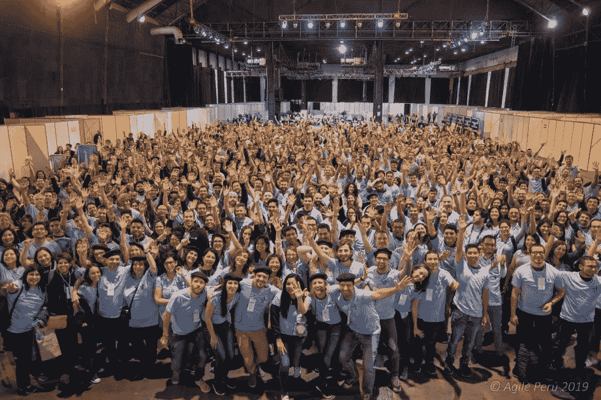

# 寻找敏捷:自画像

> 原文：<https://medium.com/globant/finding-agility-a-self-portrait-554de372b99?source=collection_archive---------1----------------------->

什么是敏捷？当开始考虑写这篇文章时，有人建议我提供一个在不同环境中使用敏捷框架的指南。然而，我想得越多，就越意识到这将是一个人为的指南，几乎没有实际用途。相反，我想讲述我发现敏捷的故事，从早期极限编程的实验，到学习 Scrum 和看板，再到重新发现我对敏捷的目标感。

# 玩弄极限编程

我的职业生涯始于 2001 年，当时我在从事一项军事研究项目时发现了 Smalltalk。Smalltalk 是一个面向对象的编程环境，它允许我们使用非常接近自然语言的东西进行优雅的开发。这是一个发现、学习热情、方法论和设计模式的时代。我们会和其他研究人员一起阅读 Smalltalk 领域的先驱们写的每一篇文章，比如肯特·贝克。这就是我们对 Smalltalk 的热爱如何引领我们走向极限编程。

在开始一个新特性之前，我们会聚在一起计划它，并使用类似于 XP 描述的“类、责任和协作”卡，或者更简单的 [CRC 卡](http://www.extremeprogramming.org/rules/crccards.html)来创建一个初步设计。这给了我们这些团队成员一个方向。然后，我们会坐下来和[配对编程](http://www.extremeprogramming.org/rules/pair.html)。我记得两人一组工作提高了速度，减少了错误:一个人可以看到整个森林，而另一个人则专注于那棵树。然后我们轮流。

我们甚至与不使用 Smalltalk 编程但熟悉我们项目主题的人配对。这是非常强大的。在某一点上，我们发现创建一个脚本来描述一旦我们实现了一个特性，我们的系统应该如何表现是很好的，然后我们将编程直到这个脚本工作:这是一种新兴的非常基本的[测试驱动开发](http://www.extremeprogramming.org/rules/testfirst.html) (TDD)。我们的系统也非常复杂:一个模拟器必须接受信息，然后处理它，并在地图上显示它，考虑到许多变量。[的狼牙大法](http://www.extremeprogramming.org/rules/spike.html)已经成为常态。我喜欢 XP 的一点是，你必须根据理想的编程天数进行估计。我发现这是一个明智的方法，但我仍然不太明白为什么这是如此相关。我不明白最后期限和那些估计对我们工作的影响。

如果你看了一下 XP 地图，你可能会意识到我们实际上并没有那么多地应用 XP。我们应用了它的一些实践，这些实践非常有用，但是现在，回过头来看，我意识到 XP 的价值观和本质中有一些元素我们还没有完全掌握。

# Scrum 在你的简历上看起来不错

[Scrum](https://scrumguides.org/scrum-guide.html) 闪现在我的职业道路上:每日会议的力量使我们的工作与我们的远程团队同步；软件以一种[迭代和增量](https://www.javiergarzas.com/2012/10/iterativo-e-incremental.html)的方式通过一堆特性和缺陷成长；我的角色是一个推动者，同时我也整理了我与客户谈论的积压工作。我记得当时一位同事建议我在简历中加入我作为 scrum master 的角色。他们说这样会“看起来不错”，而且无论如何“即使人们不叫我那个名字，我也是这么做的。”我们不太清楚自己在说什么。

在这一系列工作中，我最后一次接触 Scrum 是作为一名功能分析师参与一家软件公司的项目，该公司为美国市场开发产品。我最终成为了产品所有者的代理人。我被邀请参加规划会议，每当有疑问时都会被问及问题。对我来说，其他一切都只是一个黑盒，因为我的角色没有 Scrum 版本。我会告诉自己，也许我的角色在 Scrum 中不存在，但我的技能肯定存在，尤其是考虑到我为构建 backlog 和开发特性所做的一切。我正在不知不觉中学习多功能团队是如何工作的。

# 有机敏捷:一见钟情

2013 年年中，我被一家小型软件公司聘请协调开发区域。他们雇用我是因为那个特定的领域很混乱，而我“善于理清头绪”。当我到达时，他们正在进行日常会议，但电话控制着那里发生的一切。或者说不受控制。没有焦点。

在用我在那之前获得的工具对混乱进行了大约一年的研究后，我明白我作为工程师的教育和经验是不够的。这让我想到了 2014 年阿根廷“敏捷性(联合国)大会”。在那里，我听到 [Alan Cyment](/@acyment) 谈论有机敏捷性，突然间，我所学到的关于敏捷性的一切开始在我的脑海中形成，就像拼图的碎片:如果我们在中间放置一个回顾展，作为一个反思的空间，打开改进的大门，一切都有意义。回顾会议有助于识别困难，找到处理困难的实践，进行试验和迭代。不用说，我回到办公室，立即召开了一次回顾会议。那是我人生的转折点。

**The 2019 Latin American Agile Unconference (Jornadas Latinoamericanas de Agilidad 2019)**
Photo credit: Ernesto Cárdenas

一旦眼罩摘下，就没有回头路了。我这么说是什么意思？你开始明白有些事情你不知道。你意识到，创建一个董事会来管理你的工作，并不会让你成为哪怕一点点[看板](https://www.javiergarzas.com/2011/11/kanban.html)专家。应用一些技术实践并不一定意味着你在使用 XP。拥有 Scrum 角色和事件本身并不意味着你正在以敏捷的方式开发产品或服务。

为什么我选择告诉你我的敏捷故事的一部分？因为我相信这表明学习是一个非常个人化的旅程。敏捷是一条没有终点的道路。你总是可以比昨天更敏捷一点。

我也分享我的故事，让你知道我也有疑虑，有时会失去目标感。当这种情况发生时，我总是回到几年前找到的指南针上:[敏捷的核心](https://heartofagile.com/)。不管实践和技术如何，敏捷价值观才是最重要的。有时候，技术、角色和定义最终会使事情复杂化，让我们迷失方向。合作。交付。反思。提高。重复一遍。

# 承诺就是承诺

正如我在开始时提到的，这篇文章最初的想法是写我们应该在每个上下文中使用哪个框架。我猜你已经意识到我不太喜欢遵循食谱。然而，你必须从某个地方开始。您需要找到通往敏捷性的道路上的第一个面包屑。而且，在开始时，你必须严格遵循这条线索(不管它是否得到了更有经验的辅导员的帮助)，以便确定，如果事情没有成功，那不是因为你没有很好地使用这个方法。这有点像如果我没有听从他们的建议，就不会责怪我的营养师没有帮我减肥。

在这个故事中，第一个面包屑是 XP。这里有一些对你有用的“面包屑”:

*   如果你在一个团队中工作，有些问题你没有讨论，那就在回顾会议中讨论。有成千上万种技术，每一种都需要不同的技能。为了更容易地跟踪这个线索，这里有一个我非常喜欢的简单的开始技巧:T2 W3 解放结构 T3。
*   如果你刚开始组建一个团队，你打算从头开始开发一个产品或服务，我建议你应用 Scrum。
*   如果你正在开发软件，采用 XP 技术将最有可能帮助你提高质量、上市时间和协作。
*   如果存在瓶颈，项目的状态不清楚，没有上市时间的可见性，那么采用看板可以作为开始的面包屑。

但是，我再一次强调这样一个事实，即没有食谱，一旦你开始跟随面包屑的轨迹，一件事会导致另一件事。你最终会将 Scrum 与 XP、看板和其他东西结合起来，直到你的混合物不再有名字:它只是敏捷。

希望你写出自己的敏捷故事，敢于与世界分享！我期待着阅读你的故事！