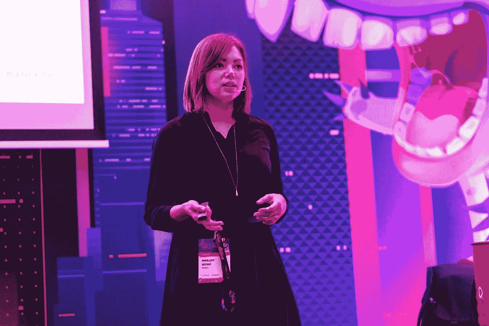
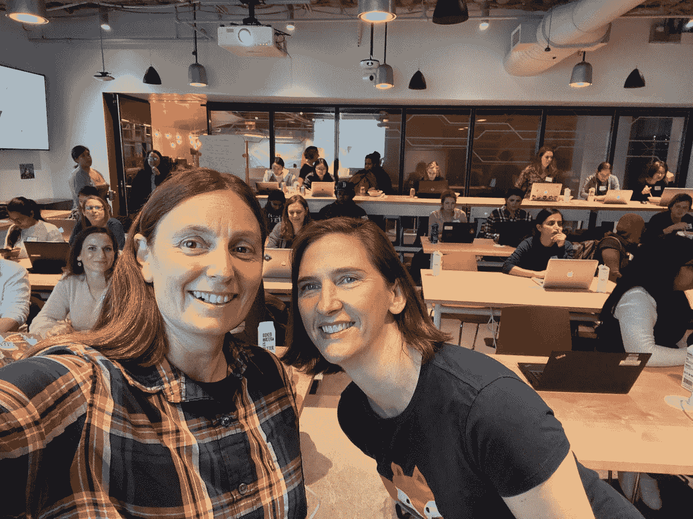

# 在开发者社区中寻找勇气和灵感

> 原文：<https://medium.com/google-developer-experts/finding-courage-and-inspiration-in-the-developer-community-7f99f732382d?source=collection_archive---------5----------------------->

网络谷歌开发者专家讲述辅导项目如何让他们成为领导者。

*由莫妮卡·贾诺塔撰写*

我们如何在技术领域赋予女性权力，并让她们掌握帮助她们成为真正领导者的技能？一种方法是从别人的成功和失败中学习。Web GDEs — [Debbie O'Brien](https://developers.google.com/community/experts/directory/profile/profile-debbie-o-brien) 、[Julia minocene](https://developers.google.com/community/experts/directory/profile/profile-julia-miocene)和 [Glafira Zhur](https://developers.google.com/community/experts/directory/profile/profile-glafira-zhur) —讨论一对一辅导的价值及其对他们自身职业和个人发展的影响。

[2019 年的一项研究](https://www.ensono.com/company/news-press/ensono-launches-women-in-tech-study/)显示，在科技活动中，只有 25%的主题演讲人是女性，而 70%的女性演讲者提到自己是会议小组中唯一的女性。改变这种状况的一个方法是举办项目和研讨会，目的是赋予妇女权力，并为她们提供相关的软技能培训，包括公开演讲、内容创作和领导力。这类项目包括[女性开发者学院](https://events.withgoogle.com/women-developer-academy-europe/) (WDA)和[通往 GDE 之路](https://events.withgoogle.com/road-to-gde/)，这两个项目都由谷歌的开发者社区运营。

WDA 项目在全球有 1000 多名毕业生，是由女性技术人员为专业 IT 从业者开办的项目。为了让科技行业的女性具备演讲和表达技能，以及自信和勇气，我们组织了培训课程、研讨会和辅导会议。另一方面，GDE 之路是一个为期三个月的指导计划，旨在支持来自历史上在技术领域代表性不足的群体的人成为专家。这两个项目的特别之处在于，它们基于导师和学员之间独特的联系、直接的知识共享和个性化的方法。

*Julia Miocene*

一些 GDE 网络社区成员有机会作为导师和学员参与女性指导计划。前端开发人员 Julia Miocene 和 Glafira Zhur 对 GDE 项目来说相对较新。她们分别在 2021 年 10 月和 2022 年 1 月成为谷歌开发者专家，毕业于第一期《女性开发者学院》和《通往 GDE 之路》；Debbie O'Brien 多年来一直是该社区的成员，也是这两个项目的积极导师。她们都分享了她们在项目中的经历，以鼓励其他女性相信自己，抓住机会，成为真正的领导者。

# 不同的道路，同一个目标

尽管这三家公司都对前端开发感兴趣，但他们都走上了截然不同的道路。Glafira Zhur 现在是一名拥有 12 年专业经验的团队负责人，她原本计划成为一名音乐家，但后来决定追随她的其他爱好。由于她的父亲是一名技术迷，她在 11 岁时就能重新安装 Windows。Julia Miocene 在从事了十多年的产品设计后，对 CSS 非常感兴趣。她成为了 GDE，因为她想使用 Chrome 和 DevTools。Debbie 是一名在前端领域工作的开发人员，对用户体验和性能有着强烈的热情。对她来说，指导是一种回报社区的方式，帮助其他人实现他们的梦想，成为他们想成为的程序员。在学习 JavaScript 的过程中，她一度非常沮丧，想要放弃，但她的导师让她相信她可以成功。现在她回报了。

*Debbie O’Brien*

正如 GDEs、Debbie、Glafira 和 Julia 都提到的，成为专家最有价值的部分是有机会结识对技术有相似兴趣的人，建立关系网，并为 web 团队提供早期反馈。另一方面，辅导让他们能够创造，增强他们的信心，让他们能够分享自己的技能和知识——不管他们是导师还是被辅导者。

# 分享知识

作为谷歌项目的学员，很大一部分是学习如何与其他开发者分享知识，并以最有效的方式帮助他们。许多 WDA 和 GDE 之路的参与者自己成为了导师。根据 Julia 的说法，重要的是要记住，导师不是老师，他们远不止如此。她说，指导的目的是一起创造一些东西，无论是一个想法，一个持久的联系，一条知识，还是一个未来的计划。

Glafira 提到，她学会了以一种新的方式看待社交媒体——作为分享知识的中心，不管这条建议看起来有多小。她说，这是因为，即使是最短的推文也可能帮助那些陷入技术问题的人，如果没有这些在线内容，他们可能无法解决这些问题。每一条知识都是有价值的。Glafira 补充说，“社交媒体现在是我的工具，我可以用它来激励人们，邀请他们加入我组织的活动。不仅仅是分享粗糙的知识，还有我的精力。”

与那些已经成功为自己的频道建立了观众群的导师合作，让参与者了解更多关于内容创作的技术方面——如何选择读者可能感兴趣的主题，如何在工作室设置灯光，或者如何准备一场引人入胜的会议演讲。

# 边教边学

从导师与学员关系的另一面来看，黛比·奥布莱恩表示，指导最大的好处是看到学员成长和成功:“我们在他们身上看到了他们自己看不到的东西，我们相信他们，并帮助引导他们实现自己的目标。有趣的是，有时我们给他们的建议对我们自己也有用，所以作为导师，我们最终也从经历中学到了很多。”

*Glafira Zhur*

葛拉菲拉和朱莉娅都表示，他们愿意在其他女性走向成功的道路上为她们提供指导。当被问及从导师项目中学到的最重要的东西是什么时，他们提到了自信——相信自己是每个女性开发人员都想要的。

# 作为社区的一部分成长

Glafira 和 Julia 都提到，在项目期间，他们遇到了许多来自当地开发者社区的鼓舞人心的人。能够向他人寻求帮助，分享见解和疑虑，并获得反馈，这对两位女性来说都是宝贵的一课。

导师可能会成为项目参与者的榜样。Julia 提到，看到别人成功并跟随他们的脚步，准确地规划出你想要在职业上达到的目标，以及如何达到目标，对她来说是多么重要。这意味着不仅要从别人的失败中学习，还要从他们的胜利和成就中学习。

通过访问其他贡献者的播客和 YouTube 频道，开发人员社区内的网络也是一个增加受众的好机会。Glafira 回忆说，在学院期间，她收到了多次邀请，并有机会在不同的渠道分享她的知识。

总的来说，比扩大受众更重要的是找到自己的声音。正如黛比所说:“我们需要更多的女性在会议上发言，在线分享知识，并成为社区的一部分。所以我鼓励你们勇敢的去追寻自己的梦想。我相信你，所以现在是时候开始相信自己了。”