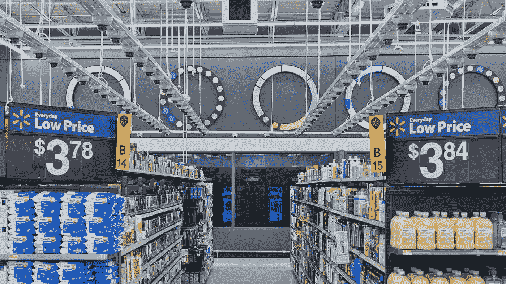
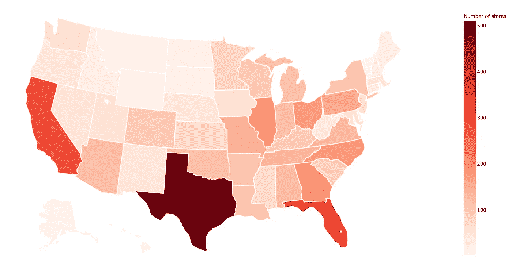
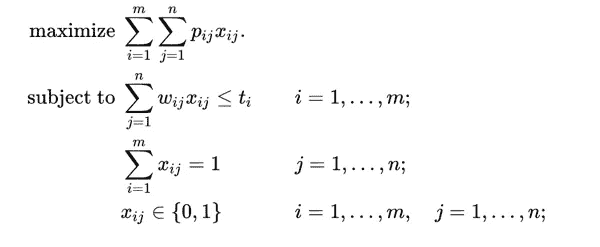
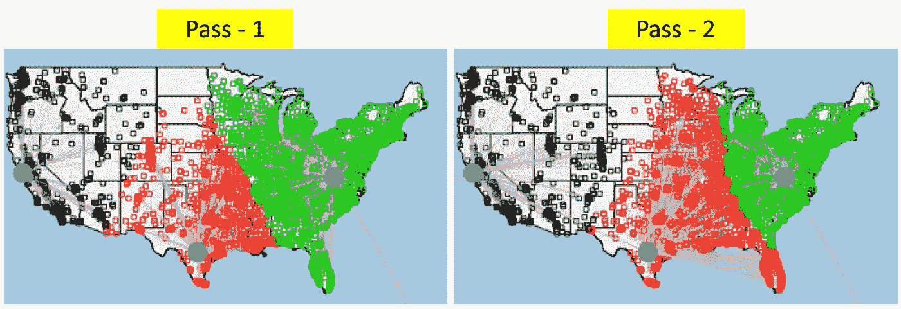

# 寻找最佳数据中心(第 1 部分)

> 原文：<https://medium.com/walmartglobaltech/finding-optimal-data-centers-part-1-64f872d57374?source=collection_archive---------0----------------------->

Store attached Data Center in Walmart Intelligent Retail Lab (IRL), Levittown, New York. Source:[https://corporate.walmart.com/photos/walmart-irl-store](https://corporate.walmart.com/photos/walmart-irl-store)

# **简介**

数据是新的石油，这是老生常谈。而且，随着如此多的数据生成，有效的数据管理对于公司来说已经变得至关重要，以便利用它来推进其业务。我们需要储备石油。与石油储备和钻井平台类似，存在具有适当基础设施的数据中心，其中可以存储和处理大量数据。

由于几个流程的数字化，沃尔玛在美国的数千家商店每天都在产生海量数据。我们如何存储数据非常重要，以促进我们商店的快速、高效运作，并为停机和灾难恢复情况提供保障。

有趣的是，这个问题是由于一个工程需求引起的，在这个工程需求中，架构师正在研究分片策略。**高可用性**和**高性能**是主要关注点。高性能是一个标准，因为随着数据库大小和事务数量的线性增加，查询数据库的响应时间也会增加。高可用性是一个标准，因为我们希望利用我们在多个地区的存在作为灾难恢复战略的一部分。

这个问题有两个部分…首先，我们需要决定需要多少个数据中心以及其中需要多少个碎片。其次，我们需要弄清楚哪个商店应该连接到哪个数据中心。在这个博客系列中，我们只关注基于数据中心的方面，而不是每个数据中心有多少碎片。

Heatmap of number of stores in each state

如上图所示，商店分布不均匀。像德克萨斯这样的州拥有大量的商店，而阿拉斯加的商店却很少。当我们打算使用分布在全国各地的几个数据中心来支持这些商店的运营时，商店在巨大地理范围内的不均匀分布给我们带来了有趣的问题。

本博客的内容如下:

1.  导言(上文)
2.  问题理解
3.  将业务需求映射到文献中的标准问题
4.  解决方法
5.  问题的变体
6.  结论

# **问题理解:**

如果我们说数据中心由云平台合作伙伴(即:关于数据中心的所有详细信息，如位置、延迟等。是由该合作伙伴提供的)，那么问题可以总结为:给定数据中心的数量 *m* 和商店的数量 *n* ，我们必须找到

**I .***k*m 中数据中心的最佳数量

**二。**将商店分配到数据中心

这里的关键词是**优**。你如何定义最优？这是这项任务中最重要的部分，对于我们的情况，将在本博客后面的解决方案部分进行解释。

# **映射问题到标准问题:**

眼前的问题非常接近文献中的[广义指派问题(GAP)](https://en.wikipedia.org/wiki/Generalized_assignment_problem) 。这是一个经典的组合优化问题，是 NP 难的。让我们把它数学化，

现在让我们把我们的具体问题与 GAP 相比较。目标函数中的 *p_ij* 是将 *store_j* 分配给 *data-center_i* 所获得的利润。如上所述，如何找到 *p_ij* 是最关键的部分，在求解方法中讨论。每个商店只能分配给一个数据中心，这是上述等式中提到的第二个约束。每个数据中心/碎片都有自己的限制，因此， *w_ij* 定义了 *store_j* 消耗 *data-center_i* 多少资源。

# **解决方法:**

这个指派问题的解决方案是一个组合爆炸。给定， *m 个*数据中心和 *n 个*门店的可能组合数分别是 *m^n* 。因此，如果你不使用任何试探法，你就要自担风险。

解决这个问题时需要考虑的一些重要事项是:

为一个数据中心分配太多商店会影响其性能

分配太少会导致数据中心利用率不足

单位时间内事务数量的增加，数据量将呈指数级增长，因此查询数据的响应时间也随之增加

将分配给一个数据中心的商店转移到另一个数据中心的成本非常高。

> 因此，将最理想的数据中心分配给具有强大底层逻辑并辅以数据驱动方法的商店至关重要，否则将会给组织造成巨大损失。

解决这个问题所需的一些输入是:

1.  商店的位置(纬度、经度)
2.  数据中心的位置(纬度、经度)
3.  数据中心的数据库容量
4.  将商店连接到数据中心的网络带宽和峰值带宽
5.  获得数据中心的成本
6.  存储的传入和传出数据量

对于最坏情况的分析，我们外推生成的数据，同时降低数据库容量。

如前所述，目标函数是最关键的部分。我们将此视为多目标优化问题。需要优化的各种目标有:

1.  使用方差/标准差最大化数据中心的平衡。使用容量利用率和带宽利用率的偏差
2.  将距离作为代理，最大限度地减少网络延迟(在这里，这意味着距离越大，网络延迟越大
3.  最大限度地降低成本(基础设施和年度成本)

经典多目标优化问题的解决方案可以使用不同的技术来获得，主要是使用线性/非线性规划或使用生物启发的多目标优化方法，如遗传规划和粒子群优化。一方面，线性/非线性规划设置中的加权目标将给出单一解，而另一方面，适当的多目标方法将给出帕累托前沿。然后我们可以在帕累托前沿选择一个最优解。基础设施成本在优化过程中的作用较小，但却是企业必须决定数据中心数量的最重要因素之一。

此外，初始解是优化问题最关键的事情之一。它减少了许多倍的计算，因此，是这个解决方案的核心。Rest all 只是运行带有一些参数调整的求解器。例如，在遗传编程中，需要调整的一些参数是突变率、突变方向、交叉概率、惩罚、容差、帕累托分数等。这方面的更多内容将在第 2 部分中讨论。在生物优化中，一次又一次的事实证明，初始解是最关键的。这里，我们使用基于业务启发的两遍算法来提供接近最优的初始解决方案，并且可以作为起始点。最后，为决策者提供了一些评价和比较解决方案的指标，它们是

1.  每个分片/数据中心的净负载
2.  每个碎片/数据中心的净距离
3.  每个分片/数据中心的商店净数量
4.  平衡参数
5.  生产能力的利用
6.  基础设施成本和年度成本
7.  更多

## 初始解决方法

让我们考虑一个 3 个数据中心的例子。在第一轮中，商店被分配到最近的数据中心。负载分布不均匀(东:南:西:: **4.3:2.1:1** )，并且严重偏向美国东部数据中心，因为商店数量更多，商店密度更大。

因此，在第二遍中，确定每个商店的第二最近的数据中心，并且将两个最近的数据中心之间的距离在容限内的商店重新分配到最佳数据中心，以改善负载平衡(东:南:西:: **2.4:2.4:1** )。

例如，两次通过后的分配比较如下图所示:

Comparison of store to data center allocation at different stages

这里可以看到，许多绿色商店已经变成红色，表示它们现在被分配到中南部数据中心，一些红色商店已经变成黑色。

对于上面的解决方案实例，

*   负荷分配比(美国东部:美国南部:美国西部)——**2.4:2.4:1**
*   商店和数据中心之间的平均距离— **519 英里**
*   最少保留天数— **454**
*   最大容量利用率— **8%**
*   …

在下面的 gif 图像中可以看到这些分配如何根据数据中心的数量而变化的预览:

Change in allocations with change in number of data centers and algorithm pass

# **问题的变体:**

在美国寻找最佳的数据中心位置，而不是像上面那样有预定义的位置，可能有很大的搜索空间，并且需要以完全不同的方式来处理，包括对自然灾害的适应性、安全性、合规性等。也是。这将帮助我们决定在哪里建立数据中心和可接受的商店故障转移机制。虽然，一个有趣的问题，它有更大的计算爆炸。我相信一些 CDN 提供公司已经在这么做了。

另一个有趣的变体是一个商店连接到一个以上的数据中心，有一个最大值，以实现更高的可用性。除了修改一个约束条件外，问题的表述保持不变。

# **结论:**

在第 1 部分中，我们研究了问题的背景和表述，问题的大小和解决方法。在这里，我们还定义了对决策至关重要的指标，并达成了初步的解决方案。

在博客的第 2 部分，我们将利用初始解决方案和已定义的指标来研究使用多目标优化获得的解决方案。敬请期待！

# 致谢:

整个工作是和 Praneeth Doguparthy 一起进行的。