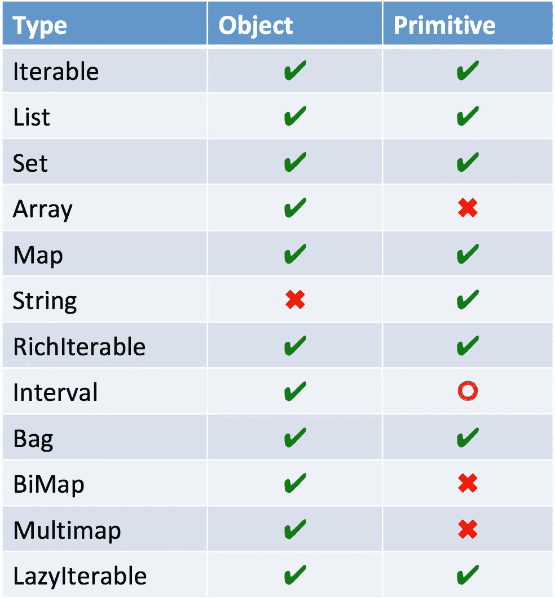

# 寻找对称

> 原文：<https://medium.com/oracledevs/finding-symmetry-27944c74b6d4?source=collection_archive---------0----------------------->

通过对称进化 Eclipse 系列的设计。


Got Eclipse Collections stickers?

# 找到缺失的类型


New Eclipse Collections types on the left add to the existing JDK types on the right

Eclipse Collections 有一大堆你在 JDK 找不到的新类型。这些类型为开发人员提供了他们需要的有用功能。支持额外的容器类型需要额外的成本，尤其是当您考虑到跨这些类型支持基本类型时。

这些缺失的类型很重要。它们帮助 Eclipse 集合为迭代模式返回更好的返回类型。

# 类型对称

Eclipse 集合在对象和原始类型之间有很好的对称性。



缺少的容器类型是固定大小的基元数组、基元`BiMaps`、基元`Multimaps`和一些基元`Intervals`(现在只有`IntInterval`存在)。字符串实际上只应该作为`char`或`int`的原始不可变集合存在。Eclipse 集合有`CharAdapter`、`CodePointAdapter`和`CodePointList`，它们提供了一组丰富的与`Strings`协同工作的迭代协议。

# API 对称性

仍然有很多事情可以做，以改善对象和原始 API 之间的对称性。有些 API 不添加新类型就无法复制。例如，用当前的`Multimap`实现来实现`groupBy`的原语版本是不太理想的，因为唯一的选择是将原语`Lists`、`Sets`或`Bags`装箱。由于 Eclipse 集合中有大量的 API，我将只关注一些主要的 API，它们目前在对象和原语集合之间没有对称性。原语`Iterables`中缺少以下方法。

1.  `groupBy` / `groupByEach`
2.  `countBy` / `countByEach`
3.  `aggregateBy` / `aggregateInPlaceBy`
4.  `partition`
5.  `reduce` / `reduceInPlace`
6.  `toMap`
7.  **所有的** `**With**` **方法**

在原始集合上所有缺失的 API 中，最微妙但最明显的区别可能是缺少**`**With**`**方法。尚不清楚“`With`”方法对于原始集合是否像对于对象集合一样有用。关于对象集合 API 上的“`With`”方法的一些用法示例，请阅读我的博客[“介词偏好”](/@donraab/preposition-preference-1f1c709b098b)。“`With`”方法允许更多的 API 与方法引用一起使用。****

****这是一些“`With`”方法的签名在`IntList`上的样子。****

```
**<P> boolean anySatisfyWith(IntObjectPredicate<? super P> predicate, P parameter);<P> boolean allSatisfyWith(IntObjectPredicate<? super P> predicate, P parameter);<P> boolean noneSatisfyWith(IntObjectPredicate<? super P> predicate, P parameter);<P> IntList selectWith(IntObjectPredicate<? super P> predicate, P parameter);<P> IntList rejectWith(IntObjectPredicate<? super P> predicate, P parameter);**
```

# ****救援的默认方法****

****Java 8 中添加的默认方法对增加我们的对象和原始 API 之间的对称性有很大的帮助。在 Eclipse Collections 10.x 中，我们将能够更多地利用默认方法，因为我们现在能够在接口中使用容器工厂类。下面的例子展示了如何使用`Bags`工厂优化`countBy`和`countByWith`的默认实现。****

```
**default <V> Bag<V> countBy(Function<? super T, ? extends V> function)
{
    return this.countBy(function, Bags.***mutable***.empty());
}default <V, P> Bag<V> countByWith(Function2<? super T, ? super P, ? extends V> function, P parameter)
{
    return this.countByWith(function, parameter,
        Bags.***mutable***.empty());
}**
```

# ****关于 Eclipse 集合 API 设计的更多信息****

****要了解更多关于 [Eclipse 集合](http://www.eclipse.org/collections/) API 的设计，请查看这个[幻灯片和下面的演示。](http://eclipse.github.io/eclipse-collections-kata/api-design/#/)****

****你还可以在这篇博文的[中找到一组 Eclipse 集合库的可视化。](/oracledevs/visualizing-eclipse-collections-646dad9533a9)****

****[*月食收藏*](https://github.com/eclipse/eclipse-collections) *为* [*投稿开放*](https://github.com/eclipse/eclipse-collections/blob/master/CONTRIBUTING.md) *。如果你喜欢这个库，你可以在 GitHub 上让我们知道。*****