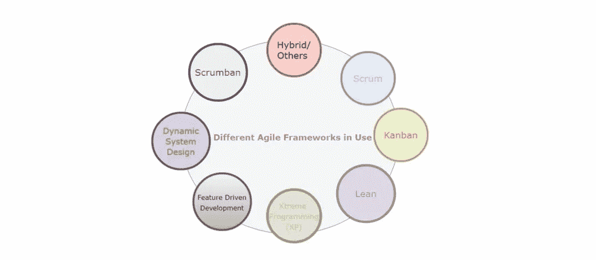
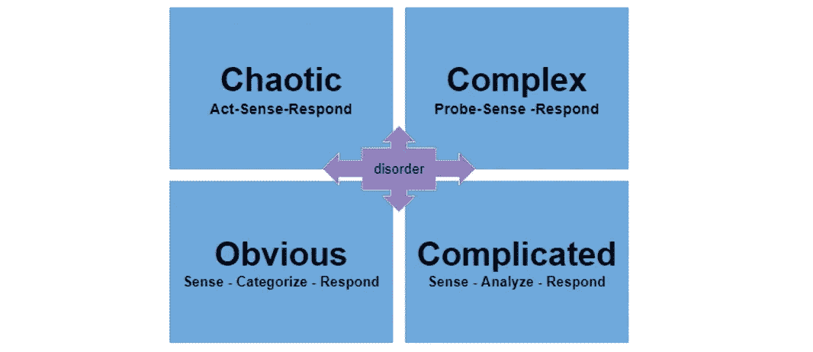
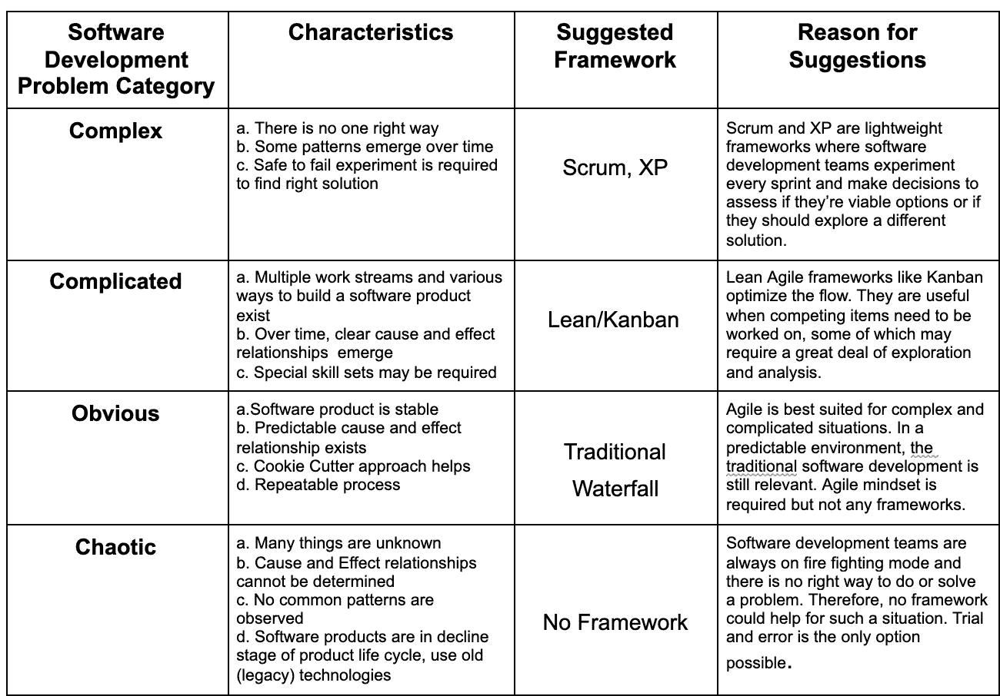
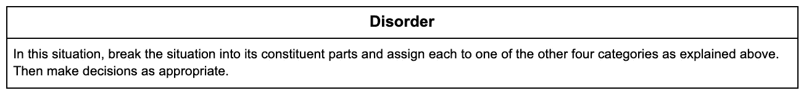

# 为您的软件团队寻找合适的交付框架

> 原文：<https://medium.com/capital-one-tech/finding-the-right-delivery-framework-for-your-software-teams-65213e9b7a69?source=collection_archive---------1----------------------->

## 敏捷就是解决问题，Cynefin 框架可以帮助你为你的团队选择合适的敏捷框架

根据 [2020 年敏捷状态报告](https://stateofagile.com/)，敏捷软件开发现在是全球超过 95%的技术组织事实上的交付机制。随着敏捷投资的广泛采用和组织的兴趣，许多个人和组织已经创建了不同的敏捷交付框架。因此，目前在技术行业中有许多框架在使用，包括一些著名的框架，如 Scrum、Kanban、Scrumban 等。

这篇文章将分享敏捷的重要性，以及不同的框架，包括 Scrum，如何基于你正在构建的软件产品适应你的组织。我们还将介绍如何使用 Cynefin 框架来帮助您确定最适合您的用例的敏捷交付框架。

# 什么是敏捷——敏捷的简单介绍

有一次我和一些高管开会，我以问这个问题开始我的演讲，*“什么是敏捷？”答案不是我所希望的。他们中的一些人提出了一些敏捷框架的名字，如 Scrum 或 Kanban。其他一些人提到了像日常站立和使用吉拉这样的仪式。现在，我认为自己是一个敏捷框架不可知论者，但这并不意味着我不尊重那些热爱特定框架的人。然而，不是我们使用的框架让我们变得敏捷，也不是支持我们管理过程的工具。*

那么，如果那些高管没有正确的理解，那么什么是敏捷呢？敏捷是:

> ***一种思维模式，组织中的人按照精益/敏捷原则生活；和价值观，同时确保这些原则在大多数情况下得到坚持***

# 软件开发总是需要敏捷交付框架吗？

Different Types of Agile Frameworks in use

直截了当的回答是*“不！*“因为:

*   敏捷思维和敏捷文化在每个组织中都很重要。然而，如果这种思维模式和文化已经牢固地建立或者正在牢固地发展，敏捷框架并不总是必要的。
*   敏捷是一种行为改变的方法，在这种方法中，组织、团队和人们转变他们的思维方式，更加以客户为中心。
*   成为一个敏捷的组织意味着对客户的反馈更加开放，并尽可能快地回应他们的反馈。
*   敏捷团队通过处理积压的客户体验请求，并随着行业和技术的变化而变化，来构建能够向客户交付价值的产品的一小部分，并重复早期和频繁交付的周期。
*   敏捷就是通过频繁的交互和自主决策来打破孤岛。

# 如何选择正确的敏捷交付框架

根据我作为敏捷人员的经验，我建议使用 [Cynefin 框架](https://www.cognitive-edge.com/the-cynefin-framework/)来帮助你的团队选择正确的敏捷交付框架。该框架的原则在政府和广泛的行业中都得到了很好的检验，以解决组织问题。基于这个框架，我们可以将软件产品可以解决的组织问题划分为以下几个类别— *复杂的、复杂的、明显的和混乱的。*

Cynefin Framework

## 软件开发问题和建议交付框架的简单比较

如果您不清楚其他四个环境中哪一个在您的组织中占主导地位，该怎么办？

那叫做*紊乱*状态。

# Cynefin 框架的实例

## 混乱

几年前，我为一个大型政府软件开发项目工作。该计划要求停用八个遗留软件应用程序，并构建一个新平台，该平台包含每个停用应用程序的所有功能。应用程序架构在不断发展，许多其他决策尚未最终确定，这意味着软件开发团队经常被蒙在鼓里，不知道他们要去哪里。

当一个决定悬而未决的时候是非常痛苦的，有创造力的人不得不闲着直到决定被解决。技术组织向决策者提供帮助，他们接受了。他们建议软件开发团队通过构建原型 API、从中学习并再次迭代来开始运行实验。在一到两个月的时间里，一个清晰的模式出现了，领导层更容易承诺为新平台提供基于微服务的架构。这种微服务架构对组织来说是一种全新的技术，他们预见到在应用程序完全开发出来之前还需要更多的实验。软件团队已经在使用 Scrum，所以使用 Scrum 作为整个计划的敏捷框架的决定被证明是有益的。

## 看板法

另一次，我在一家公司的企业技术组工作，该公司正在进行重大的数据重组。团队中的大多数数据工程师都在为提取、转换和加载(ETL)操作编写代码和脚本。他们使用的一些数据库非常复杂，存在数据完整性问题。对每组数据进行大量分析；每个数据库中都需要模式表。团队使用 Scrum 作为他们的敏捷交付框架。然而，在每个 sprint 的末尾，团队不能完成他们的大部分工作，也没有可以容易地被评审的工作。

我们致力于采用他们的敏捷交付框架，从 Scrum 到看板框架，因此团队能够在分析上花费足够的时间。此外，团队还在努力应对来自组织内几个单位的对数据架构和其他交付的多个即兴要求。从积压工作中选择最优先的项目，管理各种类别的请求并处理它们变得更加容易。由于深入的分析和工作项目的流程在这种情况下是最重要的，用基于精益的看板敏捷框架来精炼我们的方法在这里更有意义，并且最终为他们实现了。

## 传统(瀑布)

还有一段时间，我在一家医疗保健 IT 公司工作，为州医疗补助客户构建应用程序。当我开始为他们工作时，他们主要是建立门户网站，但随着手机用户群的增长，一些州开始要求使用 Android 和 iOS 应用程序。我们有一些为其他项目构建 iOS 和 Android 应用程序的经验，这些移动应用程序所需的功能在最初的门户网站中可用，包括保险 id 卡、提供商办公室或医院、索赔状态、覆盖范围等。

一旦为一个州构建了应用程序，就可以为其他州重复同样的过程。没有必要进行实验、大量分析，也没有必要一个接一个地重复某个特性，因为它们基本上都是一样的。我们与客户保持联系，并向他们更新应用程序开发的进度。然而，他们通过传统的工作分解结构来跟踪他们的进度，并且能够在合同期限内完成软件开发。团队保持了敏捷文化和心态，但是没有使用敏捷交付框架。事实上，他们使用传统的瀑布方法成功地跨几个州交付应用程序。

## 当框架没有帮助时

当我在一家旅游公司工作时，该公司的主要产品之一是全球分销系统(GDS ),这是一个由世界各地的航空公司、租车公司和酒店组成的数据库，可供其他网站和公司使用。基础系统是在 40-50 年前构建的，该公司没有一个用于开发新功能、应用问题修复和测试修复或改进的试运行(非生产)环境。如果某个东西坏了，很难修复它，因为它必须通过反复试验的方法来完成。每当客户报告任何问题时，软件工程师都处于救火模式。在这种情况下，没有任何交付框架有助于解决此类问题。通常，组织需要停用此类应用程序，并构建一些新的东西来尽快解决客户的问题。

# 如何解决更大的问题？

这个博客提供了为小型团队或组织选择交付框架的基本框架。然而，如果您在一个拥有多个软件开发团队的更大的组织中工作，那么就需要一套额外的框架来扩展交付机制。敬请关注本系列的下一篇博客，它将阐述如何选择正确的扩展交付框架。

*披露声明:2021 首创一号。观点是作者个人的观点。除非本帖中另有说明，否则 Capital One 不隶属于所提及的任何公司，也不被这些公司认可。使用或展示的所有商标和其他知识产权是其各自所有者的财产。*

【https://www.capitalone.com】最初发表于**。**