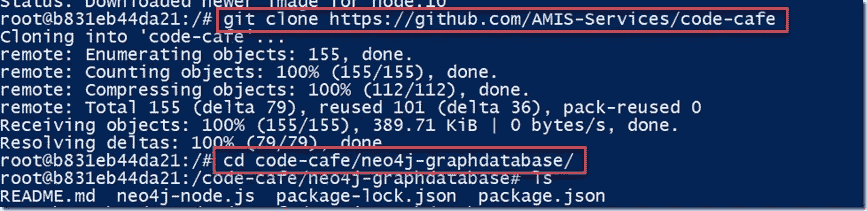

# 使用 Neo4J 和 Node 查找从 A 国到 B 国的最短路径

> 原文：<https://medium.com/oracledevs/finding-the-shortest-path-from-country-a-to-country-b-using-neo4j-and-node-d36f3aa96fe4?source=collection_archive---------0----------------------->

图形数据库擅长记录节点和边，更擅长执行遍历边的查询。与使用传统 SQL 的关系数据库相比，图数据库可以更优雅、更高效地处理一些挑战。

作为一个简单的例子，本文将创建一个 Neo4J Graph 数据库实例，用世界上的国家(节点)和国家之间的(陆地)边界(边)填充。国家数据由节点应用程序从 GitHub 文档中检索，该节点应用程序随后使用通过 Bolt 协议服务器执行的 Cypher 表达式在 Neo4J 实例中创建节点和边。节点应用程序利用 NPM 模块*neo4j-驱动程序*。

与本文相关的代码可以在 GitHub 中找到:[https://GitHub . com/AMIS-Services/code-cafe/tree/master/neo4j-graph database](https://github.com/AMIS-Services/code-cafe/tree/master/neo4j-graphdatabase)。

学习从法国到印度的最短路线(通过陆地边界的数量)的步骤如下:

先决条件:Linux 主机与 Docker 引擎可用于运行 Docker 容器(图像)和互联网连接。仅此而已。

*   运行 Neo4J 容器映像(如我的同事 Rosanna Denis 在[这篇文章](https://technology.amis.nl/2018/11/16/querying-connected-data-in-graph-databases-with-neo4j/)中所述)
*   通过浏览器 UI 访问 Neo4J
*   运行节点 JS 容器映像
*   Git 克隆 GitHub Repo
*   运行节点应用程序(它将获取数据，将其加载到 Neo4J 中，并执行查询以找到最短路径)

# 1.运行 Neo4J 容器映像

Neo4J 将在 Docker 容器中运行，在这个简单的例子中，我们不会将数据映射到容器外部的卷(这意味着我们不会将数据持久存储在 Neo4J 数据库中)

要启动 Neo4J 数据库，只需运行:

```
docker run --publish=7474:7474 --publish=7687:7687 neo4j:3.0
```

如果图像在本地还不可用，它将被提取(大约 200 MB)。


在我的例子中，我在 Windows 上工作，用 vagger 通过 VirtualBox 启动一个 Ubuntu 虚拟机。此虚拟机被分配了 IP 地址 192.168.188.142(如游民文件中所配置的)。请参见[https://github . com/AMIS-Services/code-cafe/tree/master/Linux-and-docker-host-on-windows-machine](https://github.com/AMIS-Services/code-cafe/tree/master/linux-and-docker-host-on-windows-machine)了解更多关于我的设置以及如何在您的环境中模拟它的详细信息。

# 2.通过浏览器 UI 访问 Neo4J

现在在 Docker 主机(或 Windows 主机)上的浏览器中通过端口 7474 访问 Neo4J，例如:[http://192 . 168 . 188 . 142:7474](http://192.168.188.142:7474)

用 neo4j/neo4j 连接。


logging in to Neo4J in the browser console

现在将提示您定义新密码。这样做。

随后键入命令:server connect 并提供凭据(neo4j 和新密码)以建立与 Neo4J 的连接:


现在可以执行第一个 Cypher 查询:match (n) return n(相当于关系数据库中的 select * from <all tables="" in="" the="" schema="">)。它不会返回任何结果，因为还没有数据加载到数据库中。</all>


Selecting all objects from the Neo4J database instance

# 3.运行节点 JS 容器映像

要运行干净的节点环境，请执行以下命令:

```
docker run -it --rm -p 8080:8080 node:10 bash
```


Running a Docker container image for a clean Node 10 runtime environment

这使用节点 10 运行时环境运行容器，容器中的端口 8080 暴露在 Docker 主机上的端口 8080 处。这允许我们运行一个节点应用程序，它可以在端口 8080 处理 HTTP 请求，并通过 Docker 主机上的端口 8080 访问它。容器以交互模式运行。对于带有节点 JS 运行时环境的容器内的 shell 会话，显示了命令提示符。

# 4.Git 克隆 GitHub Repo

要获得 Node JS 应用程序的源代码，从 GitHub 克隆一个存储库:

```
git clone [https://github.com/AMIS-Services/code-cafe](https://github.com/AMIS-Services/code-cafe)
```

然后更改目录:

```
cd code-cafe/neo4j-graphdatabase/
```



# 5.运行节点应用程序

在运行节点应用程序之前，我们首先需要安装所有的依赖项(如 package.json 中所定义的)。执行:

```
npm install
```


检查文件“neo4j-node.js”的内容，了解如何通过 JavaScript 与 neo4j 进行交互。确保使用您的环境的用户、密码和 uri 的相关值编辑该文件。

现在可以执行应用程序(文件 neo4j-node.js)了。您可以使用“npm start”运行“neo4j-node.js”。

节点程序将从 GitHub(https://raw . githubusercontent . com/mle doze/countries/master/countries . JSON)中检索一个带有国家的 JSON 文档。它为区域、次区域和语言，当然也为所有国家建立了节点。它建立了从国家到它们所属的区域和次区域、所讲的语言以及与它们接壤的所有其他国家的关系。

节点代码检索带有国家详细信息的 JSON 文档，并使用一些非常优雅的代码创建带有地区、子地区和语言的唯一值的便利集合:

[https://gist . github . com/lucasjellema/F3 aedc 9 f 9985 bbfd 87867 f 804d 028476](https://gist.github.com/lucasjellema/f3aedc9f9985bbfd87867f804d028476)

程序将显示关于它正在做什么的输出——包括它正在执行的文字密码语句。注意:在 Neo4J 中创建所有节点和边可能需要几分钟时间。

在程序执行结束时，它将显示如下输出:


Last section of output from neo4j-node.js

这里回答了从法国到印度的最短路径是什么——需要穿越的陆地边界最少。这个问题以密码查询的形式向 Neo4J 提出:

```
Match path = shortestpath( (f:Country{name:'France'}) –[:BORDERS_WITH *1..15]-(p:Country{name:'India'})) return path
```


如果在浏览器用户界面中执行此查询，我们将获得查询结果的图形表示:


Shortest path (in terms of number of nodes to visit) from France to India

在常规 SQL 中，这种查询在大多数关系数据库中不是非常容易(也不是非常快速)。但是，请把这篇文章仅仅看作是对 Node 程序如何与 Neo4J 交互以及如何使用 Cypher 查询数据的快速介绍，重点是关系。

显然，用不同的国家代替法国和印度也可以提出类似的问题。

Neo4J 数据库中包含的其他数据:语言(节点)和每个国家使用的语言(边)。检索所有讲法语的国家的简单查询:

```
match (f:Language{name:'French'})<- []-(l) return f,l
```

还有一个稍微简单一点的查询，查找所有不说法语的国家，并返回他们说的语言:

```
MATCH (french:Language{name:'French'}),(c:Country)-[spk:SPEAKS]-> (l) WHERE NOT (c)-->(french) RETURN c, l;
```


All countries that do not speak French and the languages they do speak

最后一个例子:所有不说法语的法国邻国——以及他们*说的语言:*

```
match (french:Language{name:'French'}), (f:Country{name:'France'})- [:BORDERS_WITH]->(bc)-[:SPEAKS]-> (language) WHERE NOT (bc)--&gt;(french) return f,bc, language
```


France, all its neighbouring countries that do no speak French and the Languages they do speak

*原载于 2019 年 1 月 1 日*[*technology . amis . nl*](https://technology.amis.nl/2019/01/01/finding-the-shortest-path-from-country-a-to-country-b-using-neo4j-and-node/)*。*