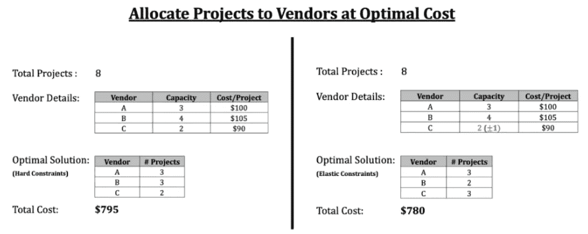
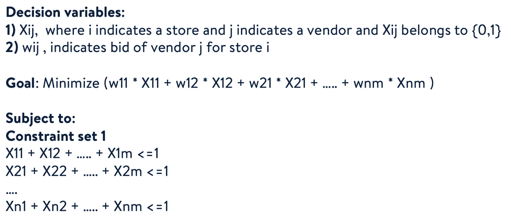
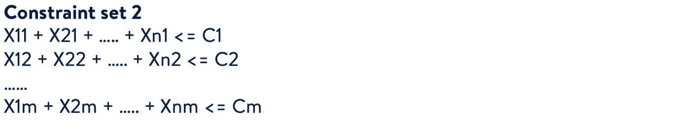
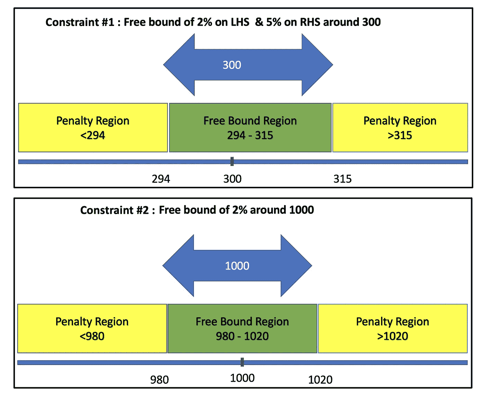
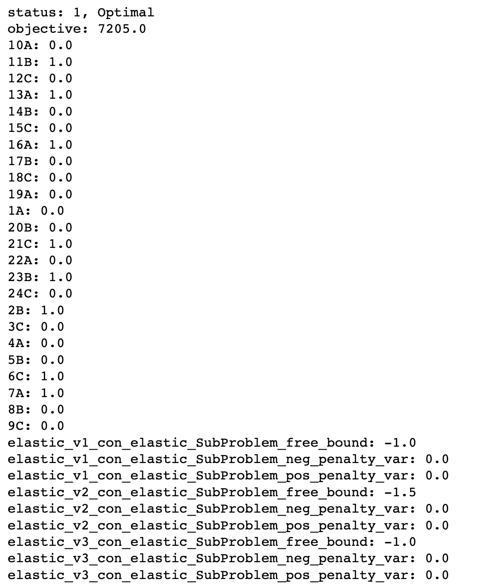
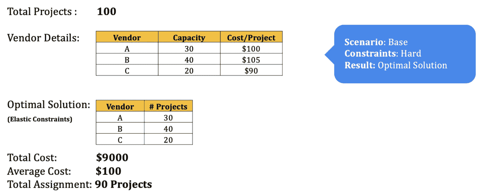
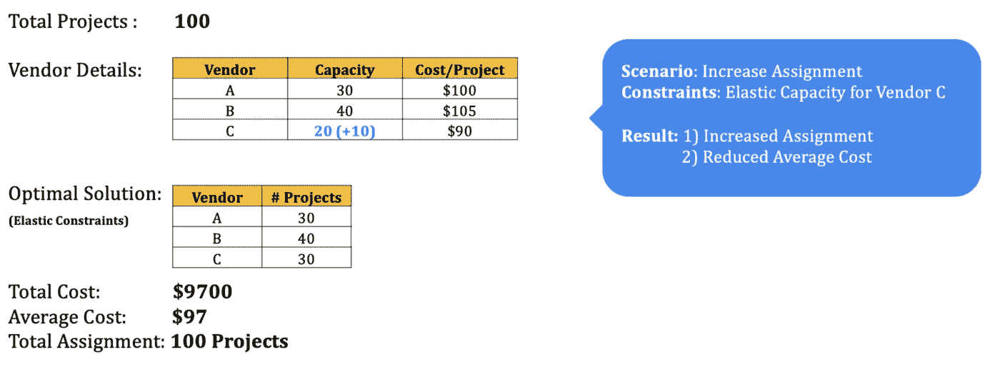
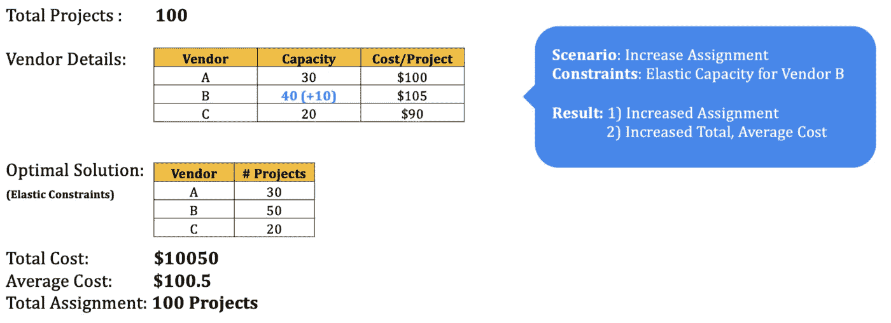
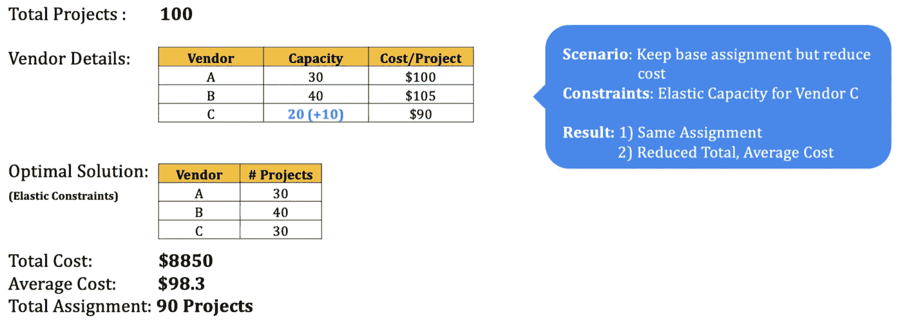

# 通过使用弹性约束的场景规划微调优化结果

> 原文：<https://medium.com/walmartglobaltech/fine-tuning-optimization-results-with-scenario-planning-using-elastic-constraints-1c3129272349?source=collection_archive---------7----------------------->


[Credits](https://pixabay.com/photos/elastic-bands-colour-ball-elastic-2229753/)

# 介绍

线性优化是优化技术的一个分支，其目标是基于某些约束和目标函数之间的线性关系找到最佳可能结果。各种各样的真实世界的用例可以通过公式化为线性优化问题来容易地解决。通常，优化包括找到计算成本、时间、资源等的目标函数的最大值或最小值。这个目标函数是在一定的约束条件下进行评估的，这些约束条件是不能违反的。在大多数情况下，这些约束是硬约束，即它们的值是固定的和/或有界的。

让我们用一个小例子来更详细地理解这一点。在图 1 中，我们展示了一个用例，其中一家公司希望指派供应商以尽可能低的成本执行某些项目。每个供应商都有固定数量的项目，以及每个项目的固定容量和成本。使用简单的线性优化，所有项目的总成本可分配为 **$795** 。这是一个使用硬约束的例子——容量和成本数字是固定的，在这些范围内找到最优解。



然而，如果允许我们处理这些约束，我们可能会得到一个不同的解决方案。如您在右侧所见，如果我们将供应商 C 的产能增加 1，我们现在可以以减少的总成本 **$780** 进行分配。在这里，我们使其中一个约束*具有弹性*，也就是说，它们不再是固定的，可以在一定程度上违反它们的初始边界。这也反映了在规划期间实际场景中发生的情况，公司可能意识到供应商 C 更具成本效益，并将尝试从他们那里协商更多容量。

因此，尽管开箱即用的优化框架可能适用于许多用例，但优化器总是有被固定数量的输入所限制的风险。这是因为该算法试图在给定的一组约束条件(固定的先决条件)内找到最佳解决方案，这些约束条件包括项目进度、供应商可用性、供应商能力、成本等。然而，在现实世界的情况下，这些约束是灵活的，可以改变以适应目标。例如，我们总是可以要求具有成本效益的供应商增加他们的容量，或者与长期供应商协商价格以降低成本。

线性优化对于我们在沃尔玛的各种用例都非常有效。其中一个用例是为我们商场的建筑项目活动指定第三方供应商。在这里，不同的供应商提交他们对项目的投标，目的是为每个项目指定一个供应商，以便整体成本最小化，同时还要考虑供应商排名、供应商能力等因素。为了解决这个问题，通常线性优化模型就足够了，但是分配可能不总是完美的。出现这种情况的一些原因是:

*   项目成本超过计划预算，
*   项目数量大于供应商的能力，
*   项目时间安排与供应商可用性冲突等。

为了找到一个最优的和现实的解决方案，我们需要给我们的模型约束增加一些灵活性或弹性。通过一些实验，最终用户将能够更好地理解优化结果，并有效地规划他们的任务。因此，简单的线性优化框架可以被认为是通过具有灵活或弹性约束来改善结果的场景规划工具。

在这篇博客中，我们将介绍线性优化中弹性约束的概念，并用 Python 实现一个玩具解决方案。

# 背后的数学！

在线性规划中，每当我们试图解决约束时，我们往往会遇到硬约束。在许多情况下，这些约束可以根据上下文稍微放宽。我们现在将看看如何将软(弹性)约束引入我们的框架背后的数学原理。

让我们假设我们有' **n** '家商店，其中 n > 0 是一个自然数。每家店都需要聘请第三方公司的经理。有不同的公司提供这种服务，每个公司都有能力(基于以前的声誉和实际人力资源可用性)提供多少资源。每个店最多需要一个经理。每家第三方公司都会提交标书。目标是在考虑每个公司的生产能力的情况下，将资源最优地分配给所有商店，同时使成本最小化。



每个商店最多应分配 1 个供应商。这里我们可以采用一个等式约束。然而，如果供应商能力小于所需的资源，设置等式约束会产生不可行的解决方案。为了克服这个挑战，我们引入了<= constraints.



The total assignment to a vendor should be less than or equal to their capacity.

**弹性约束:**

在许多情况下，如果我们稍微放松约束，看看最优解将如何变化可能会很有趣。例如:如果我们将供应商产能降低 10 %，我们的总成本可以降低多少？或者，如果我们在现有的限制下无法完成全部任务，那么如果我们在每个项目的资源和成本方面放松限制，任务将如何变化？在许多情况下，这将有助于企业在最优分配方面做出更好的决策。

现在让我们了解如何将弹性约束添加到我们的优化框架中。我们将使用 Python 中的纸浆库，它有两个关键参数:**自由绑定**和**惩罚。**

**自由束缚:**

自由边界表示一个区域，在该区域周围，我们可以允许约束自由偏离其初始固定边界。

举个例子，

如果我们有 x + y = 200，作为约束

有了 1%的自由边界，我们可以允许 x + y 的值在区间[198，202]内。

这些界限不必是对称的。任何一方都可以选择不同的百分比。这变得很重要，因为我们可能不想从某一方面偏离约束。假设我们永远不想超过 200，在这种情况下，我们可以将右边界设置为 0%。

这个自由范围内的任何约束值都是允许的。这个概念可以很容易地扩展到不等式约束。注意，对于不等式约束，一侧总是自由边界。即，对于'<=’, left is always a free bound and we can choose the right hand bound. A free bound of 0 indicates we do not allow the constraint to deviate from the value freely.

**'罚函数:**

罚函数代表了在线性规划中引入软约束的一种方式。从概念上讲，每当我们偏离约束值/自由边界区域时，通过改变目标函数来惩罚解。

让 p 代表单位罚分

**原问题:**

最大化:(2x + 3y)

服从:X + y = 20

**转化问题:**

最大化:(-p* rn + p* rp + 2x + 3y)

服从:x + y + rp + rn = 20

其中 **rp** 和 **rn** 代表连续变量，表示与约束值的正&负偏差。对于每个单位偏差 r，我们通过 **p** 使总罚分 **r*p** 来惩罚目标函数。

选择 p 成为特定于领域和问题陈述的问题。如果 p 值很大，则单位损失非常高，因此很难偏离原始约束值。类似地，低 p 值表示我们可以自由偏离约束值。

根据经验，当我们有一个最大化问题时，惩罚必须是负的。在最小化问题中，罚函数必须是正的。

**样品在纸浆中的弹性约束:**

```
con_1 = LpConstraint('con_1',sense=0,rhs=300)
elastic_con_1 = con_1.makeElasticSubproblem(penalty=1, proportionFreeBound = [0.02,0.05])con_2 = LpConstraint('con_2',sense=1,rhs=1000)
elastic_con_2 = con_2.makeElasticSubproblem(penalty=1,proportionFreeBoundList = 0.02)
```



# **Python 实现**

我们现在来看看上面讨论的玩具问题的 python 实现:

```
# Import relevant functions from Pulp
from pulp import LpMaximize, LpProblem, LpStatus, lpSum, LpVariable, LpConstraint
```

**注意:**原问题是一个成本最小化问题，我们想给每个商店分配一种资源。然而，当我们的资源少于商店时，我们会得到一个不可行的解决方案。为了解决这个问题，我们可以将商店的等式约束改为不等式(< =)约束。但是这导致了一种解决方案，其中通过将每个选择变量设为 0 来实现最小化。为了确保我们可以将供应商分配到尽可能多的商店，我们通过改变成本函数将这个最小化问题转化为最大化问题。我们从一个大数字中减去出价金额，然后将问题最大化，如下所示:

```
# Vendor Details
# We are considering 3 vendors to be assigned to 8 stores
vendors = ['A', 'B', 'C']capacity = {'A': 2, 
         'B': 3, 
         'C': 1}bids = {'A': 100, 
         'B': 105, 
         'C': 90}# Subtract bid amount from a large number, in this case: 1000
new_bids = {'A': 900, 
         'B': 895, 
         'C': 910}
```

定义变量和约束

```
## Assignment Variables
# 3 vendors x 8 stores = 24 variables
x1 = LpVariable('1A',lowBound=0, upBound=1, cat='Integer')
x2 = LpVariable('2B',lowBound=0, upBound=1, cat='Integer')
x3 = LpVariable('3C',lowBound=0, upBound=1, cat='Integer')
x4 = LpVariable('4A',lowBound=0, upBound=1, cat='Integer')
x5 = LpVariable('5B',lowBound=0, upBound=1, cat='Integer')
x6 = LpVariable('6C',lowBound=0, upBound=1, cat='Integer')
x7 = LpVariable('7A',lowBound=0, upBound=1, cat='Integer')
x8 = LpVariable('8B',lowBound=0, upBound=1, cat='Integer')
x9 = LpVariable('9C',lowBound=0, upBound=1, cat='Integer')
x10 = LpVariable('10A',lowBound=0, upBound=1, cat='Integer')
x11 = LpVariable('11B',lowBound=0, upBound=1, cat='Integer')
x12 = LpVariable('12C',lowBound=0, upBound=1, cat='Integer')
x13 = LpVariable('13A',lowBound=0, upBound=1, cat='Integer')
x14 = LpVariable('14B',lowBound=0, upBound=1, cat='Integer')
x15 = LpVariable('15C',lowBound=0, upBound=1, cat='Integer')
x16 = LpVariable('16A',lowBound=0, upBound=1, cat='Integer')
x17 = LpVariable('17B',lowBound=0, upBound=1, cat='Integer')
x18 = LpVariable('18C',lowBound=0, upBound=1, cat='Integer')
x19 = LpVariable('19A',lowBound=0, upBound=1, cat='Integer')
x20 = LpVariable('20B',lowBound=0, upBound=1, cat='Integer')
x21 = LpVariable('21C',lowBound=0, upBound=1, cat='Integer')
x22 = LpVariable('22A',lowBound=0, upBound=1, cat='Integer')
x23 = LpVariable('23B',lowBound=0, upBound=1, cat='Integer')
x24 = LpVariable('24C',lowBound=0, upBound=1, cat='Integer')## Constraints# Store assignment
# Each Store must have at most 1 vendor assigned
model += (x1+x2+x3<=1)
model += (x4+x5+x6<=1)
model += (x7+x8+x9<=1)
model += (x10+x11+x12<=1)
model += (x13+x14+x15<=1)
model += (x16+x17+x18<=1)
model += (x19+x20+x21<=1)
model += (x22+x23+x24<=1)# Objective Function
model += (900*x1+900*x4+900*x7+900*x10+900*x13+900*x16+900*x19+900*x22+\
         895*x2+895*x5+895*x8+895*x11+895*x14+895*x17+895*x20+895*x23+\
         910*x3+910*x6+910*x9+910*x12+910*x15+910*x18+910*x21+910*x24)
```

在 PuLP 中，引入弹性的方法是首先定义目标函数，然后*扩展*以包含弹性约束。这实际上被称为向模型添加软约束。具有弹性约束的优化相当于在主目标函数中增加一个子问题，并附加一些惩罚。

**注:**如前所述，自由边界区域和惩罚的选择是特定于用例的。为了模拟弹性，选择这些值，使优化器被迫只在自由范围内运行，如果超出自由范围，就会招致严重的惩罚。对于我们的用例，我们为所有供应商选择-100 的惩罚。由于这是一个最大化问题，优化器保持在自由范围内，以避免目标函数的减少。

```
# Adding Elastic Constraints
# For vendor A, we define an elastic constraints with a free bound range of +50% and penalty of -100
els_v1 = lpSum([x1,x4,x7,x10,x13,x16,x19,x22])
els_v1_con = LpConstraint(e=els_v1, sense=-1, name='elastic_v1_con', rhs=2)
els_con1 = els_v1_con.makeElasticSubProblem(penalty=-100, proportionFreeBound = 0.5)# For vendor B, we define an elastic constraints with a free bound range of +50% and penalty of -100
els_v2 = lpSum([x2,x5,x8,x11,x14,x17,x20,x23])
els_v2_con = LpConstraint(e=els_v2, sense=-1, name='elastic_v2_con', rhs=3)
els_con2 = els_v2_con.makeElasticSubProblem(penalty=-100, proportionFreeBound = 0.5)# For vendor C, we define an elastic constraints with a free bound range of +100% and penalty of -100
els_v3 = lpSum([x3,x6,x9,x12,x15,x18,x21,x24])
els_v3_con = LpConstraint(e=els_v3, sense=-1, name='elastic_v3_con', rhs=1)
els_con3 = els_v3_con.makeElasticSubProblem(penalty=-100, proportionFreeBound = 1)model.extend(els_con1)
model.extend(els_con2)
model.extend(els_con3)
model
```

现在，求解最优解

```
# Solve the problem
status = model.solve()
```

看看赋值变量

```
print(f"status: {model.status}, {LpStatus[model.status]}")
print(f"objective: {model.objective.value()}")
for var in model.variables():
    print(f"{var.name}: {var.value()}")
```



# 情景规划

让我们回到我们为供应商分配用例增加弹性的目标上来。分配的两个关键结果是:**总成本**，& **分配数量**。下面是一个例子，展示了 100 个项目的优化结果。



**Simple Linear Optimization**

我们可以看到，在这个基础场景中，在 100 个项目中，只有 90 个被分配，因为总的可用供应商能力很低。然而，我们需要确保我们所有的项目都有工作人员。为了实现这一点，我们可以使供应商的能力具有弹性，并模拟各种场景，以查看分配如何变化。下面是三个例子，在这些例子中，成本和任务在不同的场景中是不同的。



**Scenario #1**



**Scenario #2**



**Scenario #3**

如上面的例子所示，利用供应商能力可以导致各种情况，我们可以看到平均成本和总分配是如何随着能力的变化而变化的。与固定约束和一次分配的情况相比，这有助于企业做出更明智的决策。我们还可以根据业务需求，通过惩罚函数和自由绑定来创造场景和迎合问题。

# 结论

我们介绍了弹性约束的概念及其在 Python 中的实现。此外，我们还研究了它如何将场景规划的元素添加到我们的优化框架中，并帮助更有效地进行规划。这是一个通用框架，可以引入到任何类型的线性规划问题中，并且有很多应用，特别是在约束是人为的并且可以是灵活的情况下。这也是一种参数方法，允许输入(本质上是自由边界和惩罚)由运行优化的人驱动和选择，使其成为场景规划的理想选择。我们希望这篇博客已经给了你一个基本的概念和想法，为你的优化用例增加更多的能力。

## **作者:**

1.  曼迪普·辛格([曼迪普·辛格](https://medium.com/u/a1d883857e5e?source=post_page-----1c3129272349--------------------------------) )—数据科学家，沃尔玛全球技术
2.  苏杰·马德哈维([苏杰·马德哈维](https://medium.com/u/7386f3ac8e54?source=post_page-----1c3129272349--------------------------------) ) —数据科学家，沃尔玛全球技术

# **参考文献**

 [## 纸浆:纸浆类别-纸浆 v1.4.6 文件

### Todo LpFractionConstraint，FractionElasticSubProblem 此类使用指定的关联…

www.coin-or.org](https://www.coin-or.org/PuLP/pulp.html#pulp.LpConstraint.makeElasticSubProblem) [](https://andrewpwheeler.com/2020/07/28/an-example-of-soft-constraints-in-linear-programming/) [## 线性规划中软约束的一个例子

### 在我的网站上，大多数线性规划的例子都使用了硬约束。这些例子是我对……

andrewpwheeler.com](https://andrewpwheeler.com/2020/07/28/an-example-of-soft-constraints-in-linear-programming/) [](https://coin-or.github.io/pulp/guides/how_to_elastic_constraints.html) [## 弹性约束-纸浆 2.6.0 文件

### 调用它的 makeElasticSubProblem()方法，该方法返回一个 typeFixedElasticSubProblem(的子类)的对象-它的…

coin-or.github.io](https://coin-or.github.io/pulp/guides/how_to_elastic_constraints.html) 

备注—[https://www . cis . upenn . edu/~ Dan Roth/Talks/soft-constraints-ILP-VS-2013 . pdf](https://www.cis.upenn.edu/~danroth/Talks/soft-constraints-ilp-VS-2013.pdf)

备注—[https://www . csl . Cornell . edu/~ zhi ruz/pdf/soft sched-iccad 2009 . pdf](https://www.csl.cornell.edu/~zhiruz/pdfs/softsched-iccad2009.pdf)