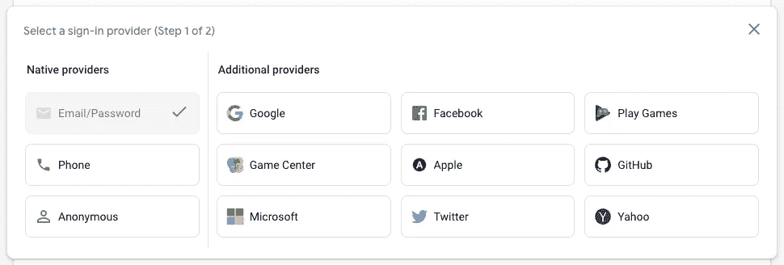

# 燃烧基——颤动💙💛

> 原文：<https://medium.com/google-developer-experts/firebase-70fd12309fd1?source=collection_archive---------4----------------------->

Firebase 是使用最广泛的 Flutter 后端之一。它是由 Google 开发的，提供了很多功能。让我们看看 Firebase 中有哪些功能可以与我们的 Flutter 应用程序集成！

Firebase 是谷歌开发的一个平台，提供各种服务，我们可以将这些服务与我们的应用程序集成在一起。以下是 Firebase 提供的一些功能:

*   证明
*   Firestore 数据库
*   实时数据库
*   储存；储备
*   主办；主持
*   功能
*   机器学习
*   碰撞分析
*   还有更多…

所以，让我们来看看所有的功能是用来做什么的！

## 证明

Firebase 为我们提供了在应用程序中添加身份验证的能力。您可以转到 Firebase 控制台，查看可以添加到应用程序中的身份验证提供程序列表。

要获得代码参考，请点击查看[！](https://firebase.flutter.dev/docs/auth/overview)

## Firestore 数据库

Firestore 是 Firebase 提供的数据库服务之一。Firestore 是一个 NoSQL 文档数据库，旨在实现自动缩放、高性能和易于应用程序开发。Firestore 数据库有两个主要组成部分:

*   **文档:**文档可以被认为是我们在 SQL 中拥有的表格。它是以键值形式存储值的记录单元。
*   集合:集合可以被认为是文档的容器。换句话说，集合可以被认为是 SQL 中的数据库，文档可以被认为是数据库中的表。

关于 Firestore 数据库的完整细节和代码示例可以在[这里](https://firebase.flutter.dev/docs/firestore/overview)找到！

## **实时数据库**

实时数据库是 Firebase 提供的另一项数据库服务。Firestore 和实时数据库的主要区别在于，这里的数据是以 JSON 格式存储的。如果不需要高级查询、排序和事务，推荐使用实时数据库。如果您需要与数据进行复杂的交互，例如在电子商务应用程序中，建议使用 Cloud Firestore。

关于实时数据库的完整细节和代码示例可以在[这里](https://firebase.flutter.dev/docs/database/overview/)找到！

## 储存；储备

顾名思义，存储提供了在 Firebase 服务器上存储图像、文件或视频并轻松管理的能力。最好的用例是将用户的个人资料图片存储在存储器中。当您在 Firebase 存储中上传任何文件时，都会生成一个唯一的链接来访问该文件。

关于 Firebase 存储的完整细节和代码示例可以在[这里](https://firebase.flutter.dev/docs/storage/overview)找到！

## 云函数

云函数允许你随时运行任何一段后端代码。它可以通过特定事件触发。例如，当用户更新他/她的用户名时，您希望更新所有集合中特定用户的用户名。您的云功能存储在 Google Cloud 中，无需管理或扩展任何服务器。

关于云函数的完整细节和代码示例可以在[这里](https://firebase.flutter.dev/docs/functions/overview)找到！

## 云消息传递

云消息或 Firebase 云消息(FCM)可以被认为是继数据库服务之后使用最广泛的 Firebase 功能之一。使用 FCM，您可以向您的应用程序发送通知。每个用户都有一个唯一的 FCM 令牌，它会随着时间的推移而更新。您可以通过通知发送高达 4 KB 的有效负载。例如，您可以在用户添加新帖子或有人对您的帖子发表评论时发送通知！

关于云消息或 FCM 的完整细节和代码示例可以在[这里](https://firebase.flutter.dev/docs/messaging/overview)找到！

## 碰撞分析

顾名思义，Crashlytics 可以帮助我们向 Firebase 控制台发送崩溃报告。Crashlytics 可以帮助您从您的生产级发布的应用程序中获取日志，以便当用户抱怨某个东西不工作或使应用程序崩溃时，您可以从 Crashlytics 中获取信息。不仅仅是日志，它还提供了其他信息，比如崩溃发生在哪个操作系统和版本上，有多少用户面临这个崩溃，等等！

关于 Firebase Crashlytics 的完整细节和代码示例可以在[这里](https://firebase.flutter.dev/docs/crashlytics/overview)找到！

## 动态链接

动态链接允许我们将用户从一个链接带到你的应用程序上的特定内容。例如，如果你正在制作一个社交媒体应用程序，用户可以通过社交媒体等将特定的帖子分享给其他用户。当另一个用户点击那个链接时，你可以决定怎么做。如果用户安装了应用程序，您可以直接向他们显示特定的帖子。如果用户没有安装应用程序，您也可以导航用户到 Play Store 或 App Store！

关于动态链接的完整细节和代码示例可以在[这里](https://firebase.flutter.dev/docs/dynamic-links/overview)找到！

## Firebase 分析

Firebase Analytics 或 Google Analytics for Firebase 允许您将分析服务添加到您的应用程序中。在此功能中，您可以随时添加事件。默认情况下，Firebase 提供了一些分析，比如一个页面被打开了多少次，活跃用户的数量等等。但是，您也可以添加自定义事件，例如，用户点击登录按钮，用户使用应用程序的时间等。

关于 Firebase Analytics 的完整细节和代码示例可以在[这里](https://firebase.flutter.dev/docs/analytics/overview/)找到！

## 远程配置

远程配置允许您更改应用程序的外观，而无需用户更新应用程序。它适用于键值对。让我们假设您已经准备好了聊天功能，但是您还不想让用户查看它。因此，您可以创建一个键值对 isChatVisible，并将其设置为 false。现在，您可以在您的应用程序中获取这些信息，并决定是否显示聊天功能。现在，无论何时你想显示它，只要把值改成 true 就行了！

关于远程配置的完整细节和代码示例可以在[这里](https://firebase.flutter.dev/docs/remote-config/overview)找到！

## 结论

因此，在本文中，我们介绍了 Firebase 提供的主要服务。还有一些，但这些是被广泛使用的！Firebase 可能是您后端的最佳选择之一，因为它的免费性达到了一定的限度，这可能会让您的工作完成！

## 希望你喜欢这篇文章！

如果你喜欢，你可以 [**给我买杯咖啡**](https://www.buymeacoffee.com/abhishekdoshi26) **！**

# 不要忘记通过以下方式与我联系:

*   [**Instagram**](https://www.instagram.com/abhishekdoshi26/)
*   [**推特**](https://twitter.com/AbhishekDoshi26)
*   [**领英**](https://www.linkedin.com/in/AbhishekDoshi26)
*   [**GitHub**](https://github.com/AbhishekDoshi26)

> 不要停止，直到你呼吸！💙
> ——阿布舍克·多希