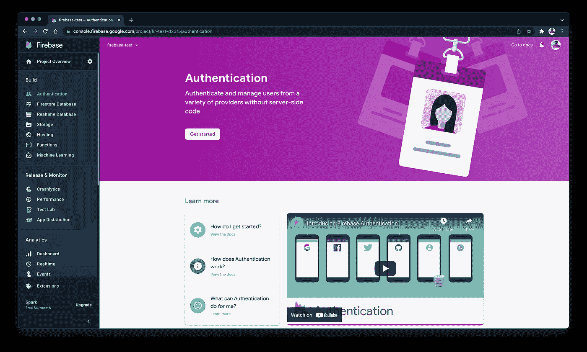
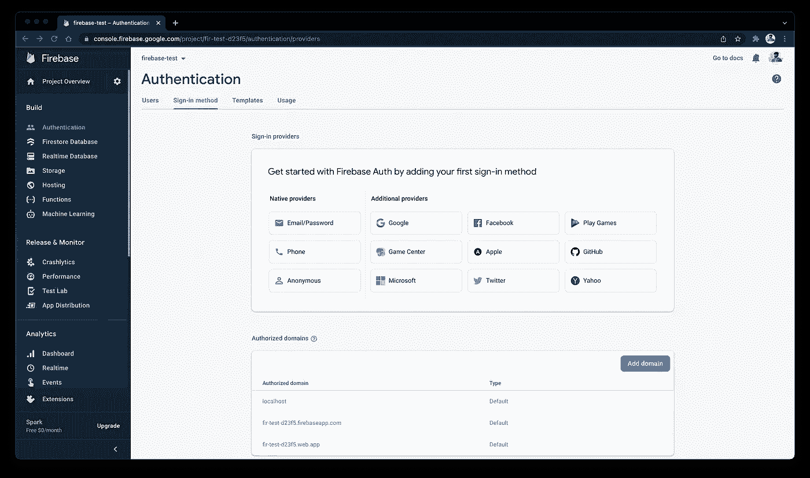
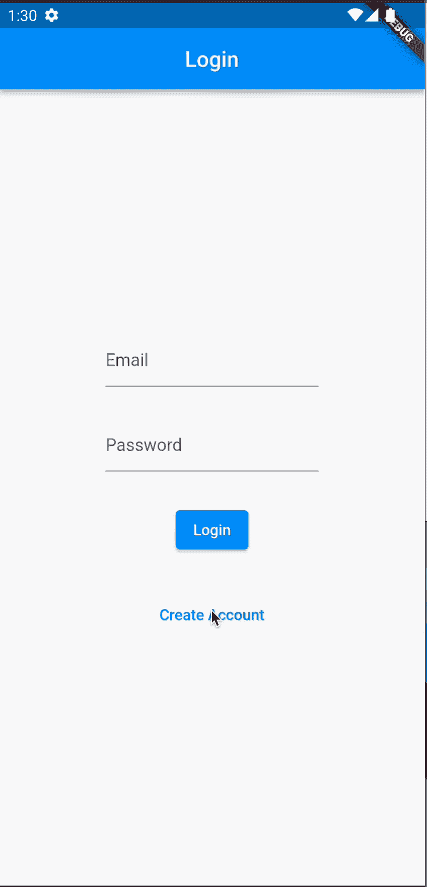
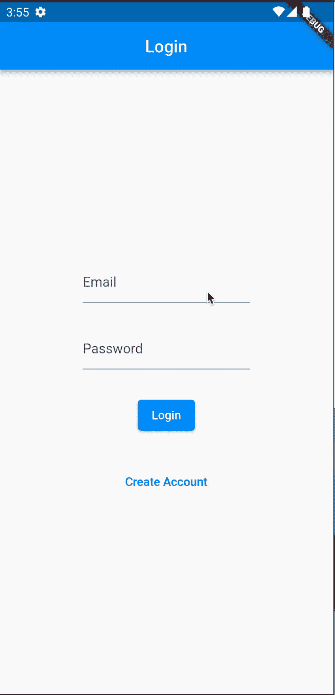

# Firebase 身份验证— Flutter💙💛

> 原文：<https://medium.com/google-developer-experts/firebase-authentication-flutter-80e8f00338ac?source=collection_archive---------1----------------------->

身份验证是几乎所有应用程序现在都需要的基本功能之一。但是，我们怎样才能实现它呢？让我们来看看这篇文章吧！


向你的应用添加认证可以通过你的后端完成。现在，如果您有一个定制的后端，这就变得很容易了，因为您只需要传递凭证，后端就会完成逻辑部分。但是，如果您没有定制的后端呢？**您可以使用 Firebase 轻松添加身份验证！**

下面是总结该过程的步骤:

*   在 Firebase 中添加一个新项目和应用程序。
*   从控制台启用您想要的任何身份验证。在本文中，我们将讨论简单的电子邮件密码认证。
*   为注册和登录创建一个简单的用户界面。
*   创建后端代码，将凭证传递给 Firebase。
*   从用户界面调用函数。
*   根据凭据是否正确来验证响应。

所以，让我们开始吧！！！

## 步骤 1:在 Firebase 中添加一个新项目和应用程序。

转到 [Firebase 控制台](https://console.firebase.google.com/)并创建一个新项目。我们不会讨论向 Firebase 添加新项目的步骤，但是为了方便起见，这里有一个参考。

## 步骤 2:启用身份验证。

首先，在您的控制台上，转到您创建的项目。现在，从右侧面板转到`Authentication`选项卡，您将能够看到一个`Get Started`按钮。



现在，单击按钮，然后您将看到一个身份验证提供者列表，我们可以在我们的应用程序中使用它。



现在，点击`Email/Password`并启用它。启用后，除了电子邮件/密码提供者，您还会看到`Enabled`。

您已经准备好进行下一步了！！

## 步骤 3:为注册和登录创建一个简单的 UI

您可以简单地创建 2 个屏幕，一个用于登录，另一个用于注册，其中将有 2 个字段-电子邮件，密码；和一个提交按钮。

这里有一个同样的例子:

**login.dart:**

**create_account.dart:**

所以，这两个屏幕只是简单的两个文本字段和几个按钮。我们还没有添加任何逻辑。现在，让我们添加逻辑吧！

## 步骤 4:创建后端代码，将凭证传递给 Firebase

首先，你需要在你的`pubspec.yaml`文件中添加`firebase_core`和`firebase_auth`包。现在，您需要在`main.dart`中的主函数中初始化 firebase 应用程序。

```
void main() async {
  WidgetsFlutterBinding.ensureInitialized();
  await Firebase.initializeApp();
  runApp(const MyApp());
}
```

现在，让我们创建一个文件来保存所有与身份验证相关的函数和 firebase 调用。我们可以将其命名为`auth_service.dart`。现在添加登录和注册功能。

因此，在登录方法中，我们从用户那里获取电子邮件和密码，并将它们发送到我们添加的`firebase_auth`包中的`signInWithEmailAndPassword`函数。同样，对于注册，我们有`createUserWithEmailAndPassword`，它将创建一个提供电子邮件和密码的用户。此外，我们在代码中处理了 firebase 的一些常见错误。现在，让我们从我们的 UI 调用这些函数！

## 步骤 5:从用户界面调用函数

现在是时候从 UI 调用我们的函数了！

**create_account.dart**

所以，如果我们只检查`ElevatedButton`的`onPressed`:

```
onPressed: () async {
                final message = await AuthService().registration(
                  email: _emailController.text,
                  password: _passwordController.text,
                );
                if (message!.contains('Success')) {
                  Navigator.of(context).pushReplacement(
                      MaterialPageRoute(builder: (context) => const Home()));
                }
                ScaffoldMessenger.of(context).showSnackBar(
                  SnackBar(
                    content: Text(message),
                  ),
                );
              },
```

这里，我们调用了我们创建的`registration`方法。现在，根据我们展示的小吃店的信息。如果帐户创建成功，我们将导航到主页。在这里，主页只是一个简单的类，没有任何特定的 UI 或逻辑！

**输出:**



**login.dart**

**输出:**



## 你可以试试来自 [GitHub 库](https://github.com/AbhishekDoshi26/firebase_test)的例子！

## 希望你喜欢这篇文章！

如果你喜欢，你可以 [**请我喝杯咖啡**](https://www.buymeacoffee.com/abhishekdoshi26) **！**


# 不要忘记通过以下方式与我联系:

*   [**Instagram**](https://www.instagram.com/abhishekdoshi26/)
*   [**推特**](https://twitter.com/AbhishekDoshi26)
*   [**领英**](https://www.linkedin.com/in/AbhishekDoshi26)
*   [GitHub](https://github.com/AbhishekDoshi26)

> 不要停止，直到你呼吸！💙
> -阿布舍克·多希