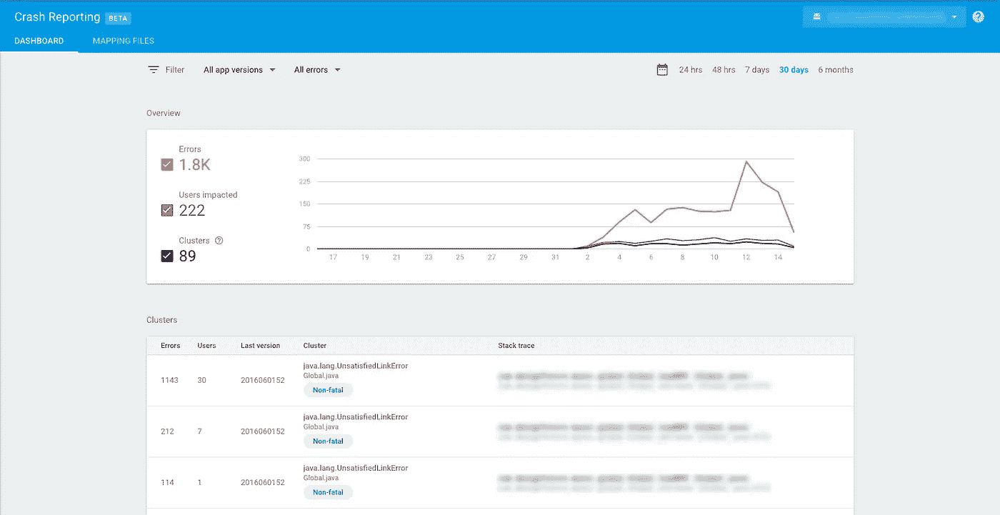
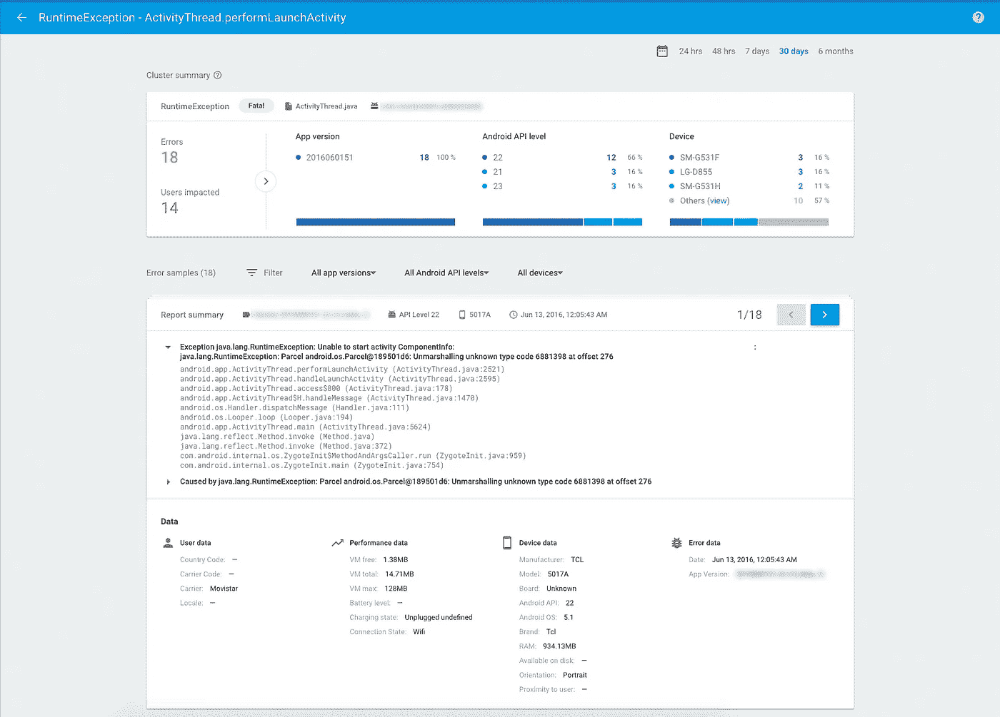

# Firebase 崩溃报告与崩溃分析

> 原文：<https://medium.com/google-developer-experts/firebase-crash-reporting-vs-crashlytics-a6c287c4b792?source=collection_archive---------0----------------------->

## 让摊牌开始

谷歌的最新平台 Firebase 提供了一套全面的工具和服务，帮助启动新应用的开发，并加速现有应用的增长。

作为开发人员，一个特别吸引我们兴趣的工具是 **Firebase 崩溃报告**。崩溃分析是我们日常任务的核心部分，旨在通过查看堆栈跟踪以及其上下文来解决用户在使用我们的应用程序时遇到的问题，修复棘手的错误和令人讨厌的情况。出于这个原因，选择的崩溃报告工具必须提供一组特定的功能，以便我们做好工作，并且应该尽可能简单和直接(因为让我们面对它，开发人员是对 UX 抱怨最多的人，这是有道理的)。

**Fabric's Crashlytics** 多年来一直是首选解决方案，到了不用动脑筋就能想到的地步。但自从 Firebase 崩溃报告公布后，许多开发人员开始怀疑事情是否发生了变化，他们是否应该转向谷歌的全方位解决方案。

这正是这篇文章要讲的，灵感来自于我在 StackOverflow 上的提问/回答。我们将从技术和可用性的角度强调这两个工具之间的区别。我们专注于 Android，因为它是我工作的平台，但许多考虑也适用于 iOS。

> **免责声明** : Firebase 崩溃报告目前标记为 *beta* 。这意味着我们所看到的很可能在接下来的几周内发生变化。在考虑哪种工具最适合您时，请记住这一点！

## 用户界面和用户体验

让我们从“哦，不太好”开始，因为这可能是 Firebase 崩溃报告的痛点(从现在开始，简称为 Firebase)。虽然用户界面*看起来不错*，但它非常基础，而且缺乏在线工具的基本功能。

Firebase Crash Reporting — Dashboard

例如，它永远不会记得你想在每页上看到多少个项目:选择每页 50 个项目，点击一个崩溃来查看更多信息，返回，你回到每页 20 个项目。 *Argh，好烦！*另一方面，Crashlytics 提供无限滚动，所以不存在这个问题。跨页面的过滤器持久性的缺乏扩展到每个方面:应用程序版本、错误类型等等。

Firebase 可以从其竞争对手那里借鉴的另一项重大改进是将崩溃标记为“已解决”的能力:这非常有帮助，因为您一眼就可以看到该特定版本还有什么需要解决。

## 火垒:有什么好喜欢的

让我们在这里进入主题。您可能希望看到利与弊的列表，一些快速而直接的帮助您决定哪种工具更适合您的东西。这是 Firebase 优于 Crashlytics 的列表。

*   普通崩溃和本地崩溃都显示在 Firebase 中
*   自动与 Firebase Analytics 集成，支持将经历过崩溃的用户分组为受众
*   非常简单的设置(只包括 Gradle 模块，可能是 *google-services.json* 文件)，加上没有单独的初始化
*   其他 Firebase 产品的一体化控制台(如果您打算使用它们的话)
*   [更少的方法](http://www.methodscount.com/?lib=com.google.firebase%3Afirebase-crash%3A%2B)(尽管它包括分析，使用标准方法允许 ProGuard 剥离几乎所有东西，所以这要归功于谷歌)
*   可以关闭基于每个用户的收集分析

如你所见，有很多值得喜欢的。首先也是最重要的是，**与 Firebase Analytics** 的无缝集成允许您创建一个用户“受众”，这些用户在使用您的应用程序时遇到了问题:然后您可以采取行动，让他们知道您已经意识到这些问题(例如，发送推送通知，使用 Firebase 通知！).

此外，您不再需要手动捕获和记录本机崩溃，或者在 Google Play 开发人员控制台中查看它们:所有内容都在一个地方，并自动收集。

## Firebase:缺少什么，可以改进什么

该服务仍处于测试阶段，因此目前正在添加/考虑许多功能([参见此处](https://firebase.google.com/docs/crash/android#known-issues)了解已知问题列表)。然而，如果你现在需要做一个决定，这里有一个我认为使用 Firebase 而不是 Crashlytics 的缺点列表。

*   需要设备上的 Google Play 服务(大需求)
*   搜索崩溃不可用
*   无法将崩溃标记为已解决
*   ProGuard/DexGuard 映射文件必须手动上传(Google 正在处理)
*   崩溃发生后，会话中不可能有侦听器

第一点是主要的一点。**如果设备中缺少 Google Play 服务，Firebase 将无法工作**，在这种情况下，您可以向您心爱的崩溃报告(以及 Firebase 套件中的其他所有内容)说再见。取决于你的应用的市场位置(中国，有人吗？)，这可能是一笔巨大的交易。

另一个经常被忽视，但真正向用户表明你关心他们对你的应用的体验的功能是注册一个回调的能力，这个回调是在崩溃后用户第一次打开你的应用时触发的。例如，你可以显示一个漂亮的对话框，让用户发送一个反馈，告诉用户是什么样的行为导致了崩溃。

# 结果

这里没有“最好”的服务，那里只有更适合你需求的服务**。Firebase，作为测试版，已经完成了伟大的任务，非常强大。有一个像 Crashlytics 这样的竞争对手，它曾经是同类产品中最好的，只会帮助 Firebase 发展得更快，变得更精致。**

**不幸的是，由于崩溃报告工具的工作性质，你很可能无法同时添加这两个工具，并查看哪一个性能更好或哪一个更适合你的应用程序(如果你很好奇，请参见[UncaughtExceptionHandler](https://developer.android.com/reference/java/lang/Thread.UncaughtExceptionHandler.html)—**EDIT**:显然，这两个工具在不阻塞异常方面表现正确，所以你很可能同时使用它们，并查看哪一个对你来说性能更好)。希望这篇文章能在你必须做出决定时给你一些帮助，无论你是重新开始还是考虑改变。**