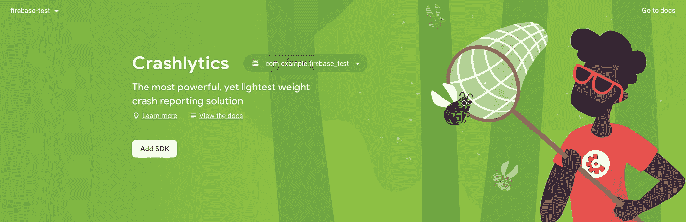

# Firebase Crashlytics —颤振💙💛

> 原文：<https://medium.com/google-developer-experts/firebase-crashlytics-flutter-2b313ed758b6?source=collection_archive---------3----------------------->

## 谁会用有崩溃的 app？你如何知道你的用户面临的崩溃？集成一个崩溃报告工具总是好的！


即使我们努力让我们的应用程序不崩溃，也没有人知道你的应用程序什么时候会崩溃🤯

> 没有什么比完美、无崩溃的代码更好的了！

因此，为了避免我们因为跟踪错误和崩溃而大伤脑筋，将任何崩溃报告工具与您的应用程序集成在一起总是一个好主意。

Firebase Crashlytics 就是 Firebase 提供的一个这样的工具。它的集成很简单，报告的崩溃与我们在调试应用程序时看到的一样，使我们更容易跟踪和解决它们！

## 步骤 1:启用碰撞分析

转到 [Firebase 控制台](https://console.firebase.google.com/)，在左侧面板`Release & Monitor`下，转到`Crashlytics`并点击`Add SDK`按钮。



## 步骤 2:将 Crashlytics SDK 添加到您的项目中

将`firebase_crashlytics`添加到您的`pubspec.yaml`文件中，然后运行`flutter pub get`。下一步是运行`flutterfire configure`,这样你的 Flutter 应用程序的 Firebase 配置就是最新的，对于 Android，它会将所需的 Crashlytics Gradle 插件添加到你的应用程序中。

## 步骤 3:添加崩溃日志记录代码

所以，我们不知道坠机会在何时何地发生。我们需要找到一种方法来捕捉所有未处理的异常！Flutter SDK 为我们提供了一个很好的方法，那就是🥳

通过用`FirebaseCrashlytics.instance.recordFlutterFatalError`覆盖`FlutterError.onError`，可以自动捕捉所有在 Flutter 框架中抛出的错误:

```
void main() async {
  runZonedGuarded<Future<void>>(() async {
    WidgetsFlutterBinding.ensureInitialized();
    await Firebase.initializeApp();

    FlutterError.onError =
       FirebaseCrashlytics.instance.recordFlutterFatalError;

    runApp(MyApp());
  }, (error, stack) =>
    FirebaseCrashlytics.instance.recordError(error, stack, fatal: true));
}
```

现在，这就是我们需要记录的所有崩溃或异常，它们可能会让您绞尽脑汁去解决😉

# 希望你喜欢这篇文章！

疑惑？随意留言 [@AbhishekDoshi26](https://linktr.ee/abhishekdoshi26)

[](https://www.buymeacoffee.com/abhishekdoshi26)

> 不要停止，直到你呼吸！💙
> -阿布舍克·多希