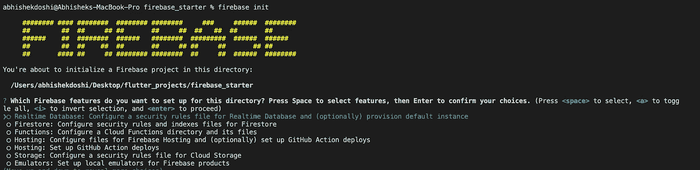
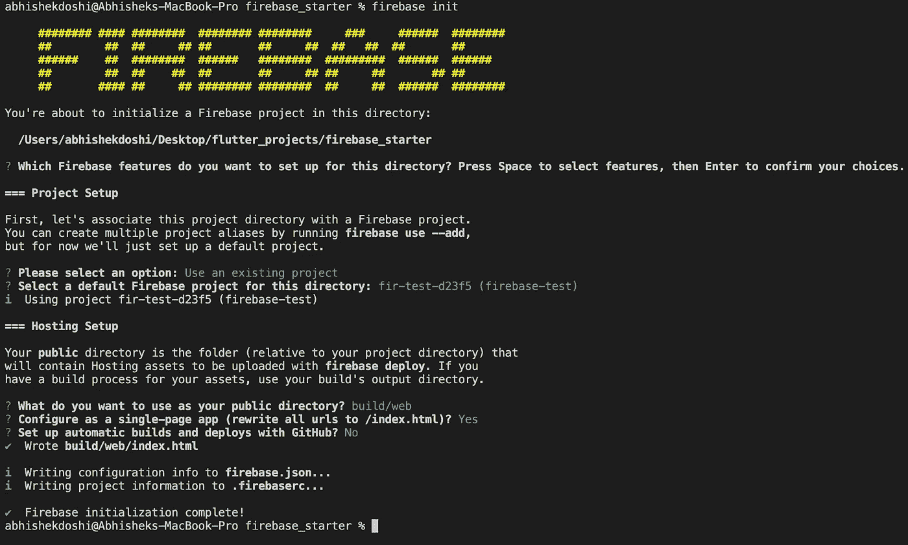
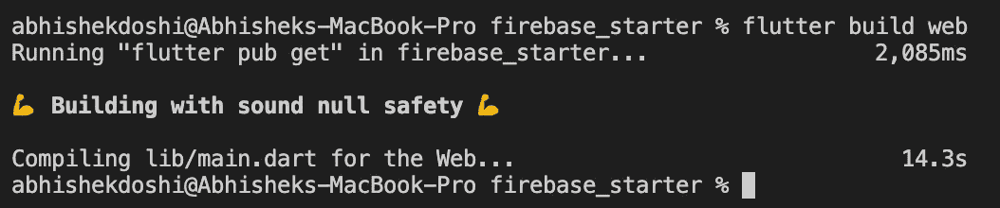
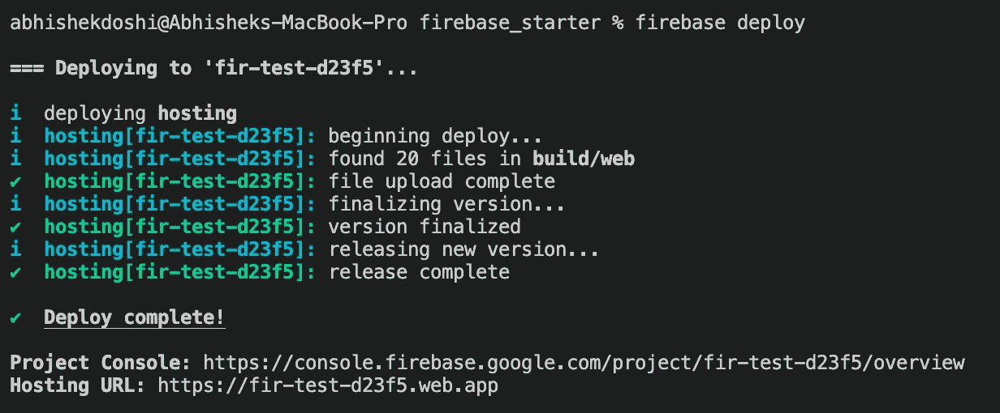

# Firebase 托管— Flutter💛💙

> 原文：<https://medium.com/google-developer-experts/firebase-hosting-37f209bd9e1b?source=collection_archive---------4----------------------->

## 嗯，使用 Flutter 创建 web 应用程序总是很有趣。但是，如果不托管你的 web 应用程序，你将如何向他人展示它呢？让我们来看看如何使用 Firebase 托管🥳来托管您的 flutter web 应用程序


Firebase 是最方便的 Flutter 后端工具之一。由于提供的服务和易于集成，Flutter + Firebase 实际上是一个奇妙的组合。请随意查看我关于 Firebase 的其他文章，了解它的其他特性。

Firebase Hosting 允许我们托管我们的 web 应用程序，不仅仅是 Flutter Web 应用程序，而是您以非常容易、简单和完全免费的方式创建的任何网站！使用 Firebase 托管的优势:

*   **快速交付 web 内容**
    借助 Firebase Hosting，您可以轻松部署单页 web 应用程序、移动应用程序登录页面或渐进式 web 应用程序。
*   **SSD 支持的托管，遍布全球** 无论用户身在何处，内容都能快速传送。部署到 Firebase 主机的文件缓存在世界各地 CDN 边缘服务器的固态硬盘上。
*   **自定义域的免费 SSL 证书** Firebase Hosting 自动为每个部署的站点提供和配置 SSL 证书。通过无痛验证连接自定义域。
*   **用一个命令部署** 把你的应用从本地目录部署到 web 只需要一个命令。查看部署历史记录，并从 Firebase 控制台回滚到以前的版本。
*   **上线前预览变化** 频道让你预览你站点的更新。允许团队成员轻松地查看进度并给出反馈、进行代码审查和测试。

现在，让我们看看如何使用 Firebase 托管您的 Flutter Web 应用程序！


Image from Firebase Console

## 步骤 0:创建一个 Firebase 项目

先决条件是通过进入 [Firebase 控制台](https://console.firebase.google.com/)并在其中注册您的应用程序来创建一个 Firebase 项目。在本文中，我们假设您已经这样做了😉

## 步骤 1:安装 firebase-tools CLI

可以使用`npm`安装 firebase-tools CLI。因此，在继续之前，如果您还没有安装 npm，您必须将其安装到您的系统中。您可以通过参考以下内容来安装 npm:

*   [在 Windows 上安装 NPM](https://www.guru99.com/download-install-node-js.html)。
*   在 Linux 上安装 NPM。
*   [在 Mac 上安装 NPM](https://treehouse.github.io/installation-guides/mac/node-mac.html)。

或者直接从 [node.js](https://nodejs.org/en/) 网站下载！

完成后，您可以运行以下命令来安装`firebase-tools CLI`

```
npm install -g firebase-tools
```

## 步骤 2:初始化您的项目

下一步是初始化您的项目。为此，您必须从终端登录 firebase:

```
firebase login
```

一旦登录，你必须初始化你的项目！

```
firebase init
```

当您运行以上命令时，您将得到如下输出:



现在，使用箭头键到达`Hosting`，然后在到达`Hosting: Configure files for Firebase Hosting and (optionally) set up GitHub Action deploys`时点击空格键，最后，点击 enter！

之后，它会要求选择一个项目。请随意选择合适的选项。

一旦创建/选择了项目，CLI 将询问，`What do you want to use as your public directory?`在这里，您可以添加`build/web`，因为这是我们的 flutter web 应用构建可用的位置。

接下来，CLI 要求`Configure as a single-page app (rewrite all urls to /index.html)?`随意输入`y`！

接下来，CLI 询问`Set up automatic builds and deploys with GitHub? (y/N)`，请随意选择您合适的答案。

仅此而已。firebase 主机初始化完成



## 步骤 3:构建你的 Flutter Web 应用程序

下一步是构建您的 Flutter Web 应用程序。您只需运行`flutter build web`，web 应用程序将被构建并存储在`build/web`文件夹中！



## 步骤 4:部署您的 web 应用程序

要部署我们在步骤 3 中创建的 web 应用程序，您只需运行`firebase deploy`！



仅此而已。您已经将您的 web 应用程序部署到 firebase hosting now 🥳

# 希望你喜欢这篇文章！

疑惑？随意留言 [@AbhishekDoshi26](https://linktr.ee/abhishekdoshi26)

[](https://www.buymeacoffee.com/abhishekdoshi26)

> 不要停止，直到你呼吸！💙
> -阿布舍克·多希