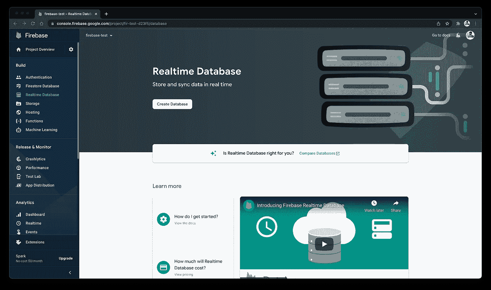

# Firebase 实时数据库——颤振💙💛

> 原文：<https://medium.com/google-developer-experts/firebase-realtime-database-c627631f877e?source=collection_archive---------0----------------------->

在我们的应用程序中，我们总是需要使用数据库。有许多提供数据库使用的服务提供商。Firebase 就是其中之一，它为我们提供实时数据库。


Firebase 实时数据库是**，一个云托管的 NoSQL 数据库，让你以 JSON 格式在你的用户之间实时存储和同步数据**。

从实时数据库开始，我们有以下步骤:

*   从 Firebase 控制台启用实时数据库
*   编写后端代码来处理实时数据库的读写
*   从用户界面调用函数来读写数据。

所以，让我们开始吧！

## 步骤 1:从 Firebase 控制台启用实时数据库

进入你的 [Firebase 控制台](https://console.firebase.google.com/)，从右边面板进入实时数据库。您将看到一个欢迎屏幕，上面有一个`Create Database`按钮。



单击该按钮后，您将看到一个弹出窗口，可以选择区域以及是否要在测试或锁定模式下创建数据库。您可以根据自己的需求进行选择。

创建数据库后，您将进入数据库页面。

我们实际上是在继续我们在 [Firebase 认证](https://abhishekdoshi26.medium.com/firebase-authentication-flutter-80e8f00338ac)和 [Firebase Firestore](/google-developer-experts/firestore-database-flutter-38c9a0cc77c7) 文章中创建的应用程序。请随意查看，这是一个简单的登录/注册应用程序，我们需要一些用户信息。所以………是时候采取行动了！

## 步骤 2:后端代码

所以下一步是创建我们的英雄后端文件，它将处理实时数据库的读写。在开始使用实时数据库之前，我们必须创建一个方法来获取 auth 包中的当前 user-id。

```
String getCurrentUserId() {
    return _firebaseAuth.currentUser?.uid ?? '';
  }
```

在我们开始后端代码之前，让我们看看数据库是如何存储数据的。众所周知，Firestore 数据库以集合文档格式存储数据，实时数据库稍有不同。它以 [JSON 格式](https://en.wikipedia.org/wiki/JSON)存储数据，这使得我们在处理大量数据时变得非常容易，因为 JSON 是处理大量数据的最佳格式。因此，当我们想从我们的应用程序发送数据时，我们必须在数据结构`Map`中发送，用`String`作为键的数据类型，并且`value`的数据类型可以是动态的。这就是我们必须使用 userID 而不是 email 作为密钥的原因，因为 email 会包含特殊字符，而我们在世界上任何地方都没有见过特殊字符或 email 作为 JSON 的密钥🤯！

因此，让我们为实时数据库创建一个单独的包，或者简单地创建一个文件来存储代码(然而，根据您的方便程度，包方法有利于使您的应用程序可伸缩)。您必须在您的`pubspec.yaml`文件中添加`[firebase_database](https://pub.dev/packages/firebase_database)`包。

在上面的代码中，对于 write 方法，我们从用户(从调用该函数的父函数)获取 userId 和数据。然后，我们创建实时数据库的实例(也称为 FirebaseDatabase)。现在，如您所见，在创建实例的过程中，我们已经将`user/$userId`传递给了`ref`方法。因此，如果数据库不包含带有这个 userID 的 JSON 条目，它将创建一个，如果它已经存在，它将使用那个记录。然后我们简单地使用包中可用的`set`方法。

对于 read 方法，我们首先以同样的方式创建实例，然后使用`get`方法获取所提供用户的记录。现在，如果数据存在，我们用快照值创建一个映射(因为数据可以作为对象使用)，然后这里我们只返回用户名。

## 步骤 3:从 UI 调用函数

一旦数据库代码准备好了，就可以从我们的 UI 中使用这些函数了。所以我们的计划是在创建新帐户时调用`write`函数，在用户登录时调用`read`函数。简单！

因此，在创建帐户时，我们使用以下代码片段:

```
RealtimeDatabase.write(
        userId: _authService.getCurrentUserId(),
        data: {
          'name': event.name,
          'email': event.email,
        },
      );
```

正如我们之前使用 bloc 一样，我们只是从 event 类中获取名称和事件，并从我们在`authService`中创建的函数中获取 userId。

现在，为了读取数据，我们调用 read 函数:

```
final _name =
          await RealtimeDatabase.read(userId: _authService.getCurrentUserId());
```

这里我们只是传递来自`authService`的用户标识

## 让我们看看它在数据库中的样子


在这里你可以看到，我们在树的根部有`users`,在里面，我们有一个带有用户 id 的用户，每个用户 id 有两个字段，电子邮件和姓名。

在本文中，我们看到了如何读写实时数据库中的数据。然而，我们可以使用许多其他方法来处理数据。请随意用官方文件[检查它们。](https://firebase.google.com/docs/database/flutter/read-and-write)

简单不是吗？我希望你从这篇文章中学到了一些新的东西！

## 希望你喜欢这篇文章！

你可以通过克隆 GitHub 库来尝试一下！

疑惑？随时留言 [@AbhishekDoshi26](https://linktr.ee/abhishekdoshi26)

[](https://www.buymeacoffee.com/abhishekdoshi26)

> *不要停止，直到你呼吸！💙
> - Abhishek Doshi*