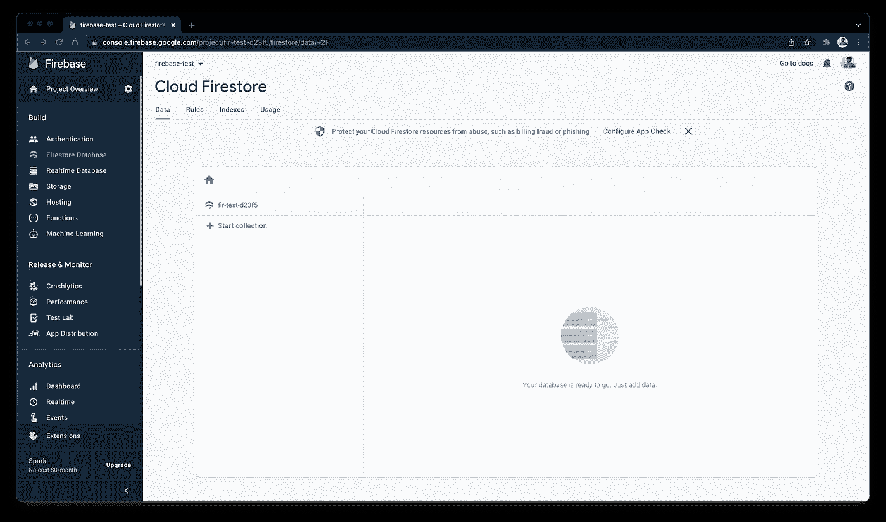

# Firestore 数据库— Flutter💙💛

> 原文：<https://medium.com/google-developer-experts/firestore-database-flutter-38c9a0cc77c7?source=collection_archive---------2----------------------->

我们不能将所有数据都存储在本地应用程序中。我们总是需要一种在线存储数据并根据用户需求获取数据的方式。Firestore 数据库可能是最适合您的应用程序的非 SQL 数据库之一💛

将数据存储到在线数据库中，并根据用户请求获取数据是该应用程序最常见的功能之一。您要么需要编写自己的后端，要么可以使用最流行的 Firebase 服务——Firestore 数据库！

要将 Firestore 集成到您的应用程序中，需要遵循几个步骤:

*   从控制台启用 Firestore 数据库。
*   编写代码以添加数据并从 Firestore 数据库获取数据。
*   编写代码以在 UI 上显示获取的数据。

所以，让我们开始吧！

## 步骤 1:从控制台启用 Firestore 数据库

进入 [Firebase 控制台](https://console.firebase.google.com/)，在左侧面板点击 Firestore 数据库。您将看到 Firestore 数据库的欢迎屏幕，其中有一个名为`Create Database`的按钮。你可以点击那个按钮开始。您将获得一个弹出窗口，以生产模式或测试模式启动，您可以根据自己的要求选择任何模式。

创建数据库后，您将看到如下屏幕:

Firestore 数据库有两个主要组成部分:

*   **文档:**文档可以被认为是我们在 SQL 中拥有的表。它是以键值形式存储值的记录单元。
*   集合:集合可以被认为是文档的容器。换句话说，集合可以被认为是 SQL 中的数据库，文档可以被认为是数据库中的表。

**第二步:写代码添加数据，从 Firestore 数据库取数据。**

现在，我们将在数据库中存储基本的用户信息。您可以阅读关于 Firebase 身份验证的文章，其中我们设计了登录和注册页面。在本例中，我们将重新设计注册页面，以便在注册时获取用户的姓名和年龄。让我们首先编写后端代码，向 firestore 添加数据并从中获取数据。

首先，将`[cloud_firestore](https://pub.dev/packages/cloud_firestore)`包添加到您的 pubspec.yaml 文件中。现在，创建一个名为`database_service.dart`的新文件，它将包含我们从 Firestore 数据库添加和获取数据的逻辑。

以下是如何使用 Firestore 读写数据的方法。

所以，在方法`addUser`中，我们首先创建了我们想要的集合实例。如果该集合不存在，Firebase 将创建一个。现在，如果您想要将文档 id 作为自定义名称(这里是用户电子邮件 id)，我们使用`users.doc(email).set`。如果您想要一个唯一的随机自动生成的 id，您可以直接使用`users.add`，它将为您生成一个具有唯一 id 的文档。

在`getUser`方法中，我们首先创建用户集合的实例，然后从集合中获取文档。一旦我们得到了文档，我们就获取文档中的数据，并以`Map<String,dynamic>`的形式存储它，这样我们以后就可以以键-值对的形式访问字段。

**第三步:编写代码在 UI 上显示获取的数据**

现在，首先，我们需要在注册页面上再添加 2 个文本字段，并添加一个对`addUsers`方法的调用。因此，您的创建帐户页面代码可以如下所示:

这里，首先，我们调用 auth_service 的注册方法，如果成功，我们调用 database_service 的 addUsers 方法。如果这也是成功的，我们导航到主页。

现在，让我们在主页上显示名称。因此，您的主页应该如下所示:

这里，我们添加了一个名为 getData()的新函数，它只是通过调用 DatabaseService 的`getUser`方法来获取名称。我们还在`Home`的构造函数中添加了电子邮件，这样我们就可以通过登录和创建帐户屏幕来传递它。

输出:

## 你可以试试来自 [GitHub 仓库](https://github.com/AbhishekDoshi26/firebase_test/tree/firestore_database)的例子！

## 希望你喜欢这篇文章！

如果你喜欢，你可以 [**请我喝杯咖啡**](https://www.buymeacoffee.com/abhishekdoshi26) **！**

# 不要忘记通过以下方式与我联系:

*   [**Instagram**](https://www.instagram.com/abhishekdoshi26/)
*   [**推特**](https://twitter.com/AbhishekDoshi26)
*   [**领英**](https://www.linkedin.com/in/AbhishekDoshi26)
*   [GitHub](https://github.com/AbhishekDoshi26)

> 不要停止，直到你在呼吸！💙
> -阿布舍克·多希