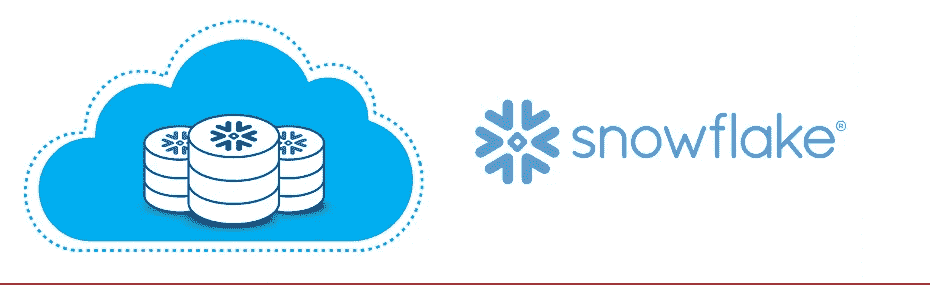
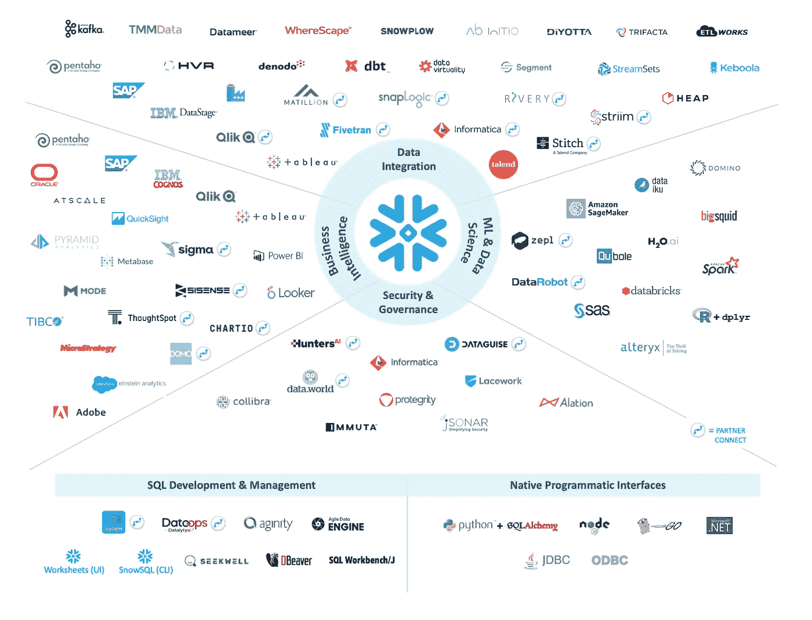

# 关于雪花的最初概念

> 原文：<https://medium.com/globant/first-concepts-about-snowflake-8da11fd5580c?source=collection_archive---------1----------------------->

> 本文的最初目的是简要解释与数据市场中用于管理不同类型数据的新工具相关的一些概念。
> 同样值得注意的是，这篇文章对 Snowpro 认证的准备很有帮助，因为它包含了关键词和概念。

# 什么是雪花？

[雪花](https://www.snowflake.com/?lang=es)是分析型[数据仓库](https://en.wikipedia.org/wiki/Data_warehouse)被认为是 [SaaS](https://en.wikipedia.org/wiki/Software_as_a_service) 提供了一些优势:

*   用户不需要管理硬件/软件来进行持续维护。
*   它只能在公共云基础架构上工作和运行。
*   使用一些虚拟计算实例在所有数据存储上执行持久性任务。

# 告诉我关于建筑的事…

雪花架构的结构介于传统的共享磁盘和非共享数据库架构之间。

在其他细节中，作为基础结构，它由三层键组成:

*   [数据库存储](https://docs.snowflake.com/en/user-guide/intro-key-concepts.html#database-storage)
*   [查询处理](https://docs.snowflake.com/en/user-guide/intro-key-concepts.html#query-processing)
*   [云服务](https://docs.snowflake.com/en/user-guide/intro-key-concepts.html#cloud-services)

Snowflake Architecture. Source: [https://docs.snowflake.com/en/user-guide/intro-key-concepts.html#snowflake-architecture](https://docs.snowflake.com/en/user-guide/intro-key-concepts.html#snowflake-architecture)

*共享磁盘架构*提供的特性是一个中央存储库，用于访问来自 DW 中所有计算节点的持久数据。

并且，*非共享数据库架构*是使用 [MPP](https://www.indicative.com/resource/what-is-massively-parallel-processing-mpp/) 计算集群的查询处理，即每个节点存储所有数据的一小部分。

这提高了性能，并为 it 部门提供了此类体系结构的可扩展性优势。

# 雪花提供的合作伙伴和技术有哪些？

雪花在工具中有不同的连接，用于使用为任务存储的所有数据

Snowflake Ecosystem. Source: [https://docs.snowflake.com/en/user-guide/intro-key-concepts.html#snowflake-architecture](https://docs.snowflake.com/en/user-guide/ecosystem.html)

因此:

[数据集成](https://docs.snowflake.com/en/user-guide/ecosystem-etl.html#data-integration) [:](https://docs.snowflake.com/en/user-guide/ecosystem-etl.html) 工具，允许使用市场上最好的数据进行 [ETL](https://www.snowflake.com/guides/what-etl) 流程。考虑数据仓库自动化的设计、开发和维护。

[商业智能](https://docs.snowflake.com/en/user-guide/ecosystem-bi.html#business-intelligence-bi) [:](https://docs.snowflake.com/en/user-guide/ecosystem-bi.html) 数据可视化报告插件，用于通过发现和分析数据进行决策。

[机器学习和数据科学](https://docs.snowflake.com/en/user-guide/ecosystem-analytics.html#machine-learning-data-science) [:](https://docs.snowflake.com/en/user-guide/ecosystem-analytics.html) 与以下过程相关的连接:数据挖掘、人工智能和数据科学。因此，这是创建多种类型的统计模型来分析公司当前或未来情况的方法。

[安全性、治理和可观察性](https://docs.snowflake.com/en/user-guide/ecosystem-security.html#security-governance-observability) [:](https://docs.snowflake.com/en/user-guide/ecosystem-security.html#) 与保护企业中的敏感数据相关，以提高硬件安全性，并能够分析以下操作范围:

*   风险评估，
*   入侵，
*   检测/监控/通知，
*   数据屏蔽，
*   数据编目。

同样，有不同的驱动程序连接到雪花环境。例如，SQL 开发和管理的工具，或者不同编程语言的访问，正如我们在最后一张图中看到的。

所有提到的工具都允许展示雪花在不同类型的解决方案中开发数据驱动解决方案的灵活性和适用性

有关更多详细信息，在[页面](https://docs.snowflake.com/en/user-guide/ecosystem-all.html)中可以找到与这些工具相关的更多信息。

# 概观

在本文中，我们在了解什么是数据仓库的水平上讨论了雪花的基本概念，它有一个非常独特的体系结构，允许它自己高效地工作。

我们还了解了有哪些技术和合作伙伴可以在数据级别创建完整的解决方案，而无需将 Snowflake 作为源或目标来实施。

# 后续步骤…

如果你有兴趣追求 [**雪花认证**](https://snowforce.my.salesforce.com/sfc/p/#i0000000hZh2/a/0Z0000001tR0/Oj8qDX9NcBYYywUDwySGaXVwD3zw3UH4Hy6XEzhX6aA) ，这个认证有多种学习方式。
-雪花有一所自己的*大学，里面有很多我们可以用来学习的课程。
-[Youtube 官方频道](https://www.youtube.com/c/SnowflakeInc)致力于用用例解释如何为不同解决方案(数据迁移、机器学习、治理、安全)的开发实现雪花。*

# *参考*

 *[## 关键概念和架构—雪花文档

### 雪花的数据仓库不是建立在现有的数据库或 Hadoop 等“大数据”软件平台上。的…

docs.snowflake.com](https://docs.snowflake.com/en/user-guide/intro-key-concepts.html)*  *[## 支持的云平台—雪花文档

### 雪花以软件即服务(SaaS)的形式提供，完全在云基础设施上运行。这意味着所有…

docs.snowflake.com](https://docs.snowflake.com/en/user-guide/intro-cloud-platforms.html)*  *[## 主要功能概述—雪花文档

### 本主题列出了当前版本中支持的显著/重要功能。请注意，它没有列出每个…

docs.snowflake.com](https://docs.snowflake.com/en/user-guide/intro-supported-features.html)*  *[## 数据生命周期概述—雪花文档

### 雪花为系统中数据生命周期内的所有标准 SELECT、DDL 和 DML 操作提供支持…

docs.snowflake.com](https://docs.snowflake.com/en/user-guide/data-lifecycle.html)*  *[## 连续数据保护—雪花文档

### 连续数据保护(CDP)包含一套全面的功能，有助于保护存储在雪花中的数据…

docs.snowflake.com](https://docs.snowflake.com/en/user-guide/data-cdp.html)* * [## 生态系统概述—雪花文档

### 雪花工程与广泛的行业领先的工具和技术，使您能够访问雪花通过…

docs.snowflake.com](https://docs.snowflake.com/en/user-guide/ecosystem.html)*